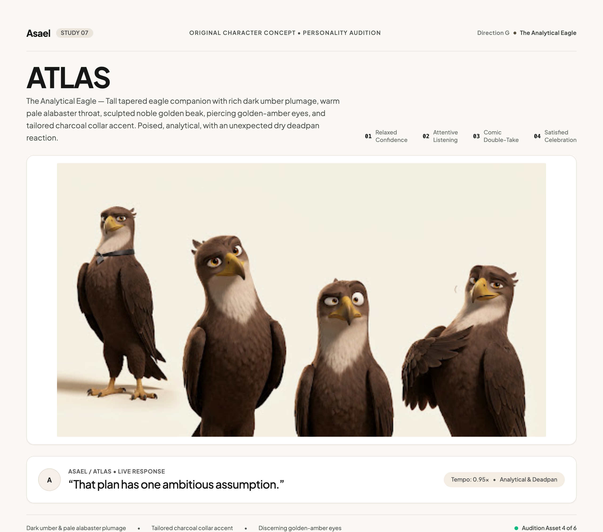
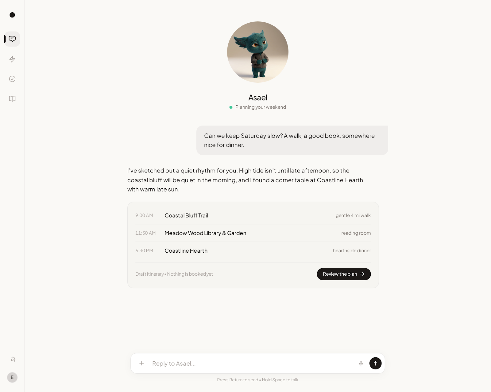
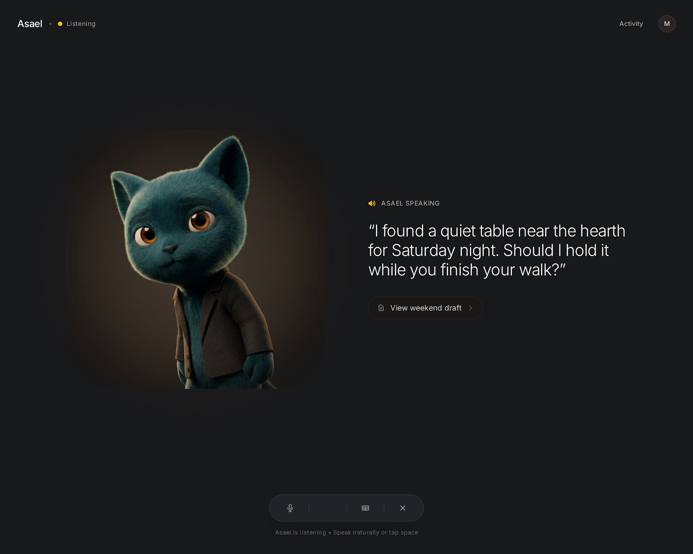

# Design brief: Asael with ATLAS

**Status, 3 October 2026:** ATLAS and the UI direction are selected. The owner authorizes implementation after the operational follow-ups; current work is preparation only. The inspected implementation baseline is `origin/main` at `89f65c2f`. No production ATLAS asset or implemented revamp is claimed.

## Problem and intended experience

The current app exposes substantial capabilities through competing visual systems, dense navigation, repeated card structures, and uneven transitions. The owner wants a mature, elegant, smooth and responsive app that also has a memorable personality.

Make everyday interaction feel like working with one familiar companion. Conversation carries requests, progress, decisions and results. Structured pages remain excellent tools for managing large collections and complex work. ATLAS supplies expression and continuity without consuming attention needed for reading or acting.

## Implementation theses

**Visual thesis:** a warm, precise workspace with near-white and graphite materials, confident typography and an expressive umber eagle that supplies energy without competing with the work.

**Content and workspace plan:** the primary canvas holds the conversation or the current list/table; a compact labelled rail provides orientation, and an optional inspector holds evidence and detail. Each page leads with scope, status and its next useful action. Use alignment, dividers and spacing before card containers; reserve cards for a distinct decision or interaction. The public sequence is a clear Asael introduction and sign-in, one concrete capability example, a real workflow/evidence explanation, then a final sign-in action. Operational pages begin with their working content and retain dense readable controls.

**Interaction thesis:** (1) immediate press/focus feedback with approximately 120ms control transitions; (2) approximately 180ms content changes and 240ms interruptible sheets/inspectors that preserve focus, scroll and drafts; (3) occasional ATLAS eye/brow/wing reactions and a brief anticipation–comic beat–settle sequence tied to real application state. More animation means a richer purposeful vocabulary, with stillness during reading and a static equivalent for every state.

## Experience principles

1. **Calm interface, expressive companion.** Keep layout and navigation composed; concentrate personality in ATLAS, selected dialogue moments and purposeful gestures.
2. **Useful detail at the right moment.** Lead with the result, next action and current state. Let evidence, configuration and operational detail expand without losing context.
3. **Every visible state has evidence.** Distinguish queued, working, waiting, interrupted, unverified and completed. Character acting follows application state and grants no authority.

## Approved visual references

The latter two images establish the approved interface composition and finish; their teal character is historical. The selected ATLAS contact sheet was exported and visually inspected on 3 October 2026. The reference is a raster concept, with no authored model, rig or animation. The charcoal collar is visible only in the first pose and must be consistent in production. These references are generated art studies, not functional screens, measured accessibility results or final design tokens.

## Visual system

| Element | Proposed standard |
|---|---|
| Light surfaces | Warm near-white canvas, lightly separated surfaces, graphite primary text; quiet borders and selective floating shadows |
| Dark surfaces | Warm graphite canvas, gently raised neutral surfaces, high-legibility off-white text; no luminous decorative effects |
| Accent | Restrained warm gold informed by ATLAS's beak against umber and charcoal; final values require contrast review; semantic attention, success and danger remain separate tokens and also use text/icons |
| Typography | Retain Geist/Geist Mono on web and native system typography. One sans hierarchy; mono only for code/IDs where useful. Prefer 15–16px reading body; honor native text scaling |
| Hierarchy | One page title, a short useful scope line, one dominant action; ordinary sentence-case labels |
| Geometry | 4-unit spacing scale; 8/12/16/24/32/48 rhythm. Approximately 10–12px controls, 16px content surfaces, larger sheet corners; pills for composer, compact filters and status only |
| Density | Comfortable conversation; compact, readable operational tables. The same system supports both without giant cards or excessive whitespace in data-heavy views |
| Reading width | Conversation about 640–720px; prose about 60–75 characters; wide graphs/tables use available canvas with local overflow |
| Navigation | Compact labelled rail that can collapse; searchable expanded navigation. Icon-only controls have visible hover/focus labels and accessible names |

Final color values and all foreground/background combinations must pass contrast checks before becoming tokens. The muted text in the Stitch studies should be strengthened. Preserve system/light/dark preferences and early theme boot; add high-contrast presentation to the audited token set rather than another unrelated palette.

## Current foundation to extend

The web stack already includes Next 16.3.8, React 19.2.8, Tailwind 4.3.3, Lucide, Three.js and Lottie. Root semantic tokens in src/app/globals.css compete with Daybook overrides in src/components/app-shell/app-shell.module.css. The current theme provider, protected shell, focus restoration, reduced-motion styles, visibility-aware refresh and resource-state behavior are valuable foundations.

Flutter has its own token/theme implementation and macOS-specific compositions. Share semantic design decisions and behavior contracts; retain native sidebar, menus, keyboard behavior, control density and window management.

## Component inventory

| Component family | Treatment | Scope |
|---|---|---|
| Session/auth, run following, repositories, scoped domain actions | Reuse | Keep current ownership, error handling and mutation contracts |
| Theme provider, navigation/deep links, command palette, notifications | Modify presentation | Preserve persistence, context, counts, shortcuts and focus behavior |
| Buttons, fields, icon controls, tabs, menus, dialogs/sheets | Formalize shared primitives | Existing markup is scattered; extract incrementally with complete keyboard/disabled/error states |
| Page header, resource states, search/filter toolbar, list/table rows, detail inspector | New common presentation patterns | Compose around existing data controllers; avoid a replacement universal domain engine |
| Composer, response blocks, artifact/evidence preview, approval card | Modify and consolidate | One family used inline and on detail pages; preserve exact review and safe rendering |
| ATLAS presence, expanded voice stage, companion settings | New | Independent renderer and state adapter; no execution callbacks from the animation asset |
| Capture/upload and source freshness indicators | Modify | Separate transfer, extraction, indexing, partial failure and ready states |

## ATLAS production direction

Use the exported, visually inspected eagle study to establish consistent front/profile/three-quarter sheets: a tapered umber silhouette, pale throat, restrained golden beak, charcoal collar, expressive eyes and brow feathers, and wings capable of compact readable gestures. Keep the expression confident and welcoming; avoid a stern, militaristic or judgmental neutral face. This is an original eagle identity, with energetic quick wit and Kevin-Hart-inspired comic timing expressed through its own language and performance. It has no celebrity likeness or celebrity voice. Prove a rough animated prototype on web/native before finalizing the rig and export pipeline. Refine feather/material consistency, wing topology and facial/beak controls, then produce eight state clips, a beak/speech test, compact portrait, light/dark lighting and static fallback. The face and silhouette must remain readable at small sizes.

Use a compact portrait during active chat, a modest full-body greeting at the start, and an expanded stage during voice or deliberate personalization. No persistent large mascot in operational tables. Clicking ATLAS opens current work/voice/personality controls with ordinary accessible UI; it does not trigger arbitrary actions.

States: available, listening, responding, working, waiting for a decision, blocked/reconnecting, completed and paused. Voice and background work can coexist: foreground audio owns the main pose, while separate labelled work status reports background activity. Avoid conflicting listening/speaking labels. Personality settings offer Quiet, Balanced and Expressive, plus independent voice/motion/character visibility controls.

## Motion and response

Use immediate pressed/focus feedback; ordinary controls about 120ms, content changes about 180ms, and sheets about 240ms as initial audition values. Short distance and opacity are the default. Never delay useful content or controls until a transition finishes. Preserve scroll and focus across navigation. Do not replay list entrances after every refresh.

ATLAS should have a richer repertoire of quick glances, brow-feather lifts, listening tilts, compact wing gestures, double-takes and satisfied nods. Use a short anticipation, a comic reaction, a beat and a settle for an occasional meaningful moment. Idle is mostly still; completion is one gesture after confirmed success. Keep approvals, money, errors and sensitive subjects direct. Reduced motion supplies static poses and labels with identical functionality.

The previously reviewed [LottieFiles motion-design skill](https://github.com/LottieFiles/motion-design-skill/blob/f9a8a041b85185ee4881b3471d3415e939aac772/skills/motion-design/SKILL.md) informs timing/choreography. Its energetic defaults are not applied to every control. Asset delivery and 3D feasibility are specified in [the feature plan](FEATURE_PLAN.md).

## Responsive and accessible behavior

- Phone: readable single column, stable bottom composer above the software keyboard, large touch targets, sheets for context and detail, no hidden primary action below voice artwork.
- Tablet: compact rail with optional contextual detail when width allows.
- Desktop web: bounded conversation, expandable history, optional detail inspector; dense page families use list/detail compositions.
- macOS: labelled source sidebar, conventional menus and shortcuts, keyboard-accessible resizable inspectors, native quick-entry/voice windows.
- All: visible focus, keyboard completion, screen-reader status summaries, contrast, text zoom, reduced motion, high contrast, accessible chart/table alternatives. ATLAS is supplementary; the product works if its asset or renderer fails.

## Outside this visual program

No celebrity voice clone, unrestricted autonomous permissions, reactivated cloud computer, new public signup/billing business model, or wholesale rewrite of the execution harness. Those are not implied by the approved look. Existing public routes receive a consistent visual treatment without inventing product availability.
