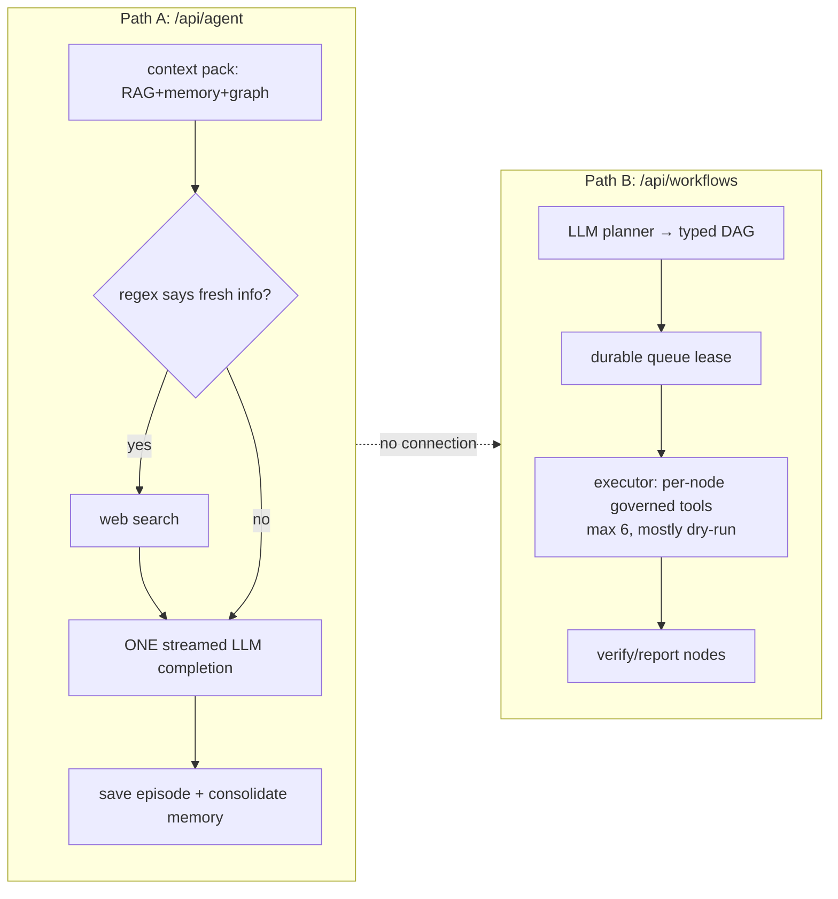

# OmniAgent OS — Principal-Level Technical Audit

Date: 2026-06-10 · Scope: full repository (~44.5k lines TS/TSX, 61 commits over 5 days) · Supersedes `docs/DEEP_DIVE_REVIEW.md`
Method: 4 phases — Discovery, Evidence-Based Audit, Improvement Strategy, Task Plan.

> Historical snapshot: this audit records the 2026-06-10 repository and is not a current operations reference. The agent tool loop, bounded request/rate controls, production storage guard, worker, and automated suites have since shipped. The current inventory includes unit coverage, guarded Postgres integration coverage, and local Playwright smoke coverage; run the documented commands for the live count. Use the main README and `docs/architecture.md` / `docs/deployment.md` for current behavior.

---

# Executive Summary

**Health grade: C+** — split verdict: the governance/operations infrastructure is **B+** (genuinely ahead of most agent platforms), the core agent capability is **D** (the agent cannot act), and engineering safety net is **D** (zero automated tests at 12 commits/day velocity).

### Top 3 Risks

1. **The product cannot do what it claims.** The "agent" streams a single LLM completion with no tool-calling loop; the system prompt advertises tools and specialist agents the model has no way to invoke, so it will *hallucinate having done work*. For a product whose pitch is "do any task it's given," this is existential, and it is also a trust/honesty defect: users will catch the model claiming actions that never happened. (`src/lib/orchestration/agent-runner.ts`, `prompts.ts:32-36`)
2. **At review time, there were no automated tests.** This finding is resolved by the current unit, integration, Playwright, and fail-closed production-smoke suites. (`package.json`, `tests/`)
3. **Cost and abuse exposure on the LLM path.** `/api/agent` accepts unbounded message content, has no rate limit, no token budget, and persists **one store write per streamed token**, multiplying both latency and database cost per response. (`api/agent/route.ts:8-16`, `agent-runner.ts:33-36,100`)

### Top 3 Opportunities

1. **~300 lines from a real product.** Every hard piece of a governed autonomous agent already exists — schema-validated tools, risk policy, approval persistence, durable queue, audit ledger, run events. Wiring governed tools into an OpenAI function-calling loop converts the entire platform from "ledger of dry-runs" to a working agentic system.
2. **Unify the two execution paths.** Chat runs and workflows are disconnected engines. One "Task" concept (chat run that can promote itself to a durable workflow at an approval gate or long step) collapses the product's biggest conceptual confusion and halves the UI surface.
3. **Sell the trust story.** Signed evaluation reports, forced RLS, SSRF guards, and persistent audit trails — competitors don't have this. Surfaced through a human-readable approval/consent UX instead of JSON dumps, governance becomes the differentiator instead of internal plumbing. WORM retention remains an external deployment control.

---

# Phase 1 — Discovery and Mapping

## Stack and runtime

| Layer | Choice | Evidence |
|---|---|---|
| Framework | Next.js 16.2.7 (canary-line; `AGENTS.md` warns APIs differ from public docs), React 19.2.4, Tailwind 4 | `package.json` |
| Language | TypeScript 5, `strict: true` | `tsconfig.json` |
| LLM | OpenAI Responses API only; `gpt-5` default, `text-embedding-3-large` @1536d | `src/lib/config.ts:1-7`, `openai/client.ts` |
| Persistence | Neon Postgres + pgvector (HNSW) with forced RLS; fallback `.omniagent/` JSON files locally, **ephemeral `/tmp` on Vercel without DB** | `db/client.ts:12-60`, `storage/` |
| Queue | `omni_operation_jobs` durable queue: leases, dedupe keys, priority, maxAttempts=5, backoff | `workflows/queue.ts:40-43`, `operations/job-queue.ts` |
| Scheduling | Vercel cron **daily** (`0 0 * * *`) on `/api/workflows/tick` + opportunistic `after()` drains | `vercel.json`, `config.ts:19` |
| Auth | First-party: scrypt passwords, opaque SHA-256-hashed session tokens, HttpOnly/Secure/Lax cookies; auth cannot be disabled in production | `auth/crypto.ts`, `auth/session.ts:16-24`, `auth/store.ts:20-32` |
| CI | One workflow: nightly production smoke vs deployed URL, uploads release-evidence artifact. **No build/lint/test on PR or push.** | `.github/workflows/production-smoke.yml` |
| Dependencies | `npm audit`: **0 vulnerabilities** (info→critical). Lean, modern tree. | audit run 2026-06-10 |

## Repo map

```
src/app/                      Public marketing (7 pages) · auth (login/signup/onboarding)
  app/                        13 authenticated workspaces (Overview, Command, Results, Workflows,
                              Approvals, Knowledge, Integrations, Tools, Evals, Monitoring, Security, Settings)
  api/                        ~50 route handlers (agent SSE, workflows, tools, connectors, observability,
                              incidents, alerts, evals, security, auth, health, diagnostics)
src/components/
  command-center.tsx          6,427 lines · ~50 useState · 61 fetch() · 33 JSON.stringify renders  ← god object
  app-shell/                  shell, dashboard, 1,628-line domain-console
  results-center.tsx, agent-runs-workspace.tsx, marketing/, onboarding/, theme/
src/lib/
  orchestration/              agent-runner (no tool loop), prompts, static capability registry
  workflows/                  planner (LLM→typed DAG), executor (per-node governed tools), queue, runner,
                              store, triggers (HMAC webhooks)
  tools/                      registry, policy (risk 0-3), executor, audit-store
  connectors/                 MCP host + OpenAPI importer → governed tool registry
  rag/                        hybrid retrieval, adaptive context engine, retrieval traces
  memory/                     store, graph memory, post-run consolidator
  observability/ diagnostics/ event ledger, SLO monitor+policies, incidents, alerts, playbooks
  security/ auth/             context/RBAC, guard, SSRF network checks, isolation report, identity
  evaluations/ release/       suite runner, signed reports + verifier, release evidence
scripts/                      4 smoke scripts (security, tenant isolation, eval, release evidence)
docs/IMPLEMENTATION_PLAN.md   builder log · README.md: 110-bullet feature list
```

## Control flow — the central architectural fact

There are **two execution paths that never meet**:



Path A reasons but cannot act. Path B acts but the model never sees results mid-flight (no replanning). The governed tool executor — the best code in the repo — is only reachable from Path B and manual UI dry-runs.

---

# Phase 2 — Audit Report

Severity: **Critical** (product-invalidating / data-loss / security) · **High** (must fix before scale) · **Medium** (should fix) · **Low** (polish).

## 2.1 Architecture and design

| ID | Sev | Finding | Evidence | Solution |
|---|---|---|---|---|
| A-1 | **Critical** | **No agentic loop.** `runAgent` = retrieve → optional search → single completion. The model receives a list of "Active specialist agents" and an "Available and planned tool surface" with no mechanism to invoke either → fabricated work claims. | `orchestration/agent-runner.ts:18-148`, `prompts.ts:32-36` | ReAct loop: pass active governed tools as OpenAI function tools; route every call through `executeGovernedTool`; approval-required calls pause + persist run, resume on decision. All building blocks exist. |
| A-2 | **High** | **Two disconnected engines** (chat vs workflow) with separate ledgers, UIs, and semantics. Users must understand both to answer "what did the system do?" | runner vs `workflows/executor.ts` | One Task abstraction: chat run promotes to durable workflow at approval gates / long steps; one timeline UI reads both ledgers. |
| A-3 | **High** | **God object UI.** `command-center.tsx`: 6,427 lines, ~50 `useState` (lines 1559-1614), 61 `fetch()`, every domain fetched on mount, one endless scroll duplicating all 13 domain pages. Any keystroke re-renders everything. | `components/command-center.tsx` | Reduce command page to conversation + run timeline + context drawer; move panels to their existing `/app/*` routes; shared fetch hooks (SWR/React Query). |
| A-4 | **High** | **Static plans can't adapt.** Executor runs planner's DAG verbatim; failures mark nodes failed; the model is never consulted mid-execution; "verification" nodes only aggregate summaries. Contradicts "do any task no matter what." | `workflows/executor.ts:45-160,259-330` | Bounded replanning (≤2 attempts) on node failure; verification nodes that call the model against acceptance criteria + evidence. |
| A-5 | Medium | **Planned/fake tools injected into the prompt** (registry mixes `active` marketing entries like `workflow.temporal` with executable tools; prompt says "Available and planned"). | `orchestration/registry.ts:41-140`, `prompts.ts:35` | Inject only tools actually executable via the governed registry; list everything else as explicitly unavailable. |
| A-6 | Medium | **Web-search trigger is a keyword regex** — misses paraphrases, false-positives, and can't be reasoned about by the model. | `web-search/search.ts:25-32` | Expose `web.search` as a model-invocable tool in the loop (A-1); keep regex only as prefetch hint. |
| A-7 | Medium | **Risk-3 tools are a permanent dead end**: "blocked until multi-party approval is implemented." Policy advertises a 0-3 scale, top tier unreachable. | `tools/policy.ts:28-36` | Implement quorum approval (the SLO-policy subsystem already has quorum logic to reuse) or stop classifying tools as 3. |
| A-8 | Low | Agent runs authorized under `manage.workflow` — semantically wrong action, couples chat permission to workflow admin, blocks viewers from read-only chat. | `api/agent/route.ts:33`, `security/context.ts:40-44` | Add `run.agent` RBAC action. |

## 2.2 Security

The baseline is strong — credit where due: scrypt + timing-safe password compare (`auth/crypto.ts:29-31`), hashed opaque session tokens (`crypto.ts:13`), correct cookie flags (`auth/session.ts:16-24`), production auth that cannot be disabled (`auth/store.ts:20-32`), forced RLS across 23 tables (`db/client.ts:12-44`), SSRF/private-network guards (`security/network.ts`), connector-secret allowlisting with platform-secret denylist (`security/context.ts:8-17,162-177`), recursive metadata redaction (`context.ts:133-152`), HMAC-signed eval reports with a verifier endpoint.

| ID | Sev | Finding | Evidence | Solution |
|---|---|---|---|---|
| S-1 | **High** | **No rate limiting, size caps, or token budgets** on any endpoint, including the LLM-spending `/api/agent`. Content schema is `z.string().min(1)` with no max; message count unbounded. One authenticated user can run unbounded spend. | `api/agent/route.ts:8-16` | `.max()` on content, cap history tokens, per-tenant daily token budget (persist to runs ledger), simple sliding-window rate limit. |
| S-2 | Medium | **Non-timing-safe comparison of the internal auth secret** (`configuredSecret === providedSecret`) on the header path that grants **arbitrary tenant/role including `system`**. | `security/context.ts:197-210` | `crypto.timingSafeEqual` on digests; consider capping header-granted role below `system`. |
| S-3 | Medium | **Unhandled `request.json()`** — malformed body throws before validation → unstructured 500 (also pollutes error SLOs with client mistakes). Pattern likely repeated across ~50 routes. | `api/agent/route.ts:19` | Shared `parseJsonBody` helper returning 400; sweep all routes. |
| S-4 | Medium | **No CSRF tokens.** `SameSite=Lax` is the only cross-site mitigation for cookie-auth'd state-changing POSTs. Acceptable today; brittle if CORS or older clients ever loosen. | `auth/session.ts:20` | Origin/Referer check middleware on mutating routes (cheap, no token plumbing). |
| S-5 | Low | Identity-header trust toggle (`OMNIAGENT_TRUST_UNSIGNED_IDENTITY_HEADERS`) is correctly fenced from production — but the fence is in code, not validated in the security smoke. | `context.ts:205-209` | Add a smoke assertion that prod rejects unsigned identity headers (may already partially exist — verify). |

## 2.3 Performance

| ID | Sev | Finding | Evidence | Solution |
|---|---|---|---|---|
| P-1 | **Critical** | **One persisted run-event per streamed token.** `emit()` awaits `appendRunEvent` for every delta — hundreds of sequential Postgres round-trips (or full JSON-file rewrites) per response; throttles stream latency and multiplies DB cost. | `agent-runner.ts:33-36,89-101` | Persist status/memory/done events immediately; buffer text deltas, flush one consolidated event per ~500ms. |
| P-2 | **High** | **Daily cron is the only guaranteed queue tick** — a "durable" workflow can sit 24h unless a user action happens to drain it. Reads as "broken" to users. | `vercel.json:1-8`, `config.ts:19` | Document Pro-cron / external-pinger (QStash, GH Actions schedule) options; show "last/next tick" + a Drain Now button in the UI. |
| P-3 | Medium | Every workspace fetches everything on mount, no pagination/virtualization on ledger tables; dashboard re-fetches serially. | `command-center.tsx`, `dashboard-overview.tsx:114-130` | Paginated endpoints already accept limits — wire them; virtualize long tables; parallelize dashboard fetches. |
| P-4 | Low | Heavy decorative shadows (`0 24px 70px`) + backdrop-blur on dense ops surfaces. | `globals.css:68-77`, `app-shell.tsx:16` | Reserve elevation for overlays. |

## 2.4 Reliability and data integrity

| ID | Sev | Finding | Evidence | Solution |
|---|---|---|---|---|
| R-1 | **High** | **Silent total data loss in hosted no-DB mode**: Vercel without `DATABASE_URL` → `/tmp`, per-instance, wiped on cold start. App behaves normally while losing everything. | `db/client.ts:50-60` | Hard-fail or persistent full-width banner in production when backend is `ephemeral`. |
| R-2 | **High** | **Read-modify-write races in JSON fallback stores.** `writeJsonFile` is atomic per write, but concurrent request handlers interleave read→modify→write and drop records. Only node executions serialize (`executor.ts:43`). | `storage/json.ts:4-18` | Per-path async write queue inside the storage module so all stores inherit serialization. |
| R-3 | Medium | `readJsonFile` swallows **all** errors including corruption/permission failures and returns the fallback → silently treats a damaged ledger as empty, then overwrites it. | `storage/json.ts:4-11` | Distinguish ENOENT from parse errors; quarantine corrupt files (`.corrupt-<ts>`) and surface a diagnostic event. |
| R-4 | Medium | Memory grows without hygiene: every run saves an episode at hardcoded `importance: 0.42`; no dedup, decay, or forgetting → retrieval quality degrades with use. | `agent-runner.ts:104-116` | Consolidator-scored importance; skip trivial episodes; embedding-similarity dedup at write; age/usage decay. |
| R-5 | Low | Dev fallback streams a canned plan that visually mimics real reasoning (status line is the only cue). | `agent-runner.ts:150-165` | Distinct "simulated" visual treatment in the transcript. |

## 2.5 Code quality and testing

| ID | Sev | Finding | Evidence | Solution |
|---|---|---|---|---|
| Q-1 | **Critical** | **Zero automated tests.** `"test": "npm run lint"`; smokes need a deployed `BASE_URL`; CI never runs build/lint/test on push or PR — only a nightly post-deploy smoke. Regressions ship by default. | `package.json:6-15`, `.github/workflows/production-smoke.yml:3-6` | Vitest; first targets = pure, high-blast-radius logic: `tools/policy.ts`, `auth/crypto.ts`, queue lease/retry, plan topo-sort, `security/network.ts`, `redactSensitive`. Add PR workflow: lint+build+test. |
| Q-2 | **High** | 33 `JSON.stringify` blobs rendered as UI results; operator-facing surfaces require reading raw payloads. | `command-center.tsx` (33 occurrences) | Structured result cards (status, summary, evidence link); raw JSON behind a disclosure. |
| Q-3 | Medium | Duplicated state/fetch patterns across command-center, domain-console (1,628 lines), results-center — three hand-rolled copies of the same data layer. | `components/` | One typed API-client module + shared hooks. |
| Q-4 | Low | `getAppBaseUrl()` falls back to `localhost:3000` — server-generated absolute links/webhooks are wrong on Vercel unless `NEXT_PUBLIC_APP_URL` set. | `config.ts:41-43` | Fall back to `VERCEL_PROJECT_PRODUCTION_URL`/`VERCEL_URL` first. |

## 2.6 UI / UX / human psychology

| ID | Sev | Finding | Evidence | Solution |
|---|---|---|---|---|
| U-1 | **High** | **First-run screen destroys trust**: hero metrics literally render `unknown`, `unknown`, `0`, and the posture panel headline is "Watch — /api/observability returned 403" (raw API error in the hero). For an autonomy product, first impressions *are* the trust model. | `screenshots/transform-app-dashboard-desktop-1280.png`, `dashboard-overview.tsx` | Three distinct visual states — loading / not-configured (with CTA) / failed (with retry) — never raw errors or `unknown` in headline metrics. |
| U-2 | **High** | **13 top-level workspaces + ops jargon** (SLO, RLS, quorum, break-glass) at first contact. The user's mental model is three questions: *what can it do → give it work → did it work*. Cognitive overload guarantees abandonment before first success. | `lib/navigation.ts:55-152` | Progressive disclosure: primary = Home/Run/Results/Approvals(badged); Build + Operate groups collapsed; hide Assure/Admin until first successful run. Merge Workflows into Run/Results (a workflow is a run that became durable). |
| U-3 | Medium | **Approvals — the product's consent ritual — are payload dumps.** People approve what they understand and stall on what they must decode; silent approval waits read as "the agent hung." | approvals UI, `command-center.tsx` | Consent-style cards: *what will happen, to which system, reversible?, why the agent wants it*; deliver pending approvals via the already-built Slack/email alert adapters. |
| U-4 | Medium | **Fake search affordance**: a magnifier-icon pill in the header is a static label, not a search box. Broken affordances teach users not to trust the rest of the UI. | `app-shell.tsx:77-80` | Replace with a real Cmd+K palette (navigate, start run, find run/memory/tool). |
| U-5 | Medium | Accessibility: nav descriptions only in `title` attrs (`app-shell.tsx:38`); no `:focus-visible` styles on `.action-button`/`.primary-button` (`globals.css:99-145`); keyboard/SR pass acknowledged as pending (`DESIGN_REVIEW.md:56`). | cited | Visible focus rings; `aria-describedby`; one keyboard-only walkthrough of run→approve→results. |
| U-6 | Low | Marketing data hardcoded as if live ("Release passed", "OpenAI Live") — fine on `/platform`, corrosive if ever rendered in-app; sidebar lacks `overflow-y-auto` and the absolute "Current surface" box can collide with nav on short viewports. | `navigation.ts:475-482`, `app-shell.tsx:16,56` | Keep static data out of authenticated surfaces; add scroll + reserved footer space. |
| U-7 | Low | Theme (OKLCH, warm-paper light / blue-charcoal dark, teal primary) is genuinely good. Minor: `--muted` on raised surfaces near 4.5:1 at small sizes; amber doubles as accent *and* warning, diluting alert semantics. | `globals.css:3-33` | Automated contrast check; separate accent hue from warning. |

## 2.7 Documentation

| ID | Sev | Finding | Evidence | Solution |
|---|---|---|---|---|
| D-1 | **High** | No user-facing docs exist. README is a 110-bullet flat feature list (a changelog wearing a README costume); `IMPLEMENTATION_PLAN.md` is a builder log; `/docs` marketing page is placeholder copy. No setup guide beyond 6 lines, no feature instructions, no runbooks, no API reference. | `README.md:59-170`, `app/docs/page.tsx` | Docs tree below (Phase 4, task M3-1). |
| D-2 | Medium | No ADRs — significant decisions (OpenAI-only, JSON-fallback storage, daily cron, first-party auth) are undocumented and will be re-litigated. | repo-wide | Lightweight ADR folder; backfill the four above. |

---

# Phase 3 — Improvement Strategy

## Five themes explain ~90% of findings

1. **The engine doesn't act** (A-1, A-4, A-6, A-7). Everything was built *around* an autonomous agent except the autonomy. The tool loop is the keystone: it activates the governed executor, the approval queue, the audit ledger, and the risk policy simultaneously.
2. **Governance was built before the thing it governs** (A-5, A-7, README scope). Quorum-versioned break-glass SLO approval policies exist; a model that can call one tool does not. Strategy: **freeze governance depth**, spend that energy on capability, then let real usage drive which governance features earn UI.
3. **The UI is the builder's debug console** (A-3, U-1..U-4, Q-2). It mirrors the module tree, not the user's task. Re-center on one loop: *give work → watch it act → approve when asked → see results*.
4. **No safety net under maximum velocity** (Q-1, R-2, R-3, S-3). 61 commits in 5 days with lint as the only gate. Every later milestone gets cheaper after M0.
5. **Honesty gaps compound into distrust** (A-5, U-1, U-4, U-6, R-5). Prompt over-claims, fake affordances, hardcoded "live" signals, raw errors in heroes. For an autonomy product, *calibrated honesty is the brand*. Rule: never display or promise a capability/status the runtime can't substantiate.

## Target state (3 months)

A user types a goal → the agent assembles context, **calls governed tools in a loop**, pauses on a human-readable approval card (also delivered to Slack), resumes, and lands evidence-linked results in one timeline. Long work promotes itself to the durable queue. The dashboard answers "is my agent healthy?" (completion rate, tool failures, approval wait, spend) — not just "is the server up?". CI gates every PR; the policy/queue/crypto core is unit-tested; docs let a stranger deploy and run their first task in 15 minutes.

## What NOT to fix (and why)

- **Don't migrate storage to an ORM/migration framework.** The hand-rolled schema bootstrap works and is tested in production; churn here risks the best-hardened code for zero user value.
- **Don't deepen SLO/approval-policy features further** (more quorum modes, more break-glass variants). It's already past what any current user can consume.
- **Don't build multi-agent swarms.** The registry's "specialist agents" should become honest (removed or real) via the tool loop first; orchestration of multiple models is premature until one agent completes real tasks reliably.
- **Don't add multi-provider LLM abstraction yet.** OpenAI-only is a constraint, not a defect; an abstraction layer before the tool loop exists would be speculative complexity. Record as ADR.
- **Don't chase WCAG AAA or visual-regression infra now.** Do the keyboard/focus/contrast basics (U-5, U-7); defer the rest until the UI stops moving.
- **Don't build billing/pricing.** The pricing page is a shell; commercial packaging is a business decision pending real users.

## Measurable definition of done

| Dimension | Metric |
|---|---|
| Capability | Agent completes a 3+ tool-call task E2E, including one approval pause/resume, with every call in the audit ledger |
| Honesty | Prompt lists only executable tools; zero `unknown`/raw-error strings renderable in headline UI |
| Performance | ≤1 store write per second per streaming run (down from per-token); p95 first-token latency unchanged or better |
| Safety net | PR CI = lint+build+unit; ≥80% line coverage on `tools/policy`, `auth/crypto`, `operations/job-queue`, plan topo-sort, `security/network` |
| UI | No component file >800 lines; primary nav ≤5 items pre-first-run; approval card comprehensible to a non-engineer (hallway test) |
| Monitoring | Dashboard shows runs/day, completion %, tool-failure %, approval wait p95, token spend; alert fires on approval waiting >4h |
| Docs | A new engineer deploys + completes first agent task in ≤15 min using docs alone |

---

# Phase 4 — Task Plan

## Quick wins — do immediately (all S effort, low risk)

| QW | Task | Fixes | Effort |
|---|---|---|---|
| QW-1 | Wrap `request.json()` in shared 400-returning helper; sweep all routes | S-3 | S |
| QW-2 | `.max(32k)` content cap + message-count cap on `/api/agent` | S-1 (partial) | S |
| QW-3 | Honest prompt: inject only executable tools; remove "planned" surface and fake specialist-agent list | A-5, theme 5 | S |
| QW-4 | Batch delta persistence (flush ≤2/s) | P-1 | S |
| QW-5 | Per-path write queue inside `storage/json.ts`; quarantine corrupt files | R-2, R-3 | S |
| QW-6 | `timingSafeEqual` for internal-auth header | S-2 | S |
| QW-7 | `VERCEL_URL` fallback in `getAppBaseUrl()` | Q-4 | S |
| QW-8 | Production banner/hard-fail on `ephemeral` storage backend | R-1 | S |
| QW-9 | Dashboard: loading / not-configured / failed states; never render raw errors | U-1 | S |
| QW-10 | Sidebar `overflow-y-auto` + focus-visible rings | U-5/U-6 | S |

## M0 — Safety Net (week 1)

| Task | Effort | Risk | Depends |
|---|---|---|---|
| M0-1 Vitest harness + PR CI workflow (lint, build, unit) | M | Low | — |
| M0-2 Unit tests: tool policy, crypto, queue lease/retry/dedupe, plan topo-sort, SSRF guard, redaction | M | Low | M0-1 |
| M0-3 All quick wins QW-1..QW-10 | M (sum) | Low | — |
| M0-4 `run.agent` RBAC action (A-8) | S | Low | — |

## M1 — Critical Capability (weeks 2-3)

| Task | Effort | Risk | Depends |
|---|---|---|---|
| M1-1 **Governed tool-calling loop** in `runAgent`: function-tool schemas from registry, every call via `executeGovernedTool`, max-steps + per-run token budget, approval-pause persists run state | **XL** | **High** (core behavior change; mitigated by M0 tests + dry-run-first defaults) | M0 |
| M1-2 Approval resume: pending decision re-enters the loop (reuse workflow approval persistence) | L | Med | M1-1 |
| M1-3 Live run timeline UI: step cards (context → search → tool calls with dry-run/risk badges → approval gate → result) replacing raw SSE text + JSON blobs | L | Low | M1-1 |
| M1-4 Per-tenant rate limit + daily token budget, recorded in runs ledger, surfaced in Settings | M | Low | M0 |
| M1-5 `web.search` as loop tool; regex demoted to prefetch hint | S | Low | M1-1 |

## M2 — High-Leverage (weeks 4-6)

| Task | Effort | Risk | Depends |
|---|---|---|---|
| M2-1 Task unification: chat run promotes to durable workflow at approval/long step; Results reads both ledgers as one timeline | L | Med | M1 |
| M2-2 Split `command-center.tsx` into route-colocated components + shared typed API hooks | L | Low (mechanical after M1-3) | M1-3 |
| M2-3 Nav restructure + progressive disclosure (U-2); merge Workflows into Run/Results | M | Med (navigation churn) | M2-2 |
| M2-4 Consent-style approval cards + Slack/email delivery of pending approvals via existing alert adapters | M | Low | M1-2 |
| M2-5 Agent-quality monitoring: runs/day, completion %, tool-failure %, approval wait p95, token spend; alert on approval >4h | M | Low | M1-4 |
| M2-6 Bounded replanning + model-backed verification nodes (A-4) | L | Med | M1-1 |
| M2-7 Cron visibility: last/next tick, Drain Now button; deployment doc for Pro-cron/QStash cadence | S | Low | — |

## M3 — Polish (weeks 7-8)

| Task | Effort | Risk | Depends |
|---|---|---|---|
| M3-1 Docs tree: getting-started, deployment (env-var table), architecture/ (diagrams from this report), guides/ (connectors, approvals, monitoring, evals), runbooks/, api-reference; README cut to quickstart+diagram+links | M | Low | stable M2 surface |
| M3-2 ADRs: OpenAI-only, storage fallback, daily cron, first-party auth | S | Low | — |
| M3-3 Memory hygiene: scored importance, dedup, decay, pin/forget UI, "why remembered" provenance link | M | Med | M1 |
| M3-4 Cmd+K command palette replacing fake search pill | M | Low | M2-3 |
| M3-5 Onboarding first-win: zero-setup sample task completing in fallback mode in <2 min | M | Low | M1-3 |
| M3-6 A11y + theme pass: contrast audit, keyboard walkthrough, separate accent vs warning hue | M | Low | M2-3 |
| M3-7 Risk-3 quorum approval (reuse SLO quorum machinery) — or reclassify; remove dead-end | M | Med | M2-4 |

---

# Open Questions

1. **Who is the user of record?** Solo operator (you) vs enterprise teams changes how much of the governance surface deserves UI investment vs API-only.
2. **Hosting tier:** is Vercel Hobby a constraint to design around (daily cron) or is Pro/external scheduling acceptable? Determines M2-7 scope.
3. **Is multi-tenant SaaS a near-term goal** or architecture insurance? RLS is built; the answer decides whether tenant admin UX matters now.
4. **OpenAI exclusivity** — intentional bet or accident? (Affects ADR M3-2 and any future abstraction.)
5. **Command Center vs domain pages** — both currently exist in duplicate; this plan assumes domain pages win and Command becomes conversation+timeline. Confirm before M2-2.
6. **What should risk-level-3 actually require?** Quorum of admins? Out-of-band confirmation? Defines M3-7.
