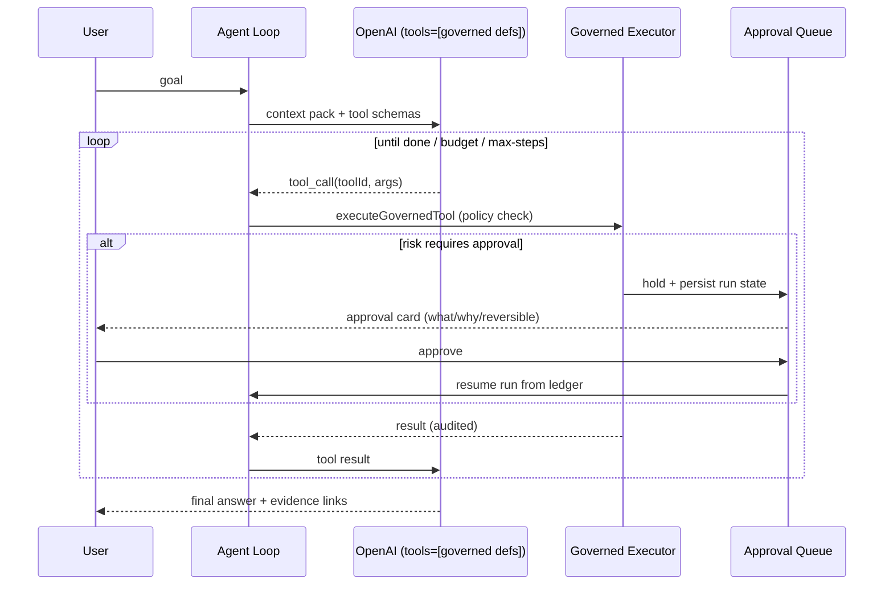

# OmniAgent OS — Deep-Dive Review

Date: 2026-06-10
Scope: full codebase (~44.5k lines of TS/TSX), UI/UX, architecture, security, monitoring, docs.
Reviewer perspective: enterprise agentic-AI product that must "do any task it is given."

---

## 1. Executive Summary

OmniAgent OS has an unusually strong **governance and operations shell** — durable workflows, queue leases, approvals, SLO policies, incidents, signed evaluation reports, tenant RLS, SSRF guards, scrypt auth. That layer is genuinely ahead of most agent frameworks.

The critical gap is the **agent itself**. The thing the product is named after cannot use tools:

- `src/lib/orchestration/agent-runner.ts` retrieves context, optionally web-searches (regex-triggered), then streams **one** LLM completion. There is no tool-calling loop, no action execution, no iteration on results.
- The system prompt (`src/lib/orchestration/prompts.ts`) tells the model it is a "multi-agent orchestration system" and lists agents/tools — but the model has no mechanism to invoke any of them. It can only *describe* doing work.
- The workflow path does execute governed tools, but only ones a planner pre-selected up front (max 6 per node), mostly as dry-runs, with no model in the loop during execution and no replanning on failure.

So today the product is: **a chat assistant + a static-plan executor + a world-class control plane around an engine that doesn't act.** Closing that one gap (a real tool-loop agent wired into the existing governed-tool executor) converts ~80% of already-built infrastructure from "ledger of dry-runs" into a real autonomous system.

Second-order theme: the **UI is built for the builder, not the user**. 13 nav surfaces, ops jargon (SLO, RLS, quorum, break-glass) on first contact, a 6,400-line single-scroll command page, and empty states that print `unknown` and raw `403` errors into the hero panel.

---

## 2. Current Architecture (as-built)

```mermaid
flowchart TD
  subgraph Public
    MKT[Marketing pages /platform /pricing /docs]
    AUTH[Login / Signup / Onboarding]
  end

  subgraph App["/app shell (13 workspaces)"]
    DASH[Overview dashboard]
    CMD[Command Center - 6.4k-line client component]
    RES[Results center]
    CONSOLES[Domain consoles: workflows, approvals, memory, connectors, tools, evals, observability, security, settings]
  end

  subgraph API["Next.js route handlers (~50 endpoints)"]
    AG["/api/agent (SSE)"]
    WF["/api/workflows*"]
    TOOLS["/api/tools*"]
    OBS["/api/observability*  /api/incidents*  /api/alerts*"]
    SEC["/api/auth*  /api/security*"]
  end

  subgraph Core
    RUNNER[agent-runner: context -> web search -> single LLM stream]
    PLANNER[workflow planner: goal -> typed DAG via structured output]
    EXEC[plan executor: per-node governed tool calls, dry-run default]
    GOV[governed tool executor: risk policy, approvals, audit]
    RAGL[RAG v2: hybrid retrieval + adaptive context engine + graph memory]
    MEMC[memory consolidator: post-run fact extraction]
  end

  subgraph Infra
    PG[(Neon Postgres + pgvector / .omniagent JSON fallback)]
    QUEUE[(omni_operation_jobs durable queue)]
    CRON[Vercel cron daily tick + after() drain]
    OAI[OpenAI Responses API]
  end

  AUTH --> App
  App --> API
  AG --> RUNNER --> RAGL --> PG
  RUNNER --> OAI
  RUNNER --> MEMC --> PG
  WF --> PLANNER --> OAI
  WF --> QUEUE --> EXEC --> GOV --> PG
  GOV -. approval wait .-> CONSOLES
  OBS --> PG
  CRON --> QUEUE
```

**The disconnect:** `RUNNER` and `EXEC` are two unrelated execution paths. The chat agent never touches `GOV`; the workflow executor never consults the model after planning. Nothing closes the loop between "model reasons" and "tools act."

---

## 3. Bugs and Flaws (with fixes)

### P0 — correctness / cost / safety

| # | Issue | Location | Fix |
|---|-------|----------|-----|
| 1 | **Agent cannot act.** No tool-calling loop; prompt promises capabilities the runtime doesn't provide, so the model will hallucinate having done work. | `agent-runner.ts`, `prompts.ts` | Implement ReAct loop (Section 5.1). Until then, change the prompt to say tools are *not* directly invocable and the agent should propose workflows. |
| 2 | **Per-token persistence.** `emit()` awaits `appendRunEvent` for every streamed delta — one store write per token. With Postgres that is hundreds of round-trips per response; with JSON files it rewrites the file per token. | `agent-runner.ts:33-36, 89-101` | Buffer deltas; persist status/memory/done events immediately, flush text every ~500ms or N chars as one consolidated event. |
| 3 | **Unhandled JSON parse.** `await request.json()` outside try/catch → malformed body crashes with an unstructured 500. | `api/agent/route.ts:19` | Wrap and return 400. Audit other routes for the same pattern. |
| 4 | **No input bounds or rate limiting on the LLM endpoint.** `z.string().min(1)` with no max length, no per-tenant rate limit, no token budget — direct cost-abuse vector once auth'd users exist. | `api/agent/route.ts` | Add `.max()` on content, cap message count/history tokens, add per-tenant daily token budget recorded to the runs ledger (Section 5.4). |
| 5 | **Planned-but-fake tools advertised to the model.** Prompt injects "Available and planned tool surface" from the static registry, including capabilities that don't exist. | `prompts.ts:35`, `orchestration/registry.ts` | Only inject `status === "active"` tools that are actually executable; label the rest explicitly as unavailable. |

### P1 — reliability / operations

| # | Issue | Location | Fix |
|---|-------|----------|-----|
| 6 | **Daily cron is the only guaranteed tick.** A durable workflow created at 9am may not advance until midnight unless a user action triggers `after()` draining. "Durable" reads as "stalled" to a user. | `vercel.json`, `config.ts:19` | Surface expected-next-tick in the UI; recommend Pro cron (every minute/5min) or an external pinger (QStash, GitHub Actions schedule) in docs; show a "drain now" button where workflows are visible. |
| 7 | **Ephemeral `/tmp` fallback in hosted no-DB mode** silently loses all memory/runs/workflows between cold starts, per instance. | `storage/paths.ts`, README | Hard-fail (or giant banner) in production when `DATABASE_URL` is missing instead of silently degrading. |
| 8 | **JSON-file store race conditions.** Only node executions serialize writes via `nodeExecutionFileWriteQueue`; other JSON stores do read-modify-write without a queue — concurrent requests can drop records in local/fallback mode. | `storage/json.ts` consumers | Centralize the write queue in `writeJsonFile` keyed by path. |
| 9 | **Web-search trigger is a regex.** Freshness keywords miss paraphrases ("what's the Fed rate situation") and false-positive on others; the model is the right decision-maker. | `web-search/search.ts:25` | Make `web.search` a model-invocable tool in the tool loop; keep the regex only as a pre-fetch hint. |
| 10 | **`getAppBaseUrl()` defaults to localhost** — signed links, webhooks, and report URLs generated server-side are wrong on Vercel unless `NEXT_PUBLIC_APP_URL` is set. | `config.ts:41` | Fall back to `VERCEL_PROJECT_PRODUCTION_URL`/`VERCEL_URL` before localhost. |
| 11 | **Fixed importance `0.42` for every episode memory** and consolidation on every run regardless of substance → memory fills with low-value episodes that dilute retrieval. | `agent-runner.ts:114` | Let the consolidator score importance; skip episode saves for trivial exchanges; add decay/dedup (Section 5.6). |
| 12 | **No automated tests.** `npm test` = lint; the four smoke scripts require a deployed `BASE_URL`. 44k lines with zero unit/integration coverage of planner, executor, policy, retrieval scoring. | `package.json` | Add Vitest; start with tool policy decisions, queue lease/retry, plan topological sort, SSRF guard, and session crypto — the highest-blast-radius pure functions. |

### P2 — polish

13. `/api/agent` authorizes with action `manage.workflow` — semantically wrong for a chat run and couples chat permissions to workflow admin. Introduce `run.agent`.
14. Dev fallback streams a canned plan that *looks* like real reasoning; label it visually in the UI as simulated, not just via a status line.
15. Sidebar `<aside>` has no `overflow-y-auto`; the absolutely-positioned "Current surface" box can collide with nav items on short viewports (`app-shell.tsx:16,56`).
16. The header element styled as a search box is not a search box — it's a static label with a magnifier icon (`app-shell.tsx:77-80`). A fake affordance is worse than none (see UX section).
17. `liveSignalRail` hardcodes "Release passed / OpenAI Live" as static marketing data — ensure it is never rendered on authenticated surfaces as if live.

### What is genuinely good (keep)

- Security posture: scrypt + hashed opaque sessions, HttpOnly cookies, production auth that can't be disabled, SSRF/private-network guards, connector secret allowlisting, forced RLS, allow/deny audit trails.
- Durable queue semantics: leases, retry backoff, stale recovery, bounded drains.
- Signed evaluation reports with verifier endpoint — rare and valuable for enterprise trust.
- Observability ledger with correlation IDs across API/workflow/security/alert events.
- OKLCH token-based theme with dark mode and `prefers-reduced-motion` handling.

---

## 4. UI / UX / Psychology Review

### 4.1 Information architecture

13 top-level workspaces is a control plane for the *builder of the platform*, not its user. A first-time user's mental model is three questions: **"What can it do? → Give it work → Did it work?"** Everything else is supporting cast.

Recommended structure (progressive disclosure):

```
Primary  (always visible):  Home · Run · Results · Approvals(badged)
Build    (collapsible):     Knowledge · Integrations · Tools
Operate  (collapsible, default-collapsed for non-admins): Monitoring · Evaluations · Security · Settings
```

Workflows should not be a separate destination from "Run" — a workflow is just a run that became durable. Two entry points for "make the agent do something" guarantees confusion.

### 4.2 The command center page

`command-center.tsx` is 6,427 lines, ~50 `useState` hooks, every domain fetched on mount, rendered as one endless scroll (confirmed by screenshot — the page is ~40 viewports tall). Consequences:

- Any keystroke in the chat input re-renders every panel.
- The user cannot form a spatial model of the page; nothing is findable twice.
- It duplicates the dedicated domain pages that already exist under `/app/*`.

**Fix:** the command page should contain exactly the conversation + a live run timeline + a context drawer. Everything else already has a home. Split the monolith into per-domain components colocated with their routes; share fetch logic via small hooks (or SWR/React Query) instead of 50 parallel state slices.

### 4.3 Empty states and trust (psychology)

The dashboard screenshot shows the first-run experience: hero metrics reading `unknown`, `unknown`, `0`, and a posture panel headlined **"Watch — /api/observability returned 403"**. First impressions decide trust in autonomous systems; this one says "broken."

- Never render raw API errors or `unknown` into headline metrics. Distinguish *loading*, *not configured yet*, and *failed* — each gets its own visual and a next action ("Connect a database", "Sign in again").
- An autonomous agent product earns trust through **visible process**: show what it's about to do (plan preview), what it's doing (live step states), what it did (evidence). The architecture already produces all three signals — the UI mostly dumps them as JSON strings (`toolResult`, `workflowResult` etc. are raw `JSON.stringify` blobs). Render structured cards.
- **Approvals are the product's trust ritual.** The approval queue should read like a consent screen: *what will happen, to what system, reversible or not, why the agent wants it* — not a payload dump. People approve what they understand; they stall on what they must decode.
- Jargon costs adoption: "SLO breach quorum break-glass rollback" is meaningful to SREs only. Keep the precise terms in Monitoring, but the primary surfaces should speak task language: "Needs your OK", "Done — view output", "Failed — retry?".
- The fake search pill should become a real **Cmd+K command palette** (navigate, start run, find a run/memory/tool). For a keyboard-leaning operator audience this is the single highest-leverage navigation feature.

### 4.4 Theme

The OKLCH palette (warm paper light mode, blue-charcoal dark mode, teal primary, amber accent) is tasteful, consistent, and properly tokenized. Minor notes:

- Run an automated contrast pass: `--muted` light (`oklch(0.47 …)`) on `--surface-raised` is near the 4.5:1 boundary at small sizes.
- Panel shadows (`0 24px 70px`) are heavy for a dense ops UI at scale; reserve elevation for overlays.
- Status colors are used for both *severity* and *brand accents* (amber = warning and accent) — separate them to keep alert semantics unambiguous.
- Add visible `:focus-visible` rings to `.action-button`/`.primary-button`; keyboard users currently get browser defaults at best.

### 4.5 Accessibility

- Nav item descriptions live in `title` attributes — invisible to touch and unreliable for screen readers; move to `aria-describedby` or visible secondary text.
- The mobile horizontal-scroll nav has no scroll affordance indicator.
- DESIGN_REVIEW.md already flags the missing keyboard/screen-reader pass — it remains the top a11y debt.

---

## 5. Enhancements (prioritized)

### 5.1 P0 — Make the agent agentic (the one that matters)

Wire the governed tool registry into the model as real function tools:



Everything needed already exists: schema-validated tools, risk policy, approval persistence, run ledger, durable queue for resumption. The loop is the missing ~300 lines that turns the platform on. Add: max-steps cap, per-run token/cost budget, and "promote to workflow" when the loop hits an approval or a long-running step — which also **unifies the chat and workflow paths into one Task concept**.

### 5.2 P0 — Live run timeline UI

Replace the raw SSE text dump with a step timeline: context retrieved → searching web (sources) → tool call cards (input summary, status, dry-run badge) → approval gate → result. This is simultaneously the monitoring view, the trust builder, and the debugging surface. The event types already exist in the run ledger.

### 5.3 P1 — Replanning and verification

The plan executor runs a static DAG; failures just mark nodes failed. Add: (a) on node failure, send the failure context back to the planner for a bounded replan (max 2 attempts); (b) make "verify" nodes call the model with the node's evidence and acceptance criteria rather than only collecting summaries. This is what makes "do any task no matter what" credible.

### 5.4 P1 — Cost and budget telemetry

No token/cost capture exists on the chat path (evals estimate cost, runs don't). Record prompt/completion tokens per run, roll up per tenant/day, show on the dashboard, and enforce soft budgets with an operator override. Enterprise buyers ask this on day one.

### 5.5 P1 — Approval experience + notifications

Approval cards rendered as human consequences ("Will POST to api.github.com — creates a real issue — not reversible") with one-click approve/reject, plus delivery of pending approvals through the existing alert adapters (Slack/email already built!). An agent that waits silently for an approval no one knows about is an agent that "hangs."

### 5.6 P2 — Memory hygiene and explainability

Dedup near-identical memories at write time (embedding similarity), decay importance with age/non-use, and add UI affordances: pin, forget, and "why is this remembered" (link memory → source run). Users distrust black-box memory; inspectable memory is a differentiator.

### 5.7 P2 — Onboarding "first win"

Ship a zero-setup sample task (works in fallback mode) so a new user gets a successful run, a visible plan, and a consolidated memory in under two minutes — before being asked to configure connectors, databases, or keys. Hide the Assure/Admin nav groups until the first run completes (progressive disclosure).

### 5.8 P2 — Command palette (Cmd+K)

Replace the decorative search pill: navigate workspaces, start a run, jump to a run/workflow/memory/tool by id or text.

---

## 6. Monitoring Review

Strong foundation (event ledger, SLO policies, incidents, alert delivery, health endpoint). Gaps:

1. **No agent-quality monitoring** — only infrastructure SLOs. Add: runs/day, completion rate, tool-call failure rate, approval wait time (p50/p95), token spend, memory growth. These are the metrics that say whether the *agent* is healthy, not just the server.
2. **No live tail** — observability is fetch-on-click. Add SSE to the events feed (the SSE plumbing exists in `http/sse.ts`).
3. **Approval latency is invisible** — the most common operational stall has no metric or alert. Alert when an approval has waited > N hours.
4. **Cron staleness** — show "last tick / next expected tick" prominently; a missed cron currently fails silent until workflows pile up as "stale."

---

## 7. Documentation Plan

Current state: an excellent but unreadable `README.md` (a 110-item flat feature list), `IMPLEMENTATION_PLAN.md` (builder log), `DESIGN_REVIEW.md`, and a marketing /docs page with placeholder copy. Missing: anything a new user or operator can follow.

Recommended `docs/` tree:

```
docs/
  README.md                 -> index
  getting-started.md        -> 10-minute local quickstart + first run
  deployment.md             -> Vercel + Neon + cron + every env var in a table
  architecture/
    overview.md             -> diagrams from this review
    agent-loop.md           -> run lifecycle, events, memory consolidation
    workflows.md            -> planner, queue, leases, recovery, signals
    memory-rag.md           -> stores, retrieval scoring, graph memory
    security.md             -> auth, RLS, RBAC, SSRF guards, secrets model
  guides/
    connect-mcp.md / connect-openapi.md
    approvals.md            -> who approves what, risk levels 0-3
    monitoring.md           -> SLO policies, incidents, alert targets
    evaluations.md          -> suites, safety modes, signed reports, verify
  runbooks/
    stale-workflows.md, failed-alerts.md, incident-response.md
  api-reference.md          -> generate from route handlers + zod schemas
```

Move the README's feature list into a `CHANGELOG`-style record; the README itself should be: what it is, 5-line quickstart, one diagram, links.

---

## 8. Suggested Sequence

1. **Week 1 (P0):** tool-loop agent + delta-write batching + JSON-parse/limits hardening + honest prompt.
2. **Week 2:** run timeline UI + dashboard empty/error states + split command-center monolith.
3. **Week 3:** nav restructure + approval cards + approval alerts + cost telemetry.
4. **Week 4:** replanning/verification, unit tests for policy/queue/planner, docs tree, Cmd+K.
