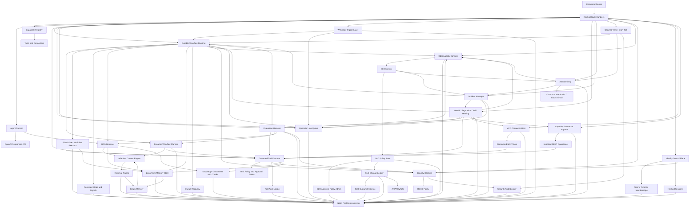

# OmniAgent OS Implementation Plan

## North Star

Build a durable AI agentic orchestration framework that can reason with OpenAI models, retrieve project knowledge, remember durable facts, connect to external systems, run governed tools, and verify work before it is considered complete.

## Current Slice

- Next.js command center
- OpenAI Responses API streaming endpoint
- File-backed local memory and knowledge ledgers in `.omniagent/`
- Neon/Postgres-backed durable memory, source documents, source chunks, and run ledger when `DATABASE_URL` is configured
- RAG v2 knowledge layer with `omni_knowledge_documents` and `omni_knowledge_chunks`
- pgvector columns and HNSW indexes for semantic retrieval, using a pgvector-safe embedding dimension
- Hybrid retrieval with semantic, keyword, recency, and memory-importance signals
- Adaptive context engine with query profiling, retrieve/no-retrieve routing, evidence confidence, source diversification, positional context packing, and persisted retrieval traces
- Graph memory engine that derives concept/entity communities from durable memories and retrieval traces, then feeds graph neighborhoods into context packs for multi-hop synthesis
- Manual memory writes and manual knowledge ingestion
- Automatic memory consolidation after successful runs into facts, preferences, procedures, decisions, and unresolved tasks
- Memory browser and knowledge library panels in the command center
- Governed tool executor with schema validation, dry-run default behavior, risk policy, approval holds, and audit history
- Agent mode switch: orchestrate, research, execute, learn
- Capability registry for specialist agents, tools, and connector types
- Run ledger for runs, events, status, prompt, model, context count, response, and errors
- Tool ledger for tool id, risk level, status, dry-run flag, approval requirement, inputs, outputs, and reasons
- Durable approval metadata for governed tool records, including approve/reject decisions, approver, decision time, and reason
- MCP connector registry for Streamable HTTP endpoints, token env-var references, server capabilities, discovered tool schemas, and connector health
- OpenAPI connector registry for JSON/YAML specs, base URLs, token env-var references, imported operations, request schemas, and connector health
- Durable workflow runtime with persisted runs, steps, events, Postgres-backed operation jobs, leases, retry backoff, approval waits, operator signals, and report persistence
- Dynamic workflow planner with typed DAG generation, tool/connector selection, execution policy, verification criteria, and persisted planner ledger
- Plan-driven workflow executor with persisted DAG node executions, governed tool decisions, dry-run side-effect controls, verification summaries, and report integration
- Native webhook trigger layer with signed event intake, trigger/event audit ledgers, workflow run creation, and durable queue enqueue
- Production health diagnostics with component status, SLO metrics, incident ledgers, and self-healing repair actions
- Incident management with normalized incident lifecycle, alert routing metadata, acknowledgement/resolution actions, event history, and remediation playbooks
- Alert delivery with signed outbound webhooks, Slack/email adapters, delivery retry/backoff, target readiness probes, failed-delivery recovery, escalation policy metadata, and scheduled production dispatch
- Vercel Cron-secured production workflow queue, observability SLO monitor, and scheduled alert delivery ticks through `/api/workflows/tick`, with opportunistic post-response draining through Next.js `after()`
- Operations center with approval queue, failed work summary, active workflow summary, connector error summary, and durable approval actions
- Observability console with durable runtime events, correlation IDs, SLO summaries, configurable SLO policies, route failure counts, monitor controls, and secret-safe metadata
- External connection catalog for MCP/OpenAPI adapter setup across common production apps
- Evaluation harness with persisted suites, case results, pass/warn/fail status, retrieval checks, workflow lifecycle checks, latency, and cost estimates
- Security controls with tenant-scoped context headers, RBAC roles, server-only secret env-var references, sensitive metadata redaction, and persisted allow/deny audit trails
- Identity control plane with auth-enabled mode, scrypt password hashes, HttpOnly opaque session cookies, hashed session tokens, tenants, users, memberships, and role-derived security context

## Architecture

## Milestones

1. Attach Neon Postgres through Vercel Marketplace and set `DATABASE_URL`. Done.
2. Add RAG v2 documents, chunks, pgvector-backed retrieval, and a memory/knowledge browser. Done.
3. Add memory consolidation: extract facts, preferences, procedures, decisions, and unresolved tasks after every run. Done.
4. Tool execution engine: implement governed tool calls with schemas, risk levels, approval gates, dry-runs, and audit records. Done.
5. MCP connector host: register remote Streamable HTTP MCP servers, discover tools, and expose selected tools through the governed executor. Done.
6. OpenAPI connector importer: transform API specs into typed tool adapters. Done.
7. Workflow runtime: add durable queues for long-running jobs, retries, signals, and resumes. Done.
8. Evaluation harness: add regression tasks, retrieval quality checks, and cost/latency metrics. Done.
9. Security controls: add tenant boundaries, RBAC, secret vaulting, and audit trails. Done.
10. Auth and tenant control plane: add session auth, tenants, users, memberships, role-derived contexts, and admin user creation. Done.
11. Vercel Cron workflow ticker: add a secured scheduled production queue tick endpoint. Done.
12. Approval and operations center: add durable tool approvals, workflow/tool approval queue, operations overview, and external connection catalog. Done.
13. pgvector production hardening: align OpenAI embedding dimensions with pgvector HNSW limits, migrate vector columns, backfill vector indexes, and remove noisy fallback warnings. Done.
14. Durable runtime hardening: add Postgres operation jobs, queue leases, expired-lease repair, retry backoff, workflow dedupe keys, queue health reporting, and post-response drains. Done.
15. Adaptive context engine: add retrieval policy routing, evidence grading, diversity-aware packing, retrieval trace observability, and queue/workflow integration. Done.
16. Graph memory engine: add concept/entity extraction, memory graph nodes/edges/builds, graph search, graph-context packing, and graph regression checks. Done.
17. Dynamic workflow planner: add structured goal decomposition, typed DAG planner, governed tool/connector selection, execution policy, verification criteria, planner ledger, and workflow integration. Done.
18. Plan-driven workflow executor: persist every dynamic DAG node execution, run read-only governed tools, dry-run side-effecting or approval-gated tools, summarize execution for verification, expose execution stats, and add regression coverage. Done.
19. Webhook workflow triggers: add signed event intake, trigger and event ledgers, workflow run creation, durable queue enqueue, command-center stats, and regression coverage. Done.
20. Production health diagnostics: add health and diagnostics APIs, persisted component/SLO ledgers, self-healing repair actions, command-center health counters, and regression coverage. Done.
21. Incident management: add normalized incidents, event history, alert routing metadata, acknowledgement/resolution actions, remediation playbooks, command-center controls, and regression coverage. Done.
22. Alert delivery: add persisted alert deliveries, signed outbound webhooks, Slack/email adapters, retry/backoff, escalation policy metadata, command-center controls, and regression coverage. Done.
23. Scheduled alert operations: extend the secured Vercel cron tick to queue and dispatch incident alerts, expose scheduler readiness and limits in the command center, and add scheduler regression coverage. Done.
24. Alert operations hardening: add secret-safe target health probes, blocked external target accounting, failed-delivery retry controls, command-center target health rows, and regression coverage. Done.
25. Observability console: add durable runtime events, correlation IDs, SLO/error summaries, observability API, command-center timeline, and regression coverage. Done.
26. Observability SLO alerting: add SLO policy evaluation, breach-to-incident sync, alert queue integration, cron/operator monitor execution, command-center controls, and regression coverage. Done.
27. SLO policy management: add durable SLO policies, threshold/severity/routing/suppression configuration, default reset, command-center editor controls, and regression coverage. Done.
28. SLO policy change control: add durable policy change requests, approval queue integration, immutable before/after snapshots, rollback requests, command-center history, and regression coverage. Done.
29. SLO multi-party approval: add quorum policy, role-gated approver rules, requester separation, signed evidence hashes, rollback attestations, command-center progress, and regression coverage. Done.
30. SLO approval policy administration: add durable approval policy config, immutable version history, configurable quorums, break-glass rules, command-center controls, and regression coverage. Done.
31. Production queue recovery: add stale workflow inspection, safe requeue/fail reconciliation, bounded queue drain actions, diagnostics integration, command-center controls, and regression coverage. Done.
