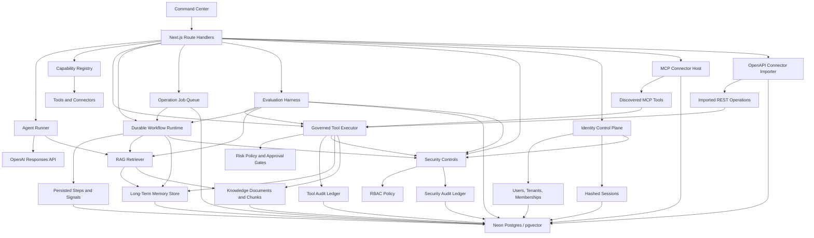

# OmniAgent OS Implementation Plan

## North Star

Build a durable AI agentic orchestration framework that can reason with OpenAI models, retrieve project knowledge, remember durable facts, connect to external systems, run governed tools, and verify work before it is considered complete.

## Current Slice

- Next.js command center
- OpenAI Responses API streaming endpoint
- File-backed local memory and knowledge ledgers in `.omniagent/`
- Neon/Postgres-backed durable memory, source documents, source chunks, and run ledger when `DATABASE_URL` is configured
- RAG v2 knowledge layer with `omni_knowledge_documents` and `omni_knowledge_chunks`
- pgvector columns and HNSW indexes for semantic retrieval, using a pgvector-safe embedding dimension
- Hybrid retrieval with semantic, keyword, recency, and memory-importance signals
- Manual memory writes and manual knowledge ingestion
- Automatic memory consolidation after successful runs into facts, preferences, procedures, decisions, and unresolved tasks
- Memory browser and knowledge library panels in the command center
- Governed tool executor with schema validation, dry-run default behavior, risk policy, approval holds, and audit history
- Agent mode switch: orchestrate, research, execute, learn
- Capability registry for specialist agents, tools, and connector types
- Run ledger for runs, events, status, prompt, model, context count, response, and errors
- Tool ledger for tool id, risk level, status, dry-run flag, approval requirement, inputs, outputs, and reasons
- Durable approval metadata for governed tool records, including approve/reject decisions, approver, decision time, and reason
- MCP connector registry for Streamable HTTP endpoints, token env-var references, server capabilities, discovered tool schemas, and connector health
- OpenAPI connector registry for JSON/YAML specs, base URLs, token env-var references, imported operations, request schemas, and connector health
- Durable workflow runtime with persisted runs, steps, events, Postgres-backed operation jobs, leases, retry backoff, approval waits, operator signals, and report persistence
- Vercel Cron-secured production workflow queue ticks through `/api/workflows/tick`, with opportunistic post-response draining through Next.js `after()`
- Operations center with approval queue, failed work summary, active workflow summary, connector error summary, and durable approval actions
- External connection catalog for MCP/OpenAPI adapter setup across common production apps
- Evaluation harness with persisted suites, case results, pass/warn/fail status, retrieval checks, workflow lifecycle checks, latency, and cost estimates
- Security controls with tenant-scoped context headers, RBAC roles, server-only secret env-var references, sensitive metadata redaction, and persisted allow/deny audit trails
- Identity control plane with auth-enabled mode, scrypt password hashes, HttpOnly opaque session cookies, hashed session tokens, tenants, users, memberships, and role-derived security context

## Architecture

## Milestones

1. Attach Neon Postgres through Vercel Marketplace and set `DATABASE_URL`. Done.
2. Add RAG v2 documents, chunks, pgvector-backed retrieval, and a memory/knowledge browser. Done.
3. Add memory consolidation: extract facts, preferences, procedures, decisions, and unresolved tasks after every run. Done.
4. Tool execution engine: implement governed tool calls with schemas, risk levels, approval gates, dry-runs, and audit records. Done.
5. MCP connector host: register remote Streamable HTTP MCP servers, discover tools, and expose selected tools through the governed executor. Done.
6. OpenAPI connector importer: transform API specs into typed tool adapters. Done.
7. Workflow runtime: add durable queues for long-running jobs, retries, signals, and resumes. Done.
8. Evaluation harness: add regression tasks, retrieval quality checks, and cost/latency metrics. Done.
9. Security controls: add tenant boundaries, RBAC, secret vaulting, and audit trails. Done.
10. Auth and tenant control plane: add session auth, tenants, users, memberships, role-derived contexts, and admin user creation. Done.
11. Vercel Cron workflow ticker: add a secured scheduled production queue tick endpoint. Done.
12. Approval and operations center: add durable tool approvals, workflow/tool approval queue, operations overview, and external connection catalog. Done.
13. pgvector production hardening: align OpenAI embedding dimensions with pgvector HNSW limits, migrate vector columns, backfill vector indexes, and remove noisy fallback warnings. Done.
14. Durable runtime hardening: add Postgres operation jobs, queue leases, expired-lease repair, retry backoff, workflow dedupe keys, queue health reporting, and post-response drains. Done.
