# OmniAgent OS Implementation Plan

> Plan status after item 70: P6.2 semantic intent/entity/capability routing,
> P6.3 native conversation/observation transport, and P6.4 bounded typed
> workflow-node execution are production-proven and complete. Model output is
> strictly parsed and remains
> advisory to deterministic procedure, ambiguity, approval, catalog, and
> tenant-policy boundaries. P6.1 has production-proven read, clarification,
> resume, and bounded model-summary slices; interrupted-run recovery and
> broader fault injection remain open. P5.2 is complete for its declared
> actor-private registry, review, memory, and canonical text-evidence scope.
> P3.1 and P4.1 remain held at their explicit external-authority gates. An
> authenticated direct run can compile only the canonical user's explicitly
> selected private-memory evidence in `all` mode, under an exact
> request/actor/purpose-bound user scope. Automatic retrieval, project/session
> modes, workflows, background workers, agent-private/shared visibility,
> standing formation, and the full authority resolver remain closed, so P3.1
> is not complete. Project mode now fails closed to session-only context instead
> of falling through to tenant-wide memory. Its activation requires a real
> governance, consent, membership, and grant authority; none is inferred from
> tenant membership alone. P5.2's versioned 27-case production-like benchmark
> passes every declared precision, recall, isolation, lifecycle, and
> determinism gate. The next independent implementation slice is P6.5 dynamic
> dependency binding and parallel DAG scheduling. The production P6.4 canary
> also confirmed an older bounded-replan ordering defect: a failed verifier
> resets `plan` and `execute` but immediately re-enters `verify`; this remains
> pending for P6.6/recovery work. P12 and P13 are intentionally deferred.

## North Star

Build a durable AI agentic orchestration framework that can reason with OpenAI models, retrieve project knowledge, remember durable facts, connect to external systems, run governed tools, and verify work before it is considered complete.

## Current Slice

- Next.js command center
- OpenAI Responses API streaming endpoint
- File-backed local memory and knowledge ledgers in `.omniagent/`
- Neon/Postgres-backed durable memory, source documents, source chunks, and run ledger when `DATABASE_URL` is configured
- RAG v2 knowledge layer with `omni_knowledge_documents` and `omni_knowledge_chunks`
- pgvector columns and HNSW indexes for semantic retrieval, using a pgvector-safe embedding dimension
- Hybrid retrieval with semantic, keyword, recency, and memory-importance signals
- Adaptive context engine with query profiling, retrieve/no-retrieve routing, evidence confidence, source diversification, positional context packing, and persisted retrieval traces
- Context Compiler v2 shadow comparison with scope/purpose/currentness gates, hashed candidate decisions, and actor-bound run receipts; the legacy pack remains authoritative
- Graph memory engine that derives concept/entity communities from durable memories and retrieval traces, then feeds graph neighborhoods into context packs for multi-hop synthesis
- Versioned Asael ontology registry covering all 17 planned entity types and 13 typed relations without rewriting the legacy graph projection
- Actor-private entity registry with aliases, deterministic exact-only auto-linking, immutable resolution decisions, reversible merge reviews, typed audit events, and forced tenant/actor RLS
- Deterministic typed-entity projection from explicit user-authored memory markers, with multi-memory lineage, correction/forget propagation, final-reference label scrubbing, and permanent database deletion barriers
- Manual memory writes and manual knowledge ingestion
- Evidence-based memory formation from explicit user assertions, canonical source observations, and verified tool effects; assistant prose remains an inactive inference candidate
- Memory browser and knowledge library panels in the command center
- Governed tool executor with schema validation, dry-run default behavior, risk policy, approval holds, and audit history
- Agent mode switch: orchestrate, research, execute, learn
- Capability registry for specialist agents, tools, and connector types
- Run ledger for runs, events, status, prompt, model, context count, response, and errors
- Tenant-pinned Loop v2 read-only canary with deterministic state transitions, transactionally persisted checkpoints, bounded retry/replan/cancel handling, governed `runs.list` execution, and atomic terminal disposition
- Separately pinned Loop v2 model-text canary for bounded explicit summaries, with one logical model call, no tools or retrieved context, mandatory usage receipts, and fail-closed verification
- Tool ledger for tool id, risk level, status, dry-run flag, approval requirement, inputs, outputs, and reasons
- Durable approval metadata for governed tool records, including approve/reject decisions, approver, decision time, and reason
- MCP connector registry for Streamable HTTP endpoints, token env-var references, server capabilities, discovered tool schemas, and connector health
- OpenAPI connector registry for JSON/YAML specs, base URLs, token env-var references, imported operations, request schemas, and connector health
- Durable workflow runtime with persisted runs, steps, events, Postgres-backed operation jobs, leases, retry backoff, approval waits, operator signals, and report persistence
- Dynamic workflow planner with typed DAG generation, tool/connector selection, execution policy, verification criteria, and persisted planner ledger
- Plan-driven workflow executor with persisted DAG node executions, governed tool decisions, dry-run side-effect controls, verification summaries, and report integration
- Versioned workflow-node contract with server-derived agent/tool/control executors, exact dependency artifacts and tool grants, bounded model/tool calls, typed artifacts and acceptance checks, and input/output-bound execution receipts
- Native webhook trigger layer with signed event intake, trigger/event audit ledgers, workflow run creation, and durable queue enqueue
- Production health diagnostics with component status, SLO metrics, incident ledgers, and self-healing repair actions
- Incident management with normalized incident lifecycle, alert routing metadata, acknowledgement/resolution actions, event history, and remediation playbooks
- Alert delivery with signed outbound webhooks, Slack/email adapters, delivery retry/backoff, target readiness probes, failed-delivery recovery, escalation policy metadata, and scheduled production dispatch
- Vercel Cron-secured production workflow queue, observability SLO monitor, and scheduled alert delivery ticks through `/api/workflows/tick`, with opportunistic post-response draining through Next.js `after()`
- Operations center with approval queue, failed work summary, active workflow summary, connector error summary, and durable approval actions
- Observability console with durable runtime events, correlation IDs, SLO summaries, configurable SLO policies, route failure counts, monitor controls, and secret-safe metadata
- External connection catalog for MCP/OpenAPI adapter setup across common production apps
- Evaluation harness with persisted suites, case results, pass/warn/fail status, retrieval checks, workflow lifecycle checks, latency, and cost estimates
- Signed evaluation report snapshots with persistent JSON audit bundles, HMAC signatures, evidence manifests, and download support
- Evaluation report verification with canonical digest checks, HMAC keyring validation, rotation-key metadata, and operator-facing verification controls
- Security controls with tenant-scoped context headers, RBAC roles, server-only secret env-var references, sensitive metadata redaction, and persisted allow/deny audit trails
- Identity control plane with auth-enabled mode, scrypt password hashes, HttpOnly opaque session cookies, hashed session tokens, tenants, users, memberships, and role-derived security context

## Architecture

```mermaid
flowchart TD
  UI["Command Center"] --> API["Next.js Route Handlers"]
  API --> RUNNER["Agent Runner"]
  RUNNER --> OAI["OpenAI Responses API"]
  RUNNER --> RAG["RAG Retriever"]
  RAG --> CTX["Adaptive Context Engine"]
  RAG --> MEM["Long-Term Memory Store"]
  RAG --> DOCS["Knowledge Documents and Chunks"]
  CTX --> RTRACE["Retrieval Traces"]
  RTRACE --> DB
  MEM --> DB["Neon Postgres / pgvector"]
  MEM --> MGRAPH["Graph Memory"]
  RTRACE --> MGRAPH
  MGRAPH --> CTX
  MGRAPH --> DB
  DOCS --> DB
  API --> REG["Capability Registry"]
  REG --> TOOLS["Tools and Connectors"]
  API --> GOV["Governed Tool Executor"]
  GOV --> POLICY["Risk Policy and Approval Gates"]
  GOV --> AUDIT["Tool Audit Ledger"]
  API --> WF["Durable Workflow Runtime"]
  WF --> WPLAN["Dynamic Workflow Planner"]
  WF --> WEXEC["Plan-Driven Workflow Executor"]
  WPLAN --> CTX
  WPLAN --> GOV
  WPLAN --> DB
  WEXEC --> GOV
  WEXEC --> DB
  WEXEC --> MEM
  API --> OQ["Operation Job Queue"]
  WF --> WSTEPS["Persisted Steps and Signals"]
  OQ --> WF
  OQ --> DB
  WSTEPS --> DB
  WF --> RAG
  WF --> MEM
  API --> EVAL["Evaluation Harness"]
  EVAL --> GOV
  EVAL --> WF
  EVAL --> WPLAN
  EVAL --> RAG
  EVAL --> DB
  EVAL --> EREPORT["Signed Report Snapshots"]
  EREPORT --> DB
  EREPORT --> EVERIFY["Report Verifier / Key Metadata"]
  API --> TRIG["Webhook Trigger Layer"]
  TRIG --> WF
  TRIG --> OQ
  TRIG --> DB
  API --> DIAG["Health Diagnostics / Self-Healing"]
  DIAG --> OQ
  DIAG --> WF
  DIAG --> EVAL
  DIAG --> GOV
  DIAG --> MCP
  DIAG --> OPENAPI
  DIAG --> DB
  API --> INCIDENTS["Incident Manager"]
  INCIDENTS --> DIAG
  INCIDENTS --> OQ
  INCIDENTS --> WF
  INCIDENTS --> DB
  API --> ALERTS["Alert Delivery"]
  ALERTS --> INCIDENTS
  ALERTS --> WEBHOOKS["Outbound Webhooks / Slack / Email"]
  ALERTS --> DB
  API --> CRON["Secured Vercel Cron Tick"]
  CRON --> WF
  WF --> QREC["Queue Recovery"]
  QREC --> DB
  CRON --> ALERTS
  CRON --> SAUDIT
  API --> OBS["Observability Console"]
  OBS --> SLO["SLO Monitor"]
  SLO --> SLOPOL["SLO Policy Store"]
  SLOPOL --> SLOADMIN["SLO Approval Policy Admin"]
  SLOPOL --> SLOCHG["SLO Change Ledger"]
  SLOCHG --> SLOQUORUM["SLO Quorum Evidence"]
  SLOPOL --> DB
  SLOADMIN --> DB
  SLOCHG --> DB
  SLOQUORUM --> DB
  SLOCHG --> APPROVALS
  SLO --> INCIDENTS
  SLO --> ALERTS
  WF --> OBS
  ALERTS --> OBS
  EVAL --> OBS
  DIAG --> OBS
  OBS --> DB
  API --> SEC["Security Controls"]
  SEC --> RBAC["RBAC Policy"]
  SEC --> SAUDIT["Security Audit Ledger"]
  SAUDIT --> DB
  API --> AUTH["Identity Control Plane"]
  AUTH --> USERS["Users, Tenants, Memberships"]
  AUTH --> SESS["Hashed Sessions"]
  USERS --> DB
  SESS --> DB
  AUTH --> SEC
  GOV --> SEC
  WF --> SEC
  EVAL --> SEC
  API --> MCP["MCP Connector Host"]
  MCP --> MTOOLS["Discovered MCP Tools"]
  MTOOLS --> GOV
  API --> OPENAPI["OpenAPI Connector Importer"]
  OPENAPI --> RTOOLS["Imported REST Operations"]
  RTOOLS --> GOV
  GOV --> MEM
  GOV --> DOCS
  AUDIT --> DB
  MCP --> DB
  OPENAPI --> DB
```

## Milestones

1. Attach Neon Postgres through Vercel Marketplace and set `DATABASE_URL`. Done.
2. Add RAG v2 documents, chunks, pgvector-backed retrieval, and a memory/knowledge browser. Done.
3. Add memory consolidation: extract facts, preferences, procedures, decisions, and unresolved tasks after every run. Done.
4. Tool execution engine: implement governed tool calls with schemas, risk levels, approval gates, dry-runs, and audit records. Done.
5. MCP connector host: register remote Streamable HTTP MCP servers, discover tools, and expose selected tools through the governed executor. Done.
6. OpenAPI connector importer: transform API specs into typed tool adapters. Done.
7. Workflow runtime: add durable queues for long-running jobs, retries, signals, and resumes. Done.
8. Evaluation harness: add regression tasks, retrieval quality checks, and cost/latency metrics. Done.
9. Security controls: add tenant boundaries, RBAC, secret vaulting, and audit trails. Done.
10. Auth and tenant control plane: add session auth, tenants, users, memberships, role-derived contexts, and admin user creation. Done.
11. Vercel Cron workflow ticker: add a secured scheduled production queue tick endpoint. Done.
12. Approval and operations center: add durable tool approvals, workflow/tool approval queue, operations overview, and external connection catalog. Done.
13. pgvector production hardening: align OpenAI embedding dimensions with pgvector HNSW limits, migrate vector columns, backfill vector indexes, and remove noisy fallback warnings. Done.
14. Durable runtime hardening: add Postgres operation jobs, queue leases, expired-lease repair, retry backoff, workflow dedupe keys, queue health reporting, and post-response drains. Done.
15. Adaptive context engine: add retrieval policy routing, evidence grading, diversity-aware packing, retrieval trace observability, and queue/workflow integration. Done.
16. Graph memory engine: add concept/entity extraction, memory graph nodes/edges/builds, graph search, graph-context packing, and graph regression checks. Done.
17. Dynamic workflow planner: add structured goal decomposition, typed DAG planner, governed tool/connector selection, execution policy, verification criteria, planner ledger, and workflow integration. Done.
18. Plan-driven workflow executor: persist every dynamic DAG node execution, run read-only governed tools, dry-run side-effecting or approval-gated tools, summarize execution for verification, expose execution stats, and add regression coverage. Done.
19. Webhook workflow triggers: add signed event intake, trigger and event ledgers, workflow run creation, durable queue enqueue, command-center stats, and regression coverage. Done.
20. Production health diagnostics: add health and diagnostics APIs, persisted component/SLO ledgers, self-healing repair actions, command-center health counters, and regression coverage. Done.
21. Incident management: add normalized incidents, event history, alert routing metadata, acknowledgement/resolution actions, remediation playbooks, command-center controls, and regression coverage. Done.
22. Alert delivery: add persisted alert deliveries, signed outbound webhooks, Slack/email adapters, retry/backoff, escalation policy metadata, command-center controls, and regression coverage. Done.
23. Scheduled alert operations: extend the secured Vercel cron tick to queue and dispatch incident alerts, expose scheduler readiness and limits in the command center, and add scheduler regression coverage. Done.
24. Alert operations hardening: add secret-safe target health probes, blocked external target accounting, failed-delivery retry controls, command-center target health rows, and regression coverage. Done.
25. Observability console: add durable runtime events, correlation IDs, SLO/error summaries, observability API, command-center timeline, and regression coverage. Done.
26. Observability SLO alerting: add SLO policy evaluation, breach-to-incident sync, alert queue integration, cron/operator monitor execution, command-center controls, and regression coverage. Done.
27. SLO policy management: add durable SLO policies, threshold/severity/routing/suppression configuration, default reset, command-center editor controls, and regression coverage. Done.
28. SLO policy change control: add durable policy change requests, approval queue integration, immutable before/after snapshots, rollback requests, command-center history, and regression coverage. Done.
29. SLO multi-party approval: add quorum policy, role-gated approver rules, requester separation, signed evidence hashes, rollback attestations, command-center progress, and regression coverage. Done.
30. SLO approval policy administration: add durable approval policy config, immutable version history, configurable quorums, break-glass rules, command-center controls, and regression coverage. Done.
31. Production queue recovery: add stale workflow inspection, safe requeue/fail reconciliation, bounded queue drain actions, diagnostics integration, command-center controls, and regression coverage. Done.
32. Workflow health semantics: separate live workflow liveness risk from recovered terminal failure history, resolve stale recovery incidents cleanly, and add pure regression coverage. Done.
33. Command Center liveness semantics: expose live workflow risk, recent unhandled failures, recovered failures, and historical terminal failures as distinct operations counters with regression coverage. Done.
34. Recovery history details: expose workflow recovery event history through operations overview and render operator-facing Command Center rows with disposition, stale age, attempt counts, actor, reason, and affected queue jobs. Done.
35. Production evaluation governance: classify eval cases by read-only/synthetic/mutation safety mode, default production runs to safe cases, require admin override reasons for mutation-capable cases, expose Command Center risk labels, and add governance regression coverage. Done.
36. Evaluation override operations: split Command Center evaluation execution into safe and gated lanes, require admin/system role plus explicit mutation consent and operator reason for gated suites, and attach override evidence to evaluation runtime responses and events. Done.
37. Evaluation run drill-down: enrich run detail responses with case governance, override evidence, and correlated runtime events, then add Command Center run selection with all/failed/warned/gated case filters and compact case result inspection. Done.
38. Persistent evaluation report export: persist signed JSON audit bundles for evaluation runs, expose authenticated report list/download APIs, add Command Center create/download controls, and include regression-ready case/event manifests. Done.
39. Evaluation report verification: add canonical JSON digest validation, HMAC verification against active/rotated/fallback signing keys, authenticated verifier APIs for stored or submitted reports, non-secret keyring metadata, and Command Center verify controls. Done.
40. Auth/read lockdown: fail closed in hosted/production runtimes, default to viewer, trust identity headers only with an internal secret, and require RBAC reads for memory, knowledge, runs, tools, workflows, evaluations, connectors, and capabilities. Done.
41. Connector hardening: require connector secret env vars to use `OMNIAGENT_CONNECTOR_*` or an explicit allowlist, reject platform secret references at registration and execution, block private/loopback/metadata connector URLs, and stop unvalidated redirects. Done.
42. Tenant isolation first pass: tenant-scope memory, knowledge, context packs, agent runs, workflow runs, tool audits, and identity control-plane reads/writes while preserving internal worker access paths. Done.
43. Schema/bootstrap hardening: fix fresh Postgres schema order so operation jobs exist before workflow trigger event foreign keys, and serialize first-load SLO approval policy seeding in file mode. Done.
44. Queue lease correctness: fence operation job completion/failure by running status and lease owner, surface stale worker results, and prevent recovery requeue from clearing active leases. Done.
45. Release gates: add production-ready security smoke tests, package scripts, and signed evaluation report release-gate decisions that distinguish signature integrity from release approval. Done.
46. RAG/memory hardening: make Postgres the source of truth when configured, add tenant-scoped JSON-embedding fallback inside Postgres, enforce tag filters, and add overlapping chunk boundaries. Done.
47. Command Center safety/accessibility: add high-risk action confirmations, duplicate-submit locks, disabled states, and ARIA live/log regions for operator feedback. Done.
48. P1.6 full-boundary checkpoints: chain model success/failure, governed tool, approval, council delegation, and verifier boundaries; add fail-closed complete-phase reconciliation while preserving older rollout behavior. Production shadow generation 3 established all ten phases. Read-only canary generation 4 then matched 86/86 checkpoints across eight runs and hard-kill recovery reclaimed the exact fence as generation 2 with zero external effects or effect receipts. Done.
49. P1.4 external mutation receipts: classify governed connector operations, persist immutable v2 effect intents before HTTP, MCP, and OpenAPI mutations, finalize bounded provider acknowledgements as explicit unverifiable receipts when no uniform read exists, preserve verified Google Calendar read-after-write, and bind workflow effects to exact persisted plan identity. Done.
50. P1.5 claim-level evidence: resolve immutable tenant-scoped knowledge evidence, authorize owner/scope/purpose/retention before inspection, decompose exact answer spans, persist and structurally verify `ClaimEvidenceMapV1`, prevent citation IDs from upgrading unrelated text, emit a metadata-only completion summary, expose a bounded public projection, and render per-claim support states and coverage. Done.
51. P1.7 checkpoint replay, fork, and correction: expose bounded checkpoint steps in trajectories; validate the complete root-to-selected checkpoint chain and exact source event prefix; atomically create immutable tenant-scoped lineage, a fresh-scoped target run, and metadata-only source/target fork events; never inherit continuation, resume, tool, or approval state; and let a user launch the corrected trace from the result UI while preserving the source history. Done.
52. P2.1 canonical source lineage: retain strict `SourceItem`, immutable `SourceRevision`, `EvidenceUnit`, and typed adapter-output contracts; bind Google personal-sync passages to stable provider revision coordinates; and reject every registered actor-attributed ingest that lacks exact source revision and passage locator lineage. The production closure check found zero legacy knowledge rows requiring backfill. Done.
53. P2.2 independent personal-source checkpoints: page Gmail, Calendar, and Drive independently; commit each source coordinate only after its bounded page settles in an authenticated, encrypted cursor envelope; preserve healthy sibling progress on a source failure; include Gmail deletions and fixed Calendar/Drive backfill windows; fence concurrent workers with expiring lease generations; and invalidate stale cursors and leases on reauthorization. Migration v71 is applied and focused pagination, fault, retry, reconnect, cursor-sealing, and lease tests pass. Done.
54. P2.3 Drive convergence pilot: retain the inactive, rollout-bound generation-2 transactional checkpoint path; settle creates, edits, deletes, restores, retries, and concurrent observations through immutable revisions/tombstones and one ordered head; and version the hash-only metadata adapter so parent-set moves produce revisions without retaining provider identifiers. Bounded rollout/checkpoint/convergence fixtures pass. Production has no Google grant or enrolled rollout, so live-provider proof and read promotion remain pending external enrollment. Done for the Drive pilot.
55. P2.7 lineage tombstone and deletion barrier: preserve immutable immediate memory barriers; require reviewed forget manifests; remove forgotten content from reads, graph, context, and export; invalidate pending runs and derived briefs; transactionally retire connected-source and Capture descendants; fence delayed Capture ingestion; and lease bounded physical scrubs through the maintenance contract with a 24-hour default SLA. Focused deletion, invalidation, preview, scrub, and export-path fixtures pass. Done for registered surfaces.
56. P3.1 canonical user-private memory canary: migration v72 removes the dormant enrollment hold only for canonical actor-owned `user_private` rows; restrictive RLS binds every read and mutation to the exact transaction-local actor and canonical purpose; authenticated session/mobile memory create, list, search, inspect, correct, forget, export, and restore paths enter that scope; legacy rows remain on a separate compatibility lane; and each new bound row emits a metadata-only typed event. The authenticated Retrieval Plan API merges the caller's independently scoped private-memory results into its context pack. Migration v77 persists a separate immutable, actor-private trace containing only that private-memory evidence component; the tenant compatibility trace never receives the scoped query or results, and unscoped workers cannot observe the private trace. Migration v79 projects user-private memory into a separately namespaced, actor-bound graph; writes and corrections update it under their exact purpose, owner-authorized graph reads and Retrieval Plan searches merge it with compatibility results, and unscoped or sibling-actor reads cannot observe it. Migration v80 preserves those checks while evaluating the validated transaction scope once per statement instead of once per projected graph row. Migration v81 adds immutable run ownership and restrictive actor policies across run, thread, turn, run-event, checkpoint, resume-claim, and fork ledgers; request paths install the authenticated actor set and resume, specialist, consolidation, daily-brief, and workflow workers re-enter the persisted owner scope. Migration v82 applies the same owner boundary to governed tool inputs, outputs, approval state, and tool-event streams. Migration v74 repairs the daily-brief lineage column required by governed deletion invalidation. Migrations v75-v76 index immutable barrier manifests and remove redundant derived-row read scans only after proving the write-time/deferred deletion invariant; migration v78 similarly removes retrieval-trace JSON rescans only after proving indexed lineage completeness. The production graph query fell from 15.46 seconds to 37.6 milliseconds. This slice still excluded private memory from agent prompts.
57. P3.1 explicit private-context compilation: a direct authenticated agent request now creates a canonical user-principal retrieval scope only when the request contains a non-empty explicit evidence selection. The prompt compiler verifies the canonical/legacy actor binding, exact request correlation, tenant, retrieval purpose, direct agent principal, empty shared coordinates/grants, and personal `all` memory mode before independently resolving the selected IDs. Private context lineage and any continuation copies stay within actor-private trace, run/thread/checkpoint, and governed tool/event boundaries; manifests persist only evidence IDs and hashes. When private context is present, sibling council delegation/verification, the entire tool surface, and legacy prompt/response consolidation are disabled rather than receiving that context. Automatic context, session/project modes, workflows, forks, specialist/background workers, standing formation, agent-private/shared visibility, and the full authority resolver remain excluded. Done for direct explicit selection; P3.1 remains open.
58. P3.3 evidence-based memory formation: replace prompt/response extraction with four validated formation origins. Explicit user “remember” assertions create canonical actor-private active memories bound to the exact request, thread, and turn; canonical source observations bind exact knowledge and evidence lineage; only terminal, non-dry-run tool effects with a verified effect receipt create active episodes. Assistant output and workflow-generated reports are stored only as inactive `candidate` inferences and never enter retrieval or graph projections. Every formation writes a metadata-only `memory.formation.recorded` receipt with content/evidence hashes and exact evidence references. Migration v83 quarantines legacy active response-derived agent/workflow memories, removes their graph and brief projections, and queues graph rebuilding. Done.
59. P4.1 Context Compiler v2 shadow comparison: add a separate compiler contract over canonical source evidence, memory claims/summaries, and graph neighborhoods. It rejects missing access bindings, absent authorization scope, tenant/actor/scope/grant/purpose mismatches, inactive or temporally invalid claims, expired/non-current/deleted source revisions, and graph neighborhoods without active authorized backing memories before its own selection. Explicit empty selection remains authoritative. Direct durable runs compare the v2 selection with the unchanged legacy prompt pack and append a digest-verified, actor-bound `run.context_compiler_v2.shadow` receipt containing only hashes, enums, booleans, and counts. New canonical text revisions include the v2 context purpose; older evidence remains rejected until it is independently reauthorized or re-ingested. Done for shadow comparison; P4.1 remains open until observed gates justify promotion and all canonical evidence classes use pre-retrieval authorization.
60. P5.1/P5.2 ontology and scoped entity-registry foundation: pin `asael-ontology:1` with all 17 master-plan entity types, 13 typed relations, historical-version compatibility, and mandatory scope, sensitivity, purpose, lineage, and temporal semantics. Persist actor-private entity records, aliases, immutable resolution decisions, and merge reviews in migration v84 with forced tenant and actor RLS, immutable identity/access coordinates, contract digests, deterministic exact-only auto-linking, review-required fuzzy/ambiguous matches, reversible merges, and metadata-only typed audit events. A focused synthetic gate produced 10,000-basis-point auto-link precision with zero cross-actor candidates, and a rolled-back production runtime-role probe observed one owner row and zero sibling rows. Production web and Fly were released at `9861d4070d22eb648c5f0bf4e06760eabdac8d4b`; the runtime database password was rotated during the coordinated cutover. Done for the first safe sequence and P5.1. P5.2 remains open for canonical extraction integration, representative precision/recall data, and production adoption; the existing graph UI and legacy co-occurrence projection remain unchanged.
61. P6.1 read-only Loop v2 canary: define the versioned `understand -> clarify -> plan -> act -> observe -> verify -> replan/finish` transition contract and pin it to an exact active tenant rollout. Migration v85 persists an immutable actor-owned checkpoint chain with typed events and forced RLS. The first runtime task recognizes only an exact recent-runs read, invokes only governed `runs.list`, retries that idempotent read at most twice, verifies risk 0/no approval/no effect receipt, and atomically commits the terminal checkpoint with the run disposition. Legacy runs remain on v1. Focused success, retry, cancellation, tamper, route, and store tests pass. Production generation 1 completed `understand, plan, act, observe, verify, finish` with zero retries/replans, one live `runs.list`, and no effect receipt; web and Fly are healthy at `74a543ad029f0a061b80c65db821da5d514b0fc6`. Done for the first safe sequence. P6.1 remains open for general model-backed tasks, clarification inside the v2 loop, durable interruption/resume, and broader production fault-injection.
62. P3.1 fail-closed project mode and P5.2 explicit entity extraction: keep `project` memory mode session-only while project authority, consent, grants, and shared-scope policies remain unavailable; record the held decision in the run harness instead of falling through to tenant-wide memory. Project only explicit typed markers such as `organization: Acme` or `person named "Ada Lovelace"` from canonical active user-authored assertions, manual memories, and corrections; ordinary capitalization and assistant/model prose produce no entities. Exact auto-links append independent memory lineage, corrections attach replacement lineage before removing superseded lineage, and reviewed forget removes root/descendant references atomically. The final reference retires the entity and physically scrubs its label. Migration v86 adds indexed lineage columns, restrictive deletion-barrier reads, and write rejection for permanently forgotten memory; v87 adds a tenant/actor-bound owner probe used under the shared projection/deletion lock; v88 corrects table-specific immutability-trigger dispatch. The representative explicit-marker fixture measured precision 1.0 and recall 1.0. The authenticated production canary created one candidate/entity, then returned one affected and retired entity on reviewed forget; owner-role assertions confirmed the immutable receipt, forgotten memory shell, retired entity, scrubbed contract label, and empty lineage. Vercel and Fly are healthy at `27af65b18c7768e73aa199bc06f75acffdfb8798`. Done for the explicit user-authored lane. At this checkpoint P3.1 remained open for authorized project/shared memory, and P5.2 remained open for canonical source/evidence extraction, review UX, and a representative production-like benchmark.
63. P5.2 actor-private registry review surface: expose only a bounded public projection of the canonical user's confidential entity registry through authenticated `GET /api/entities`, with `private, no-store` caching and no access contracts or digests. `POST /api/entities` accepts only strict two-record merge decisions under the exact canonical user `entity.review.v1` scope; fuzzy single-candidate matches stay visible and fail closed. The Memory workspace loads this registry independently, shows active/merged records and aliases, lets an operator approve or reject true ambiguity, and reverses prior approvals through the immutable merge-review contract. Reviewed memory deletion receipts now show exact affected/retired entity and alias counts. Focused route, scope, review-visibility, entity-store, extraction, lint, type, and production-build checks pass. An authenticated production canary returned the private registry contract with no-store caching, and a browser canary opened the viewport-level drawer with no page errors. Vercel and Fly are healthy at exact release `a0417bf0860f4320bae78e7a003fb9b22613dad5`. Done for review UX; P5.2 remains open for canonical source/evidence extraction and a representative production-like benchmark.
64. P5.2 canonical source/evidence entity extraction: run the same exact typed-marker extractor over immutable canonical text chunks only when the source is actor-owned, `user_private`, coordinate-free, current, retained, and authorized for claim-evidence processing. Every projected entity carries the exact `EvidenceUnit` ID and immutable digest; ordinary capitalization, shared sources, system/capture ingestion, stale revisions, expired evidence, and unauthorized purpose sets produce no entity. Migration v89 adds indexed evidence-lineage columns, contract/index consistency triggers, restrictive current-evidence read policies, and a tenant/actor owner probe. Source revision replacement, canonical tombstones, and direct Knowledge source deletion retire affected evidence lineage in the same source transaction; removing the final reference retires and scrubs the entity, while cross-actor retirement fails closed. Focused extraction, ingestion, deletion, convergence, schema-marker, lint, type, and production-build checks pass. Migration 89 is installed with both policies/triggers and the security-definer probe verified. Authenticated registry read remained healthy, and Vercel/Fly are healthy at exact release `702928ed5f056d53180ffdda9285bd1d214809a9`. Done for canonical source/evidence extraction; P5.2 remains open only for the representative production-like entity-resolution benchmark.
65. P5.2 production-like entity-resolution benchmark: replace the six-case person-only unit assertion with the versioned, synthetic, side-effect-free `p5.2-entity-resolution-production-like-v1` suite. Its 27 cases cover canonical and alias matches, Unicode/punctuation normalization, duplicate identities, alias collisions, fuzzy review holds, unseen identities, retired records, entity-type separation, and tenant, actor, and access-binding isolation. The suite schema requires every declared coverage dimension and decision class, all four candidate scope classes, and a retired candidate; every case is replayed with reversed candidate order. The checked-in scorer reports suite digest `414a29adcf92b9d390c4c135d51b411578bbbe4414cd324415371cfd6617f454`, 10,000-basis-point auto-link precision, auto-link recall, review recall, and decision accuracy, with zero false auto-merges, scope leaks, or nondeterministic cases. Focused scorer, schema-weakening, lint, and type checks pass. Done; this closes P5.2 within its declared actor-private scope. The benchmark is evaluation evidence, not production merge or access-broadening authority, and the legacy topic/co-occurrence graph remains unchanged pending P5.3/P5.4.
66. P6.1 persisted clarification and resume: expand only the existing recent-runs canary so an ambiguous `show/list/get my runs` request records `understand -> clarify`, atomically moves its actor-owned run to `waiting_clarification`, and returns the run ID with a bounded confirmation prompt before any tool executes. Migration v90 requires a thread binding and permits only one waiting clarification per tenant/actor/thread. An explicit affirmative response must carry that exact run and thread ID; the store locks and revalidates the run/actor/thread/agent tuple, restores the immutable original execution scope, records `clarified -> plan`, and then continues through the unchanged governed `runs.list` path. The web conversation remains writable while waiting and restores the pending clarification from its persisted assistant turn after reload. Focused route, runtime, store, status, type, and production-build checks pass (51 focused tests); duplicate resume converges without a second checkpoint. Migration 90 is installed with its checksum, validated constraint, valid unique index, and zero invalid rows. Vercel, the Fly gateway, and all three worker startup lanes are healthy and active at exact release `b8d26701c8cb281ae822eeae7cbb8807e67d7939`; anonymous `/api/agent` remains closed with 401. The authenticated interaction canary remains to be run when an unlocked browser session is available. Done for the first clarification/resume slice; P6.1 remains open for bounded model-backed tasks and broader production fault injection.
67. P6.1 bounded model-text canary: add a second immutable capability/engine pin for only `Summarize:` or `Summarize this text:` requests containing 80–4,000 characters. It accepts only direct Atlas work with no mission, specialists, resume ID, context evidence, or approval; supplies only the redacted explicit source text to one logical fast-tier gateway call; permits at most four gateway-recorded provider attempts; caps output at 256 tokens/4,000 characters; and requires a non-local completed provider receipt plus a persisted usage receipt before success. No tool, memory, web, council, workflow, continuation, or conversation-history content enters the task. Provider or verification failure records `action_failed`/`verification_failed -> replan -> finish` without a second logical call, while cancellation records a terminal canceled checkpoint. Existing admitted runs now continue under their immutable pin even after a rollout pause or supersession; only new roots recheck the current rollout. Migration v91 replaces the old single-engine checks with a validated capability/engine/configuration/pin-column invariant; all 16 prior checkpoints remained valid. The rollout was registered and activated through the risk-3 system API, preserving typed lifecycle events. The authenticated production canary made one model call and zero tool calls, persisted `understand, plan, act, observe, verify, finish`, recorded one completed `text_generation` usage receipt with 34 output tokens, and finished successfully. Focused checks pass (58 tests plus lint, typecheck, and production build). Vercel, Fly, and all worker startup lanes are healthy and active at exact release `1b2a87055283dcd3c7db3adab26fcc0820aa41c0`; anonymous `/api/agent` remains closed with 401. Done for the first model-backed task; P6.1 remains open for broader interrupted-run recovery and bounded production fault injection.
68. P6.2 semantic intent/entity/capability routing: resolve every eligible request through the tenant's assigned orchestrator model using a bounded text call, strict JSON/Zod contract, usage receipt, and fail-closed deterministic fallback. Intersect model-proposed capability IDs with the active tenant catalog, use semantic queries only as discovery hints, preserve exact saved procedures and destructive ambiguity as authoritative invariants, and make approval monotonic across the legacy policy, semantic consequence signal, and catalog risk. Persist a metadata-only `intent.semantic_resolved` receipt without prompt content, raw entity text, tool grants, or effects. The versioned 24-case `p6.2-semantic-routing-v1` production-like suite runs through a protected, idempotent, side-effect-free endpoint and records `evaluation.semantic_routing.completed`. At release `ce2f167cdfdfe21ad58711eafbac733d95c2487b`, it achieved route accuracy 1.0, required-tool recall 1.0, model coverage 1.0, and zero unexpected clarification. Focused policy/resolver/route/evaluation tests, lint, typecheck, and staged production build pass. Canonical Vercel, the Fly gateway, and fast/background/maintenance worker lanes are healthy on that exact release; anonymous `/api/agent` returns 401. Done; next is P6.3. P6.1's broader recovery/fault-injection work remains separately open, and P12/P13 remain deferred.
69. P6.3 native conversation roles and structured observations: replace the flattened `USER:`/`ASSISTANT:` pseudo-transcript with strict provider-neutral schema v1 items for user/assistant messages, untrusted observations, tool calls, and tool results. Memory/RAG, web, workspace capability, and council data stay structurally labeled as untrusted observations outside privileged instructions. OpenAI, Gemini Interactions, Anthropic Messages, and Bedrock Converse adapters map that contract into native roles and native tool blocks. Every new gateway tool continuation must include a validated canonical replay transcript in addition to optional provider-owned state; approval-paused OpenAI and multi-provider runs persist the canonical form, while historical continuations remain read-compatible. The run harness receipts the schema version and role/observation guarantees. Focused contract, adapter, gateway, agent-loop, approval-resume, store, lint, and type checks pass, including provider-neutral tool replay without provider state. A staged three-message production canary preserved the assistant turn, returned `cobalt`, emitted the v2 harness with conversation schema v1/native roles/structured observations, and recorded a completed model usage receipt. Canonical Vercel, Fly protocol 1, and fast/background/maintenance worker lanes are healthy and active at exact release `99fd32dfe9ce70bf11e94902b4a7e4afee90212b`; anonymous `/api/agent` returns 401. Done; next is P6.4. P6.1 recovery/fault injection remains separately open, and P12/P13 remain deferred.
70. P6.4 bounded typed workflow-node execution: derive a versioned node contract server-side after planning, fixing each node's `agent`, `tool`, or `control` executor, exact dependency IDs, exact tool allowlist, and model/tool/output limits. Persist only bounded typed node inputs. Tool nodes produce artifacts from redacted governed tool results and bind their tool-execution IDs; approval nodes bind deterministic control evidence; tool-less nodes must make one structured model call, receive no tool or context grants, evaluate every declared acceptance criterion, and cannot claim side effects or complete by repeating their description. Every completed node output includes typed artifacts plus a content-free execution receipt binding input/output hashes, dependency executions, and model/tool/control evidence. Historical plans are upgraded at execution while a persisted broadened contract fails closed. Seventeen focused contract, planner, agent-executor, tool-executor, lint, and type checks pass. The staged production gate completed five node executions with zero node failures, schema v1 on every input/result/receipt, and both `model_receipt` and `tool_receipts` completion bases. Canonical Vercel, Fly protocol 1, and fast/background/maintenance worker lanes are healthy and active at exact release `7ef1a95db58883efe4fa3531190d9d0d4105b86f`; anonymous `/api/agent` returns 401. The same synthetic run exposed a pre-existing bounded-replan ordering defect after node execution: failed verification resets `plan` and `execute` but immediately re-enters `verify`; track it under P6.6/recovery rather than treating it as P6.4 evidence. Done; next is P6.5. P6.1 recovery/fault injection remains separately open, and P12/P13 remain deferred.
