# OmniAgent OS Implementation Plan

> Plan status after item 91: Phases 0, 1, and 6 are production-proven and complete.
> The Phase 0 aggregate gate now verifies all ten execution-scope boundaries,
> the six versioned run contracts, a current tenant rollout pin, all nine
> canonical statuses, the 16-case P0.5 baseline, and all seven accepted ADRs.
> P6.1 now includes persisted read, clarification, resume,
> bounded model-summary, generation-fenced interrupted-run recovery, and the
> fixed bounded fault-injection gate. P6.2 semantic intent/entity/capability routing,
> P6.3 native conversation/observation transport, and P6.4 bounded typed
> workflow-node execution, plus P6.5 dependency binding and parallel DAG
> scheduling and P6.6 bounded failed-subtree replanning, are production-proven
> and complete. Model output is
> strictly parsed and remains
> advisory to deterministic procedure, ambiguity, approval, catalog, and
> tenant-policy boundaries. P5.2 is complete for its declared
> actor-private registry, review, memory, and canonical text-evidence scope.
> P3.2 is production-proven and complete: all eight memory tiers have explicit
> versioned lifecycle policy, persisted explainability, and bounded retrieval.
> P3.4 is production-proven and complete: inactive confirmation and contradiction
> candidates enter an actor-scoped review inbox and only an explicit, deterministic
> decision can activate or retire their claims.
> P3.5 is production-proven and complete: source-linked turn, episode, project,
> and lifetime summaries are rebuildable actor-private projections, and bounded
> historical episodes replace omitted raw transcript context.
> P3.1 remains held at its explicit external-authority gate. An
> authenticated direct run can compile only the canonical user's explicitly
> selected private-memory evidence in `all` mode, under an exact
> request/actor/purpose-bound user scope. Automatic retrieval, project/session
> modes, workflows, background workers, agent-private/shared visibility,
> standing formation, and the full authority resolver remain closed, so P3.1
> is not complete. P4.1 is partially promoted: explicit private selections use
> Context Compiler v2 as a shrink-only authorization intersection, with its
> metadata-only receipt committed before model disclosure. Automatic, shared,
> and pre-retrieval promotion remain open. P4.3, P4.4, and P4.5 are production-proven
> and complete: retrieval uses schema-constrained semantic, temporal, entity,
> relationship, and procedural plans with deterministic fallback and unchanged
> upstream authorization, explicit provider-neutral embedding spaces, and a
> local learned multilingual reranker with content-free receipts. Context is
> lineage-deduplicated and packed through hard model/task token limits with
> tiered allocation. Project mode now fails closed to session-only context instead
> of falling through to tenant-wide memory. Its activation requires a real
> governance, consent, membership, and grant authority; none is inferred from
> tenant membership alone. P5.2's versioned 27-case production-like benchmark
> passes every declared precision, recall, isolation, lifecycle, and
> determinism gate. P6.7 complete run budgets, P6.8 trace hierarchy with
> outcome-oriented observability, and P6.9 recurring-failure minimization with
> reviewed harness feedback are production-proven and done.
> P1.1-P1.7 and the aggregate Phase 1 gate are production-proven and complete.
> Ten active mutation domains now have scoped, idempotent, metadata-only event
> contracts and same-transaction Postgres commits; the not-yet-created Customer
> Success record surface remains explicitly closed until Phase 10.
> P6.6 corrected the older verifier-replan ordering defect and
> now restarts at context retrieval before planning the affected subtree. P12
> and P13 are intentionally deferred.

## North Star

Build a durable AI agentic orchestration framework that can reason with OpenAI models, retrieve project knowledge, remember durable facts, connect to external systems, run governed tools, and verify work before it is considered complete.

## Current Slice

- Next.js command center
- OpenAI Responses API streaming endpoint
- File-backed local memory and knowledge ledgers in `.omniagent/`
- Neon/Postgres-backed durable memory, source documents, source chunks, and run ledger when `DATABASE_URL` is configured
- RAG v2 knowledge layer with `omni_knowledge_documents` and `omni_knowledge_chunks`
- pgvector columns and HNSW indexes for semantic retrieval, using a pgvector-safe embedding dimension
- Hybrid retrieval with semantic, keyword, recency, and memory-importance signals
- Adaptive context engine with query profiling, retrieve/no-retrieve routing, evidence confidence, source diversification, positional context packing, and persisted retrieval traces
- Context Compiler v2 shadow comparison for general retrieval plus a shrink-only authoritative canary for explicit actor-private selections; both use hashed actor-bound receipts, and the canary receipt must persist before model disclosure
- Direct Conversation context-scope controls for no extra context, current message, conversation-only, and reviewed explicit selection; automatic personal and shared scopes remain visibly authority-held
- Governed P4.3 query planning with strict structured semantic hints, deterministic temporal/entity/relationship/procedural fallback, unchanged authorization scope, and a frozen measured-accuracy gate
- P4.4 provider-neutral multilingual retrieval with explicit vector-space isolation, credential-free local embeddings, a deterministic learned reranker, and content-free embedding/reranker receipts
- P4.5 lineage-aware context packing with tiered allocation, a 20% duplicate-token ceiling, hard model/task limits, and a persisted content-free budget receipt
- Graph memory engine that derives concept/entity communities from durable memories and retrieval traces, then feeds graph neighborhoods into context packs for multi-hop synthesis
- Versioned Asael ontology registry covering all 17 planned entity types and 13 typed relations without rewriting the legacy graph projection
- Actor-private entity registry with aliases, deterministic exact-only auto-linking, immutable resolution decisions, reversible merge reviews, typed audit events, and forced tenant/actor RLS
- Deterministic typed-entity projection from explicit user-authored memory markers, with multi-memory lineage, correction/forget propagation, final-reference label scrubbing, and permanent database deletion barriers
- Manual memory writes and manual knowledge ingestion
- Evidence-based memory formation from explicit user assertions, canonical source observations, and verified tool effects; assistant prose remains an inactive inference candidate
- Memory browser and knowledge library panels in the command center
- Governed tool executor with schema validation, dry-run default behavior, risk policy, approval holds, and audit history
- Agent mode switch: orchestrate, research, execute, learn
- Capability registry for specialist agents, tools, and connector types
- Run ledger for runs, events, status, prompt, model, context count, response, and errors
- Actor-scoped, correlation-driven run and workflow trace hierarchy across intent, plan, agent, model, tool, evidence, effect, verification, and memory, with hashed identifiers and no prompt, tool-output, or private-reasoning content
- Tenant-pinned Loop v2 read-only canary with deterministic state transitions, transactionally persisted checkpoints, bounded retry/replan/cancel handling, governed `runs.list` execution, and atomic terminal disposition
- Separately pinned Loop v2 model-text canary for bounded explicit summaries, with one logical model call, no tools or retrieved context, mandatory usage receipts, and fail-closed verification
- Tool ledger for tool id, risk level, status, dry-run flag, approval requirement, inputs, outputs, and reasons
- Durable approval metadata for governed tool records, including approve/reject decisions, approver, decision time, and reason
- MCP connector registry for Streamable HTTP endpoints, token env-var references, server capabilities, discovered tool schemas, and connector health
- OpenAPI connector registry for JSON/YAML specs, base URLs, token env-var references, imported operations, request schemas, and connector health
- Durable workflow runtime with persisted runs, steps, events, Postgres-backed operation jobs, leases, retry backoff, approval waits, operator signals, and report persistence
- Dynamic workflow planner with typed DAG generation, tool/connector selection, execution policy, verification criteria, and persisted planner ledger
- Plan-driven workflow executor with persisted DAG node executions, governed tool decisions, dry-run side-effect controls, verification summaries, and report integration
- Versioned workflow-node contract with server-derived agent/tool/control executors, exact dependency artifacts and tool grants, bounded model/tool calls, typed artifacts and acceptance checks, and input/output-bound execution receipts
- Native webhook trigger layer with signed event intake, trigger/event audit ledgers, workflow run creation, and durable queue enqueue
- Production health diagnostics with component status, SLO metrics, incident ledgers, and self-healing repair actions
- Incident management with normalized incident lifecycle, alert routing metadata, acknowledgement/resolution actions, event history, and remediation playbooks
- Alert delivery with signed outbound webhooks, Slack/email adapters, delivery retry/backoff, target readiness probes, failed-delivery recovery, escalation policy metadata, and scheduled production dispatch
- Vercel Cron-secured production workflow queue, observability SLO monitor, and scheduled alert delivery ticks through `/api/workflows/tick`, with opportunistic post-response draining through Next.js `after()`
- Operations center with approval queue, failed work summary, active workflow summary, connector error summary, and durable approval actions
- Observability console with durable runtime events, correlation IDs, SLO summaries, configurable SLO policies, route failure counts, monitor controls, and secret-safe metadata
- External connection catalog for MCP/OpenAPI adapter setup across common production apps
- Evaluation harness with persisted suites, case results, pass/warn/fail status, retrieval checks, workflow lifecycle checks, latency, and cost estimates
- Recurring evaluation-failure feedback with content-free failure fingerprints, minimized digest-bound replay cases, two-pass resolution, incident linkage, and versioned review-only harness rule proposals that never apply themselves
- Signed evaluation report snapshots with persistent JSON audit bundles, HMAC signatures, evidence manifests, and download support
- Evaluation report verification with canonical digest checks, HMAC keyring validation, rotation-key metadata, and operator-facing verification controls
- Security controls with tenant-scoped context headers, RBAC roles, server-only secret env-var references, sensitive metadata redaction, and persisted allow/deny audit trails
- Identity control plane with auth-enabled mode, scrypt password hashes, HttpOnly opaque session cookies, hashed session tokens, tenants, users, memberships, and role-derived security context

## Architecture

```mermaid
flowchart TD
  UI["Command Center"] --> API["Next.js Route Handlers"]
  API --> RUNNER["Agent Runner"]
  RUNNER --> OAI["OpenAI Responses API"]
  RUNNER --> RAG["RAG Retriever"]
  RAG --> CTX["Adaptive Context Engine"]
  RAG --> MEM["Long-Term Memory Store"]
  RAG --> DOCS["Knowledge Documents and Chunks"]
  CTX --> RTRACE["Retrieval Traces"]
  RTRACE --> DB
  MEM --> DB["Neon Postgres / pgvector"]
  MEM --> MGRAPH["Graph Memory"]
  RTRACE --> MGRAPH
  MGRAPH --> CTX
  MGRAPH --> DB
  DOCS --> DB
  API --> REG["Capability Registry"]
  REG --> TOOLS["Tools and Connectors"]
  API --> GOV["Governed Tool Executor"]
  GOV --> POLICY["Risk Policy and Approval Gates"]
  GOV --> AUDIT["Tool Audit Ledger"]
  API --> WF["Durable Workflow Runtime"]
  WF --> WPLAN["Dynamic Workflow Planner"]
  WF --> WEXEC["Plan-Driven Workflow Executor"]
  WPLAN --> CTX
  WPLAN --> GOV
  WPLAN --> DB
  WEXEC --> GOV
  WEXEC --> DB
  WEXEC --> MEM
  API --> OQ["Operation Job Queue"]
  WF --> WSTEPS["Persisted Steps and Signals"]
  OQ --> WF
  OQ --> DB
  WSTEPS --> DB
  WF --> RAG
  WF --> MEM
  API --> EVAL["Evaluation Harness"]
  EVAL --> GOV
  EVAL --> WF
  EVAL --> WPLAN
  EVAL --> RAG
  EVAL --> DB
  EVAL --> EREPORT["Signed Report Snapshots"]
  EREPORT --> DB
  EREPORT --> EVERIFY["Report Verifier / Key Metadata"]
  API --> TRIG["Webhook Trigger Layer"]
  TRIG --> WF
  TRIG --> OQ
  TRIG --> DB
  API --> DIAG["Health Diagnostics / Self-Healing"]
  DIAG --> OQ
  DIAG --> WF
  DIAG --> EVAL
  DIAG --> GOV
  DIAG --> MCP
  DIAG --> OPENAPI
  DIAG --> DB
  API --> INCIDENTS["Incident Manager"]
  INCIDENTS --> DIAG
  INCIDENTS --> OQ
  INCIDENTS --> WF
  INCIDENTS --> DB
  API --> ALERTS["Alert Delivery"]
  ALERTS --> INCIDENTS
  ALERTS --> WEBHOOKS["Outbound Webhooks / Slack / Email"]
  ALERTS --> DB
  API --> CRON["Secured Vercel Cron Tick"]
  CRON --> WF
  WF --> QREC["Queue Recovery"]
  QREC --> DB
  CRON --> ALERTS
  CRON --> SAUDIT
  API --> OBS["Observability Console"]
  OBS --> SLO["SLO Monitor"]
  SLO --> SLOPOL["SLO Policy Store"]
  SLOPOL --> SLOADMIN["SLO Approval Policy Admin"]
  SLOPOL --> SLOCHG["SLO Change Ledger"]
  SLOCHG --> SLOQUORUM["SLO Quorum Evidence"]
  SLOPOL --> DB
  SLOADMIN --> DB
  SLOCHG --> DB
  SLOQUORUM --> DB
  SLOCHG --> APPROVALS
  SLO --> INCIDENTS
  SLO --> ALERTS
  WF --> OBS
  ALERTS --> OBS
  EVAL --> OBS
  DIAG --> OBS
  OBS --> DB
  API --> SEC["Security Controls"]
  SEC --> RBAC["RBAC Policy"]
  SEC --> SAUDIT["Security Audit Ledger"]
  SAUDIT --> DB
  API --> AUTH["Identity Control Plane"]
  AUTH --> USERS["Users, Tenants, Memberships"]
  AUTH --> SESS["Hashed Sessions"]
  USERS --> DB
  SESS --> DB
  AUTH --> SEC
  GOV --> SEC
  WF --> SEC
  EVAL --> SEC
  API --> MCP["MCP Connector Host"]
  MCP --> MTOOLS["Discovered MCP Tools"]
  MTOOLS --> GOV
  API --> OPENAPI["OpenAPI Connector Importer"]
  OPENAPI --> RTOOLS["Imported REST Operations"]
  RTOOLS --> GOV
  GOV --> MEM
  GOV --> DOCS
  AUDIT --> DB
  MCP --> DB
  OPENAPI --> DB
```

## Milestones

1. Attach Neon Postgres through Vercel Marketplace and set `DATABASE_URL`. Done.
2. Add RAG v2 documents, chunks, pgvector-backed retrieval, and a memory/knowledge browser. Done.
3. Add memory consolidation: extract facts, preferences, procedures, decisions, and unresolved tasks after every run. Done.
4. Tool execution engine: implement governed tool calls with schemas, risk levels, approval gates, dry-runs, and audit records. Done.
5. MCP connector host: register remote Streamable HTTP MCP servers, discover tools, and expose selected tools through the governed executor. Done.
6. OpenAPI connector importer: transform API specs into typed tool adapters. Done.
7. Workflow runtime: add durable queues for long-running jobs, retries, signals, and resumes. Done.
8. Evaluation harness: add regression tasks, retrieval quality checks, and cost/latency metrics. Done.
9. Security controls: add tenant boundaries, RBAC, secret vaulting, and audit trails. Done.
10. Auth and tenant control plane: add session auth, tenants, users, memberships, role-derived contexts, and admin user creation. Done.
11. Vercel Cron workflow ticker: add a secured scheduled production queue tick endpoint. Done.
12. Approval and operations center: add durable tool approvals, workflow/tool approval queue, operations overview, and external connection catalog. Done.
13. pgvector production hardening: align OpenAI embedding dimensions with pgvector HNSW limits, migrate vector columns, backfill vector indexes, and remove noisy fallback warnings. Done.
14. Durable runtime hardening: add Postgres operation jobs, queue leases, expired-lease repair, retry backoff, workflow dedupe keys, queue health reporting, and post-response drains. Done.
15. Adaptive context engine: add retrieval policy routing, evidence grading, diversity-aware packing, retrieval trace observability, and queue/workflow integration. Done.
16. Graph memory engine: add concept/entity extraction, memory graph nodes/edges/builds, graph search, graph-context packing, and graph regression checks. Done.
17. Dynamic workflow planner: add structured goal decomposition, typed DAG planner, governed tool/connector selection, execution policy, verification criteria, planner ledger, and workflow integration. Done.
18. Plan-driven workflow executor: persist every dynamic DAG node execution, run read-only governed tools, dry-run side-effecting or approval-gated tools, summarize execution for verification, expose execution stats, and add regression coverage. Done.
19. Webhook workflow triggers: add signed event intake, trigger and event ledgers, workflow run creation, durable queue enqueue, command-center stats, and regression coverage. Done.
20. Production health diagnostics: add health and diagnostics APIs, persisted component/SLO ledgers, self-healing repair actions, command-center health counters, and regression coverage. Done.
21. Incident management: add normalized incidents, event history, alert routing metadata, acknowledgement/resolution actions, remediation playbooks, command-center controls, and regression coverage. Done.
22. Alert delivery: add persisted alert deliveries, signed outbound webhooks, Slack/email adapters, retry/backoff, escalation policy metadata, command-center controls, and regression coverage. Done.
23. Scheduled alert operations: extend the secured Vercel cron tick to queue and dispatch incident alerts, expose scheduler readiness and limits in the command center, and add scheduler regression coverage. Done.
24. Alert operations hardening: add secret-safe target health probes, blocked external target accounting, failed-delivery retry controls, command-center target health rows, and regression coverage. Done.
25. Observability console: add durable runtime events, correlation IDs, SLO/error summaries, observability API, command-center timeline, and regression coverage. Done.
26. Observability SLO alerting: add SLO policy evaluation, breach-to-incident sync, alert queue integration, cron/operator monitor execution, command-center controls, and regression coverage. Done.
27. SLO policy management: add durable SLO policies, threshold/severity/routing/suppression configuration, default reset, command-center editor controls, and regression coverage. Done.
28. SLO policy change control: add durable policy change requests, approval queue integration, immutable before/after snapshots, rollback requests, command-center history, and regression coverage. Done.
29. SLO multi-party approval: add quorum policy, role-gated approver rules, requester separation, signed evidence hashes, rollback attestations, command-center progress, and regression coverage. Done.
30. SLO approval policy administration: add durable approval policy config, immutable version history, configurable quorums, break-glass rules, command-center controls, and regression coverage. Done.
31. Production queue recovery: add stale workflow inspection, safe requeue/fail reconciliation, bounded queue drain actions, diagnostics integration, command-center controls, and regression coverage. Done.
32. Workflow health semantics: separate live workflow liveness risk from recovered terminal failure history, resolve stale recovery incidents cleanly, and add pure regression coverage. Done.
33. Command Center liveness semantics: expose live workflow risk, recent unhandled failures, recovered failures, and historical terminal failures as distinct operations counters with regression coverage. Done.
34. Recovery history details: expose workflow recovery event history through operations overview and render operator-facing Command Center rows with disposition, stale age, attempt counts, actor, reason, and affected queue jobs. Done.
35. Production evaluation governance: classify eval cases by read-only/synthetic/mutation safety mode, default production runs to safe cases, require admin override reasons for mutation-capable cases, expose Command Center risk labels, and add governance regression coverage. Done.
36. Evaluation override operations: split Command Center evaluation execution into safe and gated lanes, require admin/system role plus explicit mutation consent and operator reason for gated suites, and attach override evidence to evaluation runtime responses and events. Done.
37. Evaluation run drill-down: enrich run detail responses with case governance, override evidence, and correlated runtime events, then add Command Center run selection with all/failed/warned/gated case filters and compact case result inspection. Done.
38. Persistent evaluation report export: persist signed JSON audit bundles for evaluation runs, expose authenticated report list/download APIs, add Command Center create/download controls, and include regression-ready case/event manifests. Done.
39. Evaluation report verification: add canonical JSON digest validation, HMAC verification against active/rotated/fallback signing keys, authenticated verifier APIs for stored or submitted reports, non-secret keyring metadata, and Command Center verify controls. Done.
40. Auth/read lockdown: fail closed in hosted/production runtimes, default to viewer, trust identity headers only with an internal secret, and require RBAC reads for memory, knowledge, runs, tools, workflows, evaluations, connectors, and capabilities. Done.
41. Connector hardening: require connector secret env vars to use `OMNIAGENT_CONNECTOR_*` or an explicit allowlist, reject platform secret references at registration and execution, block private/loopback/metadata connector URLs, and stop unvalidated redirects. Done.
42. Tenant isolation first pass: tenant-scope memory, knowledge, context packs, agent runs, workflow runs, tool audits, and identity control-plane reads/writes while preserving internal worker access paths. Done.
43. Schema/bootstrap hardening: fix fresh Postgres schema order so operation jobs exist before workflow trigger event foreign keys, and serialize first-load SLO approval policy seeding in file mode. Done.
44. Queue lease correctness: fence operation job completion/failure by running status and lease owner, surface stale worker results, and prevent recovery requeue from clearing active leases. Done.
45. Release gates: add production-ready security smoke tests, package scripts, and signed evaluation report release-gate decisions that distinguish signature integrity from release approval. Done.
46. RAG/memory hardening: make Postgres the source of truth when configured, add tenant-scoped JSON-embedding fallback inside Postgres, enforce tag filters, and add overlapping chunk boundaries. Done.
47. Command Center safety/accessibility: add high-risk action confirmations, duplicate-submit locks, disabled states, and ARIA live/log regions for operator feedback. Done.
48. P1.6 full-boundary checkpoints: chain model success/failure, governed tool, approval, council delegation, and verifier boundaries; add fail-closed complete-phase reconciliation while preserving older rollout behavior. Production shadow generation 3 established all ten phases. Read-only canary generation 4 then matched 86/86 checkpoints across eight runs and hard-kill recovery reclaimed the exact fence as generation 2 with zero external effects or effect receipts. Done.
49. P1.4 external mutation receipts: classify governed connector operations, persist immutable v2 effect intents before HTTP, MCP, and OpenAPI mutations, finalize bounded provider acknowledgements as explicit unverifiable receipts when no uniform read exists, preserve verified Google Calendar read-after-write, and bind workflow effects to exact persisted plan identity. Done.
50. P1.5 claim-level evidence: resolve immutable tenant-scoped knowledge evidence, authorize owner/scope/purpose/retention before inspection, decompose exact answer spans, persist and structurally verify `ClaimEvidenceMapV1`, prevent citation IDs from upgrading unrelated text, emit a metadata-only completion summary, expose a bounded public projection, and render per-claim support states and coverage. Done.
51. P1.7 checkpoint replay, fork, and correction: expose bounded checkpoint steps in trajectories; validate the complete root-to-selected checkpoint chain and exact source event prefix; atomically create immutable tenant-scoped lineage, a fresh-scoped target run, and metadata-only source/target fork events; never inherit continuation, resume, tool, or approval state; and let a user launch the corrected trace from the result UI while preserving the source history. Done.
52. P2.1 canonical source lineage: retain strict `SourceItem`, immutable `SourceRevision`, `EvidenceUnit`, and typed adapter-output contracts; bind Google personal-sync passages to stable provider revision coordinates; and reject every registered actor-attributed ingest that lacks exact source revision and passage locator lineage. The production closure check found zero legacy knowledge rows requiring backfill. Done.
53. P2.2 independent personal-source checkpoints: page Gmail, Calendar, and Drive independently; commit each source coordinate only after its bounded page settles in an authenticated, encrypted cursor envelope; preserve healthy sibling progress on a source failure; include Gmail deletions and fixed Calendar/Drive backfill windows; fence concurrent workers with expiring lease generations; and invalidate stale cursors and leases on reauthorization. Migration v71 is applied and focused pagination, fault, retry, reconnect, cursor-sealing, and lease tests pass. Done.
54. P2.3 Drive convergence pilot: retain the inactive, rollout-bound generation-2 transactional checkpoint path; settle creates, edits, deletes, restores, retries, and concurrent observations through immutable revisions/tombstones and one ordered head; and version the hash-only metadata adapter so parent-set moves produce revisions without retaining provider identifiers. Bounded rollout/checkpoint/convergence fixtures pass. Production has no Google grant or enrolled rollout, so live-provider proof and read promotion remain pending external enrollment. Done for the Drive pilot.
55. P2.7 lineage tombstone and deletion barrier: preserve immutable immediate memory barriers; require reviewed forget manifests; remove forgotten content from reads, graph, context, and export; invalidate pending runs and derived briefs; transactionally retire connected-source and Capture descendants; fence delayed Capture ingestion; and lease bounded physical scrubs through the maintenance contract with a 24-hour default SLA. Focused deletion, invalidation, preview, scrub, and export-path fixtures pass. Done for registered surfaces.
56. P3.1 canonical user-private memory canary: migration v72 removes the dormant enrollment hold only for canonical actor-owned `user_private` rows; restrictive RLS binds every read and mutation to the exact transaction-local actor and canonical purpose; authenticated session/mobile memory create, list, search, inspect, correct, forget, export, and restore paths enter that scope; legacy rows remain on a separate compatibility lane; and each new bound row emits a metadata-only typed event. The authenticated Retrieval Plan API merges the caller's independently scoped private-memory results into its context pack. Migration v77 persists a separate immutable, actor-private trace containing only that private-memory evidence component; the tenant compatibility trace never receives the scoped query or results, and unscoped workers cannot observe the private trace. Migration v79 projects user-private memory into a separately namespaced, actor-bound graph; writes and corrections update it under their exact purpose, owner-authorized graph reads and Retrieval Plan searches merge it with compatibility results, and unscoped or sibling-actor reads cannot observe it. Migration v80 preserves those checks while evaluating the validated transaction scope once per statement instead of once per projected graph row. Migration v81 adds immutable run ownership and restrictive actor policies across run, thread, turn, run-event, checkpoint, resume-claim, and fork ledgers; request paths install the authenticated actor set and resume, specialist, consolidation, daily-brief, and workflow workers re-enter the persisted owner scope. Migration v82 applies the same owner boundary to governed tool inputs, outputs, approval state, and tool-event streams. Migration v74 repairs the daily-brief lineage column required by governed deletion invalidation. Migrations v75-v76 index immutable barrier manifests and remove redundant derived-row read scans only after proving the write-time/deferred deletion invariant; migration v78 similarly removes retrieval-trace JSON rescans only after proving indexed lineage completeness. The production graph query fell from 15.46 seconds to 37.6 milliseconds. This slice still excluded private memory from agent prompts.
57. P3.1 explicit private-context compilation: a direct authenticated agent request now creates a canonical user-principal retrieval scope only when the request contains a non-empty explicit evidence selection. The prompt compiler verifies the canonical/legacy actor binding, exact request correlation, tenant, retrieval purpose, direct agent principal, empty shared coordinates/grants, and personal `all` memory mode before independently resolving the selected IDs. Private context lineage and any continuation copies stay within actor-private trace, run/thread/checkpoint, and governed tool/event boundaries; manifests persist only evidence IDs and hashes. When private context is present, sibling council delegation/verification, the entire tool surface, and legacy prompt/response consolidation are disabled rather than receiving that context. Automatic context, session/project modes, workflows, forks, specialist/background workers, standing formation, agent-private/shared visibility, and the full authority resolver remain excluded. Done for direct explicit selection; P3.1 remains open.
58. P3.3 evidence-based memory formation: replace prompt/response extraction with four validated formation origins. Explicit user “remember” assertions create canonical actor-private active memories bound to the exact request, thread, and turn; canonical source observations bind exact knowledge and evidence lineage; only terminal, non-dry-run tool effects with a verified effect receipt create active episodes. Assistant output and workflow-generated reports are stored only as inactive `candidate` inferences and never enter retrieval or graph projections. Every formation writes a metadata-only `memory.formation.recorded` receipt with content/evidence hashes and exact evidence references. Migration v83 quarantines legacy active response-derived agent/workflow memories, removes their graph and brief projections, and queues graph rebuilding. Done.
59. P4.1 Context Compiler v2 shadow comparison: add a separate compiler contract over canonical source evidence, memory claims/summaries, and graph neighborhoods. It rejects missing access bindings, absent authorization scope, tenant/actor/scope/grant/purpose mismatches, inactive or temporally invalid claims, expired/non-current/deleted source revisions, and graph neighborhoods without active authorized backing memories before its own selection. Explicit empty selection remains authoritative. Direct durable runs compare the v2 selection with the unchanged legacy prompt pack and append a digest-verified, actor-bound `run.context_compiler_v2.shadow` receipt containing only hashes, enums, booleans, and counts. New canonical text revisions include the v2 context purpose; older evidence remains rejected until it is independently reauthorized or re-ingested. Done for shadow comparison; P4.1 remains open until observed gates justify promotion and all canonical evidence classes use pre-retrieval authorization.
60. P5.1/P5.2 ontology and scoped entity-registry foundation: pin `asael-ontology:1` with all 17 master-plan entity types, 13 typed relations, historical-version compatibility, and mandatory scope, sensitivity, purpose, lineage, and temporal semantics. Persist actor-private entity records, aliases, immutable resolution decisions, and merge reviews in migration v84 with forced tenant and actor RLS, immutable identity/access coordinates, contract digests, deterministic exact-only auto-linking, review-required fuzzy/ambiguous matches, reversible merges, and metadata-only typed audit events. A focused synthetic gate produced 10,000-basis-point auto-link precision with zero cross-actor candidates, and a rolled-back production runtime-role probe observed one owner row and zero sibling rows. Production web and Fly were released at `9861d4070d22eb648c5f0bf4e06760eabdac8d4b`; the runtime database password was rotated during the coordinated cutover. Done for the first safe sequence and P5.1. P5.2 remains open for canonical extraction integration, representative precision/recall data, and production adoption; the existing graph UI and legacy co-occurrence projection remain unchanged.
61. P6.1 read-only Loop v2 canary: define the versioned `understand -> clarify -> plan -> act -> observe -> verify -> replan/finish` transition contract and pin it to an exact active tenant rollout. Migration v85 persists an immutable actor-owned checkpoint chain with typed events and forced RLS. The first runtime task recognizes only an exact recent-runs read, invokes only governed `runs.list`, retries that idempotent read at most twice, verifies risk 0/no approval/no effect receipt, and atomically commits the terminal checkpoint with the run disposition. Legacy runs remain on v1. Focused success, retry, cancellation, tamper, route, and store tests pass. Production generation 1 completed `understand, plan, act, observe, verify, finish` with zero retries/replans, one live `runs.list`, and no effect receipt; web and Fly are healthy at `74a543ad029f0a061b80c65db821da5d514b0fc6`. Done for the first safe sequence. P6.1 remains open for general model-backed tasks, clarification inside the v2 loop, durable interruption/resume, and broader production fault-injection.
62. P3.1 fail-closed project mode and P5.2 explicit entity extraction: keep `project` memory mode session-only while project authority, consent, grants, and shared-scope policies remain unavailable; record the held decision in the run harness instead of falling through to tenant-wide memory. Project only explicit typed markers such as `organization: Acme` or `person named "Ada Lovelace"` from canonical active user-authored assertions, manual memories, and corrections; ordinary capitalization and assistant/model prose produce no entities. Exact auto-links append independent memory lineage, corrections attach replacement lineage before removing superseded lineage, and reviewed forget removes root/descendant references atomically. The final reference retires the entity and physically scrubs its label. Migration v86 adds indexed lineage columns, restrictive deletion-barrier reads, and write rejection for permanently forgotten memory; v87 adds a tenant/actor-bound owner probe used under the shared projection/deletion lock; v88 corrects table-specific immutability-trigger dispatch. The representative explicit-marker fixture measured precision 1.0 and recall 1.0. The authenticated production canary created one candidate/entity, then returned one affected and retired entity on reviewed forget; owner-role assertions confirmed the immutable receipt, forgotten memory shell, retired entity, scrubbed contract label, and empty lineage. Vercel and Fly are healthy at `27af65b18c7768e73aa199bc06f75acffdfb8798`. Done for the explicit user-authored lane. At this checkpoint P3.1 remained open for authorized project/shared memory, and P5.2 remained open for canonical source/evidence extraction, review UX, and a representative production-like benchmark.
63. P5.2 actor-private registry review surface: expose only a bounded public projection of the canonical user's confidential entity registry through authenticated `GET /api/entities`, with `private, no-store` caching and no access contracts or digests. `POST /api/entities` accepts only strict two-record merge decisions under the exact canonical user `entity.review.v1` scope; fuzzy single-candidate matches stay visible and fail closed. The Memory workspace loads this registry independently, shows active/merged records and aliases, lets an operator approve or reject true ambiguity, and reverses prior approvals through the immutable merge-review contract. Reviewed memory deletion receipts now show exact affected/retired entity and alias counts. Focused route, scope, review-visibility, entity-store, extraction, lint, type, and production-build checks pass. An authenticated production canary returned the private registry contract with no-store caching, and a browser canary opened the viewport-level drawer with no page errors. Vercel and Fly are healthy at exact release `a0417bf0860f4320bae78e7a003fb9b22613dad5`. Done for review UX; P5.2 remains open for canonical source/evidence extraction and a representative production-like benchmark.
64. P5.2 canonical source/evidence entity extraction: run the same exact typed-marker extractor over immutable canonical text chunks only when the source is actor-owned, `user_private`, coordinate-free, current, retained, and authorized for claim-evidence processing. Every projected entity carries the exact `EvidenceUnit` ID and immutable digest; ordinary capitalization, shared sources, system/capture ingestion, stale revisions, expired evidence, and unauthorized purpose sets produce no entity. Migration v89 adds indexed evidence-lineage columns, contract/index consistency triggers, restrictive current-evidence read policies, and a tenant/actor owner probe. Source revision replacement, canonical tombstones, and direct Knowledge source deletion retire affected evidence lineage in the same source transaction; removing the final reference retires and scrubs the entity, while cross-actor retirement fails closed. Focused extraction, ingestion, deletion, convergence, schema-marker, lint, type, and production-build checks pass. Migration 89 is installed with both policies/triggers and the security-definer probe verified. Authenticated registry read remained healthy, and Vercel/Fly are healthy at exact release `702928ed5f056d53180ffdda9285bd1d214809a9`. Done for canonical source/evidence extraction; P5.2 remains open only for the representative production-like entity-resolution benchmark.
65. P5.2 production-like entity-resolution benchmark: replace the six-case person-only unit assertion with the versioned, synthetic, side-effect-free `p5.2-entity-resolution-production-like-v1` suite. Its 27 cases cover canonical and alias matches, Unicode/punctuation normalization, duplicate identities, alias collisions, fuzzy review holds, unseen identities, retired records, entity-type separation, and tenant, actor, and access-binding isolation. The suite schema requires every declared coverage dimension and decision class, all four candidate scope classes, and a retired candidate; every case is replayed with reversed candidate order. The checked-in scorer reports suite digest `414a29adcf92b9d390c4c135d51b411578bbbe4414cd324415371cfd6617f454`, 10,000-basis-point auto-link precision, auto-link recall, review recall, and decision accuracy, with zero false auto-merges, scope leaks, or nondeterministic cases. Focused scorer, schema-weakening, lint, and type checks pass. Done; this closes P5.2 within its declared actor-private scope. The benchmark is evaluation evidence, not production merge or access-broadening authority, and the legacy topic/co-occurrence graph remains unchanged pending P5.3/P5.4.
66. P6.1 persisted clarification and resume: expand only the existing recent-runs canary so an ambiguous `show/list/get my runs` request records `understand -> clarify`, atomically moves its actor-owned run to `waiting_clarification`, and returns the run ID with a bounded confirmation prompt before any tool executes. Migration v90 requires a thread binding and permits only one waiting clarification per tenant/actor/thread. An explicit affirmative response must carry that exact run and thread ID; the store locks and revalidates the run/actor/thread/agent tuple, restores the immutable original execution scope, records `clarified -> plan`, and then continues through the unchanged governed `runs.list` path. The web conversation remains writable while waiting and restores the pending clarification from its persisted assistant turn after reload. Focused route, runtime, store, status, type, and production-build checks pass (51 focused tests); duplicate resume converges without a second checkpoint. Migration 90 is installed with its checksum, validated constraint, valid unique index, and zero invalid rows. Vercel, the Fly gateway, and all three worker startup lanes are healthy and active at exact release `b8d26701c8cb281ae822eeae7cbb8807e67d7939`; anonymous `/api/agent` remains closed with 401. The authenticated interaction canary remains to be run when an unlocked browser session is available. Done for the first clarification/resume slice; P6.1 remains open for bounded model-backed tasks and broader production fault injection.
67. P6.1 bounded model-text canary: add a second immutable capability/engine pin for only `Summarize:` or `Summarize this text:` requests containing 80–4,000 characters. It accepts only direct Atlas work with no mission, specialists, resume ID, context evidence, or approval; supplies only the redacted explicit source text to one logical fast-tier gateway call; permits at most four gateway-recorded provider attempts; caps output at 256 tokens/4,000 characters; and requires a non-local completed provider receipt plus a persisted usage receipt before success. No tool, memory, web, council, workflow, continuation, or conversation-history content enters the task. Provider or verification failure records `action_failed`/`verification_failed -> replan -> finish` without a second logical call, while cancellation records a terminal canceled checkpoint. Existing admitted runs now continue under their immutable pin even after a rollout pause or supersession; only new roots recheck the current rollout. Migration v91 replaces the old single-engine checks with a validated capability/engine/configuration/pin-column invariant; all 16 prior checkpoints remained valid. The rollout was registered and activated through the risk-3 system API, preserving typed lifecycle events. The authenticated production canary made one model call and zero tool calls, persisted `understand, plan, act, observe, verify, finish`, recorded one completed `text_generation` usage receipt with 34 output tokens, and finished successfully. Focused checks pass (58 tests plus lint, typecheck, and production build). Vercel, Fly, and all worker startup lanes are healthy and active at exact release `1b2a87055283dcd3c7db3adab26fcc0820aa41c0`; anonymous `/api/agent` remains closed with 401. Done for the first model-backed task; P6.1 remains open for broader interrupted-run recovery and bounded production fault injection.
68. P6.2 semantic intent/entity/capability routing: resolve every eligible request through the tenant's assigned orchestrator model using a bounded text call, strict JSON/Zod contract, usage receipt, and fail-closed deterministic fallback. Intersect model-proposed capability IDs with the active tenant catalog, use semantic queries only as discovery hints, preserve exact saved procedures and destructive ambiguity as authoritative invariants, and make approval monotonic across the legacy policy, semantic consequence signal, and catalog risk. Persist a metadata-only `intent.semantic_resolved` receipt without prompt content, raw entity text, tool grants, or effects. The versioned 24-case `p6.2-semantic-routing-v1` production-like suite runs through a protected, idempotent, side-effect-free endpoint and records `evaluation.semantic_routing.completed`. At release `ce2f167cdfdfe21ad58711eafbac733d95c2487b`, it achieved route accuracy 1.0, required-tool recall 1.0, model coverage 1.0, and zero unexpected clarification. Focused policy/resolver/route/evaluation tests, lint, typecheck, and staged production build pass. Canonical Vercel, the Fly gateway, and fast/background/maintenance worker lanes are healthy on that exact release; anonymous `/api/agent` returns 401. Done; next is P6.3. P6.1's broader recovery/fault-injection work remains separately open, and P12/P13 remain deferred.
69. P6.3 native conversation roles and structured observations: replace the flattened `USER:`/`ASSISTANT:` pseudo-transcript with strict provider-neutral schema v1 items for user/assistant messages, untrusted observations, tool calls, and tool results. Memory/RAG, web, workspace capability, and council data stay structurally labeled as untrusted observations outside privileged instructions. OpenAI, Gemini Interactions, Anthropic Messages, and Bedrock Converse adapters map that contract into native roles and native tool blocks. Every new gateway tool continuation must include a validated canonical replay transcript in addition to optional provider-owned state; approval-paused OpenAI and multi-provider runs persist the canonical form, while historical continuations remain read-compatible. The run harness receipts the schema version and role/observation guarantees. Focused contract, adapter, gateway, agent-loop, approval-resume, store, lint, and type checks pass, including provider-neutral tool replay without provider state. A staged three-message production canary preserved the assistant turn, returned `cobalt`, emitted the v2 harness with conversation schema v1/native roles/structured observations, and recorded a completed model usage receipt. Canonical Vercel, Fly protocol 1, and fast/background/maintenance worker lanes are healthy and active at exact release `99fd32dfe9ce70bf11e94902b4a7e4afee90212b`; anonymous `/api/agent` returns 401. Done; next is P6.4. P6.1 recovery/fault injection remains separately open, and P12/P13 remain deferred.
70. P6.4 bounded typed workflow-node execution: derive a versioned node contract server-side after planning, fixing each node's `agent`, `tool`, or `control` executor, exact dependency IDs, exact tool allowlist, and model/tool/output limits. Persist only bounded typed node inputs. Tool nodes produce artifacts from redacted governed tool results and bind their tool-execution IDs; approval nodes bind deterministic control evidence; tool-less nodes must make one structured model call, receive no tool or context grants, evaluate every declared acceptance criterion, and cannot claim side effects or complete by repeating their description. Every completed node output includes typed artifacts plus a content-free execution receipt binding input/output hashes, dependency executions, and model/tool/control evidence. Historical plans are upgraded at execution while a persisted broadened contract fails closed. Seventeen focused contract, planner, agent-executor, tool-executor, lint, and type checks pass. The staged production gate completed five node executions with zero node failures, schema v1 on every input/result/receipt, and both `model_receipt` and `tool_receipts` completion bases. Canonical Vercel, Fly protocol 1, and fast/background/maintenance worker lanes are healthy and active at exact release `7ef1a95db58883efe4fa3531190d9d0d4105b86f`; anonymous `/api/agent` returns 401. The same synthetic run exposed a pre-existing bounded-replan ordering defect after node execution: failed verification resets `plan` and `execute` but immediately re-enters `verify`; track it under P6.6/recovery rather than treating it as P6.4 evidence. Done; next is P6.5. P6.1 recovery/fault injection remains separately open, and P12/P13 remain deferred.
71. P6.5 typed dependency binding and parallel DAG scheduling: let planned nodes declare bounded direct-dependency artifact bindings into allowlisted governed-tool content fields through restricted JSON Pointers. Planner and executor reject undeclared dependencies/tools, duplicate targets, missing artifacts, oversized values, credential/network/command fields, prototype pollution, and array traversal. The executor now schedules ready DAG nodes in bounded waves: model-only nodes and explicitly read-only, risk-0, approval-free tools may overlap, while control nodes and every possible mutation remain single-node serialized. Persisted batch events expose node IDs and concurrency without artifact content. Seventeen focused executor, binding, scheduler, lint, and type checks pass. The staged production gate ran `runs.list` and `missions.list` in one concurrent batch with overlapping execution intervals, then waited for the join and bound the exact typed upstream artifact `{\"runs\":[]}` into `knowledge.search.input.query`. Canonical Vercel, Fly protocol 1, and all worker lanes are healthy and active at exact release `da3a187bf3ac11299442369388ecb4640b63548a`; the activation marker matches and anonymous `/api/agent` returns 401. Done; next is P6.6. P6.1 recovery/fault injection remains separately open, and P12/P13 remain deferred.
72. P6.6 bounded failed-subtree replanning: persist a strict schema-v1 directive that binds the previous plan ID and digest, trigger and failure frontier, descendant affected closure, and hash-bound reusable node executions. A replan must retain the exact node set, restore every unaffected node definition byte-for-byte, change at least one affected node, and provide valid completed execution lineage for every reused node; missing, incomplete, mismatched, broadened, or no-op candidates fail closed. Failed verification now clears context, plan, approval, execution, and verification state and resumes at context retrieval. Any old approval is revoked, approval requirements can only tighten, and replanned execution receives empty context/capability grants before seeding only validated prior artifacts. Twenty-five focused replan, runner, executor, binding, scheduler, lint, and type checks pass. The staged canary failed `search-knowledge-from-runs`, marked its four-node descendant subtree affected, retained three upstream executions, refreshed the context trace, created a materially changed seven-node plan with the same IDs, and completed only the affected work with `reusedNodes: 3`. The final plan execution completed and mechanical workflow verification passed; a separate optional model-verifier request timed out and the outer run correctly failed closed. Canonical Vercel, Fly protocol 1, and all three worker lanes are healthy and active at exact release `376ba9e969cf999e2bfc93d6c5282a07e6ec1eb8`; the activation marker matches and anonymous `/api/agent` returns 401. Done; next is P6.7. P6.1 recovery/fault injection remains separately open, and P12/P13 remain deferred.
73. P6.7 complete run budgets: define one strict ten-counter contract for model turns, tokens, estimated cost, active wall time, governed tools, browser actions, agents, fan-out, retries, and replans. Direct runs, approval continuations, durable subagents, workflow planning and execution, queue redelivery, verification, synthesis, retry, and bounded subtree replan now reserve authority before work. Delegation partitions and narrows parent authority and cannot increase it; old continuations and legacy workflow records upgrade conservatively. Exhaustion persists typed `budget_exhausted` / `workflow.budget_exhausted` evidence, fails terminally before another attempt, and appears with used/limit values in the run workspace. Sixty-six focused budget, gateway, runner, workflow, queue, route, council, lint, and type checks pass. Migration 92 is installed with checksum `f0d1ff02fd7308ce715e744440ec6d7cb674cbdd43c4a23c79877397834fce70`. The authenticated direct production canary returned exactly `P67_RELEASE_OK`; canonical Vercel, Fly protocol 1, the dedicated Playwright service, and all worker lanes are healthy at exact release `c245885488f41c2cf0b9a8af47ecc688c40ba613`. The activation marker matches and anonymous `/api/agent` returns 401. Done; next is P6.8. P6.1 recovery/fault injection remains separately open, and P12/P13 remain deferred.
74. P6.8 trace hierarchy and outcome-oriented observability: project a bounded nine-stage journey from actor-owned correlated events across intent, plan, agent, model, tool, evidence, effect, verification, and memory. Exact tenant and actor scope is mandatory at event lookup; correlation, event, and causation identifiers are returned only as hashes, and prompt text, tool output, and private reasoning never enter the hierarchy. Actor-owned run and workflow trajectory APIs return the same projection, and Command Activity prefers the active workflow trace while retaining direct-run trace support. Migration 93 installs the partial actor/correlation/sequence index with checksum `4f2b43c621892e37f7d1bf7ddb856c1b4e753cfdb65a47676e0d12fd9f33b07a`. Fifty focused hierarchy, store, route, and UI checks pass, with an additional planner-schema regression and focused executor checks plus lint and type validation. The authenticated direct canary observed the required intent, plan, agent, model, and verification stages without retaining the prompt; the live workflow canary produced a real OpenAI structured plan with three model/control nodes, zero tools, and no fallback. Canonical Vercel, Fly protocol 1, the dedicated Playwright service, and active fast/background/maintenance worker lanes are healthy at exact release `e0dc873bcd38b0335871d3faee336220770b35d8`; the activation marker matches and anonymous `/api/agent` returns 401. Done; next is P6.9. P6.1 recovery/fault injection remains separately open, and P12/P13 remain deferred.
75. P6.9 recurring-failure minimization and harness feedback: classify evaluation failures into bounded deterministic categories and retain only case identity, definition and signal digests, input JSON shape, and expected keys in a schema-v1 replay case. A second consecutive matching failure opens or updates a tenant-scoped failure cluster and evaluation-regression incident, then proposes a versioned tool contract, evaluation case, prompt change, workflow guard, architecture constraint, or runbook for explicit review; proposals are immutable, never apply automatically, and two focused passes resolve the cluster and incident. Replays queue only the exact current case when its definition digest still matches and never inherit mutation authority. Migration 94 installs the three forced-RLS feedback tables, valid lookup/open-proposal indexes, and the review-transition trigger with checksum `900cced9921f7ad9fa9062104efefd06151b1ff6837ecdf420d7536c89163641`. Forty focused classifier, store, route, database-manifest, and UI tests pass with affected lint and type validation. The production `system.readiness` canary completed through the active worker and created exactly one pass observation with zero false clusters or proposals. Canonical Vercel, Fly protocol 1, the dedicated Playwright service, and active fast/background/maintenance worker lanes are healthy at exact release `4770ac6791b6661bbba232c7e5198df85bfe56b3`; anonymous `/api/agent` returns 401. Done. P6.1 interrupted-run recovery and broader bounded fault injection remain before the Phase 6 gate; P12/P13 remain deferred.
76. P6.1 interrupted-run recovery and bounded fault injection: claim a stale active Loop v2 checkpoint under a transaction-scoped row lock with generation, token-digest, and expiry fencing in `continuation.loopV2Recovery`; keep the plaintext token only in memory and restore the checkpoint's exact initiating actor, execution scope, capability pin, and idempotency identity before any continuation. The idempotent `runs.list` canary resumes from `understand`, `plan`, `act`, `observe`, or `verify` through the same governed tool idempotency key. Model-text boundaries, replans, and exhausted claims fail closed instead of replaying uncertain work; stale fences defer without calling the generic failure path, and generic stale-run repair excludes active Loop v2 chains. The maintenance lane runs this recovery before generic repair. Migration 95 installs the validated recovery-continuation constraint and valid partial candidate index with checksum `cfaff4bf0ecbade79687b4e3c30700321556e96a545fefeffaba3d7789c7c5a1`. Sixty-five focused runtime, recovery, store, route, and manifest tests pass with affected lint, type validation, and the production build. The protected 15-case production suite recovered 7/7 eligible interruptions (100%) with zero duplicate effects, false successes, unfenced writes, generic failure mutations, incomplete traces, or missing first-progress evidence, and executed zero external effects. Canonical Vercel, the Fly protocol-1 gateway/worker, the dedicated Playwright service, and all worker lanes are healthy and active at exact release `62f51f0244cf40f906a98d01815d102bc7cccb6d`; anonymous `/api/agent` returns 401. The internal worker credential was rotated during release and the previous value is invalid. Done; this closes P6.1 and the Phase 6 gate. P12/P13 remain deferred.
77. Phase 0 aggregate production gate: add a runtime architecture-decision registry for accepted ADRs 005-011 and an authenticated, idempotent `p0-production-phase-gate-v1` evaluation. The gate exercises actual execution-scope construction, persistence parsing, tenant rejection, and grant attenuation; builds all six named run-contract sections through the production shadow builders; verifies the current tenant's exact active Loop v2 rollout generation; projects all nine canonical statuses without allowing legacy success; executes and scores the 16-case P0.5 observer; and requires all seven cross-cutting decisions to remain accepted. It persists only a content-free `evaluation.phase_zero.completed` receipt and grants no model, tool, mutation, or external-effect authority. Forty-two focused gate, route, baseline, rollout, status, and ADR checks pass with affected lint, TypeScript, and the Next 16 production build. The protected production run passed 6/6 plan rows, 10/10 scope boundaries, 6/6 run contracts, 9/9 statuses, 16/16 baseline cases at 10,000 basis points, and 7/7 decisions with zero effects; canonical replay returned the same immutable receipt. Canonical Vercel deployment `dpl_G6hCQCkqAHG8Woy8SZru2cJyq2vt`, the Fly protocol-1 gateway/worker and all three worker lanes, and the dedicated Playwright service are healthy at exact release `49c8a3d87108b8cd6da3cd442b0d27ecd0e78804`; anonymous `/api/agent` returns 401. Done; this closes P0.1-P0.6 and the Phase 0 gate. P12/P13 remain deferred.
78. P1.3 exact outcome contracts and terminal receipts: bind each new workflow's metadata-only `OutcomeContractV1` to the accepted plan before approval or execution while retaining explicit `posthoc` compatibility for historical plans. Loop v2 direct reads and bounded model summaries bind the principal, intent, outcome, and harness component digests atomically with their root checkpoint, then reject component drift and persist an exact `TerminalReceiptV1` plus typed event in the terminal transaction. A deterministic read reports canonical `succeeded` only when its governed-tool no-effect receipt and response digest match; model assertions remain `unverified`, failures/cancellations preserve their exact disposition, and legacy completion remains unverified. Migration 96 installs the JSONB receipt projection and validated status/run/source constraint with checksum `423502a50edaef9e43b7b518506ed097893c901dcb1d8aa10619044ed5d2bc6d`. Focused validation passed 87 direct/store/database checks and 73 evaluator/route/regression checks, affected lint, TypeScript, and the Vercel Next 16 production build. The protected `p1.3-outcome-contracts-v1` production gate passed 15/15 cases, 14/14 negative cases, zero false success, one exact verified success, two rejected tamper cases, and zero effects; canonical replay returned the same receipt. Canonical Vercel deployment `dpl_ANXwqVS2UUVFmkvs5sFTexQsTgQy`, the Fly protocol-1 gateway/worker and fast/background/maintenance lanes, and the dedicated Playwright service are healthy at exact release `780adca53b008b3e6eceaf1beeaa1128cec5c254`; anonymous `/api/agent` returns 401. Done for P1.3; the aggregate Phase 1 proof is recorded in item 79, and P12/P13 remain deferred.
79. P1.1/P1.2 atomic mutation events and the aggregate Phase 1 gate: make the active run, workflow lifecycle/plan/node/trigger, project, mission, governed-tool, approval, capture asset/recording, canonical source-convergence, memory, and notification Postgres writers commit their scoped metadata event in the same transaction as the canonical mutation. Deterministic IDs and idempotency-key digests make duplicate writes converge; event payloads retain references, hashes, states, and counts rather than personal content or provider output. A runtime registry covers all 11 Phase 1 domains, 10 active evented domains, 13 writer modules, and 75 typed event forms; `customer_records` is explicitly `no_mutation_surface` until Phase 10 creates that domain. The authenticated, idempotent `p1-production-phase-gate-v1` uses the production registry and contract builders without granting model, tool, persistence, or external-effect authority. Focused workflow, tool-ledger, event-registry, gate, and route tests pass with affected lint, TypeScript, and the Node 24 Next 16 production build. The protected production run passed 7/7 rows, replayed 10/10 active-domain projections at 10,000 basis points, retained the P1.3 result at 15/15 cases with 14 negative cases and zero false success, and verified effect-receipt attribution/idempotency, unsupported-claim handling, checkpoints, and fresh-authority forks with zero effects. Canonical replay returned the same suite digest `38c1cdccf9197fa18b024764886e9ffbe122257db2aec18f9fb9aac89182f906`. Canonical Vercel deployment `dpl_21K1oSf9fnrTCUaTEFDJjTzyNsor`, the Fly protocol-1 gateway/worker and fast/background/maintenance lanes, and the dedicated Playwright service are healthy at release `342879290bbe7ed2bd17c089d51a3450381ac568`; anonymous valid `/api/agent` POST returns 401. No database migration was required. Done; this closes P1.1-P1.7 and the Phase 1 gate. P12/P13 remain deferred; next is Phase 2.
80. P2.4 tenant-scoped asset object plane: add a private Singapore Vercel Blob store, immutable opaque tenant/owner/source/version/hash locators, forced tenant-and-actor RLS metadata, transactional stage/ready/delete/scrub events, resumable multipart transfer, read-back hash and size verification, and five-minute actor-and-purpose-bound delivery URLs that never expose direct Blob locations. Capture files and recording segments now atomically retain legacy database bytes while staging object candidates; extraction transitions and deletion barriers propagate to the object plane, and the background worker re-enters the exact persisted owner scope. Migration v97 is installed with checksum `ff8189b689c62c78e596c35d022f88eac29d02de63c9b3aa9c10ee1d6e2f04d8`. Focused object, route, Capture, queue, registry, lint, type, and production-build checks pass. The authenticated production lifecycle canary created a 41-byte Capture asset, promoted the private object after exact hash/size parity, redeemed it through the signed application proxy, denied delivery immediately after deletion, and physically scrubbed the object on the bounded worker retry. Canonical Vercel and Fly protocol 1 are healthy at exact release `3bf419b6bfb653f1915b64c5054caa5ea22ac0b5`; anonymous delivery returns 401. Done; next is P2.5 database-byte backfill and rollout-gated read cutover. P12/P13 remain deferred.
81. P2.5 resumable legacy-byte migration and rollout-gated reader: add migration v98 and an owner-private receipt that records generation, stable source cursor, progress counts, verification digest, and terminal status under forced tenant-and-actor RLS. The background worker stages missing objects in bounded batches, repairs failed commits idempotently, and completes only after every current legacy source has exact media-type, byte-count, and checksum parity in a read-back-verified object. Capture asset and recording-segment reads use a persisted tenant rollout: shadow dual-reads while serving legacy bytes, canary serves verified objects only after the owner receipt completes, and pause immediately restores the retained legacy reader without deleting either copy. Admin and system principals receive a narrow audited `manage.storage` cutover permission; deletion remains an irreversible barrier. Focused migration, object, rollout-route, Capture, deletion, RBAC, lint, type, and production-build checks pass. Production migrated 8/8 historical assets with zero pending, failed, missing, or mismatched rows. A new 34-byte asset returned the same SHA-256 through canary object reads and paused legacy rollback, reactivated successfully, deleted its indexed document and memory, denied further reads, and physically scrubbed the Blob with zero failures. Migration v98 checksum is `e10e7e46e2759527ece96ea68a767e6dc75f58f61c868d23b6adcd2117e2141e`. Canonical Vercel and Fly protocol 1 are healthy at exact release `50df71029010248d1e13234cebb4ae703abfa30b`; next is P2.6 structured extraction. P12/P13 remain deferred.
82. P2.6 format-aware structured extraction: normalize supported documents and text, CSV/TSV and workbook sheets, presentation slides, OpenDocument archives, EPUB/PDF pages including bounded OCR, full image regions, uploaded audio/video transcript time ranges, and Capture recording segments into ordered evidence units with exact locators. Immutable originals remain in the P2.4/P2.5 private object plane; canonical source revisions and evidence inherit the exact owner-private, confidential grant and retention policy. Digest-bound extraction receipts distinguish completed, partial, unsupported, and failed states and bind extractor/config identity, source kind, format, unit count, locator kinds, warnings, and content digest. Migration v99 adds the receipt projection and validated partial-state constraints with checksum `5b4db49b9aeac3828c4e55850b2b7828fb928aa02e0f9d11778b5becf6e97375`. Focused extractor, queue, route, database, and object tests pass with affected lint, TypeScript, and the Next 16 production build. The authenticated production CSV canary indexed one exact `sheet_range` evidence unit, returned it through integrity-checked readback, and proved source/derivative permission inheritance; deletion removed the asset and knowledge and the worker physically scrubbed the private object with zero failures. Canonical Vercel and Fly protocol 1 are healthy at exact release `96b246293b8cd632ac0934c4da6fcae5b2c311a2`. Done; next is P2.8 portable archive v2. The P2.3 live Google-provider proof remains externally enrollment-bound, and P12/P13 remain deferred.
83. P2.8 portable archive v2 and verified restore: replace tenant-wide archive projection with exact-owner canonical knowledge and canonical actor-purpose private memory; bind knowledge, memories, threads, Today, projects, reauthorization-only connector configuration, skills, agents, and optional encrypted originals into a schema-closed manifest with counts, per-section hashes, dispositions, and explicit exclusions. Credentials, secrets, embeddings, provider cursors, unscoped legacy memories, and operational audit content remain excluded. Optional originals are capped at 25 / 2 MB and use metadata-bound AES-256-GCM with scrypt-derived passphrase keys. Restore verifies the complete archive, content and section digests, asset authentication, and name collisions before mutation; target writes retain archive provenance, rebind ownership, converge on deterministic identities or exact matches, and emit a hash-bound metadata-only receipt. Nine focused contract, service, owner-bound SQL, and route tests pass with affected lint, TypeScript, and the Next 16 production build. The production export verified 72 included records and every declared exclusion with no credential-key matches. An isolated 62-byte encrypted asset restored with matching content hash, reached a ready owner-scoped private object, and was then deleted and physically scrubbed with zero job failures. Canonical Vercel and Fly protocol 1 are healthy at exact release `23aba20acc942445de421eba0f8627df10f89f5b`. No migration was required. Done. The Phase 2 aggregate gate remains open only for the externally enrolled P2.3 live Google-provider proof; P12/P13 remain deferred.
84. P3.2 explicit, explainable memory tiers: add the frozen policy-v1 tiers `working`, `episodic`, `semantic`, `procedural`, `preference`, `decision`, `commitment`, and `summary`, each with explicit retention, review-only promotion, superseding correction, authorization/temporal retrieval, and priority rules. Persist tier, policy version, formation reason, retention expiry, last-use counters, and promotion lineage; exclude expired records and generic working memory from retrieval; preserve correction history; project retrieval use through the immutable trace; and expose why/source/scope/confidence/last use/validity plus the complete policy in the authenticated API and Memory workspace. Portable archive v2 remains backward compatible and preserves tier identity on restore. Migration v100 installs and backfills `memory_tier_policy_v1`, keeps all permanent-deletion barriers intact, and is installed with checksum `bfc626248789e032ca657d911f93a6929018f218a712f6d62f388fc2d41a159d`; production verification found 2,047/2,047 eligible rows valid, all 16 forgotten rows protected, and one exact last-use projection trigger. Fifty-nine focused policy, store, Postgres, API, portable-archive, and manifest tests pass with affected lint, TypeScript, and the Next 16 production build. The live Fly worker authenticated to canonical Vercel and read 25 records with valid tiers, policy v1, complete explainability, and no exposed embeddings. Canonical Vercel and Fly protocol 1 are healthy at exact release `32e38779ac34dcb6b82a5ede5fc71311975632f2`; their shared internal credential and the release-smoke credential were rotated together. Done. P3.1 remains externally authority-gated, P3.3 was already complete, and P12/P13 remain deferred; next is P3.4.
85. P3.4 contradiction and confirmation inbox: create a deterministic review contract for `confirmation` and `contradiction` candidates with `confirm_candidate`, `keep_existing`, and contradiction-only `keep_both` decisions. New candidates and explicit corrections persist an owner-scoped review plus metadata-only detection event in the same transaction; candidates remain absent from retrieval, graph, and entity projections until resolution. Resolution is idempotent for the same decision, conflicts on a different decision, preserves temporal history, updates graph/entity projections only after activation, and emits a metadata-only resolution event. The authenticated API merges only the caller's legacy-compatible and canonical private lanes with private no-store caching, and the Memory workspace provides a side-by-side evidence, source, confidence, and validity review surface. Migration v101 installs the forced-RLS inbox, immutable identity trigger, candidate backfill, and actor-restrictive policy with checksum `8165ab850b46c4cc71c31d2c3ba15e093e1dba9f2063a9a0f024bb5fcdd20247`; production has 58 pending legacy candidates, zero uncovered candidates, zero owner-scope mismatches, and exactly one identity trigger. Sixty-five focused contract, store, Postgres, database, and API tests pass with affected lint, TypeScript, and the Next 16 production build. The live Fly worker read 25 valid inbox records from canonical Vercel with private no-store caching and no exposed embeddings or review actor IDs. Canonical Vercel and Fly protocol 1 are healthy at exact release `7b8409084c596eeeee7fc017e72545d69491b968`. Done. P3.1 remains externally authority-gated, P3.3 was already complete, and P12/P13 remain deferred; next is P3.5.
86. P3.5 hierarchical conversation memory: persist deterministic, actor-private turn summaries, 12-turn episode summaries, 32-episode project-summary buckets, and lifetime-index buckets with exact source-turn and child-summary lineage, content/source digests, and a purpose-bound access-scope digest. Appending a turn rebuilds the affected hierarchy in the same transaction and emits `conversation.summary.rebuilt` metadata only when a projection changes; an authorized thread action can rebuild the same records from their immutable source turns. The thread context compiler keeps recent turns verbatim and, only when older raw turns are omitted, reserves a bounded user-role block explicitly marked as untrusted historical data. Project association is explicit and owner-validated rather than inferred. Migration v102 installs the forced-RLS hierarchy, immutable owner/scope/lineage triggers, and five indexes with checksum `e979bae8e96750841821717ed37b3dcf04c95732f28b5aba092052d07cc8545b`; migration v103 adds the turn-deletion barrier and scrubs dangling aggregates with checksum `217b5f80d37caf761ef2165f6b66755f9d14b5309fef5881249468f2355bbe7f`. Sixty-eight focused summary, thread, context compiler, API, Postgres, and database tests pass with affected lint, TypeScript, and the Next 16 production build. The authenticated production canary created turn, episode, and lifetime projections, proved exact source links/rebuildability/private no-store projection, then deleted its thread and observed zero remaining turns, summaries, or dangling lineage. Project aggregation is covered by the same deterministic builder and focused scope test. Canonical Vercel and Fly protocol 1 are healthy at exact release `363a7aac985f57628187ed1ef406366f3f2d0418`. Done. P3.1 remains externally authority-gated, and P12/P13 remain deferred; next is P3.6.
87. P3.6 deterministic memory lifecycle maintenance: freeze policy v1 for normalized exact-claim deduplication, tier-aware retrieval-priority decay, pinned-record protection, reversible archival, and review-only episodic-to-procedural promotion with exact evidence lineage. Lifecycle state is joined to memory reads without rewriting historical truth; archived memories and their graph lineage are excluded from retrieval, and permanent deletion remains a separate reviewed barrier. The authenticated API and Memory workspace expose maintenance reports, promotion decisions, pin/unpin, archive/restore, and retrieval multipliers; the all-tenant maintenance lane re-enters each persisted private owner scope. Migration v104 installs separate forced-RLS lifecycle and promotion-review projections, immutable scope/lineage triggers, deletion scrubbing, and five indexes with checksum `b717c250b1e743cbe103ec0a60686a5bc2029a79845442ee138b34d3dead8e5b`. Seventy-five focused lifecycle, store, graph, worker, API, UI, Postgres, and manifest tests pass with affected lint, TypeScript, and the Next 16 production build. A rolled-back database canary proved exact duplicate archival, promotion lineage, resolution, and cleanup. The governed production pass scanned 1,825 records, reversibly archived 19 duplicates across 14 exact groups, reduced the active duplicate rate from 1.0851% to zero, and replayed with zero further changes. Canonical Vercel and Fly protocol 1 are healthy at exact release `10832461401f1f9cbd18884f0c7d4eba8f1fec54`. Done. P3.1 remains externally authority-gated, P12/P13 remain deferred, and P3.7 follows in item 88.
88. P3.7 understandable conversational memory control: add governed `memory.inspect`, `memory.forget.preview`, `memory.lifecycle`, and `memory.export` tools beside search/correction/forget; route plain-language scope, lifecycle, export, and deletion intent through the authenticated request scope; require the exact preview-manifest digest and human approval for permanent deletion; and reconcile a committed private forget under the same actor-purpose scope after process loss. The Memory workspace now explains visibility, boundary, and sensitivity in plain language and exposes a verified portable-archive download with its receipt and exclusions. Forty-nine focused tool, routing, archive, route, and UI tests pass with TypeScript, a focused authenticated browser canary, and the Next 16 production build. Canonical Vercel and Fly protocol 1 are healthy at exact release `84dbdd15b58831c318bc1108e65107cb935805f7`. No migration was required. Done for the authorized user-private and legacy-compatibility lanes. P3.1 remains open for agent/mission/project/workspace authority and scope broadening; P12/P13 remain deferred.
89. P4.1 explicit actor-private compiler canary: retain Context Compiler v2 shadow receipts for general direct runs, but make v2 authoritative for a non-empty, explicitly selected private-memory request only as the intersection of legacy-selected and independently authorized evidence. This canary can remove candidates but cannot add them. Its schema-closed, metadata-only `run.context_compiler_v2.canary` receipt must commit to the actor-bound run stream before the provider call; a receipt failure blocks disclosure. Thirty-two initial focused compiler, context, event, route, and runner checks passed with TypeScript, lint, and the Next 16 production build. A post-deploy authenticated canary then exposed generic redaction altering safe authorization enums; the strict barrier stopped the run before model disclosure. The narrow fix preserves the already schema-built compiler metadata, and 19 focused regression checks plus an authenticated live-provider canary proved one authorized selection, one rejected unauthorized selection, and no raw marker or memory ID in the receipt. Canonical Vercel and Fly protocol 1 are healthy at exact release `cf7ef2c27172ed3d065433ccc662b8c6b91a0533`. No migration was required. P4.1 remains open for automatic/shared candidate authorization before retrieval and ranking; P3.1 remains the authority prerequisite for broader scopes, and P12/P13 remain deferred.
90. P4.2 governed direct-run context scopes: define all nine master-plan scopes in one versioned policy and make `none`, `current_turn`, `session`, and `explicit_selection` active for direct Conversation runs. The server rejects selection/scope mismatch, returns conflict for the five authority-held scopes, drops caller and stored thread history for current-turn/no-extra-context requests, suppresses durable retrieval for session-only requests, and keeps explicit selection behind the P4.1 shrink-only compiler and receipt barrier. The Conversation composer and Context panel show the active boundary before execution and display personal, agent-private, mission, project, and workspace scopes as disabled with the authority reason. The selected enum is retained in the metadata-only run harness receipt. Existing clients without `contextScope` keep compatibility behavior; durable workflow and Loop v2 scope integration remain closed. Twenty-four focused policy, route, and runner checks pass with TypeScript, affected lint, the Next 16 production build, and an authenticated browser canary that verified the disabled scopes and exact session-only request payload. Canonical Vercel and Fly protocol 1 are healthy at exact release `91e798b58cf90d23df985b14bd639287f5d5bc8a`. No migration was required. P4.2 remains open for the authority-dependent scopes and governed durable-runtime integration; P12/P13 remain deferred.
91. P4.3 governed retrieval query planning: replace the single heuristic expansion with the versioned `p4.3-query-plan:1` contract for semantic, temporal, entity, relationship, and procedural domains. A strict structured-generation router may add bounded paraphrases and descriptive terms, but it cannot emit tenant, actor, scope, grant, purpose, visibility, tool, or policy fields; the original query remains first, deterministic temporal semantics win conflicts, and the already-authorized database scope is passed unchanged to every memory, knowledge, and graph search. Missing attribution, provider/schema/receipt failure, casual input, and explicit-empty context fall back without widening; explicit-empty makes no provider call. Direct agent and durable workflow semantic turns reserve the existing model budget before disclosure, while the initial workflow planner uses deterministic query planning to avoid an unbudgeted duplicate call. The immutable retrieval profile records the validated plan and normalizes older traces on read. The frozen 32-case natural-language gate achieved 1.0 domain precision, domain recall, temporal-mode accuracy, and original-query anchoring against thresholds 0.95/0.95/0.95/1.0. Thirty focused planner, context, route, agent, and workflow tests passed with affected lint, TypeScript, and the Next 16 production build. A live production structured-provider canary returned `temporal`, `entity`, and `relationship` for a historical ownership paraphrase, preserved `as_of`, retained the query anchor and authority exclusion, and recorded its model usage receipt. Canonical Vercel and Fly protocol 1 are healthy at exact release `2cd0d40b24514cc2b7ffd39716c068e1c4f18115`; anonymous Retrieval Plan access returns 401. No migration was required. Done. P4.1/P4.2 retain their separately declared authority work; P12/P13 remain deferred.
92. P4.4 provider-neutral multilingual retrieval: introduce an explicit embedding capability and receipt contract, isolate every vector space by immutable model/dimension identity, and make the credential-free 384-dimension local multilingual feature-hash space the safe fallback. Local queries never enter the legacy OpenAI pgvector index or compare against stored vectors from another space; candidate embeddings are computed only after bounded tenant/actor-authorized reads. OpenAI embeddings are eligible only when that external provider is explicitly allowed, while the direct-agent same-provider lane can opt in without expanding disclosure to another provider. A deterministic pairwise logistic reranker trained on a checked-in 10-case corpus reranks only authorized candidates and records a content-free `p4.4-reranker-receipt:1`. The frozen 16-case held-out multilingual benchmark improved top-1 accuracy from 0.0625 to 0.9375 and MRR from 0.3177 to 0.9688. Fifty-five focused embedding, retrieval, context, tool, route, workflow, Postgres, capture, and entity tests passed with affected lint, TypeScript, and the Next 16 production build. A production canary without external embedding permission returned local 384-dimension embedding and reranker receipts with `externalDisclosure=false` and `requiresCredential=false`; anonymous memory, knowledge, and Retrieval Plan access returned 401. Canonical Vercel and Fly protocol 1 are healthy at exact release `0725b9608b75a3d74a6d78c12ee76130ee741bd5`. No migration was required. Done; P4.5 lineage deduplication and tiered token budgeting is next. P4.1/P4.2 retain their separately declared authority work; P12/P13 remain deferred.
93. P4.5 lineage-aware tiered context budget: group canonical source revisions/items, knowledge documents/evidence, derived memories, correction/duplicate chains, single-memory graph projections, and exact-content copies behind a content-free lineage digest before diversity selection. At most two candidates from one lineage enter packing, the second receives an explicit penalty, and second-or-later lineage tokens can never exceed the configured 20% share. The provider-neutral UTF-8 byte upper-bound estimator allocates critical, procedural, semantic, episodic, summary, and graph tiers, truncates only evidence content, and hard-caps the complete formatted block to the smaller of remaining model capacity and the task-authorized limit. Direct agents and durable workflow retrieval reserve and pass an exact 4,096-token context allowance; workflow planning uses 6,144; other callers receive the safe 8,192 default. The content-free `p4.5-context-budget:1` receipt is returned with the pack and persisted in the existing retrieval profile JSON, so no schema change is required. The frozen 16-case gate achieved 100% budget compliance, duplicate-share compliance, lineage accuracy, and priority-tier coverage; average duplicate-token share was 0.96% against the 20% ceiling, with 97.26% average budget utilization. Thirty-nine focused allocator, context, private-memory, retrieval, route, agent, workflow, Capture, and entity regressions passed with affected lint, TypeScript, and the Next 16 production build. Staged and canonical production canaries returned matching pack/profile receipts with `withinBudget=true`; anonymous memory, knowledge, and Retrieval Plan access returned 401. Canonical Vercel and Fly protocol 1 are healthy at exact release `20dd3e91157fa177678077602875e973291aa2de`, and all activated worker lanes returned 200. Done; P4.6 context preview and run-bound overrides is next. P4.1/P4.2 retain their separately declared authority work; P12/P13 remain deferred.
94. P4.6 reviewed context selection and actual-use receipt: authenticated Retrieval Plan responses now carry a short-lived, tenant/actor/query/candidate/context-pack-bound signed preview. `POST /api/retrieval/selection-lock` converts the reviewed include/exclude partition into a second signed lock; direct runs and durable workflow creation verify that lock against the exact scope and ordered selection before execution, and never persist the raw token. Goal, scope, or checkbox changes invalidate the browser lock. Before any model disclosure, execution appends the strict content-free `run.context.receipt` containing preview, inclusion, exclusion, actually-used, and selected-but-dropped evidence IDs plus manifest, compiled-context, budget, and receipt digests. Receipt failure blocks the model call. Run detail and the Conversation Results workspace expose that same receipt so the user can compare what was reviewed with what was actually used. Legacy workflow callers without the new scope remain compatible, while active non-durable scopes fail closed to empty saved context. Thirty-seven focused lock, retrieval, agent, workflow, runner, run-detail, trajectory, and event tests passed with affected-file lint, TypeScript, and the Next 16 production build. No migration was required. Canonical Vercel deployment `dpl_J8UYViwDHnmxWX7ybQMRES2KiRNc`, Fly release 288 image `sha256:ab987cbb27a853cec9c46eec51fb5afa4277b13f7fc046ada38eac6ec159e03f`, protocol-1 gateway, and all activated worker lanes are healthy at exact release `1e91e219c9f5cf124000c71afa72f886149d9714`; anonymous `/api/agent` and Retrieval Plan access return 401. Done; P4.7 provider-bound continuation and caching is next. P4.1/P4.2 retain their separately declared authority work; P12/P13 remain deferred.
95. P4.7 privacy-safe provider continuation and prompt caching: retain the server-owned native-role canonical transcript and exact provider-bound opaque continuation checks from P6.3, while optimizing repeated stable prefixes without enabling provider application-state retention. OpenAI Responses remains `store:false` and receives only an HMAC-derived tenant/actor/run cache bucket with no raw identity or content; Anthropic Messages enables the ZDR-compatible five-minute ephemeral automatic cache; Gemini Interactions remains `store:false`, preserves every provider step exactly, and uses its default stateless implicit cache; documented cache-capable Bedrock Converse families receive an explicit checkpoint after stable system/tool content. Anthropic cache creation/read tokens and Bedrock cache read/write tokens are included in logical input and total usage, while cached-read tokens remain separately costed. Thirty-two focused cache-key, OpenAI, Anthropic, Gemini, Bedrock, gateway-boundary, and canonical-replay tests pass with affected lint, TypeScript, and the Next 16 production build. No migration was required. Canonical Vercel deployment `dpl_EapYKVX52jW2aJNnRCBwVGQauoB6`, Fly release 289 image `sha256:b1d49a519f7b1c5853aaacf8c6407dd72ac7855f0ce07100e406b2553ed23d01`, protocol-1 gateway, exact activation marker, and all worker lanes are healthy at exact release `a2ebb5fa5692b148b47af37f283267ec4aa337b3`; anonymous `/api/agent` returns 401. Done. P4.1/P4.2 retain their separately declared authority work; P5.2 is already complete under item 65; P12/P13 remain deferred. The next actionable slice is P5.3 bitemporal claims and typed relations.
96. P5.3 bitemporal claims and typed relations: add a digest-verified `TemporalRelationClaimRevision` contract pinned to `asael-ontology:1`, with canonical typed endpoints, exact access binding and lineage, distinct `asserted`, `observed`, `inferred`, and `computed` epistemic kinds, confidence, retraction, half-open valid time, and append-only system time. Corrections append a successor and close only the prior system interval; independently evidenced conflicting claims remain separate. Migration 105 installs the actor-private relation ledger with forced tenant/actor RLS, five restrictive policies, active memory/evidence barriers, ontology endpoint validation, immutable revisions, deferred successor enforcement, and temporal indexes. `GET /api/memory/graph?view=temporal_relations` supports bounded entity, relation, epistemic-kind, valid-time, recorded-time, and full-history queries while excluding access contracts, digests, and evidence identifiers. The Supabase migration reports schema 105, forced RLS, five restrictive policies, four boundary triggers, and an empty initial ledger. Forty-nine focused contract, store, route, ontology, and migration-manifest tests pass with affected lint, TypeScript, and the Next 16 production build. Canonical Vercel deployment `dpl_7keAFzhwRCuLMao46Sce1vt2aXfs`, Fly release 290 image `sha256:32c3fc0b14092a113610d2bf88d60dca0c7c6933601120df1c0a9ac3c6c17eb3`, protocol-1 gateway, exact activation marker, and all worker lanes are healthy at exact release `d01c11fd9ccd10c46bc1918b4e22eff955c146e1`; anonymous agent and temporal-graph requests return 401. Done. P5.4 is next: transactionally derive and repair these relations from canonical claims and evidence. P4.1/P4.2 retain their separately declared authority work; P12/P13 remain deferred.
97. P5.4 transactional relation projection and repair: derive typed temporal relations only from explicit, line-bounded canonical user assertions or current canonical source evidence; validate ontology endpoints and exact actor-private entity identity; hold ambiguous, cross-scope, and internally conflicting candidates; and ignore retrieval traces, model output, and ordinary prose. One deterministic reconciliation path serves incremental writes, durable queue repair, and full rebuild, with idempotent create, revise, retract, and reactivate behavior plus active-state parity independent of revision history. Memory/source mutations enqueue actor-scoped repair transactionally, entity projection closes the race with a second enqueue, and the maintenance worker drains generation-fenced work while emitting metadata-only requested, reconciled, and revision events. Migration 106 adds the forced-RLS projection queue with four restrictive policies and permits a lineage-preserving retraction successor after canonical evidence or endpoints become inactive while retaining every active-claim barrier. Supabase reports schema 106, forced RLS, four restrictive queue policies, the retraction guard, and empty relation/queue cohorts. One hundred eleven focused projection, reconciliation, temporal-store, memory, source, workflow, migration, and database checks pass with affected lint, TypeScript, and the Next 16 production build. Canonical Vercel deployment `dpl_bJ4Lp5c2sk5du9yTqVGbJD4sw7Tq`, Fly release 291 image `sha256:9c17796cd58eba6fe68ceced222069994fb2dbd60e117aa106fb9a7fcafaaaef`, protocol-1 gateway, exact activation marker, and all held, rebound, and activated worker lanes are healthy at exact release `d8550408996a51d0710a8b335787cd60d29b9e63`; valid anonymous agent and temporal-graph requests return 401. Done. P5.5 graph-aware retrieval and relationship-path explanation is next. P4.1/P4.2 retain their separately declared authority work; P12/P13 remain deferred.
98. P5.5 graph-aware retrieval and relationship-path explanation: retrieve only authorization-filtered, temporally active typed relation paths; compile those paths as untrusted evidence with claim/evidence lineage; and expose the same bounded explanations in memory results. The implementation never infers an edge from co-occurrence or model prose and keeps actor-private access binding intact. Focused relationship retrieval, compiler, route, and explanation checks pass. Done.
99. P5.6 scale-aware graph storage: introduce a scoped graph-storage adapter, record scale/parity measurements, explain adapter decisions, and gate promotion through an aggregate phase evaluation instead of silently switching storage. Migration 107 installs content-free graph-query telemetry with exact runtime grants and forced RLS. The production database carries the exact migration marker. Done for the declared adapter and phase gate; no external graph backend has been activated.
100. P7.1 split Agent identity: separate versioned behavioral definitions from execution principals and principal policies; dual-write custom Agent changes; re-version dependent Agent definitions when a Skill changes; and bind the exact definition, persona, prompt, Skill, principal, and policy versions to every new or forked run. Resume and clarification reuse the immutable pin, and an existing run rejects identity rebinding. Migration 108 is installed in production. Focused identity, run, route, and persistence checks pass. Done.
101. P7.2 explicit Agent persona: add the strict persona contract for charter, operating style, voice, visual identity, allowed domains, escalation behavior, and success measures; expose it in Agent creation/inspection and identity cards; apply the exact pinned persona in Conversation, Council, Mission, Results, and speech attribution without treating persona text as authority. Migration 109 is installed in production. Sixty-six focused checks, affected lint, TypeScript, and the production build pass. Done.
102. P7.3 agent-private memory: verified tool effects now form actor-and-Agent-bound episodic memory; the storage boundary admits only working, episodic, semantic, and procedural private tiers; direct runs may select `agent_private`, which consults only the exact database scope and excludes legacy tenant memory, knowledge, graph, traces, learning guidance, and sibling council delegation. Explicit sharing leaves the source private and atomically creates a target-owned copy plus a digest-verified, append-only `agent-memory-grant:1` artifact and typed event. Migrations 110 and 111 are installed in production; readback confirms the validated memory constraint, forced grant RLS, tenant plus actor policies, two immutability triggers, and an empty initial grant cohort. Focused formation, retrieval, scope, runner, route, grant, store, portable-data, migration, lint, TypeScript, and Next 16 production-build checks pass. Application promotion is pending: Vercel rejected the complete-feature deployment because the team still has an overdue balance, so Fly was intentionally left on the last paired release. P7.4 is next; P12/P13 remain deferred.
103. P7.4 Agent context and capability grant editor: Arsenal and Settings now explain and manage strict default-deny grants for owned custom Agents, including purpose, scope, exact targets/resources, operation IDs, item/byte/invocation/cost/duration budgets, expiry, and revocation; built-ins remain server-policy-only and readable compatibility Agents remain read-only. Each change atomically rotates the Agent execution principal, reissues retained live grants to that exact generation, pins the new context/capability grant IDs, revokes the old authority, and emits metadata-only held/activated/revoked events. Direct, clarification, Mission, specialist, and workflow execution scopes now carry the exact principal and pinned grant IDs, while existing runs retain their immutable identity manifest. Migration 112 is installed in production; readback confirms its exact marker, forced RLS, removal of the activation hold, lifecycle trigger, restrictive actor policy, lifecycle-only runtime updates, no runtime delete/truncate/table-wide update, and an empty initial grant cohort. Focused contract, store, identity, API, execution-route, UI, migration, lint, TypeScript, and Next 16 production-build checks pass. Application promotion is pending the paired Vercel/Fly release. P7.5 is next; P12/P13 remain deferred.
