# OmniAgent OS Implementation Plan

> Plan status after item 168: Phases 0, 1, 2, and 6 are production-proven and complete.
> The Phase 0 aggregate gate now verifies all ten execution-scope boundaries,
> the six versioned run contracts, a current tenant rollout pin, all nine
> canonical statuses, the 16-case P0.5 baseline, and all seven accepted ADRs.
> P6.1 now includes persisted read, clarification, resume,
> bounded model-summary, generation-fenced interrupted-run recovery, and the
> fixed bounded fault-injection gate. P6.2 semantic intent/entity/capability routing,
> P6.3 native conversation/observation transport, and P6.4 bounded typed
> workflow-node execution, plus P6.5 dependency binding and parallel DAG
> scheduling and P6.6 bounded failed-subtree replanning, are production-proven
> and complete. Model output is
> strictly parsed and remains
> advisory to deterministic procedure, ambiguity, approval, catalog, and
> tenant-policy boundaries. P5.2 is complete for its declared
> actor-private registry, review, memory, and canonical text-evidence scope.
> P3.2 is production-proven and complete: all eight memory tiers have explicit
> versioned lifecycle policy, persisted explainability, and bounded retrieval.
> P3.4 is production-proven and complete: inactive confirmation and contradiction
> candidates enter an actor-scoped review inbox and only an explicit, deterministic
> decision can activate or retire their claims.
> P3.5 is production-proven and complete: source-linked turn, episode, project,
> and lifetime summaries are rebuildable actor-private projections, and bounded
> historical episodes replace omitted raw transcript context.
> Phase 3 is complete. P3.1's served memory coordinates are covered by composed canonical
> authority: exact user-private selection, Agent-private identity/grants, and
> Project/Workspace membership. Mission context resolves its compatibility ID
> to that Mission's one canonical Project rather than creating a competing
> Mission memory store. The focused phase gate proves inactive assistant prose,
> correction propagation, and zero cross-scope exposure across these composed
> boundaries. The production P4.1/P4.2 release now covers all nine context
> scopes. Explicit selection and automatic personal retrieval both use Context
> Compiler v2 as shrink-only authorization intersections whose metadata-only
> receipts commit before model disclosure. Personal context additionally
> requires the owner's current, versioned standing consent. Durable workflows
> bind that exact consent to the reviewed plan and immutable run root and
> revalidate it before planning, retrieval, every later step, and replanning.
> The separately pinned Loop v2 context-text engine carries the same consent
> digest and compiler receipt. Migrations v147-v148 are installed, the exact
> generation-1 context-text rollout is active, and an authenticated production
> current-turn canary completed through the pinned engine with a verified typed
> trajectory. Owner personal consent remains inactive by choice and the same
> production route fails closed with 409 before personal retrieval. P4.1 and
> P4.2 are production-proven and complete. P4.3,
> P4.4, and P4.5 are production-proven
> and complete: retrieval uses schema-constrained semantic, temporal, entity,
> relationship, and procedural plans with deterministic fallback and unchanged
> upstream authorization, explicit provider-neutral embedding spaces, and a
> local learned multilingual reranker with content-free receipts. Context is
> lineage-deduplicated and packed through hard model/task token limits with
> tiered allocation. Project mode now fails closed to session-only context instead
> of falling through to tenant-wide memory. Its activation requires a real
> governance, consent, membership, and grant authority; none is inferred from
> tenant membership alone. P5.2's versioned 27-case production-like benchmark
> passes every declared precision, recall, isolation, lifecycle, and
> determinism gate. P6.7 complete run budgets, P6.8 trace hierarchy with
> outcome-oriented observability, and P6.9 recurring-failure minimization with
> reviewed harness feedback are production-proven and done.
> P1.1-P1.7 and the aggregate Phase 1 gate are production-proven and complete.
> P2.1-P2.8 and the aggregate Phase 2 gate are production-proven and complete.
> The owner reauthorized Google at authorization generation 2, and the active
> generation-3 canonical Drive canary settled eight live pages containing 80
> distinct items with exact current revisions and heads, zero duplicate heads,
> and zero item errors. Mutation convergence remains covered by the bounded
> create, edit, delete, move, retry, restore, and concurrent-update fixtures;
> the live proof was read-only and did not alter provider files.
> Ten active mutation domains now have scoped, idempotent, metadata-only event
> contracts and same-transaction Postgres commits; the not-yet-created Customer
> Success record surface remains explicitly closed until Phase 10.
> P6.6 corrected the older verifier-replan ordering defect and
> now restarts at context retrieval before planning the affected subtree. P12.5
> implementation and server deployment are complete; native push activation
> still requires the owner-supplied Firebase/APNs configuration and signed
> device release. P13 remains intentionally deferred.

## Latest completed slice

157. P12 completion-gate hardening: voice capture is lifecycle-aware, so inactive, paused, hidden, detached, and disposed Flutter views cancel and discard an unfinished recording and invalidate any late transcription before it can alter or send a draft. Push candidate lookup and acknowledgement require the delivery registration to match the authenticated tenant, actor, exact device, and exact mobile session, so a sibling installation cannot acknowledge another device's delivery. The mapper also omits the work-item-only parent field for approval, meeting, customer, and run targets instead of failing strict discriminated-union parsing. The focused gate passes 35 server checks across revocation, refresh rotation/replay, cross-tenant lifecycle, offline owner binding, causal push, exact-installation acknowledgement, provider behavior, and route authorization, plus 22 Flutter checks across secure-session release, remote wipe, encrypted five-kind Capture/reconnect, push deep-link validation, native contracts, and voice interruption. Vercel's TypeScript/Next.js build generated all 122 routes; deployment `dpl_89EomgZ72EjogvukrrKzUDiugk4c` is Ready and promoted at exact revision `f6d6cbd55d84ca94ad0f6871c56ff597cadb1724`. Canonical health is healthy with database, OpenAI, and cron configured, contract discovery reports v4 current/v3 previous, and anonymous acknowledgement remains denied with 401. The unchanged Fly worker in `iad` and Playwright gateway in `sin` are started with passing checks and healthy public endpoints. No migration or Fly release was required. Code-side P12 gate remediation is complete; the phase remains operationally open only for dedicated FCM/APNs credentials and matching native app files, a signed binary, and a real-device delivery/acknowledgement receipt. P9.12/P9.13 and Phase 13 remain excluded.

158. P3.1/P4.2 canonical Mission context: activate the direct `mission` scope by resolving the attached legacy Mission ID through the canonical Work compatibility map and exact active Project membership. The database scope contains only that canonical Workspace/Project; the Agent execution scope must additionally carry the same requested Mission ID, and any mismatch fails before retrieval. Mission context therefore reuses `project_shared` truth instead of creating a competing `mission_shared` store. Mission-to-Command links select the scope explicitly, while Command disables it without an attached Mission. Workflow plan/start endpoints return 409 for this scope until durable workflow authority is implemented. Fifty-seven focused policy, authority, route, runner, and Mission UI checks pass, and Vercel's TypeScript/Next.js production build generated all 122 routes. Deployment `dpl_2qjTM2EJi9jJ25SpL8DCyw8RPV1s` is Ready and promoted at exact revision `4de7047e3276949e022ba2599102cea434ac0e38`; canonical health is healthy with database, OpenAI, and cron configured, and anonymous Command access redirects to login. No migration or Fly release was required. Direct context now has eight active scopes; automatic personal context and authority-dependent durable workflow/Loop integration remain the actionable P4.1/P4.2 gap.

159. Phase 3 aggregate closure: rerun the persistent-memory gate against the now-composed P3.1 authority rather than its obsolete dormant-resolver assumption. Thirty-one focused checks prove that only explicit user assertions form active private facts, assistant prose remains an inactive inference, a confirmed correction preserves lineage while removing the superseded claim from recall, and exact tenant, actor, Agent, Project, Workspace, Mission-to-Project, purpose, grant, and immutable access-binding boundaries reject sibling reads and writes. Mission intentionally uses its canonical Project's `project_shared` truth instead of adding the obsolete competing `mission_shared` store. P3.1 through P3.7 and the Phase 3 gate are complete. This is a plan reconciliation over already deployed behavior, so no standalone production deployment is required.

160. P4.1/P4.2 durable shared workflow context: enable Mission, Project, and Workspace context in reviewed plans and durable runs without turning persisted metadata into standing authority. The request resolves exact canonical membership before planning; the plan stores only the scope and authority digest, while the run stores a private digest-bound envelope tied to its immutable root execution scope. Retrieval and every replan resolve current membership again, compare the complete authority digest, and pass only the matching database memory scope into scoped-only context compilation before ranking. Revocation, membership-role drift, root-scope changes, plan/run context mismatch, missing envelopes, or client-injected envelopes fail closed. Mission continues to use its one canonical Project instead of a second store. Public workflow projections strip the private binding, while typed plan and step evidence retain only scope and hashes. Forty-four focused route, binding, planner, runner, public-projection, direct-agent, and policy checks pass with affected lint and TypeScript. Vercel's production build generated all 122 routes and passed TypeScript; deployment `dpl_jbRvbbMtUGLuePrtM7xybo5u1pm5` is Ready and promoted at exact revision `7400bba35b21d4948e80e2ab2263a9ce1c1a4e7e`. Canonical health is healthy with database, OpenAI, and cron configured, and anonymous Mission workflow planning remains denied with 401. No schema migration or Fly release was required because the safe plan binding uses the existing validation JSON and the private run envelope uses the existing input JSON. Automatic personal context, durable Agent-private context, and Loop v2 context integration remain the P4.1/P4.2 gap.

161. P4.1/P4.2 durable Agent-private workflow context: reviewed planning now requires an explicit assigned Agent and retrieves only through the exact authenticated actor plus the Agent's current immutable principal. The plan persists a content-free Agent ID and authority digest; workflow start discards caller-supplied identity, profile, principal, and private-binding metadata, resolves the current server identity/grants, binds the Agent principal to the root execution authority, and stores a digest-bound private envelope that public projections remove. The worker re-resolves the active identity before retrieval and every plan/replan, rejects definition, principal, grant, expiry, root-authority, plan-boundary, or envelope drift, and supplies a database scope with null Workspace/Project/Mission coordinates as required by the Agent-private RLS policy. The explicit-empty context filter is omitted only for this authorized durable scope, so it no longer suppresses eligible Agent memory. Verified-effect formation uses the same coordinate-free private boundary. Forty-one focused binding, planner, route, runner, public-projection, and direct-agent checks pass with affected lint and TypeScript. Vercel's production build passed TypeScript and generated all 122 routes; deployment `dpl_FWscSQGuWg82KnZ9MXngnmSkSdbm` is Ready and promoted at exact code revision `c45b3294ce47a0880b3c920408dccc21d626994c`. Canonical health is healthy with database, OpenAI, and cron configured, and anonymous Agent-private planning is denied with 401. No schema migration or Fly release was required because the reviewed plan boundary and private run envelope use existing JSON fields. Automatic personal context and Loop v2 context integration remain the P4.1/P4.2 gap.

162. P4.1/P4.2 automatic personal context and Loop v2 release candidate (historical checkpoint): add an owner-visible, versioned standing-consent notice with append-only activation/revocation history, exact actor forced-RLS access, and no serving-role delete/truncate authority. A direct or durable request may select `personal` only while that exact consent generation remains active. The request-bound access scope is canonical-actor private and coordinate-free; automatic Context Compiler v2 may only shrink the already scoped legacy candidate set and must persist `run.context_compiler_v2.automatic` before disclosure. Personal direct runs disable tools, web search, sibling council delegation, private query traces, and response consolidation. Reviewed workflows persist only a consent digest in the plan, create a server-only root-bound envelope at start, remove it from public projections, and revalidate consent before planning, retrieval, every later step, and replanning. The separately pinned `agent_loop_v2_context_text_canary_1` engine binds the exact execution scope, consent authority, query, conversation, manifest, compiled context, evidence set, and budget receipt before its model call. Migrations v147-v148 install the Loop checkpoint constraint and consent ledger. The complete focused gate passes 143 tests across 22 files with affected lint and TypeScript. At this recorded checkpoint, production promotion was pending the ordered v147-v148 migration because the migration-owner credential was unavailable while the workstation Keychain was locked. Item 163 records its completed promotion. No Fly image change is required.

163. Phase 4 production closure: Supabase project `dhgzqvdhhjxxtxtdpxqn` is `ACTIVE_HEALTHY` and its local/remote ledger is aligned through v148. Migration v147 installed the Loop context checkpoint constraint with checksum `abe02d5cde5e23661f1407af38a6cb7db6f9491b46e48c7313341d7b8a069760`. The first v148 attempt correctly rolled back when its privilege assertion found inherited default table grants; the corrected migration explicitly revokes all serving-role table authority before restoring only its declared select/insert/column-update grants, and installed with checksum `e41c0aa8ef3d49aa2b29da415d2ca37d4d1eeef3d36fe338cb1fffa2a6a48e0d`. Thirty-one focused migration/client checks passed. The governed rollout API registered and activated generation 1 of `agent_loop_v2_context_text` in canary mode with engine `agent_loop_v2_context_text_canary_1`, contract `agent_loop_transition_checkpoint_v1`, configuration digest `8e973988773ef0e9148e46cc106dfaf66d943af89db7003178746d98a060574d`, and lifecycle revision 1. An initial live canary exposed a legacy-email versus canonical-owner identity comparison; the runtime now validates the persisted Agent controller against the request's canonical actor binding while retaining the legacy request root for compatibility, and its focused regression file passes 5/5. Vercel deployment `dpl_5GTqmermkHbiMfxEw7ycq5NMhogk` is Ready and promoted at exact revision `306fe61a8235afdb14452cb3111c76325c61c3d4`; the build passed TypeScript and generated all 123 pages/routes. Authenticated production run `95ead2d8-30db-477f-b34a-0bbeb63a9a36` completed on the exact context-text engine with one model call, zero retrieved memories, a typed context/contract/transition chain, and a valid trajectory. Its semantic result remains truthfully `unverified` because this bounded summary lane has no semantic adjudicator. Owner standing consent remains inactive, and a personal-scope request returns 409 before retrieval. Canonical health is healthy with database, OpenAI, and cron configured. No Fly image changed. P4.1 through P4.7 and the Phase 4 gate are complete.

164. Post-Phase-4 remaining-gate reconciliation: the authenticated Integrations and Source Coverage projections are both ready, but the configured Google grant is expired. Gmail, Calendar, Drive, and Photos are `action_required` and not connected; Gmail, Calendar, and Drive retain partial historical sync with last success at `2026-09-06T02:56:10.000Z`, while current source coverage correctly reports unknown, not-started, never-fresh blind spots. Phase 2 therefore has no implementation gap; P2.3 needs an owner-completed Google reconnect followed by a fresh live convergence proof. AP2 readiness is `disabled_configuration_only`, permits zero transactions, registers zero payment-effect tools, accepted adapters, participants, or key authorities, and names the reviewed merchant adapter, WebAuthn attestation policy, isolated credential provider, and merchant payment processor as activation blockers. P9.19 remains correctly held until the human-present flow is proven; P9.12/P9.13 remain intentionally excluded. P12.1-P12.5 remain implementation- and server-release-complete, but Vercel/Fly still expose no FCM/APNs configuration names, the repository has no Firebase native app files or signed APK/AAB/IPA, and the authoritative adoption projection reports zero active session families/devices with enrollment evidence held. Phase 12 therefore needs owner-supplied provider credentials, matching Firebase app configuration, signed distribution, a real-device session, and a delivery/acknowledgement receipt. No further safe code or deployment change can truthfully close these external gates. Phase 13 remains excluded.

165. Phase 2 production closure: the owner reauthorized Google, creating authorization generation 2. The first live attempt exposed two deployment-path defects: the canonical and shadow Drive sidecars competed with the authoritative sync for Vercel's one database slot, and the strict source-checkpoint parser received the settlement-only `source` discriminator as persisted payload. The sidecars now run after the legacy cursor and lease settle, in canonical-then-shadow order, and the discriminator is removed before checkpoint validation. Nine focused lease/persistence/personal-sync regressions pass with affected lint and diff validation. Production deployment `dpl_DE8ywahmuRN7uvDfmCaCAhu6kWsU` is Ready and promoted at exact revision `f49fff4e4d6a98b360b63c5637143a81ed430379`; an authenticated sync returns HTTP 200 and persists the mail, calendar, and Drive source settlements instead of failing the whole request. It truthfully retains per-source processing errors for pre-existing legacy RAG replay conflicts, so those conflicts are not presented as canonical success and their legacy cursors do not advance. Independently, the active generation-3 canary for `source.google-drive.canonical-metadata` uses engine `source-sync.p2.3-drive-v2`, contract `google-drive.metadata-canonical.v2`, configuration digest `e6077b4c577e0c985485f6d8f4c65f223b9e59eb9abd36d35f7eb45a108c936c`, canary mode, and lifecycle revision 1. Eight committed transactional pages contain 80 observations for 80 distinct live Drive items: all 80 are applied, all 80 match the exact current source revision and ordered head, and there are zero dead letters, item errors, invalid live heads, or duplicate provider heads. The next bounded page remains open for ordinary continuation. This read-only live-provider proof did not create, edit, move, or delete user files; bounded fixtures remain the mutation evidence for create, edit, delete, move, retry, restore, and delayed concurrent convergence. Supabase is `ACTIVE_HEALTHY`; canonical Vercel health reports the exact release; the unchanged Fly worker and Playwright service are started with passing checks and healthy endpoints. P2.1-P2.8 and the aggregate Phase 2 gate are complete. Legacy RAG remains authoritative under the declared pilot contract; no read-authority promotion is inferred.

## North Star

Build a durable AI agentic orchestration framework that can reason with OpenAI models, retrieve project knowledge, remember durable facts, connect to external systems, run governed tools, and verify work before it is considered complete.

## Current Slice

- Next.js command center
- OpenAI Responses API streaming endpoint
- File-backed local memory and knowledge ledgers in `.omniagent/`
- Neon/Postgres-backed durable memory, source documents, source chunks, and run ledger when `DATABASE_URL` is configured
- RAG v2 knowledge layer with `omni_knowledge_documents` and `omni_knowledge_chunks`
- pgvector columns and HNSW indexes for semantic retrieval, using a pgvector-safe embedding dimension
- Hybrid retrieval with semantic, keyword, recency, and memory-importance signals
- Adaptive context engine with query profiling, retrieve/no-retrieve routing, evidence confidence, source diversification, positional context packing, and persisted retrieval traces
- Context Compiler v2 shadow comparison for compatibility retrieval plus shrink-only authoritative explicit-selection and automatic owner-private modes; strict hashed actor-bound receipts persist before model disclosure
- All nine direct Conversation context scopes, including canonical shared membership, exact Agent-private identity/grants, owner-consented automatic personal context, and reviewed explicit selection; migrations v147-v148 and the generation-1 Loop v2 context-text canary are active in production
- Governed P4.3 query planning with strict structured semantic hints, deterministic temporal/entity/relationship/procedural fallback, unchanged authorization scope, and a frozen measured-accuracy gate
- P4.4 provider-neutral multilingual retrieval with explicit vector-space isolation, credential-free local embeddings, a deterministic learned reranker, and content-free embedding/reranker receipts
- P4.5 lineage-aware context packing with tiered allocation, a 20% duplicate-token ceiling, hard model/task limits, and a persisted content-free budget receipt
- Graph memory engine that derives concept/entity communities from durable memories and retrieval traces, then feeds graph neighborhoods into context packs for multi-hop synthesis
- Versioned Asael ontology registry covering all 17 planned entity types and 13 typed relations without rewriting the legacy graph projection
- Actor-private entity registry with aliases, deterministic exact-only auto-linking, immutable resolution decisions, reversible merge reviews, typed audit events, and forced tenant/actor RLS
- Deterministic typed-entity projection from explicit user-authored memory markers, with multi-memory lineage, correction/forget propagation, final-reference label scrubbing, and permanent database deletion barriers
- Manual memory writes and manual knowledge ingestion
- Evidence-based memory formation from explicit user assertions, canonical source observations, and verified tool effects; assistant prose remains an inactive inference candidate
- Memory browser and knowledge library panels in the command center
- Governed tool executor with schema validation, dry-run default behavior, risk policy, approval holds, and audit history
- Agent mode switch: orchestrate, research, execute, learn
- Capability registry for specialist agents, tools, and connector types
- Run ledger for runs, events, status, prompt, model, context count, response, and errors
- Actor-scoped, correlation-driven run and workflow trace hierarchy across intent, plan, agent, model, tool, evidence, effect, verification, and memory, with hashed identifiers and no prompt, tool-output, or private-reasoning content
- Tenant-pinned Loop v2 read-only canary with deterministic state transitions, transactionally persisted checkpoints, bounded retry/replan/cancel handling, governed `runs.list` execution, and atomic terminal disposition
- Separately pinned Loop v2 model-text canary for bounded explicit summaries, with one logical model call, no tools or retrieved context, mandatory usage receipts, and fail-closed verification
- Tool ledger for tool id, risk level, status, dry-run flag, approval requirement, inputs, outputs, and reasons
- Durable approval metadata for governed tool records, including approve/reject decisions, approver, decision time, and reason
- MCP connector registry for Streamable HTTP endpoints, token env-var references, server capabilities, discovered tool schemas, and connector health
- OpenAPI connector registry for JSON/YAML specs, base URLs, token env-var references, imported operations, request schemas, and connector health
- Durable workflow runtime with persisted runs, steps, events, Postgres-backed operation jobs, leases, retry backoff, approval waits, operator signals, and report persistence
- Dynamic workflow planner with typed DAG generation, tool/connector selection, execution policy, verification criteria, and persisted planner ledger
- Plan-driven workflow executor with persisted DAG node executions, governed tool decisions, dry-run side-effect controls, verification summaries, and report integration
- Versioned workflow-node contract with server-derived agent/tool/control executors, exact dependency artifacts and tool grants, bounded model/tool calls, typed artifacts and acceptance checks, and input/output-bound execution receipts
- Native webhook trigger layer with signed event intake, trigger/event audit ledgers, workflow run creation, and durable queue enqueue
- Production health diagnostics with component status, SLO metrics, incident ledgers, and self-healing repair actions
- Incident management with normalized incident lifecycle, alert routing metadata, acknowledgement/resolution actions, event history, and remediation playbooks
- Alert delivery with signed outbound webhooks, Slack/email adapters, delivery retry/backoff, target readiness probes, failed-delivery recovery, escalation policy metadata, and scheduled production dispatch
- Vercel Cron-secured production workflow queue, observability SLO monitor, and scheduled alert delivery ticks through `/api/workflows/tick`, with opportunistic post-response draining through Next.js `after()`
- Operations center with approval queue, failed work summary, active workflow summary, connector error summary, and durable approval actions
- Observability console with durable runtime events, correlation IDs, SLO summaries, configurable SLO policies, route failure counts, monitor controls, and secret-safe metadata
- External connection catalog for MCP/OpenAPI adapter setup across common production apps
- Evaluation harness with persisted suites, case results, pass/warn/fail status, retrieval checks, workflow lifecycle checks, latency, and cost estimates
- Recurring evaluation-failure feedback with content-free failure fingerprints, minimized digest-bound replay cases, two-pass resolution, incident linkage, and versioned review-only harness rule proposals that never apply themselves
- Signed evaluation report snapshots with persistent JSON audit bundles, HMAC signatures, evidence manifests, and download support
- Evaluation report verification with canonical digest checks, HMAC keyring validation, rotation-key metadata, and operator-facing verification controls
- Security controls with tenant-scoped context headers, RBAC roles, server-only secret env-var references, sensitive metadata redaction, and persisted allow/deny audit trails
- Identity control plane with auth-enabled mode, scrypt password hashes, HttpOnly opaque session cookies, hashed session tokens, tenants, users, memberships, and role-derived security context

## Architecture

```mermaid
flowchart TD
  UI["Command Center"] --> API["Next.js Route Handlers"]
  API --> RUNNER["Agent Runner"]
  RUNNER --> OAI["OpenAI Responses API"]
  RUNNER --> RAG["RAG Retriever"]
  RAG --> CTX["Adaptive Context Engine"]
  RAG --> MEM["Long-Term Memory Store"]
  RAG --> DOCS["Knowledge Documents and Chunks"]
  CTX --> RTRACE["Retrieval Traces"]
  RTRACE --> DB
  MEM --> DB["Neon Postgres / pgvector"]
  MEM --> MGRAPH["Graph Memory"]
  RTRACE --> MGRAPH
  MGRAPH --> CTX
  MGRAPH --> DB
  DOCS --> DB
  API --> REG["Capability Registry"]
  REG --> TOOLS["Tools and Connectors"]
  API --> GOV["Governed Tool Executor"]
  GOV --> POLICY["Risk Policy and Approval Gates"]
  GOV --> AUDIT["Tool Audit Ledger"]
  API --> WF["Durable Workflow Runtime"]
  WF --> WPLAN["Dynamic Workflow Planner"]
  WF --> WEXEC["Plan-Driven Workflow Executor"]
  WPLAN --> CTX
  WPLAN --> GOV
  WPLAN --> DB
  WEXEC --> GOV
  WEXEC --> DB
  WEXEC --> MEM
  API --> OQ["Operation Job Queue"]
  WF --> WSTEPS["Persisted Steps and Signals"]
  OQ --> WF
  OQ --> DB
  WSTEPS --> DB
  WF --> RAG
  WF --> MEM
  API --> EVAL["Evaluation Harness"]
  EVAL --> GOV
  EVAL --> WF
  EVAL --> WPLAN
  EVAL --> RAG
  EVAL --> DB
  EVAL --> EREPORT["Signed Report Snapshots"]
  EREPORT --> DB
  EREPORT --> EVERIFY["Report Verifier / Key Metadata"]
  API --> TRIG["Webhook Trigger Layer"]
  TRIG --> WF
  TRIG --> OQ
  TRIG --> DB
  API --> DIAG["Health Diagnostics / Self-Healing"]
  DIAG --> OQ
  DIAG --> WF
  DIAG --> EVAL
  DIAG --> GOV
  DIAG --> MCP
  DIAG --> OPENAPI
  DIAG --> DB
  API --> INCIDENTS["Incident Manager"]
  INCIDENTS --> DIAG
  INCIDENTS --> OQ
  INCIDENTS --> WF
  INCIDENTS --> DB
  API --> ALERTS["Alert Delivery"]
  ALERTS --> INCIDENTS
  ALERTS --> WEBHOOKS["Outbound Webhooks / Slack / Email"]
  ALERTS --> DB
  API --> CRON["Secured Vercel Cron Tick"]
  CRON --> WF
  WF --> QREC["Queue Recovery"]
  QREC --> DB
  CRON --> ALERTS
  CRON --> SAUDIT
  API --> OBS["Observability Console"]
  OBS --> SLO["SLO Monitor"]
  SLO --> SLOPOL["SLO Policy Store"]
  SLOPOL --> SLOADMIN["SLO Approval Policy Admin"]
  SLOPOL --> SLOCHG["SLO Change Ledger"]
  SLOCHG --> SLOQUORUM["SLO Quorum Evidence"]
  SLOPOL --> DB
  SLOADMIN --> DB
  SLOCHG --> DB
  SLOQUORUM --> DB
  SLOCHG --> APPROVALS
  SLO --> INCIDENTS
  SLO --> ALERTS
  WF --> OBS
  ALERTS --> OBS
  EVAL --> OBS
  DIAG --> OBS
  OBS --> DB
  API --> SEC["Security Controls"]
  SEC --> RBAC["RBAC Policy"]
  SEC --> SAUDIT["Security Audit Ledger"]
  SAUDIT --> DB
  API --> AUTH["Identity Control Plane"]
  AUTH --> USERS["Users, Tenants, Memberships"]
  AUTH --> SESS["Hashed Sessions"]
  USERS --> DB
  SESS --> DB
  AUTH --> SEC
  GOV --> SEC
  WF --> SEC
  EVAL --> SEC
  API --> MCP["MCP Connector Host"]
  MCP --> MTOOLS["Discovered MCP Tools"]
  MTOOLS --> GOV
  API --> OPENAPI["OpenAPI Connector Importer"]
  OPENAPI --> RTOOLS["Imported REST Operations"]
  RTOOLS --> GOV
  GOV --> MEM
  GOV --> DOCS
  AUDIT --> DB
  MCP --> DB
  OPENAPI --> DB
```

## Milestones

1. Attach Neon Postgres through Vercel Marketplace and set `DATABASE_URL`. Done.
2. Add RAG v2 documents, chunks, pgvector-backed retrieval, and a memory/knowledge browser. Done.
3. Add memory consolidation: extract facts, preferences, procedures, decisions, and unresolved tasks after every run. Done.
4. Tool execution engine: implement governed tool calls with schemas, risk levels, approval gates, dry-runs, and audit records. Done.
5. MCP connector host: register remote Streamable HTTP MCP servers, discover tools, and expose selected tools through the governed executor. Done.
6. OpenAPI connector importer: transform API specs into typed tool adapters. Done.
7. Workflow runtime: add durable queues for long-running jobs, retries, signals, and resumes. Done.
8. Evaluation harness: add regression tasks, retrieval quality checks, and cost/latency metrics. Done.
9. Security controls: add tenant boundaries, RBAC, secret vaulting, and audit trails. Done.
10. Auth and tenant control plane: add session auth, tenants, users, memberships, role-derived contexts, and admin user creation. Done.
11. Vercel Cron workflow ticker: add a secured scheduled production queue tick endpoint. Done.
12. Approval and operations center: add durable tool approvals, workflow/tool approval queue, operations overview, and external connection catalog. Done.
13. pgvector production hardening: align OpenAI embedding dimensions with pgvector HNSW limits, migrate vector columns, backfill vector indexes, and remove noisy fallback warnings. Done.
14. Durable runtime hardening: add Postgres operation jobs, queue leases, expired-lease repair, retry backoff, workflow dedupe keys, queue health reporting, and post-response drains. Done.
15. Adaptive context engine: add retrieval policy routing, evidence grading, diversity-aware packing, retrieval trace observability, and queue/workflow integration. Done.
16. Graph memory engine: add concept/entity extraction, memory graph nodes/edges/builds, graph search, graph-context packing, and graph regression checks. Done.
17. Dynamic workflow planner: add structured goal decomposition, typed DAG planner, governed tool/connector selection, execution policy, verification criteria, planner ledger, and workflow integration. Done.
18. Plan-driven workflow executor: persist every dynamic DAG node execution, run read-only governed tools, dry-run side-effecting or approval-gated tools, summarize execution for verification, expose execution stats, and add regression coverage. Done.
19. Webhook workflow triggers: add signed event intake, trigger and event ledgers, workflow run creation, durable queue enqueue, command-center stats, and regression coverage. Done.
20. Production health diagnostics: add health and diagnostics APIs, persisted component/SLO ledgers, self-healing repair actions, command-center health counters, and regression coverage. Done.
21. Incident management: add normalized incidents, event history, alert routing metadata, acknowledgement/resolution actions, remediation playbooks, command-center controls, and regression coverage. Done.
22. Alert delivery: add persisted alert deliveries, signed outbound webhooks, Slack/email adapters, retry/backoff, escalation policy metadata, command-center controls, and regression coverage. Done.
23. Scheduled alert operations: extend the secured Vercel cron tick to queue and dispatch incident alerts, expose scheduler readiness and limits in the command center, and add scheduler regression coverage. Done.
24. Alert operations hardening: add secret-safe target health probes, blocked external target accounting, failed-delivery retry controls, command-center target health rows, and regression coverage. Done.
25. Observability console: add durable runtime events, correlation IDs, SLO/error summaries, observability API, command-center timeline, and regression coverage. Done.
26. Observability SLO alerting: add SLO policy evaluation, breach-to-incident sync, alert queue integration, cron/operator monitor execution, command-center controls, and regression coverage. Done.
27. SLO policy management: add durable SLO policies, threshold/severity/routing/suppression configuration, default reset, command-center editor controls, and regression coverage. Done.
28. SLO policy change control: add durable policy change requests, approval queue integration, immutable before/after snapshots, rollback requests, command-center history, and regression coverage. Done.
29. SLO multi-party approval: add quorum policy, role-gated approver rules, requester separation, signed evidence hashes, rollback attestations, command-center progress, and regression coverage. Done.
30. SLO approval policy administration: add durable approval policy config, immutable version history, configurable quorums, break-glass rules, command-center controls, and regression coverage. Done.
31. Production queue recovery: add stale workflow inspection, safe requeue/fail reconciliation, bounded queue drain actions, diagnostics integration, command-center controls, and regression coverage. Done.
32. Workflow health semantics: separate live workflow liveness risk from recovered terminal failure history, resolve stale recovery incidents cleanly, and add pure regression coverage. Done.
33. Command Center liveness semantics: expose live workflow risk, recent unhandled failures, recovered failures, and historical terminal failures as distinct operations counters with regression coverage. Done.
34. Recovery history details: expose workflow recovery event history through operations overview and render operator-facing Command Center rows with disposition, stale age, attempt counts, actor, reason, and affected queue jobs. Done.
35. Production evaluation governance: classify eval cases by read-only/synthetic/mutation safety mode, default production runs to safe cases, require admin override reasons for mutation-capable cases, expose Command Center risk labels, and add governance regression coverage. Done.
36. Evaluation override operations: split Command Center evaluation execution into safe and gated lanes, require admin/system role plus explicit mutation consent and operator reason for gated suites, and attach override evidence to evaluation runtime responses and events. Done.
37. Evaluation run drill-down: enrich run detail responses with case governance, override evidence, and correlated runtime events, then add Command Center run selection with all/failed/warned/gated case filters and compact case result inspection. Done.
38. Persistent evaluation report export: persist signed JSON audit bundles for evaluation runs, expose authenticated report list/download APIs, add Command Center create/download controls, and include regression-ready case/event manifests. Done.
39. Evaluation report verification: add canonical JSON digest validation, HMAC verification against active/rotated/fallback signing keys, authenticated verifier APIs for stored or submitted reports, non-secret keyring metadata, and Command Center verify controls. Done.
40. Auth/read lockdown: fail closed in hosted/production runtimes, default to viewer, trust identity headers only with an internal secret, and require RBAC reads for memory, knowledge, runs, tools, workflows, evaluations, connectors, and capabilities. Done.
41. Connector hardening: require connector secret env vars to use `OMNIAGENT_CONNECTOR_*` or an explicit allowlist, reject platform secret references at registration and execution, block private/loopback/metadata connector URLs, and stop unvalidated redirects. Done.
42. Tenant isolation first pass: tenant-scope memory, knowledge, context packs, agent runs, workflow runs, tool audits, and identity control-plane reads/writes while preserving internal worker access paths. Done.
43. Schema/bootstrap hardening: fix fresh Postgres schema order so operation jobs exist before workflow trigger event foreign keys, and serialize first-load SLO approval policy seeding in file mode. Done.
44. Queue lease correctness: fence operation job completion/failure by running status and lease owner, surface stale worker results, and prevent recovery requeue from clearing active leases. Done.
45. Release gates: add production-ready security smoke tests, package scripts, and signed evaluation report release-gate decisions that distinguish signature integrity from release approval. Done.
46. RAG/memory hardening: make Postgres the source of truth when configured, add tenant-scoped JSON-embedding fallback inside Postgres, enforce tag filters, and add overlapping chunk boundaries. Done.
47. Command Center safety/accessibility: add high-risk action confirmations, duplicate-submit locks, disabled states, and ARIA live/log regions for operator feedback. Done.
48. P1.6 full-boundary checkpoints: chain model success/failure, governed tool, approval, council delegation, and verifier boundaries; add fail-closed complete-phase reconciliation while preserving older rollout behavior. Production shadow generation 3 established all ten phases. Read-only canary generation 4 then matched 86/86 checkpoints across eight runs and hard-kill recovery reclaimed the exact fence as generation 2 with zero external effects or effect receipts. Done.
49. P1.4 external mutation receipts: classify governed connector operations, persist immutable v2 effect intents before HTTP, MCP, and OpenAPI mutations, finalize bounded provider acknowledgements as explicit unverifiable receipts when no uniform read exists, preserve verified Google Calendar read-after-write, and bind workflow effects to exact persisted plan identity. Done.
50. P1.5 claim-level evidence: resolve immutable tenant-scoped knowledge evidence, authorize owner/scope/purpose/retention before inspection, decompose exact answer spans, persist and structurally verify `ClaimEvidenceMapV1`, prevent citation IDs from upgrading unrelated text, emit a metadata-only completion summary, expose a bounded public projection, and render per-claim support states and coverage. Done.
51. P1.7 checkpoint replay, fork, and correction: expose bounded checkpoint steps in trajectories; validate the complete root-to-selected checkpoint chain and exact source event prefix; atomically create immutable tenant-scoped lineage, a fresh-scoped target run, and metadata-only source/target fork events; never inherit continuation, resume, tool, or approval state; and let a user launch the corrected trace from the result UI while preserving the source history. Done.
52. P2.1 canonical source lineage: retain strict `SourceItem`, immutable `SourceRevision`, `EvidenceUnit`, and typed adapter-output contracts; bind Google personal-sync passages to stable provider revision coordinates; and reject every registered actor-attributed ingest that lacks exact source revision and passage locator lineage. The production closure check found zero legacy knowledge rows requiring backfill. Done.
53. P2.2 independent personal-source checkpoints: page Gmail, Calendar, and Drive independently; commit each source coordinate only after its bounded page settles in an authenticated, encrypted cursor envelope; preserve healthy sibling progress on a source failure; include Gmail deletions and fixed Calendar/Drive backfill windows; fence concurrent workers with expiring lease generations; and invalidate stale cursors and leases on reauthorization. Migration v71 is applied and focused pagination, fault, retry, reconnect, cursor-sealing, and lease tests pass. Done.
54. P2.3 Drive convergence pilot: retain the inactive, rollout-bound generation-2 transactional checkpoint path; settle creates, edits, deletes, restores, retries, and concurrent observations through immutable revisions/tombstones and one ordered head; and version the hash-only metadata adapter so parent-set moves produce revisions without retaining provider identifiers. Bounded rollout/checkpoint/convergence fixtures pass. Production has no Google grant or enrolled rollout, so live-provider proof and read promotion remain pending external enrollment. Done for the Drive pilot.
55. P2.7 lineage tombstone and deletion barrier: preserve immutable immediate memory barriers; require reviewed forget manifests; remove forgotten content from reads, graph, context, and export; invalidate pending runs and derived briefs; transactionally retire connected-source and Capture descendants; fence delayed Capture ingestion; and lease bounded physical scrubs through the maintenance contract with a 24-hour default SLA. Focused deletion, invalidation, preview, scrub, and export-path fixtures pass. Done for registered surfaces.
56. P3.1 canonical user-private memory canary: migration v72 removes the dormant enrollment hold only for canonical actor-owned `user_private` rows; restrictive RLS binds every read and mutation to the exact transaction-local actor and canonical purpose; authenticated session/mobile memory create, list, search, inspect, correct, forget, export, and restore paths enter that scope; legacy rows remain on a separate compatibility lane; and each new bound row emits a metadata-only typed event. The authenticated Retrieval Plan API merges the caller's independently scoped private-memory results into its context pack. Migration v77 persists a separate immutable, actor-private trace containing only that private-memory evidence component; the tenant compatibility trace never receives the scoped query or results, and unscoped workers cannot observe the private trace. Migration v79 projects user-private memory into a separately namespaced, actor-bound graph; writes and corrections update it under their exact purpose, owner-authorized graph reads and Retrieval Plan searches merge it with compatibility results, and unscoped or sibling-actor reads cannot observe it. Migration v80 preserves those checks while evaluating the validated transaction scope once per statement instead of once per projected graph row. Migration v81 adds immutable run ownership and restrictive actor policies across run, thread, turn, run-event, checkpoint, resume-claim, and fork ledgers; request paths install the authenticated actor set and resume, specialist, consolidation, daily-brief, and workflow workers re-enter the persisted owner scope. Migration v82 applies the same owner boundary to governed tool inputs, outputs, approval state, and tool-event streams. Migration v74 repairs the daily-brief lineage column required by governed deletion invalidation. Migrations v75-v76 index immutable barrier manifests and remove redundant derived-row read scans only after proving the write-time/deferred deletion invariant; migration v78 similarly removes retrieval-trace JSON rescans only after proving indexed lineage completeness. The production graph query fell from 15.46 seconds to 37.6 milliseconds. This slice still excluded private memory from agent prompts.
57. P3.1 explicit private-context compilation: a direct authenticated agent request now creates a canonical user-principal retrieval scope only when the request contains a non-empty explicit evidence selection. The prompt compiler verifies the canonical/legacy actor binding, exact request correlation, tenant, retrieval purpose, direct agent principal, empty shared coordinates/grants, and personal `all` memory mode before independently resolving the selected IDs. Private context lineage and any continuation copies stay within actor-private trace, run/thread/checkpoint, and governed tool/event boundaries; manifests persist only evidence IDs and hashes. When private context is present, sibling council delegation/verification, the entire tool surface, and legacy prompt/response consolidation are disabled rather than receiving that context. Automatic context, session/project modes, workflows, forks, specialist/background workers, standing formation, agent-private/shared visibility, and the full authority resolver remain excluded. Done for direct explicit selection; P3.1 remains open.
58. P3.3 evidence-based memory formation: replace prompt/response extraction with four validated formation origins. Explicit user “remember” assertions create canonical actor-private active memories bound to the exact request, thread, and turn; canonical source observations bind exact knowledge and evidence lineage; only terminal, non-dry-run tool effects with a verified effect receipt create active episodes. Assistant output and workflow-generated reports are stored only as inactive `candidate` inferences and never enter retrieval or graph projections. Every formation writes a metadata-only `memory.formation.recorded` receipt with content/evidence hashes and exact evidence references. Migration v83 quarantines legacy active response-derived agent/workflow memories, removes their graph and brief projections, and queues graph rebuilding. Done.
59. P4.1 Context Compiler v2 shadow comparison: add a separate compiler contract over canonical source evidence, memory claims/summaries, and graph neighborhoods. It rejects missing access bindings, absent authorization scope, tenant/actor/scope/grant/purpose mismatches, inactive or temporally invalid claims, expired/non-current/deleted source revisions, and graph neighborhoods without active authorized backing memories before its own selection. Explicit empty selection remains authoritative. Direct durable runs compare the v2 selection with the unchanged legacy prompt pack and append a digest-verified, actor-bound `run.context_compiler_v2.shadow` receipt containing only hashes, enums, booleans, and counts. New canonical text revisions include the v2 context purpose; older evidence remains rejected until it is independently reauthorized or re-ingested. Done for shadow comparison; P4.1 remains open until observed gates justify promotion and all canonical evidence classes use pre-retrieval authorization.
60. P5.1/P5.2 ontology and scoped entity-registry foundation: pin `asael-ontology:1` with all 17 master-plan entity types, 13 typed relations, historical-version compatibility, and mandatory scope, sensitivity, purpose, lineage, and temporal semantics. Persist actor-private entity records, aliases, immutable resolution decisions, and merge reviews in migration v84 with forced tenant and actor RLS, immutable identity/access coordinates, contract digests, deterministic exact-only auto-linking, review-required fuzzy/ambiguous matches, reversible merges, and metadata-only typed audit events. A focused synthetic gate produced 10,000-basis-point auto-link precision with zero cross-actor candidates, and a rolled-back production runtime-role probe observed one owner row and zero sibling rows. Production web and Fly were released at `9861d4070d22eb648c5f0bf4e06760eabdac8d4b`; the runtime database password was rotated during the coordinated cutover. Done for the first safe sequence and P5.1. P5.2 remains open for canonical extraction integration, representative precision/recall data, and production adoption; the existing graph UI and legacy co-occurrence projection remain unchanged.
61. P6.1 read-only Loop v2 canary: define the versioned `understand -> clarify -> plan -> act -> observe -> verify -> replan/finish` transition contract and pin it to an exact active tenant rollout. Migration v85 persists an immutable actor-owned checkpoint chain with typed events and forced RLS. The first runtime task recognizes only an exact recent-runs read, invokes only governed `runs.list`, retries that idempotent read at most twice, verifies risk 0/no approval/no effect receipt, and atomically commits the terminal checkpoint with the run disposition. Legacy runs remain on v1. Focused success, retry, cancellation, tamper, route, and store tests pass. Production generation 1 completed `understand, plan, act, observe, verify, finish` with zero retries/replans, one live `runs.list`, and no effect receipt; web and Fly are healthy at `74a543ad029f0a061b80c65db821da5d514b0fc6`. Done for the first safe sequence. P6.1 remains open for general model-backed tasks, clarification inside the v2 loop, durable interruption/resume, and broader production fault-injection.
62. P3.1 fail-closed project mode and P5.2 explicit entity extraction: keep `project` memory mode session-only while project authority, consent, grants, and shared-scope policies remain unavailable; record the held decision in the run harness instead of falling through to tenant-wide memory. Project only explicit typed markers such as `organization: Acme` or `person named "Ada Lovelace"` from canonical active user-authored assertions, manual memories, and corrections; ordinary capitalization and assistant/model prose produce no entities. Exact auto-links append independent memory lineage, corrections attach replacement lineage before removing superseded lineage, and reviewed forget removes root/descendant references atomically. The final reference retires the entity and physically scrubs its label. Migration v86 adds indexed lineage columns, restrictive deletion-barrier reads, and write rejection for permanently forgotten memory; v87 adds a tenant/actor-bound owner probe used under the shared projection/deletion lock; v88 corrects table-specific immutability-trigger dispatch. The representative explicit-marker fixture measured precision 1.0 and recall 1.0. The authenticated production canary created one candidate/entity, then returned one affected and retired entity on reviewed forget; owner-role assertions confirmed the immutable receipt, forgotten memory shell, retired entity, scrubbed contract label, and empty lineage. Vercel and Fly are healthy at `27af65b18c7768e73aa199bc06f75acffdfb8798`. Done for the explicit user-authored lane. At this checkpoint P3.1 remained open for authorized project/shared memory, and P5.2 remained open for canonical source/evidence extraction, review UX, and a representative production-like benchmark.
63. P5.2 actor-private registry review surface: expose only a bounded public projection of the canonical user's confidential entity registry through authenticated `GET /api/entities`, with `private, no-store` caching and no access contracts or digests. `POST /api/entities` accepts only strict two-record merge decisions under the exact canonical user `entity.review.v1` scope; fuzzy single-candidate matches stay visible and fail closed. The Memory workspace loads this registry independently, shows active/merged records and aliases, lets an operator approve or reject true ambiguity, and reverses prior approvals through the immutable merge-review contract. Reviewed memory deletion receipts now show exact affected/retired entity and alias counts. Focused route, scope, review-visibility, entity-store, extraction, lint, type, and production-build checks pass. An authenticated production canary returned the private registry contract with no-store caching, and a browser canary opened the viewport-level drawer with no page errors. Vercel and Fly are healthy at exact release `a0417bf0860f4320bae78e7a003fb9b22613dad5`. Done for review UX; P5.2 remains open for canonical source/evidence extraction and a representative production-like benchmark.
64. P5.2 canonical source/evidence entity extraction: run the same exact typed-marker extractor over immutable canonical text chunks only when the source is actor-owned, `user_private`, coordinate-free, current, retained, and authorized for claim-evidence processing. Every projected entity carries the exact `EvidenceUnit` ID and immutable digest; ordinary capitalization, shared sources, system/capture ingestion, stale revisions, expired evidence, and unauthorized purpose sets produce no entity. Migration v89 adds indexed evidence-lineage columns, contract/index consistency triggers, restrictive current-evidence read policies, and a tenant/actor owner probe. Source revision replacement, canonical tombstones, and direct Knowledge source deletion retire affected evidence lineage in the same source transaction; removing the final reference retires and scrubs the entity, while cross-actor retirement fails closed. Focused extraction, ingestion, deletion, convergence, schema-marker, lint, type, and production-build checks pass. Migration 89 is installed with both policies/triggers and the security-definer probe verified. Authenticated registry read remained healthy, and Vercel/Fly are healthy at exact release `702928ed5f056d53180ffdda9285bd1d214809a9`. Done for canonical source/evidence extraction; P5.2 remains open only for the representative production-like entity-resolution benchmark.
65. P5.2 production-like entity-resolution benchmark: replace the six-case person-only unit assertion with the versioned, synthetic, side-effect-free `p5.2-entity-resolution-production-like-v1` suite. Its 27 cases cover canonical and alias matches, Unicode/punctuation normalization, duplicate identities, alias collisions, fuzzy review holds, unseen identities, retired records, entity-type separation, and tenant, actor, and access-binding isolation. The suite schema requires every declared coverage dimension and decision class, all four candidate scope classes, and a retired candidate; every case is replayed with reversed candidate order. The checked-in scorer reports suite digest `414a29adcf92b9d390c4c135d51b411578bbbe4414cd324415371cfd6617f454`, 10,000-basis-point auto-link precision, auto-link recall, review recall, and decision accuracy, with zero false auto-merges, scope leaks, or nondeterministic cases. Focused scorer, schema-weakening, lint, and type checks pass. Done; this closes P5.2 within its declared actor-private scope. The benchmark is evaluation evidence, not production merge or access-broadening authority, and the legacy topic/co-occurrence graph remains unchanged pending P5.3/P5.4.
66. P6.1 persisted clarification and resume: expand only the existing recent-runs canary so an ambiguous `show/list/get my runs` request records `understand -> clarify`, atomically moves its actor-owned run to `waiting_clarification`, and returns the run ID with a bounded confirmation prompt before any tool executes. Migration v90 requires a thread binding and permits only one waiting clarification per tenant/actor/thread. An explicit affirmative response must carry that exact run and thread ID; the store locks and revalidates the run/actor/thread/agent tuple, restores the immutable original execution scope, records `clarified -> plan`, and then continues through the unchanged governed `runs.list` path. The web conversation remains writable while waiting and restores the pending clarification from its persisted assistant turn after reload. Focused route, runtime, store, status, type, and production-build checks pass (51 focused tests); duplicate resume converges without a second checkpoint. Migration 90 is installed with its checksum, validated constraint, valid unique index, and zero invalid rows. Vercel, the Fly gateway, and all three worker startup lanes are healthy and active at exact release `b8d26701c8cb281ae822eeae7cbb8807e67d7939`; anonymous `/api/agent` remains closed with 401. The authenticated interaction canary remains to be run when an unlocked browser session is available. Done for the first clarification/resume slice; P6.1 remains open for bounded model-backed tasks and broader production fault injection.
67. P6.1 bounded model-text canary: add a second immutable capability/engine pin for only `Summarize:` or `Summarize this text:` requests containing 80–4,000 characters. It accepts only direct Atlas work with no mission, specialists, resume ID, context evidence, or approval; supplies only the redacted explicit source text to one logical fast-tier gateway call; permits at most four gateway-recorded provider attempts; caps output at 256 tokens/4,000 characters; and requires a non-local completed provider receipt plus a persisted usage receipt before success. No tool, memory, web, council, workflow, continuation, or conversation-history content enters the task. Provider or verification failure records `action_failed`/`verification_failed -> replan -> finish` without a second logical call, while cancellation records a terminal canceled checkpoint. Existing admitted runs now continue under their immutable pin even after a rollout pause or supersession; only new roots recheck the current rollout. Migration v91 replaces the old single-engine checks with a validated capability/engine/configuration/pin-column invariant; all 16 prior checkpoints remained valid. The rollout was registered and activated through the risk-3 system API, preserving typed lifecycle events. The authenticated production canary made one model call and zero tool calls, persisted `understand, plan, act, observe, verify, finish`, recorded one completed `text_generation` usage receipt with 34 output tokens, and finished successfully. Focused checks pass (58 tests plus lint, typecheck, and production build). Vercel, Fly, and all worker startup lanes are healthy and active at exact release `1b2a87055283dcd3c7db3adab26fcc0820aa41c0`; anonymous `/api/agent` remains closed with 401. Done for the first model-backed task; P6.1 remains open for broader interrupted-run recovery and bounded production fault injection.
68. P6.2 semantic intent/entity/capability routing: resolve every eligible request through the tenant's assigned orchestrator model using a bounded text call, strict JSON/Zod contract, usage receipt, and fail-closed deterministic fallback. Intersect model-proposed capability IDs with the active tenant catalog, use semantic queries only as discovery hints, preserve exact saved procedures and destructive ambiguity as authoritative invariants, and make approval monotonic across the legacy policy, semantic consequence signal, and catalog risk. Persist a metadata-only `intent.semantic_resolved` receipt without prompt content, raw entity text, tool grants, or effects. The versioned 24-case `p6.2-semantic-routing-v1` production-like suite runs through a protected, idempotent, side-effect-free endpoint and records `evaluation.semantic_routing.completed`. At release `ce2f167cdfdfe21ad58711eafbac733d95c2487b`, it achieved route accuracy 1.0, required-tool recall 1.0, model coverage 1.0, and zero unexpected clarification. Focused policy/resolver/route/evaluation tests, lint, typecheck, and staged production build pass. Canonical Vercel, the Fly gateway, and fast/background/maintenance worker lanes are healthy on that exact release; anonymous `/api/agent` returns 401. Done; next is P6.3. P6.1's broader recovery/fault-injection work remains separately open, and P12/P13 remain deferred.
69. P6.3 native conversation roles and structured observations: replace the flattened `USER:`/`ASSISTANT:` pseudo-transcript with strict provider-neutral schema v1 items for user/assistant messages, untrusted observations, tool calls, and tool results. Memory/RAG, web, workspace capability, and council data stay structurally labeled as untrusted observations outside privileged instructions. OpenAI, Gemini Interactions, Anthropic Messages, and Bedrock Converse adapters map that contract into native roles and native tool blocks. Every new gateway tool continuation must include a validated canonical replay transcript in addition to optional provider-owned state; approval-paused OpenAI and multi-provider runs persist the canonical form, while historical continuations remain read-compatible. The run harness receipts the schema version and role/observation guarantees. Focused contract, adapter, gateway, agent-loop, approval-resume, store, lint, and type checks pass, including provider-neutral tool replay without provider state. A staged three-message production canary preserved the assistant turn, returned `cobalt`, emitted the v2 harness with conversation schema v1/native roles/structured observations, and recorded a completed model usage receipt. Canonical Vercel, Fly protocol 1, and fast/background/maintenance worker lanes are healthy and active at exact release `99fd32dfe9ce70bf11e94902b4a7e4afee90212b`; anonymous `/api/agent` returns 401. Done; next is P6.4. P6.1 recovery/fault injection remains separately open, and P12/P13 remain deferred.
70. P6.4 bounded typed workflow-node execution: derive a versioned node contract server-side after planning, fixing each node's `agent`, `tool`, or `control` executor, exact dependency IDs, exact tool allowlist, and model/tool/output limits. Persist only bounded typed node inputs. Tool nodes produce artifacts from redacted governed tool results and bind their tool-execution IDs; approval nodes bind deterministic control evidence; tool-less nodes must make one structured model call, receive no tool or context grants, evaluate every declared acceptance criterion, and cannot claim side effects or complete by repeating their description. Every completed node output includes typed artifacts plus a content-free execution receipt binding input/output hashes, dependency executions, and model/tool/control evidence. Historical plans are upgraded at execution while a persisted broadened contract fails closed. Seventeen focused contract, planner, agent-executor, tool-executor, lint, and type checks pass. The staged production gate completed five node executions with zero node failures, schema v1 on every input/result/receipt, and both `model_receipt` and `tool_receipts` completion bases. Canonical Vercel, Fly protocol 1, and fast/background/maintenance worker lanes are healthy and active at exact release `7ef1a95db58883efe4fa3531190d9d0d4105b86f`; anonymous `/api/agent` returns 401. The same synthetic run exposed a pre-existing bounded-replan ordering defect after node execution: failed verification resets `plan` and `execute` but immediately re-enters `verify`; track it under P6.6/recovery rather than treating it as P6.4 evidence. Done; next is P6.5. P6.1 recovery/fault injection remains separately open, and P12/P13 remain deferred.
71. P6.5 typed dependency binding and parallel DAG scheduling: let planned nodes declare bounded direct-dependency artifact bindings into allowlisted governed-tool content fields through restricted JSON Pointers. Planner and executor reject undeclared dependencies/tools, duplicate targets, missing artifacts, oversized values, credential/network/command fields, prototype pollution, and array traversal. The executor now schedules ready DAG nodes in bounded waves: model-only nodes and explicitly read-only, risk-0, approval-free tools may overlap, while control nodes and every possible mutation remain single-node serialized. Persisted batch events expose node IDs and concurrency without artifact content. Seventeen focused executor, binding, scheduler, lint, and type checks pass. The staged production gate ran `runs.list` and `missions.list` in one concurrent batch with overlapping execution intervals, then waited for the join and bound the exact typed upstream artifact `{\"runs\":[]}` into `knowledge.search.input.query`. Canonical Vercel, Fly protocol 1, and all worker lanes are healthy and active at exact release `da3a187bf3ac11299442369388ecb4640b63548a`; the activation marker matches and anonymous `/api/agent` returns 401. Done; next is P6.6. P6.1 recovery/fault injection remains separately open, and P12/P13 remain deferred.
72. P6.6 bounded failed-subtree replanning: persist a strict schema-v1 directive that binds the previous plan ID and digest, trigger and failure frontier, descendant affected closure, and hash-bound reusable node executions. A replan must retain the exact node set, restore every unaffected node definition byte-for-byte, change at least one affected node, and provide valid completed execution lineage for every reused node; missing, incomplete, mismatched, broadened, or no-op candidates fail closed. Failed verification now clears context, plan, approval, execution, and verification state and resumes at context retrieval. Any old approval is revoked, approval requirements can only tighten, and replanned execution receives empty context/capability grants before seeding only validated prior artifacts. Twenty-five focused replan, runner, executor, binding, scheduler, lint, and type checks pass. The staged canary failed `search-knowledge-from-runs`, marked its four-node descendant subtree affected, retained three upstream executions, refreshed the context trace, created a materially changed seven-node plan with the same IDs, and completed only the affected work with `reusedNodes: 3`. The final plan execution completed and mechanical workflow verification passed; a separate optional model-verifier request timed out and the outer run correctly failed closed. Canonical Vercel, Fly protocol 1, and all three worker lanes are healthy and active at exact release `376ba9e969cf999e2bfc93d6c5282a07e6ec1eb8`; the activation marker matches and anonymous `/api/agent` returns 401. Done; next is P6.7. P6.1 recovery/fault injection remains separately open, and P12/P13 remain deferred.
73. P6.7 complete run budgets: define one strict ten-counter contract for model turns, tokens, estimated cost, active wall time, governed tools, browser actions, agents, fan-out, retries, and replans. Direct runs, approval continuations, durable subagents, workflow planning and execution, queue redelivery, verification, synthesis, retry, and bounded subtree replan now reserve authority before work. Delegation partitions and narrows parent authority and cannot increase it; old continuations and legacy workflow records upgrade conservatively. Exhaustion persists typed `budget_exhausted` / `workflow.budget_exhausted` evidence, fails terminally before another attempt, and appears with used/limit values in the run workspace. Sixty-six focused budget, gateway, runner, workflow, queue, route, council, lint, and type checks pass. Migration 92 is installed with checksum `f0d1ff02fd7308ce715e744440ec6d7cb674cbdd43c4a23c79877397834fce70`. The authenticated direct production canary returned exactly `P67_RELEASE_OK`; canonical Vercel, Fly protocol 1, the dedicated Playwright service, and all worker lanes are healthy at exact release `c245885488f41c2cf0b9a8af47ecc688c40ba613`. The activation marker matches and anonymous `/api/agent` returns 401. Done; next is P6.8. P6.1 recovery/fault injection remains separately open, and P12/P13 remain deferred.
74. P6.8 trace hierarchy and outcome-oriented observability: project a bounded nine-stage journey from actor-owned correlated events across intent, plan, agent, model, tool, evidence, effect, verification, and memory. Exact tenant and actor scope is mandatory at event lookup; correlation, event, and causation identifiers are returned only as hashes, and prompt text, tool output, and private reasoning never enter the hierarchy. Actor-owned run and workflow trajectory APIs return the same projection, and Command Activity prefers the active workflow trace while retaining direct-run trace support. Migration 93 installs the partial actor/correlation/sequence index with checksum `4f2b43c621892e37f7d1bf7ddb856c1b4e753cfdb65a47676e0d12fd9f33b07a`. Fifty focused hierarchy, store, route, and UI checks pass, with an additional planner-schema regression and focused executor checks plus lint and type validation. The authenticated direct canary observed the required intent, plan, agent, model, and verification stages without retaining the prompt; the live workflow canary produced a real OpenAI structured plan with three model/control nodes, zero tools, and no fallback. Canonical Vercel, Fly protocol 1, the dedicated Playwright service, and active fast/background/maintenance worker lanes are healthy at exact release `e0dc873bcd38b0335871d3faee336220770b35d8`; the activation marker matches and anonymous `/api/agent` returns 401. Done; next is P6.9. P6.1 recovery/fault injection remains separately open, and P12/P13 remain deferred.
75. P6.9 recurring-failure minimization and harness feedback: classify evaluation failures into bounded deterministic categories and retain only case identity, definition and signal digests, input JSON shape, and expected keys in a schema-v1 replay case. A second consecutive matching failure opens or updates a tenant-scoped failure cluster and evaluation-regression incident, then proposes a versioned tool contract, evaluation case, prompt change, workflow guard, architecture constraint, or runbook for explicit review; proposals are immutable, never apply automatically, and two focused passes resolve the cluster and incident. Replays queue only the exact current case when its definition digest still matches and never inherit mutation authority. Migration 94 installs the three forced-RLS feedback tables, valid lookup/open-proposal indexes, and the review-transition trigger with checksum `900cced9921f7ad9fa9062104efefd06151b1ff6837ecdf420d7536c89163641`. Forty focused classifier, store, route, database-manifest, and UI tests pass with affected lint and type validation. The production `system.readiness` canary completed through the active worker and created exactly one pass observation with zero false clusters or proposals. Canonical Vercel, Fly protocol 1, the dedicated Playwright service, and active fast/background/maintenance worker lanes are healthy at exact release `4770ac6791b6661bbba232c7e5198df85bfe56b3`; anonymous `/api/agent` returns 401. Done. P6.1 interrupted-run recovery and broader bounded fault injection remain before the Phase 6 gate; P12/P13 remain deferred.
76. P6.1 interrupted-run recovery and bounded fault injection: claim a stale active Loop v2 checkpoint under a transaction-scoped row lock with generation, token-digest, and expiry fencing in `continuation.loopV2Recovery`; keep the plaintext token only in memory and restore the checkpoint's exact initiating actor, execution scope, capability pin, and idempotency identity before any continuation. The idempotent `runs.list` canary resumes from `understand`, `plan`, `act`, `observe`, or `verify` through the same governed tool idempotency key. Model-text boundaries, replans, and exhausted claims fail closed instead of replaying uncertain work; stale fences defer without calling the generic failure path, and generic stale-run repair excludes active Loop v2 chains. The maintenance lane runs this recovery before generic repair. Migration 95 installs the validated recovery-continuation constraint and valid partial candidate index with checksum `cfaff4bf0ecbade79687b4e3c30700321556e96a545fefeffaba3d7789c7c5a1`. Sixty-five focused runtime, recovery, store, route, and manifest tests pass with affected lint, type validation, and the production build. The protected 15-case production suite recovered 7/7 eligible interruptions (100%) with zero duplicate effects, false successes, unfenced writes, generic failure mutations, incomplete traces, or missing first-progress evidence, and executed zero external effects. Canonical Vercel, the Fly protocol-1 gateway/worker, the dedicated Playwright service, and all worker lanes are healthy and active at exact release `62f51f0244cf40f906a98d01815d102bc7cccb6d`; anonymous `/api/agent` returns 401. The internal worker credential was rotated during release and the previous value is invalid. Done; this closes P6.1 and the Phase 6 gate. P12/P13 remain deferred.
77. Phase 0 aggregate production gate: add a runtime architecture-decision registry for accepted ADRs 005-011 and an authenticated, idempotent `p0-production-phase-gate-v1` evaluation. The gate exercises actual execution-scope construction, persistence parsing, tenant rejection, and grant attenuation; builds all six named run-contract sections through the production shadow builders; verifies the current tenant's exact active Loop v2 rollout generation; projects all nine canonical statuses without allowing legacy success; executes and scores the 16-case P0.5 observer; and requires all seven cross-cutting decisions to remain accepted. It persists only a content-free `evaluation.phase_zero.completed` receipt and grants no model, tool, mutation, or external-effect authority. Forty-two focused gate, route, baseline, rollout, status, and ADR checks pass with affected lint, TypeScript, and the Next 16 production build. The protected production run passed 6/6 plan rows, 10/10 scope boundaries, 6/6 run contracts, 9/9 statuses, 16/16 baseline cases at 10,000 basis points, and 7/7 decisions with zero effects; canonical replay returned the same immutable receipt. Canonical Vercel deployment `dpl_G6hCQCkqAHG8Woy8SZru2cJyq2vt`, the Fly protocol-1 gateway/worker and all three worker lanes, and the dedicated Playwright service are healthy at exact release `49c8a3d87108b8cd6da3cd442b0d27ecd0e78804`; anonymous `/api/agent` returns 401. Done; this closes P0.1-P0.6 and the Phase 0 gate. P12/P13 remain deferred.
78. P1.3 exact outcome contracts and terminal receipts: bind each new workflow's metadata-only `OutcomeContractV1` to the accepted plan before approval or execution while retaining explicit `posthoc` compatibility for historical plans. Loop v2 direct reads and bounded model summaries bind the principal, intent, outcome, and harness component digests atomically with their root checkpoint, then reject component drift and persist an exact `TerminalReceiptV1` plus typed event in the terminal transaction. A deterministic read reports canonical `succeeded` only when its governed-tool no-effect receipt and response digest match; model assertions remain `unverified`, failures/cancellations preserve their exact disposition, and legacy completion remains unverified. Migration 96 installs the JSONB receipt projection and validated status/run/source constraint with checksum `423502a50edaef9e43b7b518506ed097893c901dcb1d8aa10619044ed5d2bc6d`. Focused validation passed 87 direct/store/database checks and 73 evaluator/route/regression checks, affected lint, TypeScript, and the Vercel Next 16 production build. The protected `p1.3-outcome-contracts-v1` production gate passed 15/15 cases, 14/14 negative cases, zero false success, one exact verified success, two rejected tamper cases, and zero effects; canonical replay returned the same receipt. Canonical Vercel deployment `dpl_ANXwqVS2UUVFmkvs5sFTexQsTgQy`, the Fly protocol-1 gateway/worker and fast/background/maintenance lanes, and the dedicated Playwright service are healthy at exact release `780adca53b008b3e6eceaf1beeaa1128cec5c254`; anonymous `/api/agent` returns 401. Done for P1.3; the aggregate Phase 1 proof is recorded in item 79, and P12/P13 remain deferred.
79. P1.1/P1.2 atomic mutation events and the aggregate Phase 1 gate: make the active run, workflow lifecycle/plan/node/trigger, project, mission, governed-tool, approval, capture asset/recording, canonical source-convergence, memory, and notification Postgres writers commit their scoped metadata event in the same transaction as the canonical mutation. Deterministic IDs and idempotency-key digests make duplicate writes converge; event payloads retain references, hashes, states, and counts rather than personal content or provider output. A runtime registry covers all 11 Phase 1 domains, 10 active evented domains, 13 writer modules, and 75 typed event forms; `customer_records` is explicitly `no_mutation_surface` until Phase 10 creates that domain. The authenticated, idempotent `p1-production-phase-gate-v1` uses the production registry and contract builders without granting model, tool, persistence, or external-effect authority. Focused workflow, tool-ledger, event-registry, gate, and route tests pass with affected lint, TypeScript, and the Node 24 Next 16 production build. The protected production run passed 7/7 rows, replayed 10/10 active-domain projections at 10,000 basis points, retained the P1.3 result at 15/15 cases with 14 negative cases and zero false success, and verified effect-receipt attribution/idempotency, unsupported-claim handling, checkpoints, and fresh-authority forks with zero effects. Canonical replay returned the same suite digest `38c1cdccf9197fa18b024764886e9ffbe122257db2aec18f9fb9aac89182f906`. Canonical Vercel deployment `dpl_21K1oSf9fnrTCUaTEFDJjTzyNsor`, the Fly protocol-1 gateway/worker and fast/background/maintenance lanes, and the dedicated Playwright service are healthy at release `342879290bbe7ed2bd17c089d51a3450381ac568`; anonymous valid `/api/agent` POST returns 401. No database migration was required. Done; this closes P1.1-P1.7 and the Phase 1 gate. P12/P13 remain deferred; next is Phase 2.
80. P2.4 tenant-scoped asset object plane: add a private Singapore Vercel Blob store, immutable opaque tenant/owner/source/version/hash locators, forced tenant-and-actor RLS metadata, transactional stage/ready/delete/scrub events, resumable multipart transfer, read-back hash and size verification, and five-minute actor-and-purpose-bound delivery URLs that never expose direct Blob locations. Capture files and recording segments now atomically retain legacy database bytes while staging object candidates; extraction transitions and deletion barriers propagate to the object plane, and the background worker re-enters the exact persisted owner scope. Migration v97 is installed with checksum `ff8189b689c62c78e596c35d022f88eac29d02de63c9b3aa9c10ee1d6e2f04d8`. Focused object, route, Capture, queue, registry, lint, type, and production-build checks pass. The authenticated production lifecycle canary created a 41-byte Capture asset, promoted the private object after exact hash/size parity, redeemed it through the signed application proxy, denied delivery immediately after deletion, and physically scrubbed the object on the bounded worker retry. Canonical Vercel and Fly protocol 1 are healthy at exact release `3bf419b6bfb653f1915b64c5054caa5ea22ac0b5`; anonymous delivery returns 401. Done; next is P2.5 database-byte backfill and rollout-gated read cutover. P12/P13 remain deferred.
81. P2.5 resumable legacy-byte migration and rollout-gated reader: add migration v98 and an owner-private receipt that records generation, stable source cursor, progress counts, verification digest, and terminal status under forced tenant-and-actor RLS. The background worker stages missing objects in bounded batches, repairs failed commits idempotently, and completes only after every current legacy source has exact media-type, byte-count, and checksum parity in a read-back-verified object. Capture asset and recording-segment reads use a persisted tenant rollout: shadow dual-reads while serving legacy bytes, canary serves verified objects only after the owner receipt completes, and pause immediately restores the retained legacy reader without deleting either copy. Admin and system principals receive a narrow audited `manage.storage` cutover permission; deletion remains an irreversible barrier. Focused migration, object, rollout-route, Capture, deletion, RBAC, lint, type, and production-build checks pass. Production migrated 8/8 historical assets with zero pending, failed, missing, or mismatched rows. A new 34-byte asset returned the same SHA-256 through canary object reads and paused legacy rollback, reactivated successfully, deleted its indexed document and memory, denied further reads, and physically scrubbed the Blob with zero failures. Migration v98 checksum is `e10e7e46e2759527ece96ea68a767e6dc75f58f61c868d23b6adcd2117e2141e`. Canonical Vercel and Fly protocol 1 are healthy at exact release `50df71029010248d1e13234cebb4ae703abfa30b`; next is P2.6 structured extraction. P12/P13 remain deferred.
82. P2.6 format-aware structured extraction: normalize supported documents and text, CSV/TSV and workbook sheets, presentation slides, OpenDocument archives, EPUB/PDF pages including bounded OCR, full image regions, uploaded audio/video transcript time ranges, and Capture recording segments into ordered evidence units with exact locators. Immutable originals remain in the P2.4/P2.5 private object plane; canonical source revisions and evidence inherit the exact owner-private, confidential grant and retention policy. Digest-bound extraction receipts distinguish completed, partial, unsupported, and failed states and bind extractor/config identity, source kind, format, unit count, locator kinds, warnings, and content digest. Migration v99 adds the receipt projection and validated partial-state constraints with checksum `5b4db49b9aeac3828c4e55850b2b7828fb928aa02e0f9d11778b5becf6e97375`. Focused extractor, queue, route, database, and object tests pass with affected lint, TypeScript, and the Next 16 production build. The authenticated production CSV canary indexed one exact `sheet_range` evidence unit, returned it through integrity-checked readback, and proved source/derivative permission inheritance; deletion removed the asset and knowledge and the worker physically scrubbed the private object with zero failures. Canonical Vercel and Fly protocol 1 are healthy at exact release `96b246293b8cd632ac0934c4da6fcae5b2c311a2`. Done; next is P2.8 portable archive v2. The P2.3 live Google-provider proof remains externally enrollment-bound, and P12/P13 remain deferred.
83. P2.8 portable archive v2 and verified restore: replace tenant-wide archive projection with exact-owner canonical knowledge and canonical actor-purpose private memory; bind knowledge, memories, threads, Today, projects, reauthorization-only connector configuration, skills, agents, and optional encrypted originals into a schema-closed manifest with counts, per-section hashes, dispositions, and explicit exclusions. Credentials, secrets, embeddings, provider cursors, unscoped legacy memories, and operational audit content remain excluded. Optional originals are capped at 25 / 2 MB and use metadata-bound AES-256-GCM with scrypt-derived passphrase keys. Restore verifies the complete archive, content and section digests, asset authentication, and name collisions before mutation; target writes retain archive provenance, rebind ownership, converge on deterministic identities or exact matches, and emit a hash-bound metadata-only receipt. Nine focused contract, service, owner-bound SQL, and route tests pass with affected lint, TypeScript, and the Next 16 production build. The production export verified 72 included records and every declared exclusion with no credential-key matches. An isolated 62-byte encrypted asset restored with matching content hash, reached a ready owner-scoped private object, and was then deleted and physically scrubbed with zero job failures. Canonical Vercel and Fly protocol 1 are healthy at exact release `23aba20acc942445de421eba0f8627df10f89f5b`. No migration was required. Done. The Phase 2 aggregate gate remains open only for the externally enrolled P2.3 live Google-provider proof; P12/P13 remain deferred.
84. P3.2 explicit, explainable memory tiers: add the frozen policy-v1 tiers `working`, `episodic`, `semantic`, `procedural`, `preference`, `decision`, `commitment`, and `summary`, each with explicit retention, review-only promotion, superseding correction, authorization/temporal retrieval, and priority rules. Persist tier, policy version, formation reason, retention expiry, last-use counters, and promotion lineage; exclude expired records and generic working memory from retrieval; preserve correction history; project retrieval use through the immutable trace; and expose why/source/scope/confidence/last use/validity plus the complete policy in the authenticated API and Memory workspace. Portable archive v2 remains backward compatible and preserves tier identity on restore. Migration v100 installs and backfills `memory_tier_policy_v1`, keeps all permanent-deletion barriers intact, and is installed with checksum `bfc626248789e032ca657d911f93a6929018f218a712f6d62f388fc2d41a159d`; production verification found 2,047/2,047 eligible rows valid, all 16 forgotten rows protected, and one exact last-use projection trigger. Fifty-nine focused policy, store, Postgres, API, portable-archive, and manifest tests pass with affected lint, TypeScript, and the Next 16 production build. The live Fly worker authenticated to canonical Vercel and read 25 records with valid tiers, policy v1, complete explainability, and no exposed embeddings. Canonical Vercel and Fly protocol 1 are healthy at exact release `32e38779ac34dcb6b82a5ede5fc71311975632f2`; their shared internal credential and the release-smoke credential were rotated together. Done. P3.1 remains externally authority-gated, P3.3 was already complete, and P12/P13 remain deferred; next is P3.4.
85. P3.4 contradiction and confirmation inbox: create a deterministic review contract for `confirmation` and `contradiction` candidates with `confirm_candidate`, `keep_existing`, and contradiction-only `keep_both` decisions. New candidates and explicit corrections persist an owner-scoped review plus metadata-only detection event in the same transaction; candidates remain absent from retrieval, graph, and entity projections until resolution. Resolution is idempotent for the same decision, conflicts on a different decision, preserves temporal history, updates graph/entity projections only after activation, and emits a metadata-only resolution event. The authenticated API merges only the caller's legacy-compatible and canonical private lanes with private no-store caching, and the Memory workspace provides a side-by-side evidence, source, confidence, and validity review surface. Migration v101 installs the forced-RLS inbox, immutable identity trigger, candidate backfill, and actor-restrictive policy with checksum `8165ab850b46c4cc71c31d2c3ba15e093e1dba9f2063a9a0f024bb5fcdd20247`; production has 58 pending legacy candidates, zero uncovered candidates, zero owner-scope mismatches, and exactly one identity trigger. Sixty-five focused contract, store, Postgres, database, and API tests pass with affected lint, TypeScript, and the Next 16 production build. The live Fly worker read 25 valid inbox records from canonical Vercel with private no-store caching and no exposed embeddings or review actor IDs. Canonical Vercel and Fly protocol 1 are healthy at exact release `7b8409084c596eeeee7fc017e72545d69491b968`. Done. P3.1 remains externally authority-gated, P3.3 was already complete, and P12/P13 remain deferred; next is P3.5.
86. P3.5 hierarchical conversation memory: persist deterministic, actor-private turn summaries, 12-turn episode summaries, 32-episode project-summary buckets, and lifetime-index buckets with exact source-turn and child-summary lineage, content/source digests, and a purpose-bound access-scope digest. Appending a turn rebuilds the affected hierarchy in the same transaction and emits `conversation.summary.rebuilt` metadata only when a projection changes; an authorized thread action can rebuild the same records from their immutable source turns. The thread context compiler keeps recent turns verbatim and, only when older raw turns are omitted, reserves a bounded user-role block explicitly marked as untrusted historical data. Project association is explicit and owner-validated rather than inferred. Migration v102 installs the forced-RLS hierarchy, immutable owner/scope/lineage triggers, and five indexes with checksum `e979bae8e96750841821717ed37b3dcf04c95732f28b5aba092052d07cc8545b`; migration v103 adds the turn-deletion barrier and scrubs dangling aggregates with checksum `217b5f80d37caf761ef2165f6b66755f9d14b5309fef5881249468f2355bbe7f`. Sixty-eight focused summary, thread, context compiler, API, Postgres, and database tests pass with affected lint, TypeScript, and the Next 16 production build. The authenticated production canary created turn, episode, and lifetime projections, proved exact source links/rebuildability/private no-store projection, then deleted its thread and observed zero remaining turns, summaries, or dangling lineage. Project aggregation is covered by the same deterministic builder and focused scope test. Canonical Vercel and Fly protocol 1 are healthy at exact release `363a7aac985f57628187ed1ef406366f3f2d0418`. Done. P3.1 remains externally authority-gated, and P12/P13 remain deferred; next is P3.6.
87. P3.6 deterministic memory lifecycle maintenance: freeze policy v1 for normalized exact-claim deduplication, tier-aware retrieval-priority decay, pinned-record protection, reversible archival, and review-only episodic-to-procedural promotion with exact evidence lineage. Lifecycle state is joined to memory reads without rewriting historical truth; archived memories and their graph lineage are excluded from retrieval, and permanent deletion remains a separate reviewed barrier. The authenticated API and Memory workspace expose maintenance reports, promotion decisions, pin/unpin, archive/restore, and retrieval multipliers; the all-tenant maintenance lane re-enters each persisted private owner scope. Migration v104 installs separate forced-RLS lifecycle and promotion-review projections, immutable scope/lineage triggers, deletion scrubbing, and five indexes with checksum `b717c250b1e743cbe103ec0a60686a5bc2029a79845442ee138b34d3dead8e5b`. Seventy-five focused lifecycle, store, graph, worker, API, UI, Postgres, and manifest tests pass with affected lint, TypeScript, and the Next 16 production build. A rolled-back database canary proved exact duplicate archival, promotion lineage, resolution, and cleanup. The governed production pass scanned 1,825 records, reversibly archived 19 duplicates across 14 exact groups, reduced the active duplicate rate from 1.0851% to zero, and replayed with zero further changes. Canonical Vercel and Fly protocol 1 are healthy at exact release `10832461401f1f9cbd18884f0c7d4eba8f1fec54`. Done. P3.1 remains externally authority-gated, P12/P13 remain deferred, and P3.7 follows in item 88.
88. P3.7 understandable conversational memory control: add governed `memory.inspect`, `memory.forget.preview`, `memory.lifecycle`, and `memory.export` tools beside search/correction/forget; route plain-language scope, lifecycle, export, and deletion intent through the authenticated request scope; require the exact preview-manifest digest and human approval for permanent deletion; and reconcile a committed private forget under the same actor-purpose scope after process loss. The Memory workspace now explains visibility, boundary, and sensitivity in plain language and exposes a verified portable-archive download with its receipt and exclusions. Forty-nine focused tool, routing, archive, route, and UI tests pass with TypeScript, a focused authenticated browser canary, and the Next 16 production build. Canonical Vercel and Fly protocol 1 are healthy at exact release `84dbdd15b58831c318bc1108e65107cb935805f7`. No migration was required. Done for the authorized user-private and legacy-compatibility lanes. P3.1 remains open for agent/mission/project/workspace authority and scope broadening; P12/P13 remain deferred.
89. P4.1 explicit actor-private compiler canary: retain Context Compiler v2 shadow receipts for general direct runs, but make v2 authoritative for a non-empty, explicitly selected private-memory request only as the intersection of legacy-selected and independently authorized evidence. This canary can remove candidates but cannot add them. Its schema-closed, metadata-only `run.context_compiler_v2.canary` receipt must commit to the actor-bound run stream before the provider call; a receipt failure blocks disclosure. Thirty-two initial focused compiler, context, event, route, and runner checks passed with TypeScript, lint, and the Next 16 production build. A post-deploy authenticated canary then exposed generic redaction altering safe authorization enums; the strict barrier stopped the run before model disclosure. The narrow fix preserves the already schema-built compiler metadata, and 19 focused regression checks plus an authenticated live-provider canary proved one authorized selection, one rejected unauthorized selection, and no raw marker or memory ID in the receipt. Canonical Vercel and Fly protocol 1 are healthy at exact release `cf7ef2c27172ed3d065433ccc662b8c6b91a0533`. No migration was required. P4.1 remains open for automatic/shared candidate authorization before retrieval and ranking; P3.1 remains the authority prerequisite for broader scopes, and P12/P13 remain deferred.
90. P4.2 governed direct-run context scopes: define all nine master-plan scopes in one versioned policy and make `none`, `current_turn`, `session`, and `explicit_selection` active for direct Conversation runs. The server rejects selection/scope mismatch, returns conflict for the five authority-held scopes, drops caller and stored thread history for current-turn/no-extra-context requests, suppresses durable retrieval for session-only requests, and keeps explicit selection behind the P4.1 shrink-only compiler and receipt barrier. The Conversation composer and Context panel show the active boundary before execution and display personal, agent-private, mission, project, and workspace scopes as disabled with the authority reason. The selected enum is retained in the metadata-only run harness receipt. Existing clients without `contextScope` keep compatibility behavior; durable workflow and Loop v2 scope integration remain closed. Twenty-four focused policy, route, and runner checks pass with TypeScript, affected lint, the Next 16 production build, and an authenticated browser canary that verified the disabled scopes and exact session-only request payload. Canonical Vercel and Fly protocol 1 are healthy at exact release `91e798b58cf90d23df985b14bd639287f5d5bc8a`. No migration was required. P4.2 remains open for the authority-dependent scopes and governed durable-runtime integration; P12/P13 remain deferred.
91. P4.3 governed retrieval query planning: replace the single heuristic expansion with the versioned `p4.3-query-plan:1` contract for semantic, temporal, entity, relationship, and procedural domains. A strict structured-generation router may add bounded paraphrases and descriptive terms, but it cannot emit tenant, actor, scope, grant, purpose, visibility, tool, or policy fields; the original query remains first, deterministic temporal semantics win conflicts, and the already-authorized database scope is passed unchanged to every memory, knowledge, and graph search. Missing attribution, provider/schema/receipt failure, casual input, and explicit-empty context fall back without widening; explicit-empty makes no provider call. Direct agent and durable workflow semantic turns reserve the existing model budget before disclosure, while the initial workflow planner uses deterministic query planning to avoid an unbudgeted duplicate call. The immutable retrieval profile records the validated plan and normalizes older traces on read. The frozen 32-case natural-language gate achieved 1.0 domain precision, domain recall, temporal-mode accuracy, and original-query anchoring against thresholds 0.95/0.95/0.95/1.0. Thirty focused planner, context, route, agent, and workflow tests passed with affected lint, TypeScript, and the Next 16 production build. A live production structured-provider canary returned `temporal`, `entity`, and `relationship` for a historical ownership paraphrase, preserved `as_of`, retained the query anchor and authority exclusion, and recorded its model usage receipt. Canonical Vercel and Fly protocol 1 are healthy at exact release `2cd0d40b24514cc2b7ffd39716c068e1c4f18115`; anonymous Retrieval Plan access returns 401. No migration was required. Done. P4.1/P4.2 retain their separately declared authority work; P12/P13 remain deferred.
92. P4.4 provider-neutral multilingual retrieval: introduce an explicit embedding capability and receipt contract, isolate every vector space by immutable model/dimension identity, and make the credential-free 384-dimension local multilingual feature-hash space the safe fallback. Local queries never enter the legacy OpenAI pgvector index or compare against stored vectors from another space; candidate embeddings are computed only after bounded tenant/actor-authorized reads. OpenAI embeddings are eligible only when that external provider is explicitly allowed, while the direct-agent same-provider lane can opt in without expanding disclosure to another provider. A deterministic pairwise logistic reranker trained on a checked-in 10-case corpus reranks only authorized candidates and records a content-free `p4.4-reranker-receipt:1`. The frozen 16-case held-out multilingual benchmark improved top-1 accuracy from 0.0625 to 0.9375 and MRR from 0.3177 to 0.9688. Fifty-five focused embedding, retrieval, context, tool, route, workflow, Postgres, capture, and entity tests passed with affected lint, TypeScript, and the Next 16 production build. A production canary without external embedding permission returned local 384-dimension embedding and reranker receipts with `externalDisclosure=false` and `requiresCredential=false`; anonymous memory, knowledge, and Retrieval Plan access returned 401. Canonical Vercel and Fly protocol 1 are healthy at exact release `0725b9608b75a3d74a6d78c12ee76130ee741bd5`. No migration was required. Done; P4.5 lineage deduplication and tiered token budgeting is next. P4.1/P4.2 retain their separately declared authority work; P12/P13 remain deferred.
93. P4.5 lineage-aware tiered context budget: group canonical source revisions/items, knowledge documents/evidence, derived memories, correction/duplicate chains, single-memory graph projections, and exact-content copies behind a content-free lineage digest before diversity selection. At most two candidates from one lineage enter packing, the second receives an explicit penalty, and second-or-later lineage tokens can never exceed the configured 20% share. The provider-neutral UTF-8 byte upper-bound estimator allocates critical, procedural, semantic, episodic, summary, and graph tiers, truncates only evidence content, and hard-caps the complete formatted block to the smaller of remaining model capacity and the task-authorized limit. Direct agents and durable workflow retrieval reserve and pass an exact 4,096-token context allowance; workflow planning uses 6,144; other callers receive the safe 8,192 default. The content-free `p4.5-context-budget:1` receipt is returned with the pack and persisted in the existing retrieval profile JSON, so no schema change is required. The frozen 16-case gate achieved 100% budget compliance, duplicate-share compliance, lineage accuracy, and priority-tier coverage; average duplicate-token share was 0.96% against the 20% ceiling, with 97.26% average budget utilization. Thirty-nine focused allocator, context, private-memory, retrieval, route, agent, workflow, Capture, and entity regressions passed with affected lint, TypeScript, and the Next 16 production build. Staged and canonical production canaries returned matching pack/profile receipts with `withinBudget=true`; anonymous memory, knowledge, and Retrieval Plan access returned 401. Canonical Vercel and Fly protocol 1 are healthy at exact release `20dd3e91157fa177678077602875e973291aa2de`, and all activated worker lanes returned 200. Done; P4.6 context preview and run-bound overrides is next. P4.1/P4.2 retain their separately declared authority work; P12/P13 remain deferred.
94. P4.6 reviewed context selection and actual-use receipt: authenticated Retrieval Plan responses now carry a short-lived, tenant/actor/query/candidate/context-pack-bound signed preview. `POST /api/retrieval/selection-lock` converts the reviewed include/exclude partition into a second signed lock; direct runs and durable workflow creation verify that lock against the exact scope and ordered selection before execution, and never persist the raw token. Goal, scope, or checkbox changes invalidate the browser lock. Before any model disclosure, execution appends the strict content-free `run.context.receipt` containing preview, inclusion, exclusion, actually-used, and selected-but-dropped evidence IDs plus manifest, compiled-context, budget, and receipt digests. Receipt failure blocks the model call. Run detail and the Conversation Results workspace expose that same receipt so the user can compare what was reviewed with what was actually used. Legacy workflow callers without the new scope remain compatible, while active non-durable scopes fail closed to empty saved context. Thirty-seven focused lock, retrieval, agent, workflow, runner, run-detail, trajectory, and event tests passed with affected-file lint, TypeScript, and the Next 16 production build. No migration was required. Canonical Vercel deployment `dpl_J8UYViwDHnmxWX7ybQMRES2KiRNc`, Fly release 288 image `sha256:ab987cbb27a853cec9c46eec51fb5afa4277b13f7fc046ada38eac6ec159e03f`, protocol-1 gateway, and all activated worker lanes are healthy at exact release `1e91e219c9f5cf124000c71afa72f886149d9714`; anonymous `/api/agent` and Retrieval Plan access return 401. Done; P4.7 provider-bound continuation and caching is next. P4.1/P4.2 retain their separately declared authority work; P12/P13 remain deferred.
95. P4.7 privacy-safe provider continuation and prompt caching: retain the server-owned native-role canonical transcript and exact provider-bound opaque continuation checks from P6.3, while optimizing repeated stable prefixes without enabling provider application-state retention. OpenAI Responses remains `store:false` and receives only an HMAC-derived tenant/actor/run cache bucket with no raw identity or content; Anthropic Messages enables the ZDR-compatible five-minute ephemeral automatic cache; Gemini Interactions remains `store:false`, preserves every provider step exactly, and uses its default stateless implicit cache; documented cache-capable Bedrock Converse families receive an explicit checkpoint after stable system/tool content. Anthropic cache creation/read tokens and Bedrock cache read/write tokens are included in logical input and total usage, while cached-read tokens remain separately costed. Thirty-two focused cache-key, OpenAI, Anthropic, Gemini, Bedrock, gateway-boundary, and canonical-replay tests pass with affected lint, TypeScript, and the Next 16 production build. No migration was required. Canonical Vercel deployment `dpl_EapYKVX52jW2aJNnRCBwVGQauoB6`, Fly release 289 image `sha256:b1d49a519f7b1c5853aaacf8c6407dd72ac7855f0ce07100e406b2553ed23d01`, protocol-1 gateway, exact activation marker, and all worker lanes are healthy at exact release `a2ebb5fa5692b148b47af37f283267ec4aa337b3`; anonymous `/api/agent` returns 401. Done. P4.1/P4.2 retain their separately declared authority work; P5.2 is already complete under item 65; P12/P13 remain deferred. The next actionable slice is P5.3 bitemporal claims and typed relations.
96. P5.3 bitemporal claims and typed relations: add a digest-verified `TemporalRelationClaimRevision` contract pinned to `asael-ontology:1`, with canonical typed endpoints, exact access binding and lineage, distinct `asserted`, `observed`, `inferred`, and `computed` epistemic kinds, confidence, retraction, half-open valid time, and append-only system time. Corrections append a successor and close only the prior system interval; independently evidenced conflicting claims remain separate. Migration 105 installs the actor-private relation ledger with forced tenant/actor RLS, five restrictive policies, active memory/evidence barriers, ontology endpoint validation, immutable revisions, deferred successor enforcement, and temporal indexes. `GET /api/memory/graph?view=temporal_relations` supports bounded entity, relation, epistemic-kind, valid-time, recorded-time, and full-history queries while excluding access contracts, digests, and evidence identifiers. The Supabase migration reports schema 105, forced RLS, five restrictive policies, four boundary triggers, and an empty initial ledger. Forty-nine focused contract, store, route, ontology, and migration-manifest tests pass with affected lint, TypeScript, and the Next 16 production build. Canonical Vercel deployment `dpl_7keAFzhwRCuLMao46Sce1vt2aXfs`, Fly release 290 image `sha256:32c3fc0b14092a113610d2bf88d60dca0c7c6933601120df1c0a9ac3c6c17eb3`, protocol-1 gateway, exact activation marker, and all worker lanes are healthy at exact release `d01c11fd9ccd10c46bc1918b4e22eff955c146e1`; anonymous agent and temporal-graph requests return 401. Done. P5.4 is next: transactionally derive and repair these relations from canonical claims and evidence. P4.1/P4.2 retain their separately declared authority work; P12/P13 remain deferred.
97. P5.4 transactional relation projection and repair: derive typed temporal relations only from explicit, line-bounded canonical user assertions or current canonical source evidence; validate ontology endpoints and exact actor-private entity identity; hold ambiguous, cross-scope, and internally conflicting candidates; and ignore retrieval traces, model output, and ordinary prose. One deterministic reconciliation path serves incremental writes, durable queue repair, and full rebuild, with idempotent create, revise, retract, and reactivate behavior plus active-state parity independent of revision history. Memory/source mutations enqueue actor-scoped repair transactionally, entity projection closes the race with a second enqueue, and the maintenance worker drains generation-fenced work while emitting metadata-only requested, reconciled, and revision events. Migration 106 adds the forced-RLS projection queue with four restrictive policies and permits a lineage-preserving retraction successor after canonical evidence or endpoints become inactive while retaining every active-claim barrier. Supabase reports schema 106, forced RLS, four restrictive queue policies, the retraction guard, and empty relation/queue cohorts. One hundred eleven focused projection, reconciliation, temporal-store, memory, source, workflow, migration, and database checks pass with affected lint, TypeScript, and the Next 16 production build. Canonical Vercel deployment `dpl_bJ4Lp5c2sk5du9yTqVGbJD4sw7Tq`, Fly release 291 image `sha256:9c17796cd58eba6fe68ceced222069994fb2dbd60e117aa106fb9a7fcafaaaef`, protocol-1 gateway, exact activation marker, and all held, rebound, and activated worker lanes are healthy at exact release `d8550408996a51d0710a8b335787cd60d29b9e63`; valid anonymous agent and temporal-graph requests return 401. Done. P5.5 graph-aware retrieval and relationship-path explanation is next. P4.1/P4.2 retain their separately declared authority work; P12/P13 remain deferred.
98. P5.5 graph-aware retrieval and relationship-path explanation: retrieve only authorization-filtered, temporally active typed relation paths; compile those paths as untrusted evidence with claim/evidence lineage; and expose the same bounded explanations in memory results. The implementation never infers an edge from co-occurrence or model prose and keeps actor-private access binding intact. Focused relationship retrieval, compiler, route, and explanation checks pass. Done.
99. P5.6 scale-aware graph storage: introduce a scoped graph-storage adapter, record scale/parity measurements, explain adapter decisions, and gate promotion through an aggregate phase evaluation instead of silently switching storage. Migration 107 installs content-free graph-query telemetry with exact runtime grants and forced RLS. The production database carries the exact migration marker. Done for the declared adapter and phase gate; no external graph backend has been activated.
100. P7.1 split Agent identity: separate versioned behavioral definitions from execution principals and principal policies; dual-write custom Agent changes; re-version dependent Agent definitions when a Skill changes; and bind the exact definition, persona, prompt, Skill, principal, and policy versions to every new or forked run. Resume and clarification reuse the immutable pin, and an existing run rejects identity rebinding. Migration 108 is installed in production. Focused identity, run, route, and persistence checks pass. Done.
101. P7.2 explicit Agent persona: add the strict persona contract for charter, operating style, voice, visual identity, allowed domains, escalation behavior, and success measures; expose it in Agent creation/inspection and identity cards; apply the exact pinned persona in Conversation, Council, Mission, Results, and speech attribution without treating persona text as authority. Migration 109 is installed in production. Sixty-six focused checks, affected lint, TypeScript, and the production build pass. Done.
102. P7.3 agent-private memory: verified tool effects now form actor-and-Agent-bound episodic memory; the storage boundary admits only working, episodic, semantic, and procedural private tiers; direct runs may select `agent_private`, which consults only the exact database scope and excludes legacy tenant memory, knowledge, graph, traces, learning guidance, and sibling council delegation. Explicit sharing leaves the source private and atomically creates a target-owned copy plus a digest-verified, append-only `agent-memory-grant:1` artifact and typed event. Migrations 110 and 111 are installed in production; readback confirms the validated memory constraint, forced grant RLS, tenant plus actor policies, two immutability triggers, and an empty initial grant cohort. Focused formation, retrieval, scope, runner, route, grant, store, portable-data, migration, lint, TypeScript, and Next 16 production-build checks pass. Application promotion is pending: Vercel rejected the complete-feature deployment because the team still has an overdue balance, so Fly was intentionally left on the last paired release. P7.4 is next; P12/P13 remain deferred.
103. P7.4 Agent context and capability grant editor: Arsenal and Settings now explain and manage strict default-deny grants for owned custom Agents, including purpose, scope, exact targets/resources, operation IDs, item/byte/invocation/cost/duration budgets, expiry, and revocation; built-ins remain server-policy-only and readable compatibility Agents remain read-only. Each change atomically rotates the Agent execution principal, reissues retained live grants to that exact generation, pins the new context/capability grant IDs, revokes the old authority, and emits metadata-only held/activated/revoked events. Direct, clarification, Mission, specialist, and workflow execution scopes now carry the exact principal and pinned grant IDs, while existing runs retain their immutable identity manifest. Migration 112 is installed in production; readback confirms its exact marker, forced RLS, removal of the activation hold, lifecycle trigger, restrictive actor policy, lifecycle-only runtime updates, no runtime delete/truncate/table-wide update, and an empty initial grant cohort. Focused contract, store, identity, API, execution-route, UI, migration, lint, TypeScript, and Next 16 production-build checks pass. Application promotion is pending the paired Vercel/Fly release. P7.5 is next; P12/P13 remain deferred.
104. P7.5 evaluated Agent releases: behavioral edits now publish drafts without changing the actor-owned active release. Exact digest-bound evaluations are immutable and required before atomic promotion or rollback; runtime resolves the evaluated active snapshot, while every existing run retains its immutable identity manifest. Arsenal and Settings expose active/latest versions, evaluation and transition history, promotion, evaluation-backed rollback, and typed terminal retirement. Migrations 113 and 114 are installed in production; readback confirms their exact checksums, forced release-ledger RLS, security-invoker initial enrollment with no public execution, two release channels for two custom Agents, and zero missing initial channels. Ninety-one focused contract, store, identity, API, execution-route, UI, migration, and compatibility checks pass with affected lint, TypeScript, and the Next 16 production build. Application promotion remains pending: Vercel rejected the complete-feature deployment at `3012848b1b9dde95607dd21a556186f76cb3bcac` because the team still has an overdue balance, so Fly was intentionally left unchanged. P7.6 is next; P12/P13 remain deferred.
105. P7.6 measurable Agent adaptations: completed-run corrections are immutable `observed` candidates bound to the canonical owner, exact Agent, exact observed definition version, evidence/effect digests, and confidence. A versioned deterministic evaluation must pass on that release before an explicit owner activation assigns a monotonic version; rollback is terminal. Only exact-definition active records enter prompts as untrusted non-authority guidance. Council inheritance, project-note prompt injection, and performance-based routing changes are removed. Arsenal and Settings show evidence, confidence, policy/release evaluation, activation version, and rollback; trajectory v3 and product labels report outcomes and adaptation states instead of implicit learning. Migration 115 is installed in production; readback confirms its exact checksum, forced RLS, restrictive actor policy, both lifecycle guards, security-invoker/no-public-execute function boundary, unique active-effect index, non-authority/release constraints, lifecycle-only serving updates, and an empty initial ledger. The focused feature suite passes 118 checks across 17 files with affected lint, TypeScript, Dart analysis, and the Next 16 production build. Application promotion remains pending: Vercel rejected the complete-feature deployment at `e33e743167e760019e6212fd930cbe422fb21dd2` because the team still has an overdue balance, so Fly was intentionally left unchanged. Done; P8.1 is next, and P12/P13 remain deferred.
106. P8.1 bounded internal delegation contract: add the digest-verified `p8.1-delegation-contract:1` boundary with exact parent/delegate identities, purpose and idempotency, objective and acceptance criteria, content-free artifact references, a closed output schema, attenuated context/capability/tool/connector grants, the complete run-budget vector, ordered deadlines, cancellation, bounded retry, and an exact verifier. Contracts reject credential material, transcripts, open schemas, grant/budget/deadline widening, and mutation after construction. Every new workflow Agent node persists its contract before execution, runs under the exact delegated principal/ID, supplies artifact content separately as untrusted data, and binds the contract in its typed model receipt. Every Council specialist does the same; delegation checkpoints use the contract digest and contributions return its binding as a proposal for parent verification. Forty-two focused checks across ten affected files, affected lint, TypeScript, and the 96-route Next 16 production build pass. No migration was required. The complete-feature Vercel promotion at `6bcac064e48b765c8a4586a0e0258438fbee2123` was rejected before upload because the team still has an overdue balance; Fly was intentionally left unchanged. Done; P8.2 orchestrator-mediated governed tool execution is next, and P12/P13 remain deferred.
107. P8.2 orchestrator-mediated governed delegation: issue a deterministic, digest-bound, expiring `p8.2-delegated-principal:1` whose audience is only Asael's governed executor, whose authority exactly mirrors the parent-attenuated contract, and which cannot redelegate or contain credentials. Add a broker that validates parent scope, deadline/cancellation, exact active tool set, closed bounded tool plans, invocation budget, credential-free inputs, and governed receipts. Council specialists receive at most three role-appropriate tools from the parent-resolved toolbox; Scout/Mnemosyne remain safe-read-only while Forge may receive already approval-gated effects. Planner-selected calls re-enter the canonical governed executor with delegated scope, run budgets, idempotency, approvals, and checkpoints intact. The broker sends content-free progress, returns bounded clarification or waiting results, and converts successful redacted outputs into digest-bound artifacts for the final proposed contribution. Thirty-seven focused checks across nine affected files, affected lint, TypeScript, and the 96-route Next 16 production build pass. No migration was required. The Vercel promotion at `2bf9f09752ce20c8a9d38e6a6f091e21e842e84f` was rejected before upload for the overdue team balance; Fly was intentionally left unchanged. Done; P8.3 persisted delegation lifecycle is next, and P12/P13 remain deferred.
108. P8.3 persisted delegation lifecycle: add the digest-verified `p8.3-delegation-task:1` state machine and `p8.3-delegation-task-event:1` protocol with revision-fenced proposed, accepted, working, waiting, challenged, completed-proposed, parent-accepted, rejected, canceled, and expired transitions. Initial delegate acceptance and terminal parent acceptance are distinct (`accepted` and `result_accepted`) so a subagent can never mark its own proposal terminal. The authoritative actor-private task projection binds the parent execution/delegation/principal, exact delegate principal/Agent version, exact verifier and threshold, contract digest, proposal/evaluation receipts, deadlines, and governed tool execution IDs; typed event payloads remain content-free. Council and workflow Agent execution create and advance these tasks, wait at governed approvals/clarification, challenge and cancel invalid work, propose valid closed results, and require an exact parent-side deterministic evaluation before acceptance. Run events, trajectories, workflow receipts, and the Council UI expose task IDs, lifecycle revisions, and parent dispositions. Migration 116 is installed in production with checksum `8b60665b57c9d7d1e4c31c3d17a6b57fbd50d4c9f0fecbe3d2ffaa2a7eee4ccc`; readback confirms forced RLS, the restrictive actor policy, both lifecycle guards, and an empty initial ledger. Seventy-two focused checks across eleven files, affected lint, TypeScript, and the 96-route Next 16 production build pass. Vercel rejected the complete-feature promotion at `9e5e1898b288e046807597f070ec5f30dcea2866` before upload because the team still has an overdue balance, so Fly was intentionally left unchanged. Done; P8.4 bounded messages and shared mission artifacts is next, and P12/P13 remain deferred.
109. P8.4 bounded Agent messages and shared Mission artifacts: add digest-verified `p8.4-delegation-message:1` and `p8.4-shared-mission-artifact:1` records with exact parent and sender identity, explicit parent/sibling recipients, deadlines, bounded content, credential rejection, and immutable declarations that content is untrusted, non-authoritative, contains no private memory, and cannot mutate state. Reuse the actor-private Mission artifact plane; validate sibling delivery against the canonical delegation task ledger; require exact parent scope for parent reads; and emit content-free `delegation.message.sent` / `delegation.artifact.shared` receipts. Council specialists and workflow Agent nodes now publish a completion artifact and handoff before the exact parent evaluator accepts the proposal. The browser-safe Mission projection exposes only explicitly shared channel content and omits execution principals. Seventeen focused checks across five test files, affected lint, TypeScript, and the 96-page Next 16 production build pass. No migration was required. Vercel rejected the complete-feature promotion at `62e238bee8725b56a407a9fafc6b8c4e5576df09` before upload because the team still has an overdue balance, so Fly was intentionally left unchanged. Done; P8.5 internal Agent Cards and capability discovery is next, and P12/P13 remain deferred.
110. P8.5 internal Agent Cards and capability discovery: add a digest-verified `p8.5-agent-card:1` for each built-in Agent with exact definition identity, general and specialist capability IDs, fully closed input/output schemas and digests, semantic task kinds, text/JSON/artifact-reference modalities, tool policy, delegated-principal auth requirements, internal protocol versions, and hard artifact/message/output/wall-clock/fan-out limits. Cards are internal-only, keep external A2A disabled, and exclude owner coordinates, principals, grants, endpoints, credentials, and secrets. The deterministic discovery contract rejects unavailable, auth-incompatible, modality-incompatible, task-incompatible, open-schema, or over-limit cards; semantic intent policy v2 selects the primary and complete specialist team from exact cards and persists content-free card/selection/discovery digests. `GET /api/agents/cards` exposes the same authenticated private/no-store cards and optional ranked discovery receipt. Fifty-three focused checks across seven test files, affected lint, TypeScript, and the 97-page Next 16 production build pass. No migration was required. Vercel rejected the complete-feature promotion at `01960f3a9a60edb953e7007657bae0d4e051cd96` before upload because the team still has an overdue balance, so Fly was intentionally left unchanged. Done; P8.6 external A2A client/server adapters is next, and P12/P13 remain deferred.
111. P8.6 external A2A boundary: pin HTTP+JSON protocol `1.0`, the normalized HTTPS peer interface, reviewed Agent Card digest, adapter release/digest, authentication identity, skill and local-Agent allowlists, direction, hard byte/time limits, and endpoint-bound outbound credential in one actor-private peer rollout. Add public minimal and authenticated extended Agent Cards, reviewed peer lifecycle APIs, guarded external discovery/client operations, versioned send/stream/get/list/subscribe/cancel server routes, immutable external/canonical task mappings, and append-only untrusted message/artifact/status exchanges. Incoming work creates one canonical bounded delegation with no ambient tool authority. Outbound dispatch, refresh, stream, resume, and cancel revalidate the live reviewed card, transport only scoped references plus an opaque short-lived task/peer/grant-bound token, and never persist that token. Delegated callbacks require the exact active rollout and working canonical task and re-enter the existing governed executor as a viewer service principal with original grants, idempotency, policy, receipts, and forced mutation approval. Remote completion remains `completed_proposed` until independent parent verification. Production migrations 117/118 are installed with checksums `a11e97b868005023fe398d66bb795bd9939ca3b19963515452a54fe849aecb67` and `79e1d6eab1184b8737e08f128ae49d6c966b53d7386d36c1e94efd5974085f8c`; readback confirms forced RLS, three restrictive actor policies, all lifecycle/immutability/no-truncate guards, no broad runtime update/delete/truncate grants, and empty initial ledgers. Sixty-four focused checks across ten A2A/database files, affected lint, TypeScript, and the 97-page Next 16 production build pass. Vercel rejected the complete-feature promotion at `7698648d72f06cb323f071df2b4e424e159097b4` before upload because the team still reports an overdue balance, so Fly was intentionally left unchanged. Done; P8.7 bounded deadlock, timeout, fan-out, recursion, cost, and trust controls is next, and P12/P13 remain deferred.
112. P8.7 bounded external delegation safety: define one fixed `p8.7-a2a-safety-policy:1` whose complete ten-dimensional budget is lower than local orchestration; every external peer is untrusted, cannot redelegate, receives no browser or fan-out authority, and keeps forced mutation approval. Before dispatch, atomically reserve an actor-private digest-bound safety record after traversing canonical database lineage; reject peer cycles, more than two external ancestors, more than two active siblings, more than six active root tasks, or more than 1,000,000 reserved root micro-USD. Transport the non-secret safety boundary to the peer. Every callback consumes one append-only idempotent governed-tool claim before execution. Remote operations renew a bounded progress lease; the existing worker maintenance lane cancels stalled tasks before their hard deadline and expires them at the deadline, revoking canonical task and callback authority. Inbound peers use the same lower budget vector with zero tools and retries. Production migration 119 is installed with checksum `fd3a418e621c8763c1d1850e287c098e69fa805f79a0ab00e399d67f4b3d76bc`; readback confirms forced RLS on both ledgers, two restrictive actor policies, four lifecycle/no-truncate triggers, no broad runtime mutation grants, and zero initial records. Ninety-three focused checks across A2A, database, queue, and maintenance boundaries, affected lint, TypeScript, and the 97-page Next 16 production build pass. Vercel rejected the complete-feature promotion at `9e08e08d552d1e7222b777419b8bf33419b23178` before upload because the team still reports an overdue balance, so Fly was intentionally left unchanged. Done; this closes Phase 8, P9.1 is next, and P12/P13 remain deferred.
113. P9.1 shared application-service boundary: add the transport-neutral `p9.1-app-service-boundary:1` with a strict operation registry, tenant/actor and RBAC revalidation, exact execution-scope plus opaque idempotency requirements for mutations, and content-free authority/outcome/idempotency receipt digests. Memory search/inspect/write/correct/lifecycle/forget/export, knowledge search/ingest, Mission list/show/task create/comment, and run list now enter the same services from UI routes, governed tools, and MCP reads. Existing domain stores remain the only mutation writers and keep their atomic typed event contracts; governed memory effect readback remains an internal service function rather than an Agent operation. A static coverage gate binds all 15 current Main Agent application tools and rejects direct executor imports of memory, knowledge, Mission, or run stores/retrievers and DOM automation. Thirty-eight focused service, route, governed-tool, idempotency, and MCP checks pass with affected lint, TypeScript, and the 97-page Next 16 production build. No migration is required. Vercel rejected the complete-feature promotion at `98e27c9eb676a6a1c2cffbb4065f35cfb528da50` before upload because the team still reports an overdue balance, so Fly was intentionally left unchanged. Done; P9.2 complete first-party `app.*` tool families is next, and P12/P13 remain deferred.
114. P9.2 complete first-party application control: register 102 active `app.*` tools across workspaces, projects, work items, assets, memory, Agents, Skills, runs, workflows, connectors, settings, Today, and notifications. Every tool is transport-neutral, service-bound, tenant/actor/RBAC revalidated, dry-run capable, and dispatched only through the governed executor; mutations retain exact execution attribution, opaque idempotency, typed domain events, and content-free receipts. Risk-two and risk-three effects require approval. Permanent memory, knowledge, Agent, release, memory-grant, Skill, connector, provider, API-key, and captured-content effects require a fresh exact-target preview digest. Raw credentials, provider/API-key secret creation, raw capture/audio/browser-frame bytes, and recursive Main Agent run forks remain eight explicit non-tool surfaces. Project planning/execution/reflection, stored-asset indexing, Agent cards/performance/releases/grants/adaptations, run control/activity/trajectory, and workflow trajectory now share their application services with overlapping UI routes. The static P9.2 gate proves all thirteen required families, one-to-one tool/service/dispatcher coverage, exclusion coverage, and destructive-preview requirements. Sixty-six focused service, registry, route, lifecycle, capture, run, workflow, settings, Today, and notification checks pass with affected lint, TypeScript, and the 97-page Next 16 production build. No migration is required. Vercel production deployment `dpl_6ocLeJMww9Dw8MfGTYvcprYL9DF7` is Ready and the canonical alias serves exact revision `bd18ab835d0a6a902fd96ed50f5c12535fb57777` with configured database, OpenAI, and cron dependencies. P9.2 changes only the web application; the worker image copies only its standalone worker/gateway scripts, so Fly was correctly left on its compatible healthy releases. Canonical web, the `iad` OpenAI gateway/worker, and the `sin` Playwright gateway all return HTTP 200 health. Done; P9.3 reversible trash, undo, compensation, and two-step destructive UX is next, while P12/P13 remain deferred.
115. P9.3 reversible Trash, recovery, compensation, and permanent purge: convert custom Agent, custom Skill, MCP, and OpenAPI user deletion into a server-previewed move to an actor-private 30-day ledger. Public item contracts contain only metadata and digests; internal snapshots are capped, hash-verified, and destroyed after restore, expiry, or purge. Exact preview digests, target digests, lifecycle revisions, typed events, immutable effect receipts, and idempotent retries fence every transition. Skill and ordinary connector recovery preserve identity; immutable Agent retirement creates a declared equivalent identity, while vault-backed MCP recovery returns disabled without credentials and explicitly requires human reconnection. Seven governed Trash tools plus authenticated APIs and Settings recovery controls provide list/detail/receipt, restore preview/commit, and separate irreversible purge preview/commit flows. Purge remains risk-three approval-gated for Agent execution and requires an additional direct-user confirmation in Settings; both paths return the final deletion receipt. Production migration 120 is installed with checksum `49c6af6f71d05afa4f10aa2d966381f2614fe8e9037347cd247d7b56a332049c`; readback confirms forced RLS, two restrictive actor policies, lifecycle-only update grants, no serving delete/truncate, and append-only receipts. Forty-eight focused contract, store, restoration, service, registry, API, and migration checks pass with affected lint, TypeScript, and the 98-page production build. Vercel deployment `dpl_kguF9AgjzQvoc4w2m2tt7Q22JMWy` is Ready and the canonical alias serves exact revision `9b1eaf446ddd576ba44a6c55a786e721eba6d370` with configured database, OpenAI, and cron dependencies. This web-and-database slice did not require a Fly image rebuild; the compatible worker/OpenAI gateway and Playwright gateway are healthy. Done; P9.4 bounded plan/domain/action-class approval grants is next, and P12/P13 remain deferred.
116. P9.4 bounded approval grants: replace tenant/tool earned-autonomy auto-approval with the strict `p9.4-approval-grant:1` and digest-bound claim contract. A persisted workflow approval may issue only an actor-private, short-lived, budgeted grant for exact reviewed static tool input. The grant binds owner and approver, executing principal, plan ID/digest, domain/action/tool and immutable tool-contract digest, complete target digest, reversibility, risk, source approval, expiry, and use budget. Consumption is atomic and idempotent; retries do not double-charge, exhaustion and expiry fail closed, and replanning revokes every active grant for the prior plan digest. Dynamic bindings or any changed input require per-action approval, while risk-three and irreversible actions are never grant-eligible. Trust profiles remain advisory and cannot confer authority. The Operations approval workspace exposes reviewed targets and grant eligibility without payload secrets, and `GET /api/trust` returns the actor-private grant projection. Production migration 121 is installed with checksum `74a51bdd87e583b6380533d34571455ba717829e390de8ef0806b2a818f37bd6`; readback confirms forced RLS on both ledgers, two restrictive actor policies, append-only claims, no broad serving mutation privileges, and only six grant lifecycle columns mutable. Ninety-two focused approval-grant, workflow, executor, provider, replan, database, and migration checks pass with affected lint, TypeScript, and the 98-page production build. Vercel deployment `dpl_DtNitGtzr8sLfTuwgHZ2fhtYkJzQ` is Ready and the canonical alias serves exact revision `c17aba2c40166f1f09ad9beee9f463ac6bba9dfe`; `/api/health`, the `iad` worker/OpenAI gateway, and the `sin` Playwright gateway all return HTTP 200. This web-and-database slice did not require a Fly image rebuild. Done; P9.5 server-pushed browser events and frames is next, and P12/P13 remain deferred.
117. P9.5 live browser replay: add the strict `p9.5-browser-activity-stream:1` snapshot and an authenticated reconnectable server-sent event route over the durable run ledger. The stream pushes fresh action, frame, and redacted accessibility-snapshot metadata without a client refresh, then changes from `live` to `replay` only when the persisted run enters a terminal state. Browser evidence capture reuses the existing opaque tenant/actor/run Playwright session and keeper. Safe actions retain a bounded image and separate structured snapshot; password/security controls, entered values, and credential-shaped text are redacted, while browser type, form-fill, and file-upload actions suppress both captures. Raw bytes remain actor/run scoped behind separate private/no-store routes, unthreaded sibling reads fail closed, and neither content form enters an Agent tool transcript. The viewer reconnects automatically, follows the newest live frame, permits terminal replay, and exposes the retained redacted accessibility structure. Fifteen focused observation, redaction, ownership, activity-join, stream-contract, and push-transition checks pass with affected lint, TypeScript, and the 98-page production build. No migration was required. Vercel deployment `dpl_GJHaqt1of1RN8P6K6qEZAzsQSKgt` is Ready and the canonical alias serves exact revision `508cb3847c4a1516e03c3418ba060b12aa55a04b`; canonical web, the unchanged compatible `iad` worker/OpenAI gateway, and the unchanged compatible `sin` Playwright gateway all return HTTP 200. Done; P9.6 combined model browser state is next, and P12/P13 remain deferred.
118. P9.6 grounded browser model turns: extend the governed executor with a separate one-turn browser observation that binds the exact execution ID and operation to safe page state, the already-redacted accessibility snapshot, and the bounded retained screenshot. The ordinary redacted action result remains the only value written to the tool execution record. The model gateway validates the observation, caps its text and image payload, removes image bytes for targets that do not advertise vision, and preserves the existing explicit provider disclosure boundary. OpenAI, Gemini, and Anthropic receive their current native multimodal tool-result shapes; Bedrock receives the untrusted textual state only. The Main Agent loop supplies the bundle only to the immediately following model turn, supports concurrent browser reads, and strips all browser evidence before canonical conversations or approval continuations can persist. An approval resume rehydrates only the exact actor/run/execution-owned internal assets and again discards the evidence after one turn. Sensitive-entry actions continue to produce no frame or snapshot. Forty-one focused browser-redaction, observation-contract, gateway-disclosure, provider-payload, continuation, and governed-loop checks pass with affected lint, TypeScript, and the 98-page production build. No migration or Fly rebuild was required. Vercel deployment `dpl_CxCua4tWiZ4S7YKV4bBrMic7N5qQ` is Ready and the canonical alias serves exact revision `a0742721ebb927f6537c5e877b170f686008a3a7`; canonical web, the unchanged compatible `iad` worker/OpenAI gateway, and the unchanged compatible `sin` Playwright gateway all return HTTP 200. Done; P9.7 takeover and consented encrypted persistent browser profiles is next, and P12/P13 remain deferred.
119. P9.7 consented persistent browser profiles and user takeover: add an actor-owned profile ledger with explicit HTTPS domain consent, revision-fenced updates and revocation, immutable execution binding, and content-free lifecycle events. The web tier converts a live profile revision into opaque five-minute HMAC authority bound to the exact actor/run scope and domain digest; the isolated Playwright gateway validates it, limits profile egress to those domains, and AES-256-GCM seals the archive on a dedicated encrypted Singapore Fly volume. The takeover channel opens only for an actor-owned run paused on the exact governed browser approval. Observe/click/key actions remain structured; private typed values go directly to Playwright and are excluded from events, run records, model input, and memory. Handback records bounded human completion, captures fresh browser evidence under the pending execution, releases the lease, and wakes durable resume. Migration 122 installs the three forced-RLS profile/takeover tables. The actor production canary exposed that five earlier phase migrations had created only restrictive policies; migration 123 replaces the exact same tenant+actor predicate with one permissive policy on the 12 affected A2A, Trash, approval, and browser tables, and asserts there is exactly one forced-RLS policy per table. Thirty-nine focused database/profile/takeover checks pass with affected lint and TypeScript; the actor-scoped production canary completed login, profile consent, readback, and revision-fenced revocation. Vercel deployment `dpl_3BSWUNg6dC4wg8w573FBYokHHJnk` is Ready at exact revision `972e60f7722c5ccec92f720d213f535d58f89716`; the browser Fly machine has its encrypted volume attached, reports `persistentProfiles: true` at revision `80499c5619a673b7ea57cb4022163a846e0cd7d7`, and the compatible worker/OpenAI gateway remains healthy. Done; P9.8 exploration-versus-consequential browser policy is next, and P12/P13 remain deferred.
120. P9.8 exploration-versus-consequential browser policy: add the fixed `p9.8-browser-action-policy:1` classifier after validated tool input and actor/profile resolution but before approval fingerprint and policy evaluation. Trusted local operation names and structured tab variants are the only classification inputs; remote annotations, page/accessibility labels, and model prose cannot lower risk. Observation, navigation, and the exact known tab-management actions are read-only or reversible risk-zero/one operations and do not create false external-effect receipts. Exact reviewed static navigation can consume the existing short-lived, budgeted plan grant. Clicks, typing, form fill, selections, key presses, drags, dialogs, and unknown browser operations fail closed as irreversible consequential effects, remain per-action approval-gated, and re-enter persisted provider effect intent plus an explicit post-action verification state. Arbitrary code, uploads, drops, and direct network operations remain risk three. Dynamic approval fingerprints bind the policy version and disposition; profile authority is re-resolved before an approved replay, so revoked or changed bindings fail closed. Fifty-one focused browser-policy, executor, workflow-grant, connector-risk, and provider-effect checks pass with affected lint, TypeScript, and the 99-page Next 16 production build. No migration or Fly rebuild was required. Vercel deployment `dpl_9UUv66tfycs5uxhp7TNjUrBugifL` is Ready and the canonical alias serves exact revision `2888062dddb26d8d4a535f2a1dab0345096923dd`; canonical web, the compatible `iad` worker/OpenAI gateway, and the compatible `sin` Playwright gateway all return HTTP 200. Done; P9.9 realtime streaming audio transport is next, and P12/P13 remain deferred.
121. P9.9 realtime Command transcription: replace the record-stop-upload voice button with a transcription-only WebRTC session that sends microphone audio directly to OpenAI after an explicit per-session disclosure. Asael stores no audio; the browser retains only an editable command draft until send or cancel. The authenticated web route binds the session to an owned conversation (creating one only after microphone permission), requires explicit provider/retention consent, applies a shared cost limiter, and mints a 60-second client credential through the newly allowlisted `/v1/realtime/client_secrets` Fly gateway route. The gateway retains its exact method, media-type, body, concurrency, origin, timeout, header, and credential controls. Server VAD emits speech and turn state; multilingual incremental and completed events enter a bounded allowlisted projection that treats provider data as untrusted, preserves user edits, and ignores late or unknown provider output. A failed peer connection can mint up to three replacement credentials for the same actor/conversation/session while preserving the draft. Stop opens an editable review state; only the visible Send action calls the existing Command API with that exact conversation. Content-free typed lifecycle events record provider, model, language, retention, duration, turn count, reconnect count, and transcript length, never audio or transcript content. Twenty focused route, gateway, and projection checks pass with affected lint, TypeScript, and the 100-page Next 16 production build. No migration was required. Vercel deployment `dpl_82h72pkPQXocpSvuTGZTMfEkv6wv` and the `iad` worker/OpenAI gateway are healthy at exact revision `df177fbe0ff2af8632361b522231c577bb0a92c2`; an authenticated production check minted the bounded credential and verified the disclosure contract. The compatible `sin` browser gateway remains healthy with persistent profiles. Done; P9.10 streaming TTS, the versioned Asael voice, interruption, and barge-in is next, while P12/P13 remain deferred.
122. P9.10 exact-result streaming speech: add the immutable `asael-voice:1` profile, pinned agent and definition identity, OpenAI `gpt-4o-mini-tts`/`cedar` delivery contract, 24 kHz signed PCM encoding, and a digest that changes with any profile field. The web tier accepts only the active profile, an owned conversation, and an owned or built-in Agent; it rate-limits speech, reaches OpenAI only through the exact `POST /v1/audio/speech` Fly gateway route, and streams metered PCM without buffering. The browser validates every profile, digest, encoding, and sample-rate response header, progressively schedules arbitrarily chunked PCM, splits long results within the provider bound, and speaks the exact completed Agent result rather than starting a second assistant turn. Voice mode remains mounted during the governed run, opens a fresh owned transcription session before playback, and stops both upstream delivery and scheduled audio on the visible Interrupt control or provider VAD speech-start event, returning immediately to listening with the new draft. Manual Listen uses the same stream and is interruptible. Content-free lifecycle events and usage receipts retain provider, model, profile digest, Agent/version, run, conversation, characters, bytes, duration, and completed/interrupted/failed outcome without response text or audio. Thirty-three focused voice, route, gateway, and projection checks pass with affected lint, TypeScript, and the Next 16 production build. No migration was required. Vercel deployment `dpl_FsiJhkErcyKeoJ31N3bLSJbWxpnu` and the `iad` worker/OpenAI gateway are healthy at exact revision `f49d04cb859523989c0458f1db86852a86f6f8e1`; an authenticated production request returned 84,000 `pcm_s16le` bytes at 24 kHz under the exact voice profile. The compatible `sin` browser gateway remains healthy with persistent profiles. Done; P9.11 voice-safe approvals and ambiguity handling is next, while P12/P13 remain deferred.
123. P9.11 confidence-aware voice approvals and ambiguity handling: request transcription log probabilities but retain only bounded numeric confidence summaries, never provider tokens or bytes. Low-confidence, unavailable, and edited drafts require a separate visible transcript attestation; every submitted voice command binds its content digest, session, owned conversation, confidence band, and review method in a typed metadata-only event. Voice origin only narrows authority: every tool above risk zero is forced through the existing governed executor approval barrier, including provider-neutral, OpenAI, delegated, queued, and resumed calls, while risk-zero reads remain available. Existing ambiguous destructive, procedure, and read-target intent returns clarification before tool execution. An authenticated approval-detail projection returns the redacted exact input, tool contract, risk, reversibility, reason, quorum, and actor-specific eligibility. Voice mode speaks the pause, then disables voice authority and requires visible Approve or Reject controls backed by the existing durable decision route; risk-three self-approval and repeated approvers remain blocked. Forty-four focused voice, agent-route, approval-route, provider-loop, and speech checks pass with affected lint, TypeScript, and the 100-page Next 16 production build. No migration or Fly rebuild was required. Vercel deployment `dpl_75rhP37F6nvVFtAGqCJvduCUkAvC` is Ready and the canonical alias serves exact revision `6182f05c590e238fd2936b83182cc79b6775397f`; database, OpenAI, and cron health checks pass, and the compatible `iad` OpenAI gateway and `sin` persistent-profile browser gateway remain healthy. Done; P9.12 and P9.13 are intentionally deferred, so P9.14 governed communication is next. Product phases 12 and 13 remain deferred.
124. P9.14 governed communication: define digest-verified `PersonContactPolicy`, `CommunicationIntent`, `MessageDraft`, `DeliveryReceipt`, `ConversationLink`, and untrusted inbound-envelope contracts. Actor-private policies make person/channel/relationship/purpose/disclosure/consent, connected-account identity, approval, daily frequency, quiet hours, and opt-out explicit. Five transport-neutral application tools list/set policies, list/create immutable drafts, and deliver email only after the governed risk-two approval input exactly matches the stored recipient, subject, body, and draft digest. Gmail delivery uses a deterministic RFC Message-ID, provider reconciliation, and exact raw-message readback; an unknown effect never triggers a blind duplicate retry. Personal Gmail sync maps non-sent replies only through an existing external-thread link and retains content-free hashes plus causal conversation/project/mission/run references. Production migration 124 installs six forced-RLS tables with one actor policy, lifecycle-only policy/draft updates, append-only intents/receipts/links/replies, and no serving delete/truncate. Fifty-five focused contract, service, provider, sync, registry, and migration checks pass with affected lint, TypeScript, and the 100-page production build. Vercel deployment `dpl_6Z5NVCaoWwK8oQjuR3KEgXxR2RN2` is Ready and the canonical alias serves exact revision `1f0ec50921a0e734ac01a78a9c93dddad8675b15`; Supabase, canonical web, the compatible `iad` OpenAI worker/gateway, and the compatible `sin` Playwright gateway are healthy. Existing Google grants require one explicit reconnect for the new Gmail-send scope. Done; P9.15 AP2 roles and trust boundaries is next, while P9.12/P9.13 and product phases 12/13 remain deferred.
125. P9.15 AP2 roles and trust boundaries: pin the official AP2 `v0.2.0` specification at reviewed commit `b4587ac1d055888a73b4b21750973cffba961793` and accept only the four exact mandate `vct` strings. Add digest-verified participant, adapter, public key-authority, credential, verification, and per-transaction contracts. Asael and delegated principals can act only as Shopping Agent, the Asael web/native Trusted Surface is deterministic and non-agentic, and external Credential Provider, Merchant, and Merchant Payment Processor roles require separately authenticated release-and-artifact-digest-bound adapters. Any role combination requires an explicit digest-bound security review and preserves every role's checks. User authorization requires non-exportable hardware-backed non-backup-eligible assurance; issuer metadata requires the isolated-HSM profile; private key or raw credential fields are not representable. A governed read-only `app.payments.ap2.readiness` tool and authenticated private/no-store API expose every role responsibility, protocol pin, accepted adapter, public key authority, credential boundary, and missing activation gate. The current digest-verified projection contains no configured participant, accepted adapter, or key authority, registers zero payment-effect tools, permits no transaction, and leaves both direct and autonomous payment disabled. Twenty-two focused contract, readiness, app-service, route, and registry checks pass with affected lint, TypeScript, and the production build. Vercel deployment `dpl_CAugG2CTvyMidfgHVCFgqWiD41Kx` is Ready and the canonical alias serves exact revision `756213f999a622562280c7cefec8dd8fd30c6613`; anonymous readiness access returns 401. No database migration or Fly rebuild was required. Done; P9.16 human-present Checkout and Payment Mandates is next, while P9.12/P9.13 and product phases 12/13 remain deferred.
126. P9.16 human-present Checkout and Payment Mandates: build strict closed mandate content from the reviewed cart and bind merchant, order, every line item and quantity, price, currency, tax, shipping, discount, delivery terms, payment instrument summary, constraints, expiry, owner, Agent, intent, and exact checkout digest. A deterministic user-only Trusted Surface displays those terms and invokes platform WebAuthn only from a visible user action. Registration requires an operator-reviewed allowlist of hardware AAGUIDs and accepted direct-attestation formats; authorization requires user verification, a single-device non-backup-eligible credential, a monotonic counter, and a challenge derived from the exact Checkout plus Payment Mandate review digest. Any changed terms supersede prior consent. Persisted assertion bytes, counters, trust metadata, content digests, checkout binding, and expiry are independently reverified before use. The Agent receives only read and prepare operations and cannot register, revoke, sign, authorize, checkout, or pay. Migration 125 installs actor-private forced-RLS signing credential, mandate review, and authorization-proof tables with lifecycle-only updates and append-only proof retention. Thirty-one focused mandate, WebAuthn, store, service, route, registry, and migration checks pass with affected lint, TypeScript, and the 104-page production build. Vercel deployment `dpl_7DN1xgDYZyNNJfDjneu3aQwGNEXE` is Ready and the canonical alias serves exact revision `ec4cac32e589cec81b343ce3df00349b0db00a9a`; anonymous user routes return 401 and Supabase plus both compatible Fly gateways are healthy. No signer can activate without the reviewed WebAuthn trust policy, and the system exposes zero payment-effect tools and permits no transaction. Done; P9.17 payment-credential isolation and deterministic authorization is next, while P9.12/P9.13 and product phases 12/13 remain deferred.
127. P9.17 payment-credential isolation and deterministic authorization: add a strict, reviewed credential-provider interface whose private signing keys and raw payment credentials are never representable in Asael. Derive a maximum-five-minute, single-use, no-redirect authorization scope only after independently reverifying the exact P9.16 mandates. Bind its credential provider, merchant processor audience, merchant, checkout hash, Checkout and Payment Mandate digests, instrument reference, amount, currency, intent, Agent principal, user authorization, verification receipt, expiry, and 32-byte nonce. Verify the provider's exact echoed scope, token digest, key validity, and ES256 signature outside the model. Unknown provider outcomes reconcile once by deterministic request ID and digest; no blind issuance retry is permitted. Seal the provider token with the existing independent credential keyring under a payment-specific actor/grant/provider/scope binding and expose only a digest-bearing grant projection. Migration 126 installs forced-RLS grants and append-only one-time claims; consumption atomically writes the processor-specific claim and clears the encrypted token before dispatch, while expiry and revocation also destroy it. No route, browser page, model, Agent, subagent, MCP server, log, event, memory, or general tool receives the token, raw credential, or signing material, and the authorization grants no payment effect by itself. Fifty-six focused contract, tamper, vault, readiness, service, route, database-manifest, and migration checks pass with affected lint, TypeScript, and the 104-page production build. Migration 126 is installed. Vercel deployment `dpl_38CE96fmtXhJGEGV2LJpm6kcctkg` is Ready and the canonical alias serves exact revision `734b2e3a44ae81dd3cd3999d9c8e00e582adaecc`; canonical web, Supabase, and both compatible Fly gateways are healthy. No live provider adapter is accepted and transactions remain disabled. Done; P9.18 signed receipts and reconciliation is next, while P9.12/P9.13 and product phases 12/13 remain deferred.
128. P9.18 signed receipts, payment ledger, and reconciliation: accept only exact AP2 v0.2 Checkout and Payment Receipt JWT payloads from the correct reviewed merchant or merchant-payment-processor role, enforce the pinned ES256 key, issuer, issuance interval, and hash of the closed signed mandate bundle, and retain error descriptions only as digests in the public receipt projection. Persist raw signed receipts as actor-private evidence while never returning them through API or Agent tools. Independently verify signed merchant and processor observations bound to the exact transaction, review, grant, mandate references, amount, currency, authority, key, and monotonic sequence. Derive authorization, capture, settlement, cancellation, refund, dispute, and fulfillment in a separate projection; accepted receipts alone never mean paid, and paid requires the signed processor's exact-total authorization and capture. Contradictions and non-exact totals become recoverable discrepancy codes. Migration 127 installs forced-RLS transaction and reconciliation-job ledgers plus append-only receipt and observation evidence, lifecycle fences, bounded leases, idempotent request digests, and content-free typed events. Two read-only `app.payments.ap2.transactions.*` tools and private/no-store APIs expose projections without raw receipts, provider credentials, or payment authority, bringing the governed catalog to 119 active `app.*` operations and zero payment-effect tools. Sixty-three focused AP2, migration, service, and registry checks pass with affected lint, TypeScript, and the 105-page production build. Migration 127 is installed with all four tables present and empty. Vercel deployment `dpl_5R7uupRZkJZ4XJ3JQTzFKWs6hUPh` is Ready and the canonical alias serves exact revision `5151a16d336d804653ef86fbed3ee75950159556`; anonymous payment reads return 401, and canonical web, Supabase, the `iad` worker/OpenAI gateway, and the `sin` Playwright gateway are healthy. Done. P9.19 remains held until reviewed live adapters prove the human-present flow; P9.12/P9.13 and product phases 12/13 remain deferred. P5.3 through P5.6 are already complete under items 96–99, so the next independent master-plan slice is P10.1 canonical Workspace → Project → WorkItem.
129. P10.1 canonical Workspace → Project → WorkItem: define strict versioned Workspace, Project, WorkItem, compatibility, and content-free event contracts covering milestones, dependencies, owners, agents, schedule/recurrence, risks, decisions, and artifacts. Preserve exact legacy Project/Mission/task IDs through deterministic adapters, transactionally dual-write every active mutation, and backfill exact actor-resolved sources into personal workspaces while quarantining ambiguous ownership. Migrations 128–129 activate the Workspace authority, install six canonical work tables with explicit forced tenant plus workspace/project membership RLS, preserve status history, and repair the initial abbreviated backfill projection under a corrected table-specific immutability trigger. Projects, Missions, and Today now read canonical WorkItem status; legacy `done`/`succeeded` remains closed-but-unverified until outcome evidence proves success. Focused contract, projection, shadow-store, read-model, Project, Mission, Today, database-manifest, lint, production-build, and authenticated release checks pass. Production contains one canonical Mission project with one root milestone and three tasks; all four WorkItems parse the full contract, match their stored canonical digests, have active compatibility mappings, and return `canonical_work_item_v1` from PostgreSQL through the Mission list/detail APIs. The Vercel production database now uses the non-superuser `omni_runtime` pooler role, migration 129 is installed, and deployment `dpl_2ufWz77cXA5V59gcWHU8YRE6anzP` is healthy on the canonical domain at exact revision `8f7dfc43ff398a030014bf563b5dd31a190e245c`. Done; P10.2 Mission as a canonical execution view is next. P9.12/P9.13 and product phases 12/13 remain deferred.
130. P10.2 Mission as canonical execution view: preserve legacy Mission/project/task identifiers through the P10.1 adapters, but make an assigned ready WorkItem start only through `mission.task.start`. The application service resolves the assigned Agent's active immutable identity and grants, binds the canonical Workspace, Project, WorkItem, compatibility Mission, actor, and Agent principal into the workflow execution scope, reserves one task-locked active attempt, creates one deterministic durable workflow, and queues it through the existing governed runner. Concurrent clicks and idempotent retries converge; a second active executor cannot attach. Generic Mission task mutation rejects manual `running`, `succeeded`, or `failed` writes for assigned work and rejects status changes while its attempt is active, while unassigned human work retains manual controls. The Mission drawer starts assigned Agents, yields controls while execution is active, and displays the latest bounded `governed_execution_v1` projection without fences, raw inputs, or outputs. Existing workflow/agent lifecycle synchronization remains the single route that projects real execution state and verified result artifacts back into WorkItem status. Focused store, application-service, route-policy, runtime-sync, public-projection, UI-control, lint, and TypeScript checks pass. Vercel deployment `dpl_4w6Y9yvMnBK8aDJjmeC27UqeXf2y` is promoted and the canonical domain is healthy at exact revision `17f44cc23f70bd1a9b8e4ba10656ec0d7fe27a7a`; authenticated Mission detail returns three canonical WorkItems and three governed execution views, and the new start route passed its no-mutation authorization check. No database migration or Fly release was required. Done; P10.3 unified workspace asset library is next. P9.12/P9.13 and product phases 12/13 remain deferred.
131. P10.3 unified workspace asset library: converge Capture files, recordings and separately citable transcripts, Project and Mission artifacts, generated outputs, and current immutable connected-source revisions into one strict actor-scoped read model without copying bytes or creating a competing authority. Every item carries explicit owner and work scope, permission basis, a stable current version and digest, citations, and internal source/work links. The governed `app.library.list` application service and private/no-store `/api/library` route provide bounded database-side search, kind/project filters, and offset pagination; Capture, Results, and Projects reuse one browser while retaining their exact-owner source controls. Focused contract, store, route, component, existing workspace, lint, and TypeScript checks pass. A live read against the active Supabase project paged distinct results across more than 9,000 connected sources, and every sampled item had a valid version, citation, and source or work link. Vercel deployment `dpl_5dP2Sx29pLJdGtpzRVKsBtnR2twA` is Ready and the canonical domain is healthy at exact revision `ba8224af7327119ac3bc869abb0334ebe3ed6b6c`; anonymous library access returns 401 and an authenticated production read returned versioned, cited, linked items through `app.library.list` with private/no-store caching. No database migration or Fly release was required. Done; P10.4 workspace context policy and shared memory is next. P9.12/P9.13 and product phases 12/13 remain deferred.
132. P10.4 workspace context policy and shared memory: add immutable project/workspace memory bindings, exact canonical membership authority, actor- and Agent-principal scope verification, and restrictive shared-memory RLS while retaining user-private and Agent-private isolation. Migration 130 activates `project_shared` and `workspace_shared` storage plus the membership/grant policy; migration 131 repairs the constraint-qualified canonical personal-workspace resolver without exposing the global actor-identifier table to the runtime role. The private/no-store `/api/memory/shared` service and governed `app.memory.shared.list` / approval-bound `app.memory.shared.write` tools list and write durable shared knowledge. Projects can manage their shared notes, and Command explicitly selects project or workspace context and passes only the canonical scope into direct execution. Shared retrieval stays within Context Compiler v2 shadow selection because the scope is selected but individual evidence is not; exact reviewed private evidence remains a separate canary path and cannot be combined with shared context. Agent identity pins now bind the versioned principal rather than the logical Agent ID, and the relevance-ranked model toolbox retains selected connector tools while enforcing the 32-tool provider limit. Focused binding, authority, storage, service, route, runner, identity, run, capability, migration, lint, and TypeScript checks pass. Supabase reports migrations 130–131 installed with exact markers, the runtime function grant active, and both repaired conflict targets present. Vercel deployment `dpl_Fme74sgPpDMpsvkKNueX7n2F2LDh` is Ready and the canonical domain is healthy at exact revision `86020693f4be976aa8fe9a4ed6af580256e31de3`; database, OpenAI, and cron are configured. The authenticated production canary wrote and read one workspace-shared release note, retrieved exactly that memory under the canonical personal workspace with `contextDecision: retrieved`, `contextCount: 1`, the workspace-only rationale and a 32-tool model boundary, and returned the stored commit with its exact memory citation in a terminal `done` event. No Fly release was required. Done; P10.5 templates and deterministic playbooks is next. P9.12/P9.13 and product phases 12/13 remain deferred.
133. P10.5 templates and deterministic playbooks: add strict immutable template/project/playbook contracts, digest-bound monotonic versions, exact source snapshots, idempotent instantiation records, typed publication/instantiation events, canonical workspace membership policy, and approval-bound `app.workspace_templates.publish` / `app.workspace_templates.instantiate` operations plus private no-store APIs and a Projects template library. Known aliases now merge active versioned template playbooks into the saved-procedure catalog, bypass model planning, bind exact tools and inputs, and carry acceptance criteria through the durable workflow; unmatched work retains the bounded agent loop. Template updates create a new active version and never rewrite existing projects. Migration 132 installs the three forced-RLS template tables; migration 133 repairs canonical actor matching for canonical and registered legacy identities without granting auth-table reads. The production canary also exposed and closed a pre-existing canonical-project create failure by serializing the shadow writer and separating insert from update so update-side membership RLS cannot run before initial membership exists. Forty-one focused template/routing/project tests, the narrower 14-test production fix set, affected lint, TypeScript, and both local and Vercel production builds pass. Supabase reports migrations 132–133 installed. In production, a v1 template was published and instantiated, v2 became active with one WorkItem, a new v2 project received that item, and a project created before the template update remained at zero items. Vercel deployment `dpl_J9KsvTMw8zbx6RmJYPM1eEkE2jux` is Ready and the canonical domain is healthy at exact revision `8a85e4c026000fd9e8237ff23a51d3dc4c8c8120`; database, OpenAI, and cron are configured. No Fly release was required. Done; P10.6 first-class Meeting is next. P9.12/P9.13 and product phases 12/13 remain deferred.
134. P10.6 first-class Meeting: add strict immutable meeting revisions and a separate current projection with canonical workspace authority, participant and recording-consent snapshots, calendar/Capture/source links, entity/account and project links, decisions, commitments, follow-ups, and strictest-source access. The governed meeting application services and private/no-store APIs resolve exact source revisions on every write; changed or unavailable sources are never silently substituted. The Meetings workspace unifies metadata, participants, consent, governed media links, transcript availability, decisions, commitments, entity context, and follow-up. Migration 134 installs the forced-RLS meeting revision/projection tables and the corrected project-membership policy. Focused contracts, store, service, route, UI, migration, lint, TypeScript, and production builds pass. Supabase reports migration 134 installed. Vercel deployment `dpl_HPrym5sCN4trre9ZqwWkoJ7ChoWq` was promoted and the canonical domain was healthy at exact revision `3774f6fe268ac738723b5278292f66783ae3bb7e`; the later P10.7 release retains these surfaces. No Fly release was required. Done; P10.7 resumable meeting media is next. P9.12/P9.13 and product phases 12/13 remain deferred.
135. P10.7 resumable meeting media: preserve private recording segments first, queue each segment for durable background diarization, and finalize through a resumable recording job that waits without consuming attempts until every timestamped transcript checkpoint exists. OpenAI diarized transcription records multilingual speaker turns; the bounded structured extractor rejects fabricated turn IDs and requires every summary, chapter, action item, and decision to cite exact timestamp-and-speaker evidence. Immutable digest-bound media revisions project into the consent-bound Meeting workspace, where processing survives browser disconnect and exposes status, chapters, cited outcomes, and the speaker transcript. Capture now offers explicit retain/delete-after-processing control; deletion runs only after every transcript checkpoint and cited output are durable. Failed processors can be retried idempotently, and the resulting conversation is queued into the existing governed knowledge-ingestion lane. Migration 135 installs forced-RLS media heads/revisions and segment checkpoint/retention columns. Focused contract, store, transcription, extraction, queue, recording, route, meeting, component, lint, TypeScript, and local/Vercel production-build checks pass. Supabase reports migration 135 aligned locally and remotely. Vercel deployment `dpl_HhkopUZDK7J4uShe68VE6qctsKip` is promoted and the canonical domain is healthy at exact revision `bd432396bc12352f7c46029a6d6fc4aad4b5dfa7`; database, OpenAI, and cron are configured. The compatible Fly protocol-1 gateway/worker remains healthy and required no release. The authenticated click-through canary remains deferred only because the workstation browser is locked. Done for implementation and release; P10.8 verified meeting commitments is next. P9.12/P9.13 and product phases 12/13 remain deferred.
136. P10.8 verified meeting commitments: add an immutable proposal-and-resolution ledger that binds every proposed WorkItem and optional communication draft to the exact Meeting revision, processed-media revision and digest, cited action item and digest, and direct timestamp-and-speaker evidence. Transcript-explicit owners and due dates retain their evidence authority; otherwise confirmation requires the operator to select a current participant and explicitly supply any due date. Confirmation revalidates every bound digest and current participant/project authority, then composes the existing canonical WorkItem service and, only when requested, the existing governed communication-draft service. A draft is unsent, must exactly match an active actor-owned email contact policy for a current participant, and remains subject to the separate governed delivery approval. Deterministic child idempotency keys converge retries across WorkItem creation, draft creation, immutable resolution, and the new Meeting follow-up revision without inventing or duplicating commitments. Migration 136 installs two append-only forced-RLS tables with Meeting-derived workspace, project, and source access. Eighty-four focused contract, store, migration, service, route, UI, communication, canonical-project, registry, and database checks pass with affected lint, TypeScript, and local and Vercel production builds. Supabase reports migration 136 aligned locally and remotely. Vercel deployment `dpl_88o637Lq5xphcTTpZWpKJVw1BRCH` is promoted and the canonical domain is healthy at exact revision `e1a6432cad95a2d06c84e1e03a8e70ad05d6ef50`; database, OpenAI, and cron are configured. The compatible Fly protocol-1 gateway/worker remains healthy and required no release. An authenticated production click-through confirmed the Meetings workspace renders, reports ready, exposes the first-meeting workflow, and returns its correct empty state; this account has no existing Meeting/media record, so the stateful confirmation path remains covered by the focused service and route tests. Done; P10.9 provider-neutral Account 360 is next. P9.12/P9.13 and product phases 12/13 remain deferred.
137. P10.9 provider-neutral Account 360: add strict versioned account and fact contracts plus immutable account/fact history and a monotonic current projection across organization, contacts, stakeholders, products, opportunities, cases, usage, projects, interactions, health, risks, and renewal. Every visible fact retains its exact source revision and digest, provider reference when present, observation and ingestion time, freshness and staleness, confidence, semantic owner, customer-data purposes, permission basis, and competing current fact IDs; conflicts stay visible instead of being silently resolved. Canonical workspace members can read, while only the current account owner can mutate under explicit customer-success purposes; external CRM writes remain disabled and Salesforce is not an internal source of truth. Approval-bound, idempotent governed operations and private/no-store APIs create and revise accounts and record facts, and the Account 360 workspace exposes the complete evidence-first portfolio and detail views. Migration 137 installs the three forced-RLS revision/projection tables and is aligned locally and remotely. Sixty-six focused contract, store, migration, service, route, UI, registry, and database checks pass with affected lint, TypeScript, and the 110-route local and Vercel production builds. Vercel deployment `dpl_8P7xfoYbySUgWww7BEUSLFcwwG32` is promoted and the canonical domain is healthy at exact revision `6492a71a0857c68fd38c751acddcfe90286d4341`; database, OpenAI, and cron are configured, anonymous account access returns 401, and the compatible Fly protocol-1 gateway/worker remains healthy without a release. An authenticated production click-through confirmed the Account 360 workspace reports ready, exposes the new-account workflow, and renders the correct provider-neutral empty state. Done; P10.10 Salesforce OAuth, backfill, delta sync, webhooks, and reconciliation is next. P9.12/P9.13 and product phases 12/13 remain deferred.
138. P10.10 Salesforce OAuth, convergent read synchronization, and reconciliation: add canonical Workspace-bound Salesforce OAuth with PKCE and exact `api` plus `refresh_token` scope, fix each connection to its provider organization and validated instance origin, and retain Salesforce identifiers and revisions only as external references. The read-only adapter discovers the current REST version, intersects provider-readable fields with reviewed allowlists for Account, Contact, Opportunity, Case, Task, Event, Asset, and Contract, fences initial backfill at an upper bound, and advances an independent resumable cursor per object. Immutable observations, deterministic monotonic heads, generation-fenced leases, boundary re-reads, and retained conflicts make delayed, duplicate, partial, concurrent, delta, and webhook delivery converge. The optional CDC relay requires a five-minute raw-body HMAC and stores only digested replay/event identifiers; Account 360 projection preserves exact source revisions and retracts deleted facts without any provider write. Manual and scheduled sync, health, actionable errors, cursor/lag/scope visibility, and read-only exact-record reconciliation are exposed through private APIs and the Accounts workspace. Migration 138 installs six forced-RLS connection, link, immutable revision, current-head, webhook, and reconciliation tables with global organization/object isolation and is aligned locally and remotely. Sixty-one focused OAuth, contract, store, migration, adapter, convergence, projection, route, UI, scheduler, and database checks pass with affected lint, TypeScript, and local/Vercel production builds. Vercel deployment `dpl_EERLRhXE8FZobzEJJZQJ9ETjG1zi` is promoted and the canonical domain is healthy at exact revision `7c6056f4e026b62d428b30ffe07e7cad0e0b508f`; anonymous Salesforce health access returns 401, the unconfigured webhook fails closed, and the compatible Fly protocol-1 gateway/worker remains healthy without a release. An authenticated production click-through reports `configuration_required`, `Not started`, eight read-only objects, no configured webhook, and zero reconciliation findings because the production project has no Salesforce Connected App or relay credentials. Implementation and release are complete; live OAuth/backfill evidence remains an external activation check after those credentials are supplied. P10.11 governed Salesforce writes is next. P9.12/P9.13 and product phases 12/13 remain deferred.
139. P10.11 governed Salesforce writes: add an explicit default-off production write gate, exact Account 360 revision and provider-revision preconditions, reviewed object/field allowlists, provider permission discovery, and eleven governed application tools covering activation plus create/update operations for Contact, Task, Case, Opportunity, Account fields, and update-only Note. Creates use a configured unique Salesforce External ID for deterministic upsert; updates use provider revision fencing and `If-Unmodified-Since`; every operation is bound to the current account owner, Salesforce connection owner, workspace, purpose, activation state, and approval policy. The executor persists a risk-2 effect intent before the provider call, reconciles retries and response-loss through an immutable operation ledger, reads the provider record back, and seals a verified effect receipt only after the authoritative state matches. Migration 139 installs the forced-RLS immutable write-operation ledger, is aligned locally and remotely with checksum `1abb9529ce56ff31484da98bc52de725d7c6402792dbff1b0b1706abc7c9f1e1`, and currently contains zero operations. Sixty-two focused contract, store, adapter, service, executor, route, UI, migration, and database tests pass with affected lint, TypeScript, and local and Vercel production builds. Vercel deployment `dpl_34rP9AYrX7fxo1W9xJd4wx1Z55jX` is promoted and the canonical domain is healthy at exact revision `7d35953bd91d9af966fd250848253b88a9039437`; anonymous Salesforce access returns 401 and the compatible Fly worker remains started with its health check passing. The authenticated Account 360 readback truthfully reports Salesforce configuration is required. Production has no `SALESFORCE_*` environment values, so writes remain fail-closed until a real Connected App and reviewed unique External ID field are configured; that is external activation rather than pending implementation. Done; P10.12 explainable customer health scoring is next. P9.12/P9.13 and product phases 12/13 remain deferred.
140. P10.12 explainable customer health scoring: add the pinned `asael-customer-health:1` deterministic policy across adoption, support, engagement, and commercial factors with weights totaling 10,000 basis points. Every factor retains exact fact and source revision identities/digests, value digest, raw score, source confidence, freshness and conflict multipliers, effective confidence, evidence state, and policy weight; missing or unscorable inputs contribute zero confidence, stale/conflicting inputs receive explicit policy penalties, and coverage exposes missing factor weight without turning absence into a negative customer fact. Overall score, status, confidence, coverage, account revision/digest, input digest, full policy snapshot, and factor evidence are sealed into append-only score revisions with a monotonic current projection. Optional model next-action/factor-review/input-gap suggestions must cite current fact hashes, remain `authoritative: false`, and never enter the numeric engine. Exact-revision owner evaluation is idempotent through the governed application service and Agent tool, emits only the metadata-safe `customer.account.health.evaluated` event, and the private/no-store Account 360 UI shows score, factors, evidence, policy/history, non-authoritative suggestions, and an explicit outdated-score warning after account changes. Migration 140 installs three forced-RLS policy, immutable score-history, and current-score tables with checksum `91f12ad0fdae25496f14bf21751491470f4572bcb58c587360373dc038b063e2`; local and remote migrations align and all three tables currently contain zero rows because production has no customer accounts. Fifty-five focused engine, store, service, route, UI, registry, migration, and database tests pass with affected lint, TypeScript, the 114-route local build, and the Vercel production build. Vercel deployment `dpl_26nn2qNC4WSaA5b5Z8xji8zhBJAJ` is promoted and the canonical domain is healthy at exact revision `cd78ce2cbf546cce8a7ab93086baba95011c7f47`; anonymous health-score access returns 401 and the compatible Fly worker remains started with one passing check. An authenticated production readback confirms Account 360 loads and truthfully reports its empty portfolio; no permanent canary customer was created solely for UI proof. Done; P10.13 governed customer-success workflows is next. P9.12/P9.13 and product phases 12/13 remain deferred.
141. P10.13 governed customer-success workflows: add the pinned `asael-csm-pack:1` workflow pack for onboarding, adoption review, risk escalation, renewal planning, QBR/EBR, meeting preparation and follow-up, support escalation, and expansion discovery. Every workflow has a strict discriminated input, acceptance criteria, required artifacts and evidence, a dependency-aware canonical Project template, current account revision/digest and owner binding, next action, and immutable outcome receipt; completion fails unless its exact Project contains all cited artifacts and evidence. Customer communication remains draft-only and CRM commitments remain proposals until their separate governed delivery or write path executes. Idempotent owner-bound application services and Agent tools list, start, and record outcomes; typed metadata-only events preserve observable decisions without retaining private reasoning. Migration 141 installs forced-RLS immutable run revisions and a current projection with checksum `6ed4f5625107af151e49cf1fe094b9637af2053f5f1c85e31f6984cc1b4e7f38`, and local and remote migration ledgers align. Forty-five focused contract, store, migration, service, route, UI, registry, and database checks pass with affected lint, TypeScript, and the 114-route local and Vercel production builds. Vercel deployment `dpl_CY4kLjF5tKhCvuWxje6ZUFhKjP68` is promoted and the canonical domain is healthy at exact revision `c46d881d62f10b1a68b789e691d77923cd70af9c`; anonymous workflow access returns 401 and the compatible Fly protocol-1 worker remains started with its health check passing. Production has no customer account records, so no permanent workflow canary was created solely for proof. Done; P10.14 portfolio intelligence, timeline, commitments, risks, and approval projection is next. P9.12/P9.13 and product phases 12/13 remain deferred.
142. P10.14 customer-success portfolio intelligence: add the pinned `p10.14-customer-success-intelligence:1` read-only projection across Account 360, deterministic health, governed CSM runs, Account-linked Meeting commitments, and exactly related approvals. Portfolio and account detail reads are assembled under the caller's tenant, canonical Workspace, actor set, and `customer_success.account.read` purpose; approval metadata additionally requires independent workflow-management authority and never exposes reviewed input. Deterministic attention ranking, cited risks, commitments, evidence freshness and conflicts, and the immutable account timeline feed one digest-bound next-best action that always declares `suggested: true` and `authoritative: false`, includes confidence and uncertainty, and cannot execute itself. The Account 360 and Today workspaces reuse the same private/no-store application service through their APIs and governed Agent tools, so customer attention cannot drift into a separate UI policy. No schema migration, domain event, external effect, or Fly runtime change was required. Thirty-nine focused policy, store, service, route, UI, registry, and tool checks pass with affected lint, TypeScript, the 115-route local build, and the Vercel production build. Vercel deployment `dpl_FzxEmrMnfZ28wAvtiQUYREL2dNgG` is Ready and promoted; the canonical domain is healthy at exact revision `834a941357a6bb27d13464f87f22b246053ec063`, database/OpenAI/cron dependencies are configured, and anonymous portfolio access returns 401. An authenticated production readback executed the scoped database projection and confirmed the truthful empty portfolio, new Account 360 attention/approval metrics, and Today customer-attention zero state. Phase 10 implementation is complete; P11.1 cohesive Today is next. Salesforce live OAuth/write activation still requires external Connected App credentials. P9.12/P9.13 and product phases 12/13 remain deferred.
143. P11.1 cohesive Today projection: replace independent browser fan-out with the pinned `p11.1-cohesive-today:1` application service and private/no-store `/api/today/agenda` read, composing the canonical personal snapshot, Meetings, confirmed commitments, customer risks, exact approvals, real Agent identities, workflow/Project work, and complete AI consumption. Every domain reports ready/restricted/error/hidden state, observed and last-changed time, and safe detail; absence is never inferred from an unavailable source. Actor-selected focus, agenda, approvals, customers, active Agents, work, memory, conversations, and consumption sections persist through additive migration 142 (`20260908070000_p11_1_cohesive_today.sql`, checksum `c2ccb45d121194793876b68fec90c68f2d1bdfadcc889aebdd5abd9f4bd8763d`). The service owns the canonical/current-email actor scope, suggestion projections stay non-authoritative, run summaries retain their required owner identity, stored briefs validate exact memory lineage, and one-slot Vercel runtimes serialize bounded Workspace Summary reads to prevent cold admission timeouts. No new domain event, external effect, or Fly change is required. Eighty initial focused checks plus the targeted run-summary, snapshot/brief, service/route, UI, and single-slot regression suites pass with affected lint and three successful Vercel TypeScript/Next production builds. Final deployment `dpl_HvRT34NR94cE19dav7B2qMPhTTG3` is Ready and promoted; the canonical domain is healthy at exact revision `07c14d3815a38564624d6d896e0f2cab7a65297c`, database/OpenAI/cron dependencies are configured, anonymous agenda access returns 401, and an authenticated cold production read shows all eight sources Current, the persisted AI brief readable, two real approvals, the active Agent identity, canonical workflow/Project state, and complete consumption with no source-failure event. Done; P11.2 unified Conversation progress is next. Salesforce live OAuth/write activation still requires external Connected App credentials. P9.12/P9.13 and product phases 12/13 remain deferred.
144. P11.2 unified Conversation progress: add the pinned `p11.2-conversation-progress:1` read projection to the private run trajectory and replace ephemeral Activity lists with one durable view of request, plan, context, exact Agent identity, model and governed-tool work, browser and voice activity, approvals, evidence, result, and actionable recovery. Every item is derived from owner-scoped persisted events, exact thread voice events, or checkpoint receipts and carries a SHA-256 event reference or exact checkpoint boundary; prompts, responses, retrieved content, tool arguments/output, credentials, frame bytes, and private reasoning are excluded. Completed work collapses into the conversation result and evidence, while approval, clarification, cancel, retry, and checkpoint correction continue through their existing governed authorities. Results now deep-link to the exact owned historical or current Activity record through `/app/command?run=<id>`. No schema migration, new event, external effect, environment change, or Fly release was required. Thirteen focused projection, parser, route, and Results-link tests pass with affected lint and two successful 115-route production builds. Vercel deployment `dpl_EY7YL86FJ7cnoraYRrgvuuEUARFq` is Ready and promoted; the canonical domain is healthy at exact revision `96656a9b9ff8c8200d61a77b9e1dbc009eca718f`, with database, OpenAI, and cron configured. Authenticated production verification followed a real Results deep-link, opened the completed run in Conversation Activity, confirmed its explicit result and recovery state, and exposed 21 hashed technical event receipts while keeping the answer in the conversation and sensitive execution content out of the projection. Done; P11.3 Conversation canvas is next. Salesforce live OAuth/write activation still requires external Connected App credentials. P9.12/P9.13 and product phases 12/13 remain deferred.
145. P11.3 canonical Conversation canvas: replace mode-based UI grouping with the pinned `p11.3-conversation-canvas:1` owner-scoped read projection across actual thread/run bindings, immutable checkpoint forks, canonical Projects and Project artifacts, durable delegation parentage, and exact delegation-shared artifact senders and recipients. Every visual edge names its canonical authority and relationship ID; dangling endpoints and presentation-only roots or mode groups are rejected. Run cards disclose only exact context-grant counts from valid execution-scope receipts, zero grants, or an unavailable legacy receipt, while every lineage edge explicitly states that it does not imply shared memory. The client reconstructs internal navigation from canonical entity IDs and drops unknown versions, node/edge kinds, non-memory markers, and dangling links. No schema migration, domain event, external effect, environment change, or Fly release was required. Eight focused projection, application-service, route, and client-boundary tests plus eleven application-service contract/coverage checks pass with affected lint, TypeScript, and the 115-route production build. Vercel deployment `dpl_GKtAX7XBjwz4CywuZ4VzQfnFGNJ3` is Ready and promoted from feature commit `778c259`; the canonical health route is healthy with database, OpenAI, and cron configured, although Vercel's local-CLI Git metadata retained the prior reported SHA. Anonymous canvas access returns 401. Authenticated production verification loaded an exact-run map with two nodes and one canonical link, loaded the workspace-wide projection with 50 nodes and 26 canonical links, and opened exact Activity from a run node. Production's recent Conversations contain no Project, fork, or delegation edge to display, so those paths remain covered by focused canonical fixtures rather than fabricated persistent data. Done; P11.4 Projects/Missions canonical WorkItem unification is next. Salesforce live OAuth/write activation still requires external Connected App credentials. P9.12/P9.13 and product phases 12/13 remain deferred.
146. P11.4 unified Projects and Missions WorkItem truth: add the pinned `p11.4-work-item-surface:1` contract over canonical status, assigned Agents, artifact references, governed workflow progress, and the exact AI-usage cost ledger, then render that same surface in Project and Mission list, board, detail, and execution controls. Database reads cross-check canonical projections against their physical mapping and exact workflow binding; missing or contradictory current records fail closed. Historical Project and Mission rows without a canonical record remain readable only through the explicit `local_projection` compatibility adapter, which never invents persisted hashes or broadens mutation authority, while new writes still require their canonical shadow. Legacy `/app/missions` and `/app/missions/:id` URLs remain valid. No migration, new domain event, external effect, environment change, or Fly release was required. The 27 initial focused service/route/read-model checks, 16 compatibility checks, and 10 client detail-boundary checks pass with affected lint, TypeScript, and repeated 115-route Vercel builds; correcting the dormant `.test.tsx` suffix also makes the Mission client boundary suite discoverable. Final Vercel deployment `dpl_ATi6C4rqGyEFRn3LBPY9RfVESQ2S` is Ready and promoted from feature revision `7700cd0`; the canonical health route is healthy with database, OpenAI, and cron configured, while the locally initiated deployment still exposes stale Vercel Git metadata. Authenticated production verification confirmed canonical Project assignment, artifact count, execution state, progress, and AI-cost labels, then loaded the historical Mission collection and exact legacy deep link without an unsupported response. Done; P11.5 Agent Council live delegation map is next. Salesforce live OAuth/write activation still requires external Connected App credentials. P9.12/P9.13 and product phases 12/13 remain deferred.
147. P11.5 live Agent Council delegation map: add the digest-verified `p11.5-delegation-authority:1` receipt to each new canonical delegation proposal and the strict browser-safe `p11.5-agent-council-map:1` projection across exact owner-scoped delegation tasks, pinned AgentDefinition identities, parent runs, typed Council member events, explicitly shared Mission messages/artifacts, and the AI-usage ledger. Receipt validation cross-checks task, contract, delegate principal, verifier, scope, and exact context/capability grants before showing authority; historical or contradictory rows explicitly report authority unavailable and never infer context, tools, scope, or budget. The private/no-store application service and governed read tool install the authenticated user's canonical/current-email actor scope. Arsenal now refreshes the Council independently every 12 seconds and displays each Agent's identity/current work, allowed context/capabilities/tools, Project/Mission scope, budget, messages, outputs, known/partial/unknown cost, confidence, and pinned verifier without making untrusted shared content authoritative. No migration, backfill, environment change, external effect, or Fly release was required. Eleven focused receipt, store, projection, service, route, and render checks pass with affected lint, TypeScript, and the 115-route production build. Vercel deployment `dpl_EbMKyfCynwEqVcsXzguGNDqThDwU` is Ready and promoted at exact revision `287c18e62797c836d151b021300ef1f35e58a121`; canonical health is healthy and anonymous Council access returns 401. Authenticated production verification returned the exact versioned empty projection and service receipt, then rendered Arsenal's truthful Council-ready state with no browser console or page errors. Production currently has no persisted Council delegations for this account, so populated live cards remain covered by focused canonical fixtures rather than fabricated data. Done; P11.6 readable Memory projections is next. Salesforce live OAuth/write activation still requires external Connected App credentials. P9.12/P9.13 and product phases 12/13 remain deferred.
148. P11.6 readable Memory projection: add the strict `p11.6-readable-memory:1` actor-private overview across claim metadata, confidence and conflict state, safe provenance, scope distribution, recent use history, people/Project availability, and attributed deletion propagation. Claim bodies, named entities, exact relationship paths, reconciliation evidence, raw sources, queries, results, private access bindings, and receipt identifiers remain outside the aggregate response and are disclosed only through their existing explicit owner-scoped interactions. The private/no-store `/api/memory/readable` route and governed `app.memory.readable.show` service independently install the canonical/current-email actor scope; legacy-unattributed deletion receipts are excluded rather than reassigned. Memory now opens on “What Asael believes,” removes the content-bearing aggregate graph, and progressively reveals exact claim detail, entity labels, conflicts, lifecycle controls, deletion impact, and queried relationship paths. Fifteen focused projection, service, route, registry, and client-boundary tests pass with affected lint, TypeScript, and local browser validation. Vercel deployment `dpl_5vU56dHYV6eQ3CLHeR4dUFvh5x2J` is Ready and promoted at exact feature revision `8bb0dacc04c2043f64a80e1fed7b9b7f06790a46`; canonical health is healthy and anonymous overview access returns 401. Authenticated production verification returned 100 actor-scoped claims through the exact versioned private/no-store service, rendered the overview and disclosure rules without browser errors, omitted the named aggregate graph, and fetched the selected exact claim through its separately scoped detail endpoint. No database migration, environment change, external effect, or Fly release was required. Done; P11.7 truthful Integrations is next. P9.12/P9.13 remain deferred, Phase 12 proceeds after P11.9, and only Phase 13 is excluded from the current implementation sequence.
149. P11.7 truthful Integrations: add the strict `p11.7-truthful-integrations:1` projection across request-readable OAuth grants, tenant MCP/OpenAPI contracts, canonical Workspace Salesforce health, and the tenant usage ledger. Installed records are now separate from catalog suggestions and report actual configuration, connection and manageability, declared read/write or approval authority, sync coverage, freshness, safe cursor state, recovery, and only cost attributable to recorded receipts; a failed source remains unavailable and unknown cost never means free. MCP authority relies only on declared `readOnlyHint`, OpenAPI authority on the exact HTTP method, and raw cursors, credentials, provider content, and actor coordinates remain outside the response. The private/no-store `/api/integrations/overview` route and governed `app.integrations.overview.show` service install the canonical/current-email actor scope while isolating source failures. Nineteen focused projection, service, route, registry, coverage, and client-boundary tests pass with affected lint and the Vercel Next.js/TypeScript production build. Vercel deployment `dpl_Enoqvmu6jJLh394WvoiPqmoFUcwE` is Ready and promoted at exact revision `a3237c34da1c8f2a754332fee7bbf6a65816c6a9`; canonical health is healthy and anonymous overview access returns 401. Authenticated production verification found all five inventories ready, six installed records, GitHub and Playwright working, four Google surfaces truthfully requiring action after sync errors, eight explicitly not-installed catalog suggestions, and no browser console or page errors. No database migration, environment change, external effect, or Fly release was required. Done; P11.8 truthful Settings is next. P9.12/P9.13 remain deferred, Phase 12 proceeds after P11.9, and only Phase 13 is excluded from the current implementation sequence.
150. P11.8 functional Settings assignments: replace configuration-only selectors with the versioned `p11.8-model-assignment:1` contract and wire Main Agent, Orchestrator, Planner, Verifier, Council, Memory, embeddings, vision, and audio transcription to their actual model boundaries. Save now requires an exact enabled tenant-vault connection and catalog-backed model with the role's runtime capability, serializes assignment changes under an advisory lock, and records a monotonic revision, validation time, and configuration SHA-256; legacy and unsupported rows remain configuration-only until a user explicitly revalidates them. Fallback is exposed only for generic roles whose adapters execute and receipt it. Every consumed tenant route binds its assignment ID, scope, revision, digest, credential source, and provider attempts to the AI-usage ledger, while deployment-managed calls cannot claim tenant-assignment provenance. The private/no-store Settings snapshot publishes `p11.8-functional-model-routing:1`, active/configuration-only scopes, and only exact-current-revision receipts. Migration `20260908080000_p11_8_functional_model_assignments.sql` installs internal schema version 143 and is aligned locally and remotely. Focused assignment, routing, workflow, Council, memory, capture, Settings route/UI, migration, and database checks pass with affected lint, TypeScript, and the Vercel Next.js production build. Vercel deployment `dpl_H9JwDJrc2jhgo4P6B5PTCXyNFkCi` is Ready and promoted at exact revision `9f5c487cf6dbc41c5bbaede15a0982e95b9f95a6`; canonical health is healthy and anonymous Settings access returns 401. Authenticated production verification retained six unsupported legacy scopes as configuration-only, left Verifier unassigned, activated only the revalidated Main Agent and Orchestrator routes, and completed a current-turn Agent canary through Google `gemini-3.6-flash`; both scopes now expose successful revision-2 tenant-vault receipts with no fallback. The Fly worker protocol was unchanged and was not rebuilt. Done; P11.9 knowledge/source coverage and freshness is next. P9.12/P9.13 remain deferred, Phase 12 proceeds after P11.9, and only Phase 13 is excluded from the current implementation sequence.
151. P11.9 truthful knowledge/source coverage: add the strict `p11.9-source-coverage:1` projection shared by Today, Memory, Integrations, and the governed `app.sources.coverage.show` tool. Personal Google sync now persists independent mail, calendar, and Drive checkpoint health with bounded-backfill completion and last attempted/successful times; a provider-level cursor never proves per-source completeness. The actor-scoped aggregate selects only canonical source/index/Capture counts and timestamps, while unsupported domains remain named blind spots and every missing, failed, or conflicting inventory remains unknown rather than becoming a negative fact. The private/no-store `/api/source-coverage` route excludes raw cursors, provider content, credentials, metadata, provider identifiers, actor coordinates, and private receipt IDs. Migration `20260908090000_p11_9_source_coverage_projection.sql` installs internal schema version 144 and is aligned locally and remotely. Thirty-one focused sync, migration, projection, service, route, registry, and client-boundary checks pass with affected lint, TypeScript, the local Next.js production build, and Vercel's production build. Vercel deployment `dpl_G3CcX9sW1n5uW5RmyTrJcHoNvCiP` is Ready and aliased at exact revision `695579eb30cb4fa30455b2b3d6ed814bd988a993`; canonical health is healthy and anonymous source coverage returns 401. Authenticated production verification rendered the same projection on Today, Memory, and Integrations without browser errors: 13 unsupported domains are explicit, the knowledge index truthfully reports 31/9,141 current source items indexed with 77/77 chunks embedded, expired Google access remains not connected/unknown, and a live Capture submission/source-head disagreement is explicitly unknown and actionable. The Fly worker protocol was unchanged and was not rebuilt. Done; Phase 11 is complete and Phase 12 is next. P9.12/P9.13 remain deferred and Phase 13 remains excluded.
152. P12.1 generated native contracts: make `asael.native-api` version 2 current while retaining version 1 for one rollout window. A single TypeScript registry now generates immutable OpenAPI 3.1, discriminated conversation-event JSON Schema, contract fixtures, SHA-256 manifests, and the Dart SDK boundary. Login and refresh consume the shared request schemas; bootstrap plus every mobile-auth response advertise `[2, 1]`. Every Flutter API caller now uses generated paths with generated parameter encoding, bootstrap verifies server support with an explicit prior-server rollback path, and streamed events reject unknown or mismatched discriminants before application state consumes them. Both clients still call the same authoritative routes/application services and gain no parallel business logic or authority. Fifteen focused server contract/auth checks, eight focused Flutter contract/stream/foundation checks, generated-drift verification, affected lint, TypeScript, and Vercel's 119-page production build pass. Vercel deployment `dpl_7YTKFA2wdJb3V2pU1wzPypytR7uM` is Ready and aliased at exact revision `6ce43b3c2d57c640c9e6e60c3a6aceb008f65f44`; canonical health is healthy, discovery reports current v2 and previous v1, both manifests resolve, and invalid login remains private/no-store with the exact version headers. No database migration, environment change, external effect, or Fly release was required. Done; P12.2 device lifecycle, biometric gate, and remote wipe is next. P9.12/P9.13 and Phase 13 remain excluded.
153. P12.2 device lifecycle, biometric gate, and remote wipe: extend the existing user/tenant/device-bound native session family with explicit logout, refresh-reuse, password, membership, user-revocation, remote-wipe, replacement, and legacy reasons. Refresh and bearer access revalidate active membership; same-installation login replaces the old family; actor/tenant-scoped native bearer routes list sessions, revoke an old installation, or request wipe without entering the generic native-mutation authority. A lost installation can use only possession of its last revoked access token to obtain one short-lived, hashed, single-use acknowledgement challenge. Flutter's secure store now refuses to release credentials while biometric unlock is enabled and locked, relocks on backgrounding, preserves installation policy on logout, and erases tokens, expiry, device ID, legacy credential, and biometric preference before acknowledging a remote wipe. The Devices & security surface exposes truthful active, expired, revoked, wipe-pending, and wiped states and prevents self-wipe. Migration `20260908093000_p12_2_mobile_device_lifecycle.sql` installs internal schema v145 and Supabase reports local/remote alignment. Twelve focused server lifecycle/route/migration checks and eight focused Flutter contract/storage/wipe/device checks pass with affected lint, TypeScript, Flutter analysis, and Vercel's 121-page production build. Android toolchain compilation was deliberately capped after it spent its validation window installing NDK, SDK platform, and CMake prerequisites; it emitted no application source error, but an APK was not claimed. Vercel deployment `dpl_J2P447Evvqyxyq5UCJEhu25suuVG` is Ready and aliased at exact revision `6c0fa49da4b400a8f6616c321cde4d1ae1096fa7`; canonical health is healthy with database/OpenAI/cron configured, and anonymous device/wipe probes return the exact private, versioned native contracts. No Fly release was required because worker protocol and runtime code are unchanged. No native store binary was published. Done for implementation and server release; P12.3 product vertical slices is next. P9.12/P9.13 and Phase 13 remain excluded.
154. P12.3 mobile product vertical slices: activate only the explicit `conversation.send`, `notifications.update`, `capture.submit`, `capture.transcribe`, `approvals.decide`, `today.update`, `workspaces.update`, and `evidence.cancel` mutation capabilities for a fresh compatible bearer session on current native contract v3; every unregistered native mutation remains held. The capability policy is advertised inside bootstrap without exposing device-session internals. Flutter fixes Direct conversation strategy, adds non-duplicating retry, and turns a local microphone recording into an editable transcription that is never sent without the visible Send action. The attention inbox combines independently recoverable approval and notification sources with unread, quiet-hours, read, snooze, complete, dismiss, and mark-all-read actions. Today adds focus-item/brief actions and stale retention; Workspaces and Results retain stale projections and now send required idempotency keys for their existing governed mutations. Capture selects only server-supported file/image/media formats, rejects empty or over-5-MB files before loading them, and submits through the existing asset/ingest service. A new Meetings phone/tablet surface reads the authoritative schedule, participant/recording consent, decisions, commitments, follow-ups, access class, revisions, and linked evidence with loading, empty, stale/offline, retry, and error states. Contract v3 adds notification read-all and voice transcription; v2 remains the byte-for-byte frozen previous rollout artifact with generator-enforced document hashes. Focused security, contract, notification, Capture, Today, Workspace, Results, Talk, Meetings, navigation, and generated-drift checks pass with affected server lint and Flutter analysis. Vercel's 121-page production build passes; deployment `dpl_FStq1qtMnfVqUxUP6nmFCRPZMekv` is Ready and aliased at exact revision `f1ff8716dd7c29e1ed2cbc933b500601a592537b`. Canonical health is healthy with database, OpenAI, and cron configured; discovery reports current v3/previous v2, both OpenAPI hashes match their manifests, and anonymous bootstrap, notification, meeting, and transcription access fails closed. No database migration or Fly release was required. Done; P12.4 encrypted offline capture/outbox is next, followed by P12.5 push delivery. P9.12/P9.13 and Phase 13 remain excluded.
155. P12.4 encrypted offline Capture outbox: bind the native session projection to its exact tenant and actor, generate a device-only 256-bit outbox key in Keychain/Keystore, and write each bounded draft as an atomic AES-256-GCM envelope before its first upload attempt. Text, camera scan, selected image, supported file, and meeting audio/video all use the same 5-MB Capture limit, 25-item/64-MB local bound, authenticated encryption, explicit discard confirmation, and background-lock plaintext clearing. Ordinary logout retains the device outbox for the same returning owner; remote wipe deletes the only key and a replacement key generation cannot address the old ciphertext. App start, foreground resume, a connectivity transition, and explicit Sync retry exact actor/tenant entries sequentially. Each item retains one `capture-offline-*` key as both the ingest idempotency key and Capture correlation ID, while a cross-platform owner digest must match the freshly authenticated server context before the existing asset/extraction/job service executes. Response loss therefore reuses the deterministic asset and job identity instead of creating a second effect. The outbox is deliberately unavailable to Conversation, approvals, Today, Workspace execution, Results cancellation, and every other consequential action. Focused encryption, restart, owner isolation, tamper, remote-wipe key rotation, lock-race, five-kind round-trip, route-binding, lint, and Flutter analysis checks pass. Vercel's 121-page production build passes; deployment `dpl_F3devMv4mLNWjLjdJmpYvDSzQsQJ` is Ready and aliased at exact revision `b187b998ff9b7e9df5fb3c9f36b9022b1d0a5a05`. Canonical health is healthy with database, OpenAI, and cron configured, and both ordinary and offline-shaped anonymous Capture requests fail with 401 before upload. No database migration or Fly worker release was required, and no native store binary was published. Done; P12.5 push delivery is next. P9.12/P9.13 and Phase 13 remain excluded.
156. P12.5 APNs/FCM causal push delivery: publish native contract v4 while preserving byte-frozen v3, add exact actor/user/session/device registrations with credential-vault-encrypted provider tokens, and process a deduplicating leased delivery outbox from the existing workflow tick. Preview policy is device-owned and enforced before transport as hidden data-only, generic target context, or a bounded title. Provider responses persist only message digests; permanent token rejection revokes the registration, transient failures retry within five attempts, and logout, replacement, revocation, or remote wipe revoke related registrations. Flutter initializes Firebase only after explicit permission, registers and rotates its FCM token, exposes preview policy in Devices & security, validates untrusted envelope version/IDs/target/parent and locally derives the causal link, opens and focuses the exact approval, Today/Project work item, meeting, Customer 360, or run, and persists an actor/tenant-bound acknowledgement queue before navigation so restart and reconnect converge on one server acknowledgement. Migration `20260908123000_p12_5_mobile_push_delivery.sql` installs internal schema v146 and Supabase reports local/remote alignment. Focused server push, provider, route, guard, workflow-tick, contract, migration, and schema checks pass (37 tests), as do affected lint, contract drift, Flutter analysis, and the focused secure-storage/push/Customer/native-contract client checks (10 tests). Vercel's 122-page production build passes; deployment `dpl_3gCcbULP2KLsE3MbdiLPQ79L154Q` is Ready and aliased at exact revision `3bd42746061baa78365c92f1136eda1ec1f5172c`. Canonical health is healthy, discovery reports current v4/previous v3 with the frozen v3 OpenAPI digest intact, and valid-shaped anonymous registration plus acknowledgement requests fail with 401 before storage. No Fly image release was required. Implementation and server deployment are done, but production provider delivery is truthfully `configuration_required`: Vercel and Fly contain no FCM service-account or APNs token-auth group, the repository contains no Asael `google-services.json` or `GoogleService-Info.plist`, and no signed native binary/device end-to-end receipt was produced. Phase 12 remains operationally open only for those owner-supplied credentials, signed distribution, and device proof; P9.12/P9.13 and Phase 13 remain excluded.
166. P12 native provider activation, signed Android distribution, and mobile experience: keep `https://asael.bennierichard.com` as the sole application backend and enable Firebase only on the existing `asael-private-ai` cloud project as push transport. Register Android and iOS apps with the existing compatibility identity `app.omniagent.omniagent`, commit their real non-secret native client configuration, grant a dedicated sender only `roles/firebasecloudmessaging.admin`, and install its JSON key as the sensitive Vercel production `OMNIAGENT_FCM_SERVICE_ACCOUNT_JSON` value. Android release builds now fail closed without an explicit upload identity; the dedicated keystore lives outside the repository, its password is held in macOS Keychain, and the reproducible release script generated and certificate-verified a 58.4 MB AAB with SHA-256 `569a937c8fc3090c3a8bc1f0ad64eb534206d130766cc6fc9d5bef89f77241ba`. Replace the default Flutter identity with the Asael graph launcher/adaptive icon and cobalt launch experience, then redesign the responsive login, light/dark visual system, phone-first Today/Talk/Capture/Inbox navigation, progressive workspace launcher, Today pulse/brief/focus hierarchy, and governed Conversation empty state/composer without changing server authority or adding a second backend. Flutter analysis and 14 focused Today, Conversation, push, parser, and foundation checks pass; the Python Playwright smoke captures phone/desktop and light/dark login surfaces without browser errors. Vercel deployment `dpl_6V6RtdzQqcRXhAY5CKaAWFyiPpV1` is Ready and promoted at exact revision `ad1c9562402d1516b7aed91efe357a164f68f7b0`; canonical health is healthy, native discovery reports current v4/previous v3, and the FCM sender variable is present in the production environment. No database migration or Fly release was required. Android implementation, configuration, signing, and backend activation are done. Phase 12 remains operationally open for one real Android notification/deep-link/ack receipt and for Apple Developer signing plus Firebase APNs key configuration followed by the equivalent iOS device receipt; no physical Android/iOS device, complete Xcode installation, CocoaPods installation, Apple signing identity, or provisioning profile is currently available on this host. P9.12/P9.13 and Phase 13 remain excluded.
167. P12 private Android device activation and Daybook parity correction: retain the deployed web API as the only backend and install the signed ARM64 APK directly on the owner's Samsung device without a store release. Replace the divergent cobalt mobile styling and graph glyph with the web workspace's botanical shield, exact Daybook eucalyptus/parchment/ink tokens, matching native launcher/adaptive/splash assets, and the same five everyday destinations: Today, Command, Capture, Missions, and Memory. Rebuild the phone shell around a contextual branded header, compact dock, and grouped full workspace drawer; enrich Today with date and greeting context, operating counts, the generated brief, priority metadata, project progress, and recent conversations. The real device now restores its existing authenticated session, renders live production Today data, and reports its FCM registration; focused Flutter analysis and Today/widget checks pass. A production refresh failure discovered during this activation is fixed by locking only the authoritative mobile-session row rather than the nullable sides of its membership outer joins; eight focused auth regressions and affected lint pass. Vercel deployment `dpl_5CioPP4nmvjDnznSgs72K8BrLHsx` is Ready and aliased at exact revision `fb38b384a0db26c707c5640616b2ad0956a9d960`; canonical health reports the same revision with database, OpenAI, and cron configured. Android implementation and private device distribution are complete except for one observed end-to-end notification/deep-link/acknowledgement receipt. The owner has explicitly deferred iOS and all app-store publication, so neither remains in the active P12 scope. No database migration or Fly release was required; P9.12/P9.13 and Phase 13 remain excluded.

168. Governed media studio, current-information policy, and Computer Use migration: add private prompt-driven image generation and non-destructive editing through configured Google or OpenAI routes, Google Gemini Omni video generation and editing, and deterministic FFmpeg clipping with source lineage, bounded inputs, explicit tenant/actor execution scope, governed risk-1 tools, and authenticated private/no-store APIs. Capture now exposes responsive Image, Video, and Clip workspaces with source selection, canvas and quality controls, result preview/download, and optional knowledge indexing. Semantic routing delegates media requests through an attenuated Framewright specialist persona while every effect still enters the governed executor; persona text cannot broaden tools, grants, approvals, or budget. Image generation, video generation, and Computer Use are first-class Settings scopes backed by tenant-vault assignments or explicit deployment fallback, and production now has validated Google `gemini-3.1-flash-image`, Google `gemini-omni-1.1-flash`, and OpenAI `gpt-6-astra` assignments. Trusted current UTC is injected into root, Council, semantic-routing, workflow-planning, and workflow-node prompts, and requests whose answer can change with time use the configured live-web search route with retrieved content kept structurally untrusted. The Computer Use direction keeps the isolated persistent Fly Playwright MCP runtime as the controlled execution environment, treats Browser Use as a legacy fallback, and does not remove it until equivalent approval, profile, observability, and rollback canaries pass. Migration `20260910110000_media_computer_model_scopes.sql` is installed and the Supabase ledger is aligned. Forty-three focused media/provider/catalog/tool/router/Council checks, the three-case real-FFmpeg suite, affected lint, TypeScript, and the local and Vercel 128-route production builds pass. The first deployment canary exposed Vercel's build-time absolute FFmpeg path; pinned install-script approval plus runtime working-directory resolution corrected it without relaxing object integrity. Authenticated production canaries created a private 699 KB Gemini image, a private 427 KB Gemini Omni video, and a private 59 KB one-second FFmpeg clip while leaving every source unchanged. Final Vercel deployment `dpl_pWc8s1TQmh5mgpy4CXZQG4f6f75A` is Ready and aliased at exact revision `8506dec1e725b4e2f753243d8bd903132d2742c8`; the Fly worker and persistent Playwright MCP service remain started with passing checks. OpenAI's deprecated Sora Videos endpoint is intentionally not used; video generation currently requires the configured Google route. Done for the requested media, delegation, time/freshness, configurability, and Computer Use migration slice.

169. P3.5 semantic episode shadow learning and memory-quality closure: adopt the useful Cognee-style separation of ingestion, cognification, graph projection, and retrieval evaluation without replacing Asael's stricter source, actor, approval, or event authorities. Sealed 12-turn conversation episodes can now be explicitly backfilled into immutable, exact-quote-supported semantic statements through the tenant's Settings-backed `memory` model assignment; the governed background queue coalesces exact actor/episode generations, revalidates source and assignment before and after inference, and cannot charge the model twice after a committed retry. Deterministic summaries remain the sole active context authority. Retrieval outcomes and explicit ratings are actor-private shadow observations with no ranking effect, while Mnemosyne remains a deterministic propose-only steward. The final hardening makes `conversation-summary:` events actor-private under restrictive validated actor RLS, removes private semantic jobs from tenant-wide operational lists, sanitizes public progress/results/errors, requires exact queue scope, rejects project widening, generates opaque server correlation IDs, skips one oversized or stale episode without aborting healthy siblings, and replaces per-enrichment source reads with a fixed three-query batch. Migration `20260911110000_conversation_summary_enrichments.sql` installs internal schema v156 with checksum `83e7878f29b3ea25df0ecb40bd94521a3e84af93f5eae6a34ad03bd4b9071a37`; Supabase reports local/remote alignment. Seventy-three integrated feature tests pass across the semantic contract/store/worker/routes, event privacy, queue projections, operations overview, and migration, with scoped lint, diff validation, and TypeScript clean. Vercel's 129-route production build is Ready and promoted as deployment `dpl_4dS6DjXJtmXK26fbRwt9AyZcJwVW` at exact executable revision `4b2523b53fa791b08ebd0c0c0f73e00393069e7a`. Fly release 319 uses image `registry.fly.io/omniagent-os-worker:deployment-01M27H5QEG90FD3Q26BBK2EKRE`; blue/green replacement, staged registration, canonical rebind, release activation, and all three worker lanes pass at that same revision. Canonical web, database schema verification, OpenAI configuration, cron configuration, and the `iad` protocol-1 gateway are healthy; valid anonymous event, semantic-job, and thread-backfill probes fail closed with 401. Done for the safe shadow foundation. Active semantic prompt serving, outcome-weighted ranking, semantic paraphrase/conflict classification, and automatic Mnemosyne execution remain deliberately pending behind representative offline evaluation gates; ICT/trading ontology work remains a separate future project, YouTube/Maps are excluded by request, and Phase 13 remains skipped.
170. Project-first durable-work consolidation: make Projects the only primary durable-work destination on web and Android, preserving earlier Mission records behind an explicitly labeled legacy-history route. The Project workspace now separates Plan & context from a responsive Execution view built directly from canonical WorkItem status, assignment, workflow, artifact, and cost projections. Its four live lanes expose ready work, active agent work, approvals/intervention, and closed outcomes without creating a second task store; existing approval, retry, state transition, and Command handoff controls remain governed by their existing APIs. Legacy `/app/missions` navigation redirects to Project execution unless explicitly opened as history, deep Mission links remain readable, and Android legacy Mission routes converge on Projects. No data migration or authority broadening is required.
171. Google Calendar-backed Meetings synchronization: project each actor-owned Google Calendar event from its immutable canonical source revision into the personal canonical Meeting workspace, retaining exact source lineage, participant RSVP state, conservative unknown consent, and any manually added project, entity, decision, commitment, follow-up, or media context across provider revisions. Cancellations close the Meeting projection before source retirement. Existing incremental-sync grants receive a one-time bounded and resumable 30-day-history/one-year-future re-projection before returning to Google sync tokens. Meetings now triggers Calendar-only synchronization on open and every five minutes while visible, exposes a manual Sync Calendar action and truthful status, and retains the existing approximately 30-minute worker reconciliation plus nightly Vercel safety tick. Provider reads remain actor-scoped, lease-fenced, paginated, and idempotent; no new credential or database migration is required.
172. Trading Market News Stage 0 foundation: add the full-width responsive `/app/markets` research workspace with separate Research desk, News impact lab, ICT + Quarterly, and Forecast journal views; load TradingView Lightweight Charts only when verified bars exist; keep every missing input and uncalibrated probability visibly unavailable. Introduce the read-only Meridian market-research specialist and a separately configurable `market_research` Settings assignment admitted by schema migration 157 and the AI-usage receipt boundary. Add extensible instrument contracts, governed read-only overview/bar services, and a bounded server-only Twelve Data adapter with authenticated header transport, timeouts, error normalization, OHLC validation, provider/as-of metadata, and no data repair. Focused contract, identity, settings, migration, lint, TypeScript, wide-screen, mobile-overflow, tab-interaction, and exact-mapping checks pass. Stage 1 supersedes the original unresolved calendar and NAS100 feed choices; deterministic ICT detectors, price/event replay, probability calibration, and the forward-shadow journal remain pending. Trade execution remains out of scope.
173. Trading Market News Stage 1 free-source ingestion: replace the paid Trading Economics dependency with a curated, provider-neutral high-impact U.S. event catalogue backed by official FRED release IDs and the public BLS calendar. Bind NAS100 specifically to TraderMade's aggregated CFD identity while preserving its separation from NDX, NQ/MNQ, QQQ, and broker execution quotes. Add a bounded TraderMade REST adapter with plan-entitlement errors, an FRED release-history adapter, owner-scoped immutable macro-event and append-only import ledgers under forced RLS, and a resumable `market.events.backfill` background job. Expose governed list/backfill application services and an authenticated API; let the News Impact Lab queue the 2000-to-present import, poll progress, and render source-linked history responsively. Preserve date-only precision and nullable actual/consensus/prior values until authoritative enrichment exists. Exact historical timestamps, observed release values/vintages, price-window attribution, ICT detectors, replay, calibration, and forward-shadow forecasting remain pending; trade execution remains out of scope.
174. Trading Market News Stage 1.1 NDX and official-time correction: replace the superseded TraderMade NAS100 CFD selection with the owner's explicit Twelve Data `NDX` cash-index mapping, keep the NAS100/US100 labels as aliases only, and retain the hard boundary from NQ/MNQ, QQQ, and broker CFDs. The provider recognizes NDX but the current account requires a Grow or Venture time-series entitlement, so the chart fails closed with the exact plan limitation and never substitutes Nordex stock, QQQ, or synthetic data. Extend the owner-private macro pipeline with the public BLS iCalendar source, reviewed summary mappings for CPI, PPI, Employment Situation, and JOLTS, daylight-saving-safe Eastern-to-UTC conversion, immutable schedule observations, and a typed append-only schedule event ledger under forced actor RLS. The existing resumable job imports FRED dates and BLS times together; the News Impact Lab shows exact time plus both source links when available. Observed values/vintages, the remaining Census/BEA/Federal Reserve exact schedules, price-window attribution, ICT detectors, replay, calibration, and forward-shadow forecasting remain pending; trade execution remains out of scope.
175. Trading Market News Stage 2.1 immutable price snapshot plane: put every successful Twelve Data chart response behind an owner-private snapshot boundary that stores the bounded raw provider object, validated normalized bars, contract/instrument/provider/interval identity, exact as-of range, and independent raw and normalized SHA-256 digests. A typed `market.price_snapshot.observed` event is appended only for a newly admitted immutable snapshot; forced actor RLS and serving-role grants permit select/insert but no update/delete. Interval-aware database caching reuses exact snapshots for one, two, or five minutes without masking their original retrieval time, reducing page latency and provider credits while preserving deterministic replay identity. The authenticated API and chart expose the snapshot ID/digest and provider-versus-cache source. Migration 160 is the schema boundary. NDX still requires the provider entitlement; observed macro vintages, non-BLS exact times, durable range acquisition, price-window attribution, ICT detectors, replay, calibration, and forward-shadow forecasting remain pending.
176. Trading Market News Stage 2.2 official macro vintages and deterministic event windows: extend the free-source pipeline with reviewed Census retail-sales, BEA GDP/personal-income, and Federal Reserve FOMC schedules while retaining exact BLS times, then persist official initial-release FRED observations for CPI, PPI, payrolls, unemployment, JOLTS, retail sales, real GDP growth, personal income, and personal consumption. Add a bounded explicit-UTC Twelve Data range adapter and a resumable actor-private `market.replays.backfill` job that imports only exact-time events still missing the selected instrument/interval. Each immutable replay retains the bounded raw provider response, validated normalized bars, source and snapshot digests, exact event/range coordinates, and typed `market.event_replay.observed` ledger record under forced actor RLS. Deterministic causal measurements use the last completed pre-event bar and frozen 5-minute, 15-minute, 60-minute, and 240-minute returns, pre/post range, and favorable/adverse excursion; the News Impact Lab shows real coverage and outcomes rather than inferred moves. Migration 163 is the replay boundary and Supabase reports it installed. The production worker completed the first 12-window XAU/USD batch with zero failures or skips; authenticated readback reports 12 of 142 exact-time events replayed and exposes real CPI, PPI, and employment outcomes. Vercel and the blue/green-replaced Fly worker were promoted at exact revision `da984b54c5fffa87f10474cf720508d331fba983`. NDX remains provider-entitlement blocked; complete backfill depth is intentionally provider-credit paced. Consensus/surprise history, transcript-authoritative ICT detectors, comparable-event calibration, and forward-shadow forecasting remain pending.
177. Trading Market News Stage 4.1 deterministic technical primitives: bind technical analysis to one caller-owned immutable snapshot ID and frozen `market-technical-primitives:1` definitions. The pure replay engine derives New-York-time 90-minute/session context, admits calendar opens only when the snapshot contains the period boundary, locates the latest close inside a bounded 96-bar dealing range, and detects strict five-bar swings, three-bar price gaps with later-touch state, 20-bar-median range-relative displacement, and 20-bar boundary sweeps. The result carries exact instrument/provider/interval/as-of identity plus a deterministic SHA-256; the responsive ICT + Quarterly workspace exposes the receipt, definitions, opening coverage, range position, counts, and latest observations. The route is read-only, private/no-store, and the same exact-snapshot read is available through the governed Main Agent dispatcher. The frozen primitives make no transcript-authority claim and use no model inference. Nineteen focused detector, contract, snapshot, service-registry, and dispatcher-coverage checks pass across six files with affected lint, TypeScript, diff validation, and local plus Vercel 133-route production builds. The authenticated canary derived 120 bounded observations from a real 480-bar XAU/USD snapshot, returned the same snapshot and result digests to the page, and showed boundary-aware 90-minute/day/week opens while correctly withholding the month open. Vercel deployment `51D7GTPsqW7eQhSKRKUmeAe2Cfx1` is Ready and aliased at exact revision `9361d672c21d3af5e4902ff9967f4c7b1c58f22e`; the compatible protocol-1 Fly worker remains healthy and required no rebuild. Transcript-authoritative ICT ontology, order blocks, inversion/market-structure semantics, golden-dataset review, comparable-event calibration, and forward-shadow forecasting remain pending.
178. Trading Market News Stage 2.3 comparable-event descriptive baselines: deterministically group the caller's immutable event-replay cohort by exact event family and publish a digest-bound `market-event-baseline:1` projection containing sample range, up/down/flat counts and empirical rates, 5/15/60/240-minute mean/median/quartiles, and median favorable/adverse excursion. A configurable 5-to-100 sample gate marks each family `low_sample` or `descriptive_baseline`; the contract is permanently labelled `descriptive_not_predictive` and cannot be presented as forecast calibration. The private/no-store read is available to the News Impact Lab and the governed Main Agent dispatcher; it performs no model call and no data mutation. The responsive baseline cards disclose their exact sample, middle-50-percent range, descriptive gate, and missing surprise/regime/ICT conditioning. Seventeen focused baseline, technical, contract, and governed-dispatch coverage checks pass across five files with affected lint, TypeScript, diff validation, and local plus Vercel 134-route production builds. The throttled worker completed the second actor-private batch with 24/24 new XAU/USD windows and zero skips, bringing production coverage to 36/142. Authenticated API and page canaries expose seven real release-family baselines, keep every group below the 20-event threshold visibly `low_sample`, and return result digest `53e93b65d182959596f01a43ad47284b488044c45bcbb817318c2b44fea3a1c6`. Vercel deployment `AzYGocDpiNjSR1okrZZ49wdQg1mR` is Ready and aliased at exact revision `61082fc49b16b9dce01af45e83767733e1af5af8`; the compatible Fly worker remains healthy and required no rebuild. Predictive calibration, consensus surprise conditioning, regime matching, transcript-authoritative ICT context, and forward-shadow scoring remain pending.
179. Trading Market News Stage 7.1 append-only forward-shadow journal: add the separately versioned `market-forward-shadow:1` contract and responsive Forecast Journal for next-session daily and Monday-through-Friday weekly research windows. Meridian resolves only an active catalog-backed `market_research` Settings assignment, records current UTC and New York window coordinates, treats provider/event content as untrusted evidence, and returns exactly one uniquely ranked bullish, bearish, and neutral scenario while permitting an abstention. Numeric probabilities, certainty, trade instructions, and Brier score are forbidden while the state is `uncalibrated`. The first actor/instrument/horizon/window forecast is permanently sealed with immutable snapshot/technical/baseline/macro digests plus exact provider, model, assignment revision/configuration digest, and a persisted AI-usage receipt; outcomes are separate append-only receipts derived only after expiry from exact provider bars. Add governed journal list/generate/score services for the Main Agent, authenticated API routes, deterministic direction/excursion scoring, and an outcome scorecard. Migrations 164 and 165 create forced-RLS select/insert-only forecast, outcome, and typed-event stores and admit a bounded 30-second application/database seal-clock tolerance after a production retry exposed the race; the initial failed seal wrote no forecast and the migration's first failed self-check rolled back cleanly before its normalized interval assertion was corrected. Fifty-two focused feature checks plus two focused migration checks, affected lint, TypeScript, diff validation, and Vercel production builds pass; no full suite was run by explicit instruction. Production assignment `9d9721bd-ff18-4009-abb5-22a0bd42c88b` is active at revision 1 for OpenAI `gpt-6-astra`. Authenticated canaries sealed daily forecast `market_forecast_234d67a990766bb08c91ca1680ed35a859908093c9aa3d72` (`01abd31a0d60a5977265bba81d7c1003fd0f3df5f038f4e297da349c53c3cbc1`) and weekly forecast `market_forecast_2cad93c335a64660c8c48c83d3d591f4cdc8fb8ef844e4bc` (`626894886911900dae58638a6582e77c575d64bb13d1afc34405d7db24d0e198`); the responsive UI shows both as open, limited-evidence, uncalibrated cards and withholds all outcome metrics. Replay job `bcd0f81c-37e1-4033-a95c-b2983a1387df` completed 24/24 with no skips, bringing immutable production coverage to 60/142 across eight release families and zero 20-sample-qualified groups. Vercel feature deployment `D2rSJ4NB1D2mUZmByrv5CztJHacn` was Ready at revision `42f13f0195f13e684bea8c3c9651e1608e9cf209`; safe failure diagnostics were promoted in deployment `GXpP2JbiZtxEvvsrEDv9uvmz4fUs` at revision `d7100082daa5a099c2e687579dd28f0c42809d35` and the canonical health endpoint reports healthy. The worker protocol did not change and required no Fly rebuild. Transcript-authoritative ontology/detectors, chart annotations and saved analysis versions, deterministic backtesting, consensus-surprise/regime conditioning, and statistically defensible probability calibration remain pending; NDX remains blocked by the current Twelve Data plan and trade execution remains out of scope.
180. TradingView Advanced Charts renderer: replace the temporary Lightweight Charts dependency with the owner's authorized TradingView Advanced Charts v32.2.0 release and a bounded client Datafeed adapter over Asael's existing immutable, actor-authorized Twelve Data snapshots. Keep 5-minute, 15-minute, and 1-hour changes in Asael's evidence-bound controls; chart symbol search cannot widen beyond the selected canonical instrument and the widget opens no independent market-data connection or live subscription. Preserve the chart iframe while moving between market-research tabs, expose the Advanced Charts indicator and drawing surfaces, add clear loading/update/failure states, and allow only same-origin and Blob frames in CSP. Pin the restricted repository tag and commit, stage its non-redistributable assets through `npm run sync:tradingview`, exclude every licensed file from the public Git repository, and include the ignored staging path only in authorized Vercel uploads. Four focused Datafeed checks, affected lint, TypeScript, script syntax, and a real headless-browser canary pass; the canary rendered one responsive Financial Chart iframe, changed to 5-minute data, retained the iframe across tab switches, and reported no chart integration errors. Saved actor-private drawings, typed Meridian annotation overlays, and renderer-independent analysis versions remain pending.
181. Trading Market News Stage 3/4 annotation and private-version foundation: replace the primitive-only detector with digest-bound `market-ict-quarterly-candidates:2` output over one exact actor-owned immutable snapshot. Frozen foundations now emit renderer-neutral TradingView annotations for strict swings, active/partially mitigated FVGs, displacement, equal-high/equal-low liquidity, boundary sweeps, observed session/kill-zone ranges, daily opening gaps, 90-minute boundaries/opens, and available day/week/month opening levels. Order-block, market-structure-shift, Turtle Soup, Unicorn, and Judas Swing formulas render only as explicitly review-gated candidates until user-supplied transcript definitions and timecodes are reviewed. The chart renders selected overlays in bounded concurrent batches, keeps pan/zoom usable when one primitive fails, tracks and removes only system-created shapes, and preserves manual drawings. Governed Main Agent tools can load bars/features, generate and save a drawing analysis, and list saved versions; every mutation passes through the app-service/governed-executor boundary. Migration 166 adds append-only exact-actor analysis versions and typed save events with forced RLS, snapshot/technical/chart/version digests, idempotency, bounded drawing state, and select/insert-only runtime grants; the latest matching manual drawing state restores by instrument and interval and a responsive ledger compares immutable versions. Targeted detector, contract, Datafeed, migration, database-manifest, lint, and TypeScript checks pass. Migration 166 is applied in production. The authenticated canonical canary rendered the same-origin TradingView chart under the strict CSP, showed real XAU/USD bars and drawing controls, toggled a concept layer without resetting the chart, saved one private immutable analysis version, advanced the ledger, restored it after reload, and reported no browser errors. Vercel deployment `5CxixwAePPCUeA2XPvpXoa9RdxfV` is Ready and promoted at exact revision `e3f976fe49b4e68e14728eb87fa8ba84703367c3`; the protocol-1 Fly worker was unchanged because this slice adds no worker-protocol behavior. Transcript-authoritative ontology/promotion, false-positive review decisions, deterministic asynchronous backtesting, statistically defensible calibration, deeper XAU/USD history, and NDX data access remain pending; the current Twelve Data plan still blocks NDX time series, and trade execution remains out of scope.
182. In-app agent app-builder Phase A: add a responsive Build mode inside Projects that creates one reviewed, dependency-pinned Next.js/TypeScript template in an actor/project/session-scoped Vercel Sandbox, exposes an HMAC-authenticated live preview, and provides digest-fenced tree/read/file-update plus fixed lint, type-check, test, build, and preview operations. The native UI and Forge both cross the same actor-authorized app-service boundary; Forge mutations additionally pass through the governed executor with risk, idempotency, and receipt handling. Forge resolves its provider/model from the new actor Settings `code_builder` assignment, while other agents retain their own scopes. The sandbox receives no production environment, installs with lifecycle scripts disabled, allows only npm registry egress, bounds resources/output, and stores only safe workspace/session metadata plus typed activity events. Migration 167 adds exact-actor forced-RLS builder sessions and append-only events and is applied in production. GitHub, pull requests, app preview deployments, production release, arbitrary shell/network, production credentials, and modification of the Asael repository remain unavailable. Focused builder, registry, Settings, database, lint, TypeScript, wide-monitor, and mobile checks pass without a full suite or audit by explicit instruction. A disposable live Vercel Sandbox canary on the current Node 24 image installed the starter, listed nine source files, passed its type-check, returned HTTP 200 from the authenticated preview, and was stopped. `docs/research/IN_APP_AGENT_APP_BUILDER.md` records the delivered boundary and later exit gates. Phase B iterative recovery and independent Sentinel evidence, Phase C GitHub delivery, and Phase D preview/release remain pending; the deferred trading work above is unchanged.
183. In-app agent app-builder Phase B recovery and independent verification: add immutable 30-day Vercel Sandbox checkpoints with bounded workspace manifests, exact SHA-256 identity, deterministic idempotency, optimistic session revisions, automatic pre-restore safety snapshots, and digest-verified restore. File mutations now advance the session revision and clear its current seal, including under a concurrent checkpoint race. Build Studio automatically seals before Forge, binds a post-Forge seal only to that exact completed project-scoped run, and exposes a responsive recovery timeline with manual checkpoints and explicit restore. A separate immutable verification ledger binds fixed lint/type-check evidence and trusted Playwright desktop/mobile capture digests to the current checkpoint; signed preview URLs, provider snapshot IDs, pixels, and raw browser output never enter the model receipt. Sentinel reads that receipt and inspected files through governed tools, resolves its provider/model from the actor's `verifier` Settings assignment, and appends only a run/response-digest review event. Migrations 168 and 169 are applied remotely with exact-actor forced RLS and select/insert-only immutable ledgers. Focused checkpoint, registry, browser-evidence redaction, lint and TypeScript checks pass without a full suite or audit. A disposable live provider canary changed a source digest, restored the exact file/workspace digests, resumed the private preview at HTTP 200, and deleted the sandbox plus snapshots. Vercel deployment `dpl_7FSGW4xfYBGSJHxfq56hvatGpqMW` is Ready; the canonical domain is healthy at exact revision `0b7025a4b4d42846074a98cf8aa82d32437e6e33`, anonymous builder access returns 401, and the Projects page redirects anonymous users to authentication. The authenticated desktop/mobile click-through remains deferred because the workstation was locked. Phase C GitHub delivery and Phase D app preview/release remain pending; the deferred trading work is unchanged.
184. P12.6 post-web Android parity and App Builder Phase C/D reconciliation: publish native contract v6 while retaining frozen v5, mirror the current grouped web destination map, and fix the invalid hard-coded Memory dock index by deriving all dock and drawer coordinates from destination metadata. Add native Accounts and portfolio intelligence; Markets research, bars, events, deterministic ICT/Quarterly layers, and forecast journal; read-only trusted payment evidence; functional provider/model assignments; and responsive first-class Workflows, Integrations, Tools, Quality, Monitoring, Security, and Settings surfaces. Projects now lazy-load a native Build Studio with digest-fenced editing, fixed checks, checkpoints, restore and verification; it lists only private-GitHub-App-selected repositories, binds an exact default-branch SHA, confirms before checkout, and relies on the server's automatic recovery seal before replacing the sandbox. The already-built web Phase C/D GitHub delivery and governed Vercel preview/production release services remain authoritative; mobile deliberately does not bypass their passing verification, independent Sentinel, secret scan, attestation, or explicit production approval gates. Exact native mutation enrollment adds only Markets and Settings writes at contract v6; all other unenrolled mutations fail closed, and payment signing remains on the human-present attested web surface. App version advances to `1.1.0+2`. Focused native contract, mutation policy, route, navigation, feature, analyzer, and widget checks pass without a full suite or audit. Vercel deployment `dpl_7sNPsNVtm2JWE36EXoKxUX2N7kEp` is Ready and promoted at exact feature revision `c3068264e24cb3307fbf91ea1c1f3e9d5bae6119`; canonical health is healthy with database, OpenAI, and cron configured, discovery reports v6 current/v5 previous, the restricted TradingView artifact returns HTTP 200, and anonymous mobile bootstrap remains denied with 401. The unchanged Fly OpenAI gateway/worker in `iad` and Playwright MCP service in `sin` remain healthy. The signed private Android APK is package `app.omniagent.omniagent`, version `1.1.0` build `2`, uses the existing Asael upload certificate, and has SHA-256 `7bf4979c873912884c7dec0866dc18ea57aa61dcca3fa5beaed28447dc86051f`. Private-device installation is the only incomplete release operation because no Android device is currently visible to Flutter or ADB; the existing notification delivery/deep-link/acknowledgement receipt remains the P12 operational gate.
185. App Builder bounded repository inspection feedback: preserve indexed file sizes through search, exclude non-source paths before result construction, cap ranged source reads at 24,000 characters with explicit truncation and range provenance, and represent missing size metadata as unavailable instead of a false zero-byte value. Convert provider maximum-output-token failures into actionable Forge guidance. Fourteen focused App Builder checks plus changed-file lint, TypeScript, and diff validation pass. The paired web and worker release is healthy at exact revision `7d7c9599b08b433c61b7ce1e26174c32971d8848`.
186. Expired approval retention repair: migration 175 permits the narrowly defined `approval_required` to `rejected`/`expired` retention transition even when the pre-approval row contains legitimate output or reason text, while preserving execution identity and approval evidence and requiring exact input, output, effect, and reason redaction. Forty focused retention, migration, and executor checks plus changed-file lint, TypeScript, and diff validation pass. Supabase migration 175 is installed; the manual and worker sweeps return HTTP 200 with no expired pending approval left. Vercel deployment `dpl_C7edmA5Zb3xoCzQrzq8qe9zjyGDe`, the `iad` worker/OpenAI gateway, and the `sin` Playwright gateway are healthy at compatible release state, with web and worker serving exact revision `00c601c7e0416464ec621863b64e771e038fb975`.
187. Current plan/code reconciliation and bounded codebase review: correct the Phase 9 checklist to reflect P9.12 as implemented, P9.13 as partial, and P9.19 as held; correct Phase 13 to intentionally deferred and not started. Record the current 1,683-file production inventory, 683 test files, 233 API routes, oversized persistence and Command client boundaries, the blocked embedded App Builder preview, current deployed repairs, and the explicit memory, trading, mobile, and payment gates in `docs/audits/2026-09-15-asael-codebase-review.md`. Nineteen focused voice, Meeting, notification, and mobile-push tests pass. No full suite or broad runtime audit was run by explicit instruction.
188. Authenticated session cache privacy: override Vercel's default public revalidation policy on `/api/auth/session` with `Cache-Control: private, no-store` so actor, tenant, membership, and authentication projections cannot enter browser or shared caches. The focused route regression, changed-file lint, TypeScript, diff validation, and the Vercel 138-page production build pass. Vercel deployment `dpl_72X9JY3opgSYPphh2hR37keHvL9f` is Ready and promoted at exact web revision `c152e89a25a3f1d21e3b512d02ad7699cdfd9234`; canonical health is healthy, the session route returns the exact private/no-store policy, and the licensed TradingView artifact returns HTTP 200. The unchanged compatible protocol-1 `iad` worker/OpenAI gateway and `sin` Playwright/Computer Use gateway remain healthy and required no rebuild.
189. Private API cache-boundary hardening: make the common database request wrapper override any implicit or accidental public response policy with `Cache-Control: private, no-store`, covering all 229 database-scoped API route files while preserving server-timing and response bodies. Apply the same helper to the intentionally unwrapped Google owner login/callback and managed Playwright/Computer Use transport; retain the explicitly public versioned native-contract route. Thirty-four focused database-wrapper, session, Google redirect, and browser-transport checks pass with changed-file lint, TypeScript, diff validation, and the Vercel 138-page production build. Vercel deployment `dpl_6p6P76tgYQ5pbUWCtr3tkNiLvYyZ` is Ready and promoted at exact web revision `1608c2e650aeb1dc69b1129789fdb6a8c78cf41e`; canonical health is healthy, anonymous session and approval responses carry the exact private/no-store policy, and the licensed TradingView artifact returns HTTP 200. The unchanged compatible protocol-1 `iad` worker/OpenAI gateway and `sin` Playwright/Computer Use gateway remain healthy and required no rebuild.
190. Embedded App Builder preview policy: correct Asael's top-level CSP so the cross-origin HMAC-authenticated Vercel Sandbox frame is permitted while Asael itself retains `frame-ancestors 'none'`. Bind the sandbox response to the validated exact Asael parent origin, strip conflicting `X-Frame-Options`, preserve non-frame upstream CSP directives, apply `no-referrer` and `nosniff`, and rewrite the trusted proxy on every preview restart so existing persistent sandboxes receive the fix. Preserve the exact `?public=1` health-summary cache exception while every other database-scoped response remains private/no-store. Thirty-seven focused database-wrapper, CSP, and sandbox-proxy checks pass with changed-file lint, TypeScript, diff validation, and the Vercel 138-page production build. Vercel deployment `dpl_612phbnuRqg6T6PnNdiRhdk9M227` is Ready and promoted at exact web revision `ec6f605abe89ed7eb65b6c9e4a2e3b9bafba3dbe`; canonical health, private session caching, public health-summary caching, sandbox frame CSP, and the licensed TradingView artifact all return the expected production contracts. The unchanged compatible protocol-1 `iad` worker/OpenAI gateway and `sin` Playwright/Computer Use gateway remain healthy and required no rebuild. The workstation locked before the authenticated project could restart its preview, so the visual embedded-frame canary remains pending and is not claimed complete.
191. Visibility-aware workspace refresh: replace interval-driven client refresh with one shared non-overlapping scheduler. Today, Dashboard, Approvals, Results, direct-run progress, and workflow trace projections now schedule the next poll only after the prior request completes, stop scheduling while the document is hidden, refresh immediately when focus or visibility returns, and clean up without rescheduling an in-flight request. Five focused scheduler and conversation-progress checks pass with changed-file lint, TypeScript, diff validation, and the Vercel production build. Vercel deployment `dpl_BukULfvcBktDbuHa9VJV4wGSVNCQ` is Ready and promoted at exact web revision `bae9643f971af48e5589376e212c9cbfc4c65a48`; canonical health, the private session-cache boundary, sandbox frame CSP, and the licensed TradingView artifact return their expected contracts. The unchanged compatible protocol-1 `iad` worker/OpenAI gateway and `sin` Playwright/Computer Use gateway remain healthy and required no rebuild.
192. Semantic episode shadow activation gate: add the side-effect-free `semantic-memory-shadow-gate:1` scorer and a bounded operator command for content-free, human-reviewed production-shadow observations. Activation now requires at least 24 cases across six threads and complete decision, commitment, preference, procedure, temporal-change, conflict/correction, multi-topic, noisy-dialogue, long-episode, and negative-control coverage; exact quote validity; at least 98% supported-item precision; at least 95% important-fact recall with measured recall and first-relevant-rank improvement over deterministic summaries; compression and p95 latency limits; zero scope leakage, zero important-evidence regression, and deterministic replay. Four focused pass, undersampling, quality, leakage, latency, replay, and tamper checks pass with changed-file lint, TypeScript, and diff validation. The scorer has no reads, writes, model calls, retrieval, clock access, or runtime activation effect, so no production deployment is required. Deterministic summaries remain authoritative until a qualifying real observation set passes; outcome-weighted ranking, semantic paraphrase/conflict classification, and automatic Mnemosyne execution remain separately gated.
193. Semantic shadow sample observability: add an actor-scoped, content-free current-enrichment count over exact episode/source identities and expose it in the Memory review quality panel as collected episodes versus the 24-case target and distinct threads versus the six-thread target. The projection never returns enrichment content, quotes, actor IDs, model output, or activation authority; it states that shadow data does not affect answers and keeps `activationReady=false` until the separate human-reviewed scorer passes. Twenty focused store, overview, and activation-gate checks pass with changed-file lint, TypeScript, diff validation, and the Vercel production build. Supabase table statistics currently estimate zero stored semantic episode enrichments, so sample collection—not runtime activation—is the honest next step. Vercel deployment `dpl_BNTn3VejaCbtpiuMGen4hQ9rq8DK` is Ready and promoted at exact web revision `742be7ade2723498ccbe5801cdd06cb59c6dffc8`; canonical health, anonymous Memory denial with private/no-store caching, session caching, sandbox frame CSP, and the licensed TradingView artifact return their expected contracts. The unchanged compatible protocol-1 `iad` worker/OpenAI gateway and `sin` Playwright/Computer Use gateway remain healthy and required no rebuild.
