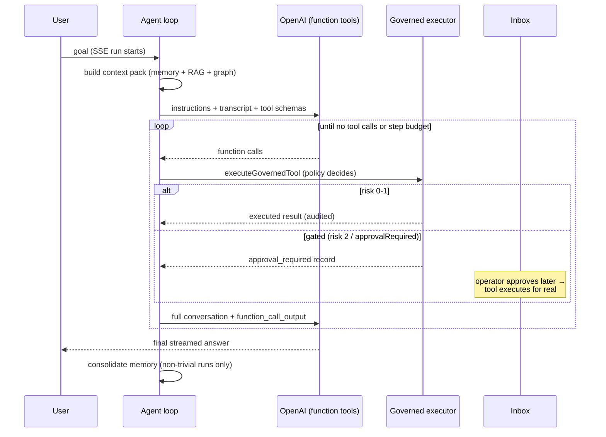

# Asael Architecture Overview

## System map

```mermaid
flowchart TD
  subgraph Public
    MKT[Marketing pages]
    AUTH[Login / Signup / Onboarding]
  end

  subgraph App["/app shell"]
    DASH[Overview dashboard]
    RUN[Run Agent workspace]
    RES[Results]
    CONSOLES[Work · Activity · Inbox · Results · advanced administration]
  end

  subgraph API["Next.js route handlers"]
    AG["/api/agent (SSE)"]
    WF["/api/workflows*"]
    TOOLS["/api/tools*  /api/approvals*"]
    OBS["/api/observability*  /api/incidents*  /api/alerts*"]
  end

  subgraph Core
    LOOP[Agent tool loop]
    PLANNER[Workflow planner → typed DAG]
    EXEC[Plan executor]
    GOV[Governed tool executor]
    RAGL[RAG + adaptive context engine + graph memory]
    MEMC[Memory consolidator]
  end

  subgraph Infra
    PG[(Neon Postgres + pgvector,
JSON fallback locally)]
    QUEUE[(omni_operation_jobs queue)]
    CRON[Vercel cron + after drains]
    OAI[OpenAI Responses API]
  end

  AUTH --> App --> API
  AG --> LOOP
  LOOP --> RAGL --> PG
  LOOP <--> OAI
  LOOP --> GOV
  WF --> PLANNER --> OAI
  WF --> QUEUE --> EXEC --> GOV
  GOV --> PG
  GOV -. approval_required .-> TOOLS
  MEMC --> PG
  CRON --> QUEUE
```

## The agent tool loop (`src/lib/orchestration/agent-runner.ts`)

Key properties:

- Every tool call goes through risk policy and lands in a persistent execution record.
- Risk 3 tools and `planned` tools are never exposed to the model.
- Gated calls create `approval_required` records and persist a run continuation. Approval executes the real call and resumes the same run with its saved conversation and outputs.
- The loop re-sends instructions and the complete conversation array on every turn. It does not use `previous_response_id`, so it remains compatible with OpenAI Zero Data Retention.
- Step budget (`OMNIAGENT_AGENT_MAX_TOOL_STEPS`), per-turn call cap, and output truncation bound cost.
- Each run emits one `run.harness` receipt with the effective context decision, model route, tool/skill set, approval mode, execution budgets, and contract hashes.
- Text deltas stream to the client immediately but persist to the run ledger in batches.

P0.2 builds and validates a versioned run-contract envelope in shadow mode
while the legacy run record stays authoritative. The envelope binds the scoped
agent principal, intent and outcome contracts, resolved context and harness
manifests, and an optional terminal receipt. Approval-paused runs retain the
active envelope inside their private continuation so resumption can emit a
consistent receipt. `run.contracts.bound`, `run.manifests.resolved`, and
`run.terminal_receipt.recorded` carry the same compact event projection: opaque
IDs, SHA-256 digests, counts, and closed-state enums only. Full contract bodies,
prompt or retrieved content, tool input/output, and model reasoning do not enter
these event receipts or trajectory metadata.

P0.4 provides a versioned, client-safe canonical status adapter as an additive
compatibility projection. Legacy completion maps to `unverified`; only a valid,
outcome-evaluator terminal receipt with verified required outcomes can project
`succeeded`. Existing store states, state machines, mutation inputs, controls,
and UI presentation remain authoritative and unchanged during this shadow
stage.

## Durable workflows

Goals submitted to `/api/workflows` are planned into typed DAGs (LLM structured output), persisted, and executed node-by-node through queue leases (`omni_operation_jobs`): lease → tick → retry with backoff (max 5 attempts) → recovery for stale leases. Approval nodes pause until signaled. The daily cron plus `after()` drains advance work; see [deployment.md](deployment.md) for cadence options.

## Storage

- **Postgres mode** (`DATABASE_URL`): all ledgers, pgvector embeddings + HNSW indexes, forced row-level security on every tenant-scoped table.
- **File mode** (local dev): JSON ledgers under `.omniagent/` with per-file write locks and corrupt-file quarantine.
- **Ephemeral mode** (hosted, no DB): `/tmp` with a persistent warning banner — for demos only.

Existing `OMNIAGENT_*`, `omni_*`, and `.omniagent/` identifiers remain stable
compatibility contracts; they are not product display names.

Schema changes run as ordered, idempotent migrations under a Postgres advisory lock. `omni_schema_version` records each applied version and upgrades the older timestamp-only marker. pgvector setup is attempted under the same lock but remains optional when the database role lacks extension privileges.

The ledgers have different mutation semantics:

- `omni_events` and security audit rows are inserted as history, but the database does not revoke update/delete privileges or provide WORM guarantees.
- `omni_ai_usage` is the canonical tenant/actor-scoped projection for every paid or metered AI operation. Each logical receipt retains per-provider-call usage, price provenance, failure state, and request identity so fallback totals are attributed to the provider/model that incurred them. Its matching `ai.usage.recorded` event preserves the typed decision receipt; run and observability copies are compatibility views, not accounting sources.
- Tool-execution records are mutable by design while status, approvals, and output are resolved.
- Local JSON ledgers are bounded and rewrite files during updates; they are not an immutable audit archive.
- Signed evaluation exports provide integrity evidence, but durable retention and object-lock controls belong in the deployment platform.

## Security model

- First-party auth: scrypt password hashes, opaque session tokens stored as SHA-256 digests, HttpOnly/Secure/SameSite=Lax cookies. Enforcement cannot be disabled in production.
- RBAC: `viewer` → read; `operator` → run agents/tools/workflows/evals; `admin` → connectors, security, identity; `system` → internal.
- Tool risk levels 0–3: 0–1 auto-execute, 2 requires one human approval, 3 requires a quorum of two distinct admin approvals (requester excluded) and is never exposed to the agent's tool loop.
- Connectors: SSRF guard (private IP/hostname blocking, DNS resolution checks, no embedded credentials), app-managed tenant-shared MCP bearer credentials sealed with AES-256-GCM and exact-origin/version AAD, legacy secret env-name allowlisting, and recursive metadata redaction. Rotation invalidates discovered authority; ciphertext and credential actor audit fields remain private storage columns and never enter connector API records.
- Inbound MCP: actor-owned export policy plus hash-only service-key scopes, strict tenant re-entry, host/origin validation, and the same governed executor used by first-party tool calls.
- Every auth failure, policy block, and allow/deny decision is recorded to the security audit and observability ledgers with correlation IDs.
- New mutations use the strict scoped event writer and immutable `*.scope_bound` events; the ownership and compatibility inventory is documented in [vision/EXECUTION_SCOPE.md](vision/EXECUTION_SCOPE.md).

## Where things live

| Concern | Path |
|---|---|
| Agent loop / prompts | `src/lib/orchestration/` |
| Governed tools + policy + audit | `src/lib/tools/` |
| Workflows (planner, executor, queue, triggers) | `src/lib/workflows/`, `src/lib/operations/` |
| Memory / RAG / graph | `src/lib/memory/`, `src/lib/rag/` |
| Connectors (MCP, OpenAPI) | `src/lib/connectors/` |
| Inbound MCP server | `src/lib/mcp/`, `src/app/api/mcp/` |
| Provider credentials / model policy | `src/lib/settings/`, `src/app/api/settings/` |
| Security / auth | `src/lib/security/`, `src/lib/auth/` |
| Observability / incidents / alerts | `src/lib/observability/`, `src/lib/diagnostics/` |
| Evaluations + signed reports | `src/lib/evaluations/`, `src/lib/release/` |
| UI shell + workspaces | `src/components/`, `src/app/app/` |
