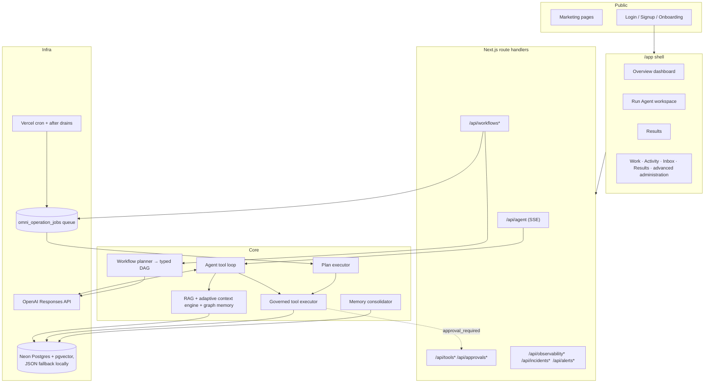
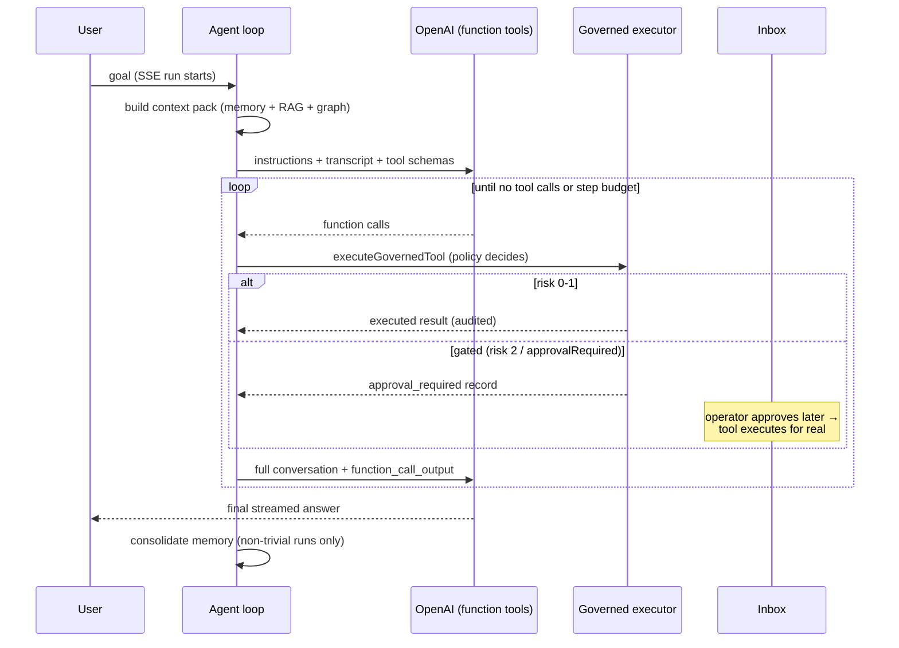

# Asael Architecture Overview

## System map

## The agent tool loop (`src/lib/orchestration/agent-runner.ts`)

Key properties:

- Every tool call goes through risk policy and lands in a persistent execution record.
- Risk 3 tools and `planned` tools are never exposed to the model.
- Gated calls create `approval_required` records and persist a run continuation. Approval executes the real call and resumes the same run with its saved conversation and outputs.
- The loop re-sends instructions and the complete conversation array on every turn. It does not use `previous_response_id`, so it remains compatible with OpenAI Zero Data Retention.
- Step budget (`OMNIAGENT_AGENT_MAX_TOOL_STEPS`), per-turn call cap, and output truncation bound cost.
- Each run emits one `run.harness` receipt with the effective context decision, model route, tool/skill set, approval mode, execution budgets, and contract hashes.
- Text deltas stream to the client immediately but persist to the run ledger in batches.

P0.2 builds and validates a versioned run-contract envelope in shadow mode
while the legacy run record stays authoritative. The envelope binds the scoped
agent principal, intent and outcome contracts, resolved context and harness
manifests, and an optional terminal receipt. Approval-paused runs retain the
active envelope inside their private continuation so resumption can emit a
consistent receipt. `run.contracts.bound`, `run.manifests.resolved`, and
`run.terminal_receipt.recorded` carry the same compact event projection: opaque
IDs, SHA-256 digests, counts, and closed-state enums only. Full contract bodies,
prompt or retrieved content, tool input/output, and model reasoning do not enter
these event receipts or trajectory metadata.

P0.4 provides a versioned, client-safe canonical status adapter as an additive
compatibility projection. Legacy completion maps to `unverified`; only a valid,
outcome-evaluator terminal receipt with verified required outcomes can project
`succeeded`. Existing store states, state machines, mutation inputs, controls,
and UI presentation remain authoritative and unchanged during this shadow
stage.

P1.3 extends that shadow path to completed workflows. The workflow result row
stores a strict outcome evaluation beside the legacy report in the same state
transition. Public workflow projections validate it before exposing its
metadata-only outcome contract, terminal receipt, and canonical status. The
legacy workflow status still drives queueing, polling, retries, approvals, and
controls. Dry-run, skipped, blocked, waiting, partial, model-asserted, and
otherwise unverified work cannot project canonical `succeeded`.
The first evaluator explicitly labels its contract binding `posthoc`: it uses
requirements from the persisted pre-execution plan, but no exact outcome
contract digest was bound before execution. Therefore this slice cannot emit
`succeeded`; pre-execution binding and strong effect receipts are later gates.

The first P1.4 canary is deliberately narrower than that phase's target. Only
live `memory.write` from a single-tool plan node in an approved workflow with
explicit tenant and initiating-actor scope creates an `EffectReceiptV1`. Its memory target is
deterministic from the scoped
execution and persisted execution-time plan/node bindings. The strict metadata/hash-only
receipt records a first-party store-commit acknowledgement plus a
tenant-scoped read-after-write comparison; it never copies memory content,
plan text, tool input/output, or a raw idempotency key. Legacy executions,
system-triggered workflows without an initiating actor, dry runs, direct tool
calls, and other tools are unchanged.

Before the canary writes memory, its executing tool record binds the input,
plan, deterministic target, idempotency identity, and tool-contract digests.
Generic stale-claim recovery does not convert this uncertain state to failed.
A same-key retry first reconciles the tenant-scoped target and may reclaim the
claim only after timeout with every bound identity unchanged. An unfinished
claim from a different tool-contract release remains pending for operator
resolution; a receipt already finalized by the earlier release remains valid
historical evidence.

This is tool-level evidence only. P1.3 projects the ID of a strictly bound,
verified canary receipt into its evidence and terminal receipt, but evaluation
remains `posthoc` and canonical `succeeded` is still impossible. External
providers, broader tool coverage, and outcome requirements bound before
execution remain future P1.4 work.

The existing workflow approval timestamp is not a cryptographic approval of
that exact plan digest. The canary proves which persisted plan executed after
workflow approval, not that the digest itself was presented and signed; that
pre-execution approval binding remains a later success gate.

## Durable workflows

Goals submitted to `/api/workflows` are planned into typed DAGs (LLM structured output), persisted, and executed node-by-node through queue leases (`omni_operation_jobs`): lease → tick → retry with backoff (max 5 attempts) → recovery for stale leases. Approval nodes pause until signaled. The daily cron plus `after()` drains advance work; see [deployment.md](deployment.md) for cadence options.

## Storage

- **Postgres mode** (`DATABASE_URL`): all ledgers, pgvector embeddings + HNSW indexes, forced row-level security on every tenant-scoped table.
- **File mode** (local dev): JSON ledgers under `.omniagent/` with per-file write locks and corrupt-file quarantine.
- **Ephemeral mode** (hosted, no DB): `/tmp` with a persistent warning banner — for demos only.

Existing `OMNIAGENT_*`, `omni_*`, and `.omniagent/` identifiers remain stable
compatibility contracts; they are not product display names.

Schema changes run as ordered, idempotent migrations under a Postgres advisory lock. `omni_schema_version` records each applied version and upgrades the older timestamp-only marker. pgvector setup is attempted under the same lock but remains optional when the database role lacks extension privileges.

Migration v36 adds the nullable `effect_receipt` column to
`omni_tool_executions`. For the canary, Postgres finalizes that receipt on the
tool record and appends `tool.effect_receipt.recorded` in the same transaction.
The local JSON fallback performs a separate best-effort event append after the
record update and is suitable only for development compatibility.

Migration v38 introduces the additive Google Drive v2 checkpoint shadow. Each
OAuth authorization generation owns an independent encrypted-cursor stream
with fenced leases, immutable hash-only page manifests, bounded retries, and
dead-letter state. A token refresh keeps the generation; an explicit
reauthorization increments it. The legacy personal-source cursor and knowledge
projection remain the production read/write authority until the later Drive
revision/tombstone convergence gate.

Migration v39 installs the inactive canonical source convergence foundation.
Immutable, receipt-bound tombstones preserve delete history, while one
tenant-and-source-scoped head advances only by the exact authorization,
rollout, phase, page, and ordinal tuple. Transaction-only mutation APIs bind an
upsert to the locked current revision or a delete to the same item's locked
last-known revision, append a metadata-only event atomically, and classify
older and duplicate observations. A delete for an item that has never been
enrolled advances an explicit receipt-bound absence head without inventing a
SourceItem or tombstone, so an older delayed upsert cannot resurrect it.
Terminal page settlements must resolve to that same receipt, canonical target,
and five-field head order; a stale settlement must instead prove a strictly
newer head. Deferred end-state constraints prevent an absence head from
coexisting with a SourceItem at commit.
Generation 1 checkpoint rows remain immutable, no Drive rollout is activated
by this migration, and legacy knowledge writes and served RAG remain the
production authority.

Migration v40 adds the inactive tenant capability-rollout registry used to
gate later engine cutovers. A capability has at most one current generation;
its engine, contract, configuration digest, mode, creator, and generation are
immutable, while only explicit registered/active/paused/superseded transitions
are allowed. A monotonic lifecycle revision gives each transition and event a
stable identity. Generations increase monotonically under a
tenant-and-capability lock, superseded rows cannot be changed or deleted, and
forced RLS preserves tenant isolation. The migration seeds no rollout and
changes no runtime or read authority.

Migration v41 binds canonical Drive checkpoints to that control plane. Every
generation-2 checkpoint carries an immutable capability and adapter identity,
and each lease records the exact rollout lifecycle revision that admitted it.
Claim, fence pinning, and settlement recheck the active tenant rollout in the
same transaction, so pause/resume cannot revive pre-pause work. A small Drive
page is fetched outside the transaction, then its hash-only manifest,
receipt-bound revisions or tombstones, ordered heads, closed item outcomes,
next encrypted cursor, and metadata-only completion event settle atomically.
Canonical page and nonterminal uniqueness includes capability and adapter
identity, while generation 1 retains its original uniqueness contract.
Generation 2 is Postgres-only and cannot use `shadow_observed`; generation 1
keeps its original IDs, cursor binding, terminal outcomes, and file fallback.
The legacy Google cursor, sync health, knowledge writes, and served RAG remain
authoritative during this canary.

Migration v42 begins P2.7 at the existing live `memory.forget` boundary. A
tenant-and-memory-scoped deletion receipt is a permanent database barrier, not
a reversible provider tombstone. New forgets require an exact execution scope
and initiating actor, canonically scrub the memory, invalidate trace and graph
descendants, append a metadata-only event, and queue a clean graph rebuild in
one transaction. Existing forgotten rows receive an explicitly unattributed
legacy barrier rather than an invented actor. Retrieval traces materialize the
memory IDs behind direct and graph results; graph rows close that lineage over
their traces. Restrictive row policies hide any mixed derived row containing a
barriered memory, while write triggers prevent rollbacked binaries, delayed
traces, graph upserts, imports, or restores from resurrecting it. File mode
retains best-effort development compatibility and does not claim this
rollback-proof guarantee. Retention and source-projection cleanup retire and
scrub derived memories without claiming an explicit user-forget receipt, and
invalidate their materialized trace/graph rows before retirement. Source-wide
deletion propagation and the physical scrub worker remain later P2.7 slices.

Migration v43 begins the P3.1 memory-access foundation without changing a
served read or write. Existing and rollback-created memories remain explicit
version-0 `legacy_unattributed` rows; owner, agent, workspace, project,
mission, visibility, sensitivity, and purpose fields stay null rather than
being inferred. Future version-1 envelopes must use the closed visibility and
sensitivity vocabularies, bind an owner and the visibility-specific scope, and
carry canonical allowed-purpose IDs plus a contract hash. A validated
enrollment constraint forbids every version-1 row, including maintenance
writes that bypass RLS, until memory, RAG, graph, export, and worker paths
enter one actor-aware database scope together. A restrictive all-command RLS
policy is a second holdback for ordinary roles. The same migration removes unnecessary
update, delete, truncate, references, and trigger privileges from non-owner
deletion-receipt grantees; immutable receipt triggers remain the independent
enforcement boundary.

Migration v44 installs the still-dormant database-session half of that
contract. One bounded JSON envelope carries an exact version, tenant, actor,
named user, agent, or actor-bound system principal, optional
workspace/project/mission, canonical context and capability grants, a distinct
canonical purpose ID, and optional audit-purpose text. The purpose ID is never
inferred from the existing free-form
`ExecutionScope.purpose`. Its stable parser returns null for an absent,
malformed, over-sized, system-scoped, tenant-mismatched, or non-canonical
envelope. The setting has no runtime writer and no policy consumes it; execute
permission on all three shadow functions is revoked from serving roles. The
validated v43 enrollment constraint and restrictive RLS holdback remain
unchanged, so this migration changes neither a served result nor a write.

The following P3.1 code canary mirrors that envelope in a strict, deep-frozen
TypeScript contract and provides a single-assignment transaction-local
installer. It requires the existing transaction callback, independently
supplied canonical purpose data, an ordinary tenant database scope, an empty
memory-scope setting, database validation before the write, and a database
postflight after it. It cannot open or nest a transaction. The v44 function
grants remain revoked and no store calls the installer, so it is intentionally
unusable by serving roles until membership, consent, and purpose validation
join the atomic all-surface activation.

Migration v45 adds the authorization call boundary but deliberately implements
it as an ungranted, always-deny hook. Current tenant membership does not prove
workspace membership; OAuth grants do not prove memory consent; capability
rollouts are not principal grants; free-form audit purpose is not a purpose
entitlement; and agent/system principals do not yet share one durable registry.
The eventual resolver must live-check and deterministically hold the canonical
actor, principal, target, purpose, consent, and capability rows in the same
transaction that installs the memory scope. No policy, store, worker, or API
calls the v45 hook, and the v43 enrollment and RLS barriers remain unchanged.

Migration v46 gives every auth user a stored, immutable, globally unique
`actor:<auth-user-id>` shadow identity. It is deterministic, non-email, and
pseudonymous personal data. It exists for disabled users so identity continuity
is separate from current authorization. The auth-user table remains outside
tenant RLS because login must find a user before discovering the tenant;
future memory authorization
must also lock and require the exact active tenant membership and active user.
Auth user IDs are constrained to opaque UUIDs, and ID mutation, user deletion,
and table truncation are rejected so a historical actor ID cannot be
reassigned. A later account-erasure path must retain a pseudonymous identity
tombstone.
Browser/mobile contexts still expose the historical email-shaped actor, and
no owner row, OAuth AAD, event, receipt, scope hash, job, continuation, approval
comparison, or runtime query is rewritten or dual-read in this batch.

The following code canary adds a pure canonical-auth-actor accessor. It returns
a frozen `actor:<auth-user-id>` projection only when an existing context is an
authenticated session, its user ID has the exact v46 lowercase UUID shape, and
its historical actor exactly equals the authenticated email. Header, default,
service, synthetic, malformed, and mismatched contexts remain unbound. The
accessor is not stored on `SecurityContext`, has no runtime call site, and does
not change serialized session/mobile responses, ownership, execution scopes,
hashes, approvals, or the dormant memory installer.

Migration v47 adds an append-only global memory-purpose vocabulary with eight
version-1 contracts: read, retrieve, write, correct, forget, formation,
maintenance, and export. These semantic IDs are distinct from existing
free-form execution/usage labels and from source-side allowed-purpose strings;
the migration does not infer, rewrite, or validate either. The catalog is
owner-only, exposes no serving grant, and has no runtime consumer. A catalog
row defines vocabulary only: tenant entitlement, consent, RBAC, capability,
scope membership, approval, and same-transaction authorization remain separate
requirements before the v45 deny hook can change.
The ordered migration must run as the stable `omni_schema_version` owner and
fails before replacing any function when that ownership precondition drifts.

Migration v48 adds an empty, tenant-scoped, generation-based purpose-
entitlement ledger. A held row can later become active or revoked, an active
row can only become revoked, and re-enablement requires a higher generation.
The table is owner-only, forced through tenant RLS, protected by an additional
system-only holdback, and constrained to contain no active row. Tenant purpose
eligibility is necessary but never sufficient: it is not actor consent,
membership, RBAC, a target grant, approval, OAuth scope, or a maintenance
bypass. Its actor columns prove attribution only; they do not identify the
grantee or subject and do not prove consent or mutation authority. This batch
seeds no row, exposes no writer or reader, changes no v45 decision, and emits
no event. Before future lifecycle DML, the writer must live-lock an active
canonical user, that user's active same-tenant membership, and a distinct
entitlement-management authority. It must never infer that authority from an
actor foreign key or generic administrator role, and it must append the typed
event in the same transaction after those checks converge.

Migration v49 adds the separate, empty standing-consent ledger for a canonical
subject actor and one exact memory purpose. Each generation begins held, a
grant can only be made by the subject in contract version 1, revocation is
terminal, and a later grant requires the next generation. Export and forget
are deliberately rejected because those are verified request-bound data
rights, not standing permissions that a tenant can suppress. The table is
owner-only, forced through tenant RLS, protected by a system-only holdback,
and constrained to contain no granted row. It has no runtime reader, writer,
event, inference, or backfill. Before activation, a later contract must bind
the subject to a versioned membership epoch and informed-notice evidence;
live user, same-tenant membership, tenant entitlement, and consent rows must
then be locked separately in the operation transaction. Revocation must never
depend on a currently active tenant entitlement.

Migration v54 adds a separate, empty membership-epoch authority for one
canonical subject actor inside one tenant. Epochs are monotonic, begin held,
have terminal revocation, and are protected by an activation constraint,
forced tenant RLS, a restrictive system-only policy, and owner-only ACLs. The
migration does not infer an epoch from the mutable legacy membership row,
because the bootstrap upsert lacks authoritative decision attribution and
typed evidence. It does not alter current membership columns, writers, roles,
sessions, request authorization, file fallback, the v45 deny hook, or the
v48-v49 ledgers. A later informed-notice contract must bind its evidence and
this exact epoch into the still-empty consent row in one migration before a
consent grant writer is designed; live authorization must still lock the user,
current same-tenant membership, epoch, entitlement, and consent separately.

Migration v55 adds the missing informed-notice evidence envelope without
inventing notice copy or a user decision. An empty immutable notice-contract
catalog and an empty tenant/actor receipt ledger are both issuance-held and
owner-only. The receipt binds one subject acknowledgement to one exact purpose,
consent generation, membership epoch, and versioned notice contract. The empty
standing-consent ledger advances to contract version 2 and requires that exact
epoch and receipt tuple, with no default or inferred backfill. Receipt issuance,
consent grants, and the memory authorization hook remain physically blocked;
future activation must separately live-lock current membership, the active
epoch, entitlement, receipt, consent, and decision actor and append typed
evidence atomically.

Migration v50 adds an owner-only, append-only auth-user actor-identifier
shadow. It records each v46 canonical actor as a self identifier and each exact
current auth email as the initial legacy identifier, while an auth-user trigger
appends aliases for new users and later email changes without deleting or
reassigning earlier values. Before installation it rejects ambiguous aliases,
any generated canonical actor already present on audited durable actor
surfaces, and email-shaped tenant ownership that lacks the corresponding
auth-user membership. The global registry remains outside tenant RLS for the
same pre-tenant identity-discovery reason as `omni_auth_users`, but it grants
no serving role access and authorizes nothing.

The matching code canary exposes a deep-frozen, canonical-first request
binding with the exact current email fallback. Sessions and APIs still serve
the email-shaped actor. The first store-specific convergence slice consumes
that binding only for `omni_today_preferences`: authenticated browser and
mobile requests whose email fits the store's existing 200-character actor
contract inspect the canonical actor and current email together, reject two
physical rows, and preserve the selected row's persisted actor on update.
A miss still creates the default row under the current email. The aggregate
Today read applies the same cardinality guard before its existing default-row
write, while API projections retain the request's email-shaped actor. Scheduler
enumeration, other Today tables, file fallback, cache
identity, and the owner-only alias registry remain unchanged. Later slices
must still use each selected row's persisted actor for ciphertext AAD, hashes,
approvals, receipts, and event comparisons. The v43 enrollment barrier, v45
deny hook, and v48-v49 empty/held ledgers remain unchanged.

The second request-bound slice extends that same validated binding only to
`omni_today_items` dashboard reads and direct ID edits. PostgreSQL reads merge
the canonical and exact-current-email partitions, apply one deterministic
status/due/created/ID ordering and then the existing limit. Because item IDs
are globally unique, a direct edit can select at most one physical row; it
retains that row's persisted actor and projects the current request actor at
the API boundary. New items remain email-owned. Brief generation,
notification workers, portable data flows, schedulers, file fallback,
retained prior-email aliases, and canonical writes remain exact-only or
unchanged until their own lifecycle and uniqueness gates are designed.

The third request-bound slice is read-only and limited to conversation
threads. Authenticated thread lists and owner-scoped direct-ID lookups can
inspect the canonical and exact-current-email partitions, globally order list
results by update time and ID, and project the current request actor. The
parent thread is resolved before its turns or thread-linked memories are read;
the same owner gate protects thread-linked browser-activity reads. Thread IDs
are globally unique, so direct selection is unambiguous. Thread creation,
turn appends, agent continuation, workflow attachment, Today projections,
portable data, file fallback, prior aliases, and canonical writes remain on
their existing exact-owner paths.

The fourth request-bound slice is also read-only and covers Projects list,
summary, and direct-detail reads. PostgreSQL merges canonical/current-email
project owners, applies the existing status and update ordering with project
ID as the deterministic tie-breaker, and projects the request actor. A
globally unique parent project is authorized before its tenant-matched tasks
or artifacts are loaded. Project creation, edits, planning, task mutation,
autonomous execution, artifact feedback, Today/brief projections, portable
data, file fallback, and canonical writes remain exact-owner paths because
those operations create workflows, scopes, evidence, and durable effects.

The fifth request-bound slice changes only selection for the interactive
personal-notification inbox. Only the notification-generation-free
`processDue: false` path passes the validated canonical/current-email binding;
the existing preference lookup/default behavior is unchanged. Its PostgreSQL
read checks the complete readable set for duplicate source occurrences before
the global status/update/ID ordering and limit; any cross-alias duplicate
fails closed rather than being merged or selected. Returned ownership remains
email-shaped. Reminder generation, worker enumeration, occurrence upsert,
read-all, snooze, dismiss, complete, and the coupled Today-item mutation stay
exact-owner paths, as does file fallback.

The sixth slice does not open a new store. It aligns Today's combined snapshot
with the already-live thread and project read contracts: recent threads and
active projects now read the canonical/current-email pair with global
update-time/ID ordering before their limits. Project task summaries remain
behind the selected globally unique parent and its exact persisted actor.
The response still omits owner fields, and the cache remains keyed by tenant
plus current email. Briefs, memory rows, mutations, background work, portable
data, file fallback behavior, and canonical writes remain unchanged.

The seventh slice converges daily-brief reads only for authenticated request
bundles and Today's PostgreSQL projection. A canonical/current-email pair is
read as one logical local-date namespace: two physical rows for the same date,
or a stored JSON envelope that disagrees with its scalar tenant, actor, ID,
date, generation metadata, or source counts, fails closed inside the database
transaction. Any default-preference insertion is therefore rolled back with
the failed read. Owner fields stay internal to validation; direct responses
project the current email and Today omits ownership. Generation, scheduling,
paid inference, saves, POST/PATCH actions, file fallback, cache identity,
portable data, prior aliases, and canonical writes remain exact and unchanged.

The eighth request-bound slice converges only the public Capture asset
collection read. PostgreSQL combines the canonical/current-email partitions,
filters internal artifacts, orders the complete visible set by update time and
global asset ID, then applies the caller's limit. Returned actor ownership is
projected to the current request email. Asset detail and content reads,
stored bytes, indexing, status changes, deletion, internal artifact access,
ingestion-job recovery, recordings and segments, RAG linkage, background
work, file fallback, and canonical writes retain their exact persisted-owner
contracts.

The ninth request-bound slice converges custom Skill list and detail reads
only. Built-in Skills remain unchanged. PostgreSQL reads the validated
canonical/current-email custom rows as one set, fails closed on any duplicate
custom slug, orders by update time and global ID, and projects the request
actor. Skill creation, editing, deletion, custom Agent references, runtime
selection and run-contract hashes, portable data, file fallback, and
canonical writes remain exact-owner. This is dormant while canonical-owned
custom Skills remain empty. Canonical Skill enrollment is blocked until
custom-Agent writes enforce same-persisted-owner Skill references and the UI
cannot offer a cross-owner Skill as actionable.

Migration v51 closes that activation gate without changing Agent execution or
ownership. Every custom Agent create/update now resolves its final normalized
custom Skill IDs inside the same transaction, locks those Skills in a stable
binary order, and accepts only the Agent's exact persisted tenant and actor;
built-in IDs remain the only catalog exception. Database triggers enforce the
same invariant for direct writers, reserve built-in IDs from the custom Skill
namespace, make custom Skill reference identity immutable, and prevent a
referenced Skill from being deleted without first removing the Agent edge.
Skill truncation is rejected, unsafe serving-role trigger/truncate grants are
removed, and direct Skill deletion is accepted only at read-committed
isolation so its lock-and-recheck protocol cannot observe a stale snapshot.
Request projections mark exact-owner custom Skills as selectable/manageable,
canonical compatibility rows as read-only/non-selectable, and built-ins as
selectable/non-manageable. Both web and Flutter Agent editors honor those
flags before offering assignment, edit, or deletion. Custom Agent reads,
runtime selection, hashes,
portable data, and canonical writes remain exact-owner contracts.

The tenth request-bound slice converges only custom Agent detail GET. A valid
authenticated binding may resolve one globally unique custom Agent ID from
the canonical/current-email pair; malformed or reserved built-in IDs and any
unexpected persisted owner fail closed. Actionability is derived from the
physical owner before the response projects the current request actor: exact
rows are selectable/manageable and canonical compatibility rows are neither.
Command withholds a custom preferred Agent until this detail contract returns
the same ID with `selectable: true`. Agent list, Arsenal and Mission catalogs,
Flutter Agent controls, mutations, runtime profile/Skill resolution,
run-contract hashes, portable data, file fallback, and canonical writes remain
on their exact-owner paths.

The eleventh slice adds an opt-in custom Agent collection projection for
Arsenal and the web Mission workspace. `ownerScope=readable` reads the
complete canonical/current-email owner pair in deterministic update-time/ID
order, rejects malformed or
built-in-reserved IDs, unexpected ownership, duplicate IDs, and cross-owner
slug collisions before projection, then publishes exact rows as actionable
and canonical rows as read-only. Both web consumers trust only explicit
boolean capability flags before assignment or mutation. Bare collection GET
remains exact-owner for Flutter and legacy clients while returning explicit
exact-row flags. Mission and Flutter controls filter future assignment and
mutation and preserve an unchanged read-only historical assignee.
Canonical Agent enrollment remains blocked on native-version adoption. Agent
runtime/Skill resolution, mutations, run-contract hashes, portable data,
file compatibility, and canonical writes remain exact-owner contracts.

The twelfth request-bound slice converges only public Capture asset metadata
detail. A validated canonical/current-email pair may resolve one globally
unique, non-internal asset ID without selecting stored content. The response
projects the current request actor and derives `contentAvailable`, `indexable`,
and `manageable` from the selected physical owner; canonical compatibility
rows are metadata-only and the Capture library hides their action controls.
Byte and download GETs, POST indexing, status changes, deletion, internal
artifacts, ingestion recovery, recordings and segments, RAG linkage,
background work, file fallback, portable data, and canonical writes remain
exact-owner contracts.

Migration v52 installs the native compatibility observation foundation without
activating a capability. Structured build number, client-contract version, and
last-seen fields are additive to mobile sessions; legacy free-text app versions
remain untouched under contract version zero. Current login and refresh calls
can attest a strict stable release/build/contract tuple, while bootstrap returns
the server-owned minimum policy and compatibility status. A private admin read
reports tenant-aggregate latest-device adoption and every still-refreshable
session family, so deduplication cannot conceal an older legacy credential.
The report is PostgreSQL-authoritative, identifier-free, and always held.

The Flutter client now sends the version-1 device contract, stores both
rotating credentials plus a stable installation ID in secure storage, restores
through `/api/mobile/bootstrap`, and re-attests on refresh. Native bearer
contexts use a distinct `mobile` source: they retain the same tenant, RBAC,
canonical-request, and audit boundaries, while browser-only origin checks stay
limited to cookie sessions and generic native mutations remain under an
explicit enrollment hold. The client can fall back to the prior strict wire
shape during server rollback, while any unattested refresh downgrades its
structured compatibility to unknown. Bare Agent lists, Agent runtime identity, writes,
membership authority, and all consent holds remain unchanged until a later
reviewed enrollment release has sufficient adoption and revocation evidence.

The thirteenth request-bound slice extends only the public Capture asset byte
GET. PostgreSQL selects the globally unique, non-internal asset and its bytes
from the validated canonical/current-email pair in one statement, retains the
physical owner internally, and verifies the persisted storage kind, positive
bounded byte count, safe response metadata, and SHA-256 before emitting a
private response. Any mismatch fails closed without serving content.
Canonical compatibility rows become downloadable but remain non-indexable and
non-manageable; POST indexing, status mutation, deletion, linked knowledge
cleanup, internal artifacts, recordings, background work, file-fallback
ownership, portable data, and canonical writes remain exact-owner contracts.

The fourteenth request-bound slice converges only authenticated service API
key metadata lists. PostgreSQL selects an explicit redacted column set from
the strictly validated canonical/current-email owner pair, uses indexed
default-collation predicates only as a candidate superset before authoritative
binary comparisons, globally orders by creation time and ID, and rejects
unexpected owners, malformed rows, and duplicate IDs, safely normalizes legacy
display-name controls, and projects the current request actor only after
deriving `manageable` from the physical owner.
Canonical compatibility keys are visible but read-only; their saved MCP
policy may differ from the exact current-email policy shown beside them. The
aggregate Settings snapshot passes the binding
only to this key list. Token hashes, provider credentials, model assignments,
MCP configuration, creation, revocation, Bearer resolution, last-used writes,
service-principal reads, file fallback, portable data, events, and canonical
writes remain exact-owner contracts.

The fifteenth request-bound slice converges only authenticated model-catalog
metadata lists. PostgreSQL selects explicit non-credential columns from the
validated canonical/current-email pair, uses indexed candidate predicates
before authoritative binary comparisons, verifies each deterministic
tenant/physical-actor/provider/model hash, rejects unexpected owners,
duplicate IDs, and cross-owner provider/model collisions, and globally orders
the collection. Provider-controlled display fields are allowlisted and safely
normalized; the persisted model identifier remains available as identity while
`displayModelId` is safe to render. Only exact-owner identifiers that satisfy
the assignment API's 240-character cap and the projection's trimmed,
control-free safety rule are `selectable`; canonical and unsupported rows
remain visible but read-only.
File fallback stays exact-owner and applies the same integrity checks. Provider
credentials, catalog refresh, model assignments, runtime resolution, events,
portable data, and canonical writes remain exact-owner contracts.

The sixteenth request-bound slice is an opt-in Capture recording-history
catalog. Migration v53 adds the composite owner/update/ID index. PostgreSQL
takes at most one bounded page from each validated canonical/current-email
owner through that index, then globally orders at most two pages by
`updated_at DESC, id ASC`. The response allowlist omits owner identity,
transcripts, audio, source linkage, metadata, and knowledge/job linkage; every
returned scalar is validated and title controls are normalized for display.
Only rows physically owned by the exact request actor advertise
`detailAvailable` and `manageable`. File fallback validates its complete exact
owner set before limiting and never widens. Bare list, detail, segment
metadata/audio, creation, completion, indexing, updates, deletion, background
recovery, events, portable data, and canonical writes remain exact-owner.

The seventeenth request-bound slice is an opt-in provider-connection metadata
catalog. PostgreSQL selects only the public connection fields from the
validated canonical/current-email pair and never selects credential
ciphertext or key identifiers. It validates owner, provider, status,
credential version, fingerprint, configured-field allowlists, timestamps, and
revocation invariants before rejecting duplicate IDs or any cross-owner
provider collision. Display labels and validation codes are normalized before
the current request actor is projected. A response-level `readable_v1`
acknowledgement gates provider-write controls so an older server fails closed
instead of creating a duplicate hidden owner. Only a physically exact-owner vault
row is `manageable` and retains active tenant-runtime readiness; canonical
history is visible as configuration-only and read-only. Deployment fallback
metadata remains explicitly non-manageable. The legacy provider reader,
credential opening, validation, rotation, status updates, revocation, catalog
refresh, assignments, runtime routing, MCP policy, file fallback, portable
data, events, and canonical writes remain exact-owner contracts.

The eighteenth request-bound slice converges only model-assignment metadata
GETs. The request reader selects an explicit column allowlist from the
validated canonical/current-email pair, verifies every owner, identifier,
scope, provider, fallback pair, consent state, stored readiness, and timestamp,
and rejects duplicate IDs or any duplicate scope before projection. Render-safe
model identifiers are separate from persisted identity. Exact-owner rows
remain manageable and retain their computed runtime readiness; canonical rows
are projected as configuration-only, read-only continuity records. Aggregate
Settings and direct assignment GETs require the literal `ownerScope=readable`
opt-in and acknowledge `requestReadContracts.modelAssignments=readable_v1`.
The UI requires that acknowledgement plus `manage.connector`, counts only
exact-owner routes, and renders a retained scope outside the editor so its
provider, fallback, or disclosure state cannot seed a write. Bare GETs remain
exact, and file fallback validates only exact-owner records. Assignment saves
and their pre-read, runtime model resolution, provider credentials, catalog
refresh, MCP policy, portable data, events, and canonical writes remain
exact-owner contracts.

The nineteenth request-bound slice converges only OAuth connection metadata.
The opt-in PostgreSQL reader selects an explicit public column allowlist from
the validated canonical/current-email pair; sealed tokens and sync cursors are
never selected. It verifies tenant and physical owner, provider, active state,
scope identifiers, authorization generation, sync state, counters, and
timestamps, then rejects duplicate IDs or any cross-owner provider collision
before projecting the current request actor. Only an exact-owner row is
`manageable`; provider-derived sync errors are normalized for display. Capture
and Integrations require both `requestReadContracts.oauthGrants=readable_v1`
and `manageable: true`, plus the existing role permission, before exposing or
executing connect, reconnect, sync, Photos, source-removal, or disconnect
controls. Bare GET and file fallback remain exact. Token opening, scheduled
sync, refresh, authorization state/callback, save, revoke, Photos sessions,
autonomy/readiness, portable data, source lineage, events, and canonical writes
remain exact-owner contracts.

The twentieth request-bound slice converges only browser-visible MCP export
configuration metadata. A literal `ownerScope=readable` GET selects the public
policy allowlist from the validated canonical/current-email pair, rejects
malformed policy or timestamps and any two-owner collision, retains physical
ownership long enough to derive `manageable`, and then projects the current
request actor. A canonical policy is continuity metadata only: Settings renders
it outside form state and exposes no save control. The UI requires the
independent `requestReadContracts.mcpExportConfiguration=readable_v1`
acknowledgement, exact management capability, and `manage.connector` role
before mounting or submitting the editor. Bare GET, file fallback, PUT and its
pre-read, service-key authentication, last-used writes, effective scope
intersection, MCP resource/tool exposure, governed execution, portable data,
events, and canonical writes remain exact-owner contracts.

The twenty-first request-bound slice extends the opt-in Capture recording
catalog to public recording and segment metadata detail. PostgreSQL reads the
verified parent and a bounded child set in one statement using explicit public
columns, preserves each physical owner as an integrity fact, and rejects
duplicate parents, mixed child ownership, malformed lifecycle state,
impossible pending transcription after recording completion, chronology and
aggregate mismatches, or duplicate/unordered segment indexes. Valid bounded
indexes may contain gaps because capture writes do not require contiguity.
Transcript text, audio bytes and hashes, transcription errors/models, arbitrary
metadata, source identifiers, and linked knowledge/job identifiers are never
selected. The response projects a request-safe public shape without tenant or
actor identifiers and derives transcript, audio, and mutation capabilities
only from exact physical ownership. Capture
requires the collection and detail `readable_v1` acknowledgements, clears
stale actionability before refresh, and renders retained metadata in a
read-only view with no exact-content or mutation affordance. Bare detail GET,
file fallback compatibility, transcript/audio routes, creation, completion,
indexing, mutation, deletion, background recovery, portable data, events, and
canonical writes remain exact-owner contracts.

The twenty-second request-bound slice converges only Mission collection
summaries. PostgreSQL reads explicit public mission columns from the validated
canonical/current-email pair through bounded owner/status lanes that reuse the
existing owner/status index, then applies one deterministic global order and
limit. The query checks cross-owner source-key collision without returning the
source key; arbitrary mission metadata is never selected. Every projected row
must satisfy exact tenant/physical-owner, identifier, status, priority, text,
lifecycle, chronology, uniqueness, and ordering invariants. File fallback
remains exact-owner and validates the complete exact set before limiting.
Physical ownership is removed only after deriving independent detail,
management, and Command-handoff capabilities. Missions requires the
`requestReadContracts.missions=readable_v1` acknowledgement before restoring
any actionability, clears cached exact detail when collection authority becomes
stale, and renders a canonical row as summary-only rather than as an empty task
board. Bare collection GET remains exact; full detail, events, cancellation or
archive, task/comment/review/attempt/artifact operations, runtime execution,
portable data, events, and canonical writes remain exact-owner contracts.

The twenty-third request-bound slice closes the bounded-catalog deep-link
seam without widening Mission detail. A literal opt-in direct summary GET
resolves one strictly validated global Mission ID from the request-bound
canonical/current-email pair, selects no arbitrary metadata, and checks its
hidden source key for a cross-owner collision before returning the same public
summary projection. Physical ownership alone enables detail, management, and
Command handoff. The browser API client requires the independent
`missionSummary=readable_v1` acknowledgement before adding an out-of-page row;
the server projection calls the same typed request-bound store directly. An
exact row may then use the existing exact full-detail path, while a canonical
row remains summary-only. File mode remains exact-owner and validates its
complete Mission ID and source-key namespaces. Events, child records,
mutations, execution, portable data, and canonical writes are unchanged.

The ledgers have different mutation semantics:

- `omni_events` and security audit rows are inserted as history, but the database does not revoke update/delete privileges or provide WORM guarantees.
- `omni_ai_usage` is the canonical tenant/actor-scoped projection for every paid or metered AI operation. Each logical receipt retains per-provider-call usage, price provenance, failure state, and request identity so fallback totals are attributed to the provider/model that incurred them. Its matching `ai.usage.recorded` event preserves the typed decision receipt; run and observability copies are compatibility views, not accounting sources.
- Tool-execution records are mutable by design while status, approvals, and output are resolved.
- Local JSON ledgers are bounded and rewrite files during updates; they are not an immutable audit archive.
- Signed evaluation exports provide integrity evidence, but durable retention and object-lock controls belong in the deployment platform.

## Security model

- First-party auth: scrypt password hashes, opaque session tokens stored as SHA-256 digests, HttpOnly/Secure/SameSite=Lax cookies. Enforcement cannot be disabled in production.
- RBAC: `viewer` → read; `operator` → run agents/tools/workflows/evals; `admin` → connectors, security, identity; `system` → internal.
- Tool risk levels 0–3: 0–1 auto-execute, 2 requires one human approval, 3 requires a quorum of two distinct admin approvals (requester excluded) and is never exposed to the agent's tool loop.
- Connectors: SSRF guard (private IP/hostname blocking, DNS resolution checks, no embedded credentials), app-managed tenant-shared MCP bearer credentials sealed with AES-256-GCM and exact-origin/version AAD, legacy secret env-name allowlisting, and recursive metadata redaction. Rotation invalidates discovered authority; ciphertext and credential actor audit fields remain private storage columns and never enter connector API records.
- Inbound MCP: actor-owned export policy plus hash-only service-key scopes, strict tenant re-entry, host/origin validation, and the same governed executor used by first-party tool calls.
- Every auth failure, policy block, and allow/deny decision is recorded to the security audit and observability ledgers with correlation IDs.
- New mutations use the strict scoped event writer and immutable `*.scope_bound` events; the ownership and compatibility inventory is documented in [vision/EXECUTION_SCOPE.md](vision/EXECUTION_SCOPE.md).

## Where things live

| Concern | Path |
|---|---|
| Agent loop / prompts | `src/lib/orchestration/` |
| Governed tools + policy + audit | `src/lib/tools/` |
| Workflows (planner, executor, queue, triggers) | `src/lib/workflows/`, `src/lib/operations/` |
| Memory / RAG / graph | `src/lib/memory/`, `src/lib/rag/` |
| Connectors (MCP, OpenAPI) | `src/lib/connectors/` |
| Inbound MCP server | `src/lib/mcp/`, `src/app/api/mcp/` |
| Provider credentials / model policy | `src/lib/settings/`, `src/app/api/settings/` |
| Security / auth | `src/lib/security/`, `src/lib/auth/` |
| Observability / incidents / alerts | `src/lib/observability/`, `src/lib/diagnostics/` |
| Evaluations + signed reports | `src/lib/evaluations/`, `src/lib/release/` |
| UI shell + workspaces | `src/components/`, `src/app/app/` |
