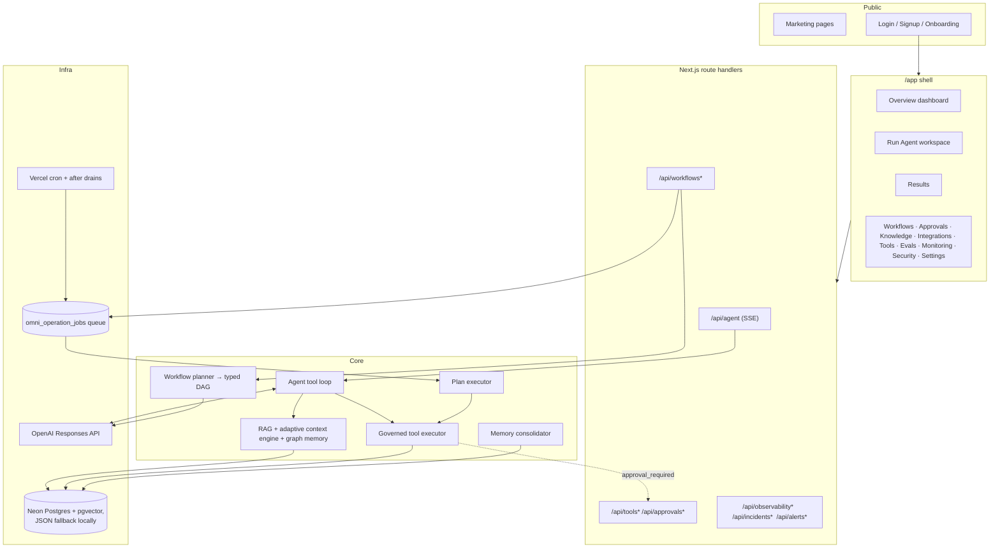
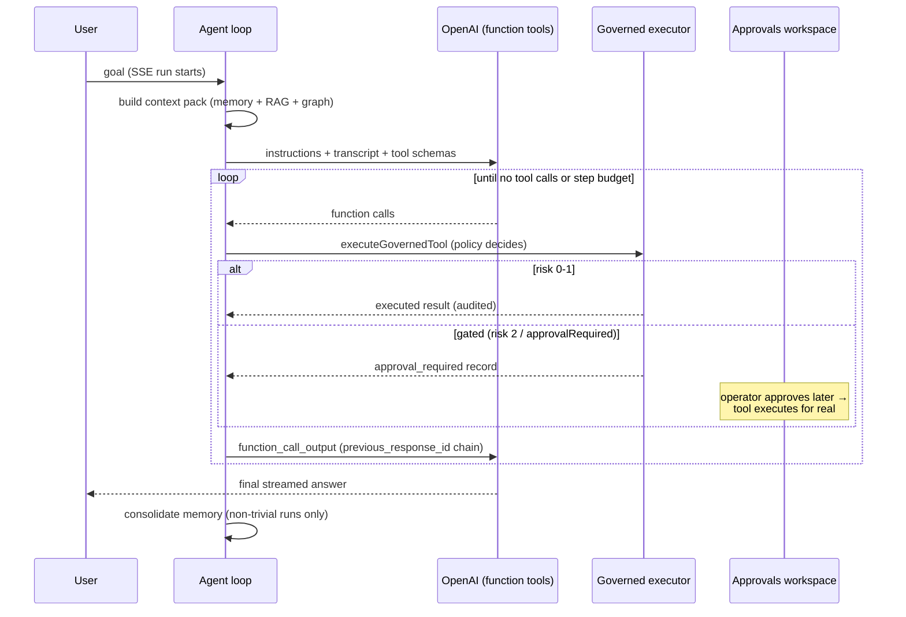

# Architecture Overview

## System map

## The agent tool loop (`src/lib/orchestration/agent-runner.ts`)

Key properties:

- Every tool call goes through risk policy and lands in the immutable tool audit ledger.
- Risk 3 tools and `planned` tools are never exposed to the model.
- Gated calls create `approval_required` records; approving them in `/app/approvals` executes the real call via the same executor.
- The loop re-sends instructions on every turn (the Responses API does not carry them across `previous_response_id`).
- Step budget (`OMNIAGENT_AGENT_MAX_TOOL_STEPS`), per-turn call cap, and output truncation bound cost.
- Text deltas stream to the client immediately but persist to the run ledger in batches.

## Durable workflows

Goals submitted to `/api/workflows` are planned into typed DAGs (LLM structured output), persisted, and executed node-by-node through queue leases (`omni_operation_jobs`): lease → tick → retry with backoff (max 5 attempts) → recovery for stale leases. Approval nodes pause until signaled. The daily cron plus `after()` drains advance work; see [deployment.md](deployment.md) for cadence options.

## Storage

- **Postgres mode** (`DATABASE_URL`): all ledgers, pgvector embeddings + HNSW indexes, forced row-level security on every tenant-scoped table.
- **File mode** (local dev): JSON ledgers under `.omniagent/` with per-file write locks and corrupt-file quarantine.
- **Ephemeral mode** (hosted, no DB): `/tmp` with a persistent warning banner — for demos only.

## Security model

- First-party auth: scrypt password hashes, opaque session tokens stored as SHA-256 digests, HttpOnly/Secure/SameSite=Lax cookies. Enforcement cannot be disabled in production.
- RBAC: `viewer` → read; `operator` → run agents/tools/workflows/evals; `admin` → connectors, security, identity; `system` → internal.
- Tool risk levels 0–3: 0–1 auto-execute, 2 requires one human approval, 3 requires a quorum of two distinct admin approvals (requester excluded) and is never exposed to the agent's tool loop.
- Connectors: SSRF guard (private IP/hostname blocking, DNS resolution checks, no embedded credentials), secret env-name allowlisting, recursive metadata redaction.
- Every auth failure, policy block, and allow/deny decision is recorded to the security audit and observability ledgers with correlation IDs.

## Where things live

| Concern | Path |
|---|---|
| Agent loop / prompts | `src/lib/orchestration/` |
| Governed tools + policy + audit | `src/lib/tools/` |
| Workflows (planner, executor, queue, triggers) | `src/lib/workflows/`, `src/lib/operations/` |
| Memory / RAG / graph | `src/lib/memory/`, `src/lib/rag/` |
| Connectors (MCP, OpenAPI) | `src/lib/connectors/` |
| Security / auth | `src/lib/security/`, `src/lib/auth/` |
| Observability / incidents / alerts | `src/lib/observability/`, `src/lib/diagnostics/` |
| Evaluations + signed reports | `src/lib/evaluations/`, `src/lib/release/` |
| UI shell + workspaces | `src/components/`, `src/app/app/` |
