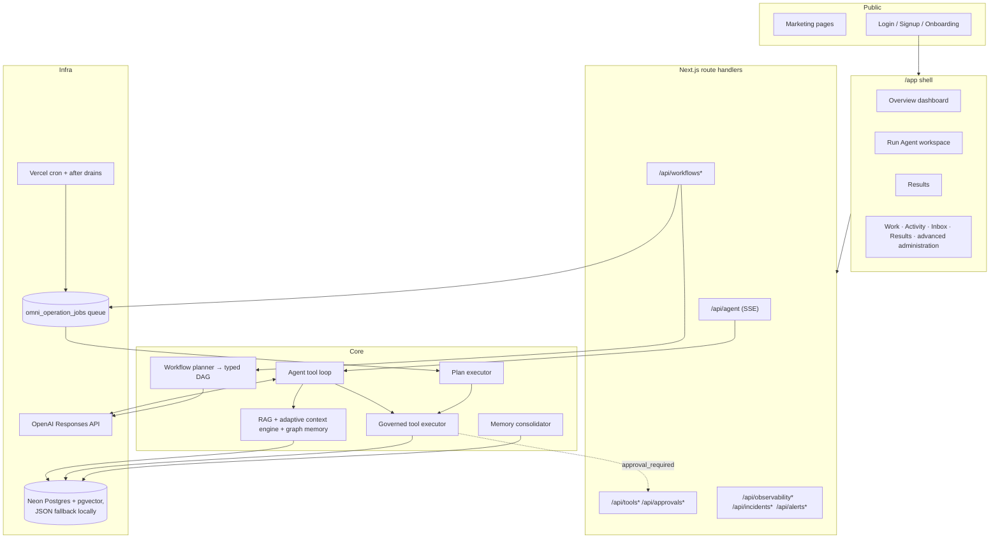
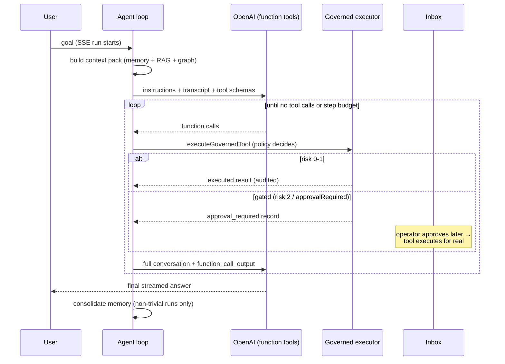

# Asael Architecture Overview

## System map

## The agent tool loop (`src/lib/orchestration/agent-runner.ts`)

Key properties:

- Every tool call goes through risk policy and lands in a persistent execution record.
- Risk 3 tools and `planned` tools are never exposed to the model.
- Gated calls create `approval_required` records and persist a run continuation. Approval executes the real call and resumes the same run with its saved conversation and outputs.
- The loop re-sends instructions and the complete conversation array on every turn. It does not use `previous_response_id`, so it remains compatible with OpenAI Zero Data Retention.
- Step budget (`OMNIAGENT_AGENT_MAX_TOOL_STEPS`), per-turn call cap, and output truncation bound cost.
- Each run emits one `run.harness` receipt with the effective context decision, model route, tool/skill set, approval mode, execution budgets, and contract hashes.
- Text deltas stream to the client immediately but persist to the run ledger in batches.

P0.2 builds and validates a versioned run-contract envelope in shadow mode
while the legacy run record stays authoritative. The envelope binds the scoped
agent principal, intent and outcome contracts, resolved context and harness
manifests, and an optional terminal receipt. Approval-paused runs retain the
active envelope inside their private continuation so resumption can emit a
consistent receipt. `run.contracts.bound`, `run.manifests.resolved`, and
`run.terminal_receipt.recorded` carry the same compact event projection: opaque
IDs, SHA-256 digests, counts, and closed-state enums only. Full contract bodies,
prompt or retrieved content, tool input/output, and model reasoning do not enter
these event receipts or trajectory metadata.

P0.4 provides a versioned, client-safe canonical status adapter as an additive
compatibility projection. Legacy completion maps to `unverified`; only a valid,
outcome-evaluator terminal receipt with verified required outcomes can project
`succeeded`. Existing store states, state machines, mutation inputs, controls,
and UI presentation remain authoritative and unchanged during this shadow
stage.

P1.3 extends that shadow path to completed workflows. The workflow result row
stores a strict outcome evaluation beside the legacy report in the same state
transition. Public workflow projections validate it before exposing its
metadata-only outcome contract, terminal receipt, and canonical status. The
legacy workflow status still drives queueing, polling, retries, approvals, and
controls. Dry-run, skipped, blocked, waiting, partial, model-asserted, and
otherwise unverified work cannot project canonical `succeeded`.
The first evaluator explicitly labels its contract binding `posthoc`: it uses
requirements from the persisted pre-execution plan, but no exact outcome
contract digest was bound before execution. Therefore this slice cannot emit
`succeeded`; pre-execution binding and strong effect receipts are later gates.

The first P1.4 canary is deliberately narrower than that phase's target. Only
live `memory.write` from a single-tool plan node in an approved workflow with
explicit tenant and initiating-actor scope creates an `EffectReceiptV1`. Its memory target is
deterministic from the scoped
execution and persisted execution-time plan/node bindings. The strict metadata/hash-only
receipt records a first-party store-commit acknowledgement plus a
tenant-scoped read-after-write comparison; it never copies memory content,
plan text, tool input/output, or a raw idempotency key. Legacy executions,
system-triggered workflows without an initiating actor, dry runs, direct tool
calls, and other tools are unchanged.

Before the canary writes memory, its executing tool record binds the input,
plan, deterministic target, idempotency identity, and tool-contract digests.
Generic stale-claim recovery does not convert this uncertain state to failed.
A same-key retry first reconciles the tenant-scoped target and may reclaim the
claim only after timeout with every bound identity unchanged. An unfinished
claim from a different tool-contract release remains pending for operator
resolution; a receipt already finalized by the earlier release remains valid
historical evidence.

This is tool-level evidence only. P1.3 projects the ID of a strictly bound,
verified canary receipt into its evidence and terminal receipt, but evaluation
remains `posthoc` and canonical `succeeded` is still impossible. External
providers, broader tool coverage, and outcome requirements bound before
execution remain future P1.4 work.

The existing workflow approval timestamp is not a cryptographic approval of
that exact plan digest. The canary proves which persisted plan executed after
workflow approval, not that the digest itself was presented and signed; that
pre-execution approval binding remains a later success gate.

## Durable workflows

Goals submitted to `/api/workflows` are planned into typed DAGs (LLM structured output), persisted, and executed node-by-node through queue leases (`omni_operation_jobs`): lease → tick → retry with backoff (max 5 attempts) → recovery for stale leases. Approval nodes pause until signaled. The daily cron plus `after()` drains advance work; see [deployment.md](deployment.md) for cadence options.

## Storage

- **Postgres mode** (`DATABASE_URL`): all ledgers, pgvector embeddings + HNSW indexes, forced row-level security on every tenant-scoped table.
- **File mode** (local dev): JSON ledgers under `.omniagent/` with per-file write locks and corrupt-file quarantine.
- **Ephemeral mode** (hosted, no DB): `/tmp` with a persistent warning banner — for demos only.

Existing `OMNIAGENT_*`, `omni_*`, and `.omniagent/` identifiers remain stable
compatibility contracts; they are not product display names.

Schema changes run as ordered, idempotent migrations under a Postgres advisory lock. `omni_schema_version` records each applied version and upgrades the older timestamp-only marker. pgvector setup is attempted under the same lock but remains optional when the database role lacks extension privileges.

Migration v36 adds the nullable `effect_receipt` column to
`omni_tool_executions`. For the canary, Postgres finalizes that receipt on the
tool record and appends `tool.effect_receipt.recorded` in the same transaction.
The local JSON fallback performs a separate best-effort event append after the
record update and is suitable only for development compatibility.

Migration v38 introduces the additive Google Drive v2 checkpoint shadow. Each
OAuth authorization generation owns an independent encrypted-cursor stream
with fenced leases, immutable hash-only page manifests, bounded retries, and
dead-letter state. A token refresh keeps the generation; an explicit
reauthorization increments it. The legacy personal-source cursor and knowledge
projection remain the production read/write authority until the later Drive
revision/tombstone convergence gate.

Migration v39 installs the inactive canonical source convergence foundation.
Immutable, receipt-bound tombstones preserve delete history, while one
tenant-and-source-scoped head advances only by the exact authorization,
rollout, phase, page, and ordinal tuple. Transaction-only mutation APIs bind an
upsert to the locked current revision or a delete to the same item's locked
last-known revision, append a metadata-only event atomically, and classify
older and duplicate observations. A delete for an item that has never been
enrolled advances an explicit receipt-bound absence head without inventing a
SourceItem or tombstone, so an older delayed upsert cannot resurrect it.
Terminal page settlements must resolve to that same receipt, canonical target,
and five-field head order; a stale settlement must instead prove a strictly
newer head. Deferred end-state constraints prevent an absence head from
coexisting with a SourceItem at commit.
Generation 1 checkpoint rows remain immutable, no Drive rollout is activated
by this migration, and legacy knowledge writes and served RAG remain the
production authority.

Migration v40 adds the inactive tenant capability-rollout registry used to
gate later engine cutovers. A capability has at most one current generation;
its engine, contract, configuration digest, mode, creator, and generation are
immutable, while only explicit registered/active/paused/superseded transitions
are allowed. A monotonic lifecycle revision gives each transition and event a
stable identity. Generations increase monotonically under a
tenant-and-capability lock, superseded rows cannot be changed or deleted, and
forced RLS preserves tenant isolation. The migration seeds no rollout and
changes no runtime or read authority.

Migration v41 binds canonical Drive checkpoints to that control plane. Every
generation-2 checkpoint carries an immutable capability and adapter identity,
and each lease records the exact rollout lifecycle revision that admitted it.
Claim, fence pinning, and settlement recheck the active tenant rollout in the
same transaction, so pause/resume cannot revive pre-pause work. A small Drive
page is fetched outside the transaction, then its hash-only manifest,
receipt-bound revisions or tombstones, ordered heads, closed item outcomes,
next encrypted cursor, and metadata-only completion event settle atomically.
Canonical page and nonterminal uniqueness includes capability and adapter
identity, while generation 1 retains its original uniqueness contract.
Generation 2 is Postgres-only and cannot use `shadow_observed`; generation 1
keeps its original IDs, cursor binding, terminal outcomes, and file fallback.
The legacy Google cursor, sync health, knowledge writes, and served RAG remain
authoritative during this canary.

Migration v42 begins P2.7 at the existing live `memory.forget` boundary. A
tenant-and-memory-scoped deletion receipt is a permanent database barrier, not
a reversible provider tombstone. New forgets require an exact execution scope
and initiating actor, canonically scrub the memory, invalidate trace and graph
descendants, append a metadata-only event, and queue a clean graph rebuild in
one transaction. Existing forgotten rows receive an explicitly unattributed
legacy barrier rather than an invented actor. Retrieval traces materialize the
memory IDs behind direct and graph results; graph rows close that lineage over
their traces. Restrictive row policies hide any mixed derived row containing a
barriered memory, while write triggers prevent rollbacked binaries, delayed
traces, graph upserts, imports, or restores from resurrecting it. File mode
retains best-effort development compatibility and does not claim this
rollback-proof guarantee. Retention and source-projection cleanup retire and
scrub derived memories without claiming an explicit user-forget receipt, and
invalidate their materialized trace/graph rows before retirement. Source-wide
deletion propagation and the physical scrub worker remain later P2.7 slices.

Migration v43 begins the P3.1 memory-access foundation without changing a
served read or write. Existing and rollback-created memories remain explicit
version-0 `legacy_unattributed` rows; owner, agent, workspace, project,
mission, visibility, sensitivity, and purpose fields stay null rather than
being inferred. Future version-1 envelopes must use the closed visibility and
sensitivity vocabularies, bind an owner and the visibility-specific scope, and
carry canonical allowed-purpose IDs plus a contract hash. A validated
enrollment constraint forbids every version-1 row, including maintenance
writes that bypass RLS, until memory, RAG, graph, export, and worker paths
enter one actor-aware database scope together. A restrictive all-command RLS
policy is a second holdback for ordinary roles. The same migration removes unnecessary
update, delete, truncate, references, and trigger privileges from non-owner
deletion-receipt grantees; immutable receipt triggers remain the independent
enforcement boundary.

Migration v44 installs the still-dormant database-session half of that
contract. One bounded JSON envelope carries an exact version, tenant, actor,
named user, agent, or actor-bound system principal, optional
workspace/project/mission, canonical context and capability grants, a distinct
canonical purpose ID, and optional audit-purpose text. The purpose ID is never
inferred from the existing free-form
`ExecutionScope.purpose`. Its stable parser returns null for an absent,
malformed, over-sized, system-scoped, tenant-mismatched, or non-canonical
envelope. The setting has no runtime writer and no policy consumes it; execute
permission on all three shadow functions is revoked from serving roles. The
validated v43 enrollment constraint and restrictive RLS holdback remain
unchanged, so this migration changes neither a served result nor a write.

The following P3.1 code canary mirrors that envelope in a strict, deep-frozen
TypeScript contract and provides a single-assignment transaction-local
installer. It requires the existing transaction callback, independently
supplied canonical purpose data, an ordinary tenant database scope, an empty
memory-scope setting, database validation before the write, and a database
postflight after it. It cannot open or nest a transaction. The v44 function
grants remain revoked and no store calls the installer, so it is intentionally
unusable by serving roles until membership, consent, and purpose validation
join the atomic all-surface activation.

Migration v45 adds the authorization call boundary but deliberately implements
it as an ungranted, always-deny hook. Current tenant membership does not prove
workspace membership; OAuth grants do not prove memory consent; capability
rollouts are not principal grants; free-form audit purpose is not a purpose
entitlement; and agent/system principals do not yet share one durable registry.
The eventual resolver must live-check and deterministically hold the canonical
actor, principal, target, purpose, consent, and capability rows in the same
transaction that installs the memory scope. No policy, store, worker, or API
calls the v45 hook, and the v43 enrollment and RLS barriers remain unchanged.

The ledgers have different mutation semantics:

- `omni_events` and security audit rows are inserted as history, but the database does not revoke update/delete privileges or provide WORM guarantees.
- `omni_ai_usage` is the canonical tenant/actor-scoped projection for every paid or metered AI operation. Each logical receipt retains per-provider-call usage, price provenance, failure state, and request identity so fallback totals are attributed to the provider/model that incurred them. Its matching `ai.usage.recorded` event preserves the typed decision receipt; run and observability copies are compatibility views, not accounting sources.
- Tool-execution records are mutable by design while status, approvals, and output are resolved.
- Local JSON ledgers are bounded and rewrite files during updates; they are not an immutable audit archive.
- Signed evaluation exports provide integrity evidence, but durable retention and object-lock controls belong in the deployment platform.

## Security model

- First-party auth: scrypt password hashes, opaque session tokens stored as SHA-256 digests, HttpOnly/Secure/SameSite=Lax cookies. Enforcement cannot be disabled in production.
- RBAC: `viewer` → read; `operator` → run agents/tools/workflows/evals; `admin` → connectors, security, identity; `system` → internal.
- Tool risk levels 0–3: 0–1 auto-execute, 2 requires one human approval, 3 requires a quorum of two distinct admin approvals (requester excluded) and is never exposed to the agent's tool loop.
- Connectors: SSRF guard (private IP/hostname blocking, DNS resolution checks, no embedded credentials), app-managed tenant-shared MCP bearer credentials sealed with AES-256-GCM and exact-origin/version AAD, legacy secret env-name allowlisting, and recursive metadata redaction. Rotation invalidates discovered authority; ciphertext and credential actor audit fields remain private storage columns and never enter connector API records.
- Inbound MCP: actor-owned export policy plus hash-only service-key scopes, strict tenant re-entry, host/origin validation, and the same governed executor used by first-party tool calls.
- Every auth failure, policy block, and allow/deny decision is recorded to the security audit and observability ledgers with correlation IDs.
- New mutations use the strict scoped event writer and immutable `*.scope_bound` events; the ownership and compatibility inventory is documented in [vision/EXECUTION_SCOPE.md](vision/EXECUTION_SCOPE.md).

## Where things live

| Concern | Path |
|---|---|
| Agent loop / prompts | `src/lib/orchestration/` |
| Governed tools + policy + audit | `src/lib/tools/` |
| Workflows (planner, executor, queue, triggers) | `src/lib/workflows/`, `src/lib/operations/` |
| Memory / RAG / graph | `src/lib/memory/`, `src/lib/rag/` |
| Connectors (MCP, OpenAPI) | `src/lib/connectors/` |
| Inbound MCP server | `src/lib/mcp/`, `src/app/api/mcp/` |
| Provider credentials / model policy | `src/lib/settings/`, `src/app/api/settings/` |
| Security / auth | `src/lib/security/`, `src/lib/auth/` |
| Observability / incidents / alerts | `src/lib/observability/`, `src/lib/diagnostics/` |
| Evaluations + signed reports | `src/lib/evaluations/`, `src/lib/release/` |
| UI shell + workspaces | `src/components/`, `src/app/app/` |
