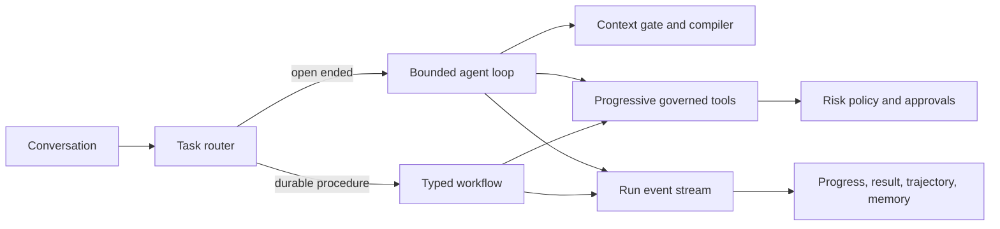

# Harness Engineering in OmniAgent

The model is one replaceable component. The harness around it owns context,
capabilities, permissions, durable state, progress, evaluation, and recovery.
When a run fails repeatedly, improve that environment instead of adding a more
forceful prompt.

This direction follows OpenAI's
[harness-engineering guidance](https://openai.com/index/harness-engineering/)
and adopts the most useful legibility patterns from the MIT-licensed
[Waku Agent](https://github.com/ShenSeanChen/waku-agent) without copying its
local-only architecture or visual assets.

## Runtime shape

The harness is deliberately split into readable parts:

| Responsibility | Source of truth |
|---|---|
| Direct model/tool loop | `src/lib/orchestration/agent-runner.ts` |
| Direct versus durable routing | `src/lib/orchestration/supervisor.ts` |
| Typed durable plans | `src/lib/workflows/` |
| Context gate, retrieval, and trace | `src/lib/rag/context-engine.ts` |
| Progressive tool discovery | `src/lib/capabilities/toolbox.ts` |
| Policy, approval, and idempotency | `src/lib/tools/` |
| Run events and replay | `src/lib/events/`, `src/lib/runs/`, `src/lib/trajectories/` |
| Deterministic and governed evaluation | `src/lib/evaluations/`, `src/lib/evals2/`, `evals/` |

## One harness receipt per run

Every new agent run emits a durable `run.harness` event after context and
capabilities are resolved. It records the effective model route, context-gate
decision and trace ID, selected evidence IDs, tool and skill IDs, approval
policy, execution budgets, and hashes of the instructions and tool contracts.

The receipt is intentionally metadata, not hidden reasoning. It lets a person
answer: _What environment did this run actually receive?_ The conversation's
activity view presents the plain-language summary; trajectory export retains a
bounded receipt for replay and comparison.

## Memory is controlled, not merely accumulated

The context engine decides whether durable retrieval is useful, and an
explicit user selection always wins. An empty explicit selection means no
saved context. Retrieved text remains untrusted evidence and is cited rather
than treated as instruction.

The native tool broker exposes three separate operations:

- `memory.write` adds a new record.
- `memory.correct` creates a corrected record and retains the previous claim as
  superseded or contradicted.
- `memory.forget` irreversibly scrubs one exact record and always requires human
  approval.

This mirrors Waku's useful self-managed-memory pattern while retaining
OmniAgent's tenant isolation, evidence history, and approval controls.

## Golden rules

1. **Compile context just in time.** Do not put every memory, skill, or tool in
   every prompt. Explicit user choices take precedence over automatic routing.
2. **Keep the loop bounded.** Tool iterations, calls per turn, arguments,
   schemas, outputs, and model output all have hard limits.
3. **Put deterministic behavior in code.** Authorization, validation, retries,
   redaction, state transitions, and acceptance checks are not model duties.
4. **Use workflows for known shape.** A workflow arranges work around the same
   governed executor; it does not create an alternate security path.
5. **Record actions, not private thought.** Context decisions, model receipts,
   tool calls, approvals, errors, and outcomes are observable typed events.
6. **Degrade optional help gracefully.** Optional specialists or enrichment
   may warn and fall back; authorization, destructive actions, and tenant
   boundaries always fail closed.
7. **Make failures actionable.** User-facing messages describe recovery without
   leaking infrastructure details. Internal events retain sanitized categories
   and correlation IDs.
8. **Convert repetition into structure.** A recurring failure should become a
   tool contract, architectural constraint, focused evaluation, or documented
   runbook—not another paragraph in the system prompt.

## What not to copy from a blueprint

Waku optimizes for a small, local, single-user assistant. OmniAgent is a
multi-tenant governed runtime, so SQLite as the only store, unscoped local
credentials, and a single-process gateway are not suitable substitutions for
RLS, durable queues, signed evidence, or the paired web/worker release model.
Likewise, more agents are not automatically a better harness: specialist and
critic passes are used only where their additional judgment is worth the cost.
