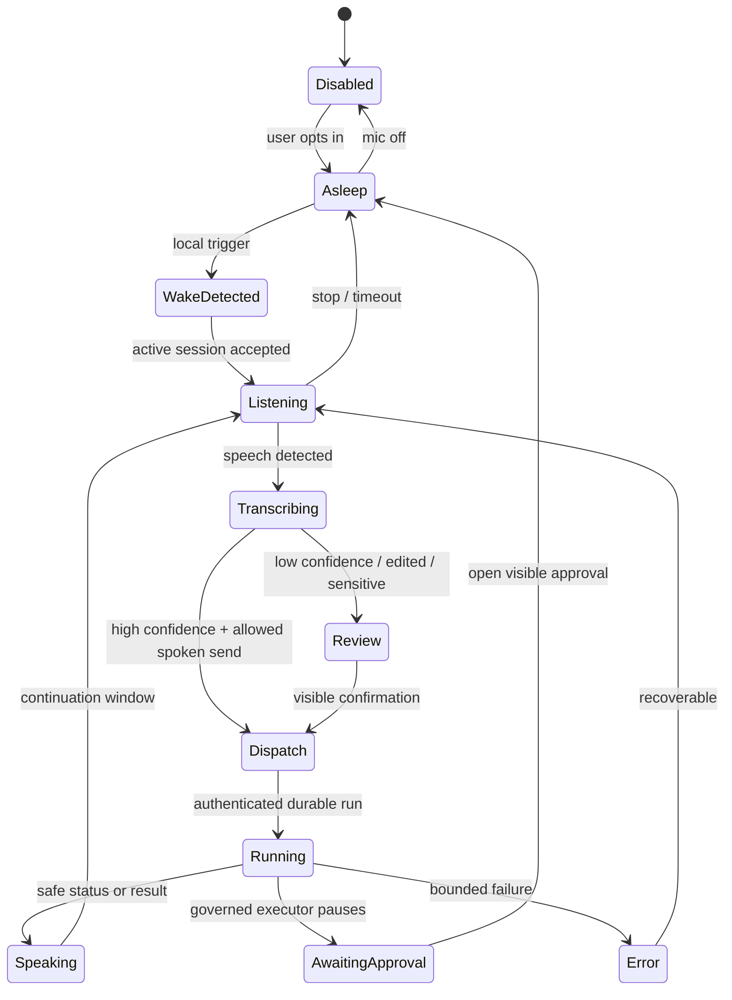

# Infina and hands-free AI — Asael product and architecture proposal

Status: researched on 2026-09-23 and implemented as the first owner-only macOS Ambient Command release on 2026-09-24. The shipped edge uses the menu bar, a global shortcut, or an Apple Vocal Shortcut for activation; it does not install a passive custom wake-word listener.

The implementation publishes native API v29, streams activated microphone audio through an ephemeral provider WebRTC credential, retains only the editable command draft, and can play the configured Agent voice through bounded temporary audio that is deleted after playback. **Use this Mac** dispatches through the ordinary authenticated Asael run and governed Computer Use executor. Voice still cannot approve an action or grant authority.

## Decision

Build a macOS-first **Asael Ambient Command** surface: an optional local wake trigger, fast spoken capture, direct routing to an Asael conversation, agent, Project, Mission, or prompt queue, and spoken status for durable work.

Do not copy Infina as a universal desktop dictation and click-control product. Infina's useful insight is its complete `wake -> dictate -> send -> switch context` loop. Asael can remove the manual context switching because it already owns the work graph, prompt queue, durable runs, evidence, approvals, cancellation, and recovery.

The governing rule is:

> Voice may capture, propose, route, steer, stop, and report work. Every agent action still crosses Asael's authenticated, tenant- and actor-scoped run boundary and governed tool executor. A wake phrase, speaker match, or spoken approval never creates authority.

Preserve the current chained `speech-to-text -> governed Asael run -> text-to-speech` architecture for the first release. It gives Asael an inspectable transcript and a clean approval boundary. Evaluate a full-duplex voice model later as a conversational shell over the same backend, after the command contract and evaluation set are stable.

## What Infina gets right

[Infina](https://www.infina.so/) is a system-wide voice input and fixed computer-control layer aimed primarily at developers using Claude Code, Codex, Cursor, terminals, and several agent sessions. It explicitly says it is not an open-ended assistant that plans or chains work across apps. Its focused job is to let a user dictate, submit, edit, and move between applications without touching the keyboard. [How Infina works](https://www.infina.so/docs/how-infina-works)

Its hands-free grammar is deliberately small:

- Say `type` to begin dictation.
- Say `send`, `send it`, or `enter` to submit.
- Say `Infina` before a control command.
- Fall back to push-to-talk when the room or task is a poor fit for hands-free use.

Infina pairs that grammar with an unobtrusive state pill: absent while asleep, green while listening, and orange while executing. Its docs also describe expired permissions and broken-listener states rather than failing silently. [Hands-free mode](https://www.infina.so/docs/hands-free-mode) · [Voice commands](https://www.infina.so/docs/voice-commands)

The product publishes a credible local stack: NVIDIA Parakeet for transcription, Silero for voice activity detection, Qwen for local intent interpretation on Apple Silicon, Vosk for wake words, and pyannote plus WeSpeaker for voice isolation. Local processing is the default after model download; an optional cloud tier improves formatting, language coverage, and difficult audio. [Models](https://www.infina.so/docs/models)

The strongest lesson is product discipline. Infina removed meetings, answer cards, web search, screenshots, and other loosely related features, then concentrated on the repeated prompt loop. [Changelog](https://www.infina.so/changelog)

### Product and commercial snapshot

| Dimension | Current public offer |
| --- | --- |
| Trial | 2,000 dictated words and 50 commands, without a card |
| Base plan | $99 per year for unlimited local words and commands |
| Cloud add-on | $60 per year for improved transcription, formatting, and language support |
| Platforms | Apple Silicon macOS and Windows 10/11 x64; no documented Linux or mobile app |
| Onboarding | Account sign-in, microphone and Accessibility permissions, then a several-hundred-megabyte local model download |
| Primary users | Developers and AI power users; broader positioning also covers writing, founders, knowledge work, and reduced keyboard use for RSI |

Infina's site uses large editorial typography, sparse cards, and a restrained terminal demo. The product follows the same approach with a small persistent state pill instead of an assistant window. Its homepage reports 220 spoken words per minute versus 45 typed, more than 95% clear-speech accuracy, roughly five times prompt throughput, and support for more than 50 apps. Treat those figures as vendor claims until reproduced in an independent test. [Pricing](https://www.infina.so/pricing) · [Installation](https://www.infina.so/docs/installation)

### Limits Asael should avoid

- Multi-agent use is still manual: speak a prompt, submit it, open another window, and repeat. Infina does not understand tasks, agents, dependencies, approvals, or run state. [Multi-agent workflow](https://www.infina.so/voice-prompting-multiple-agents)
- Hands-free mode remains experimental and is most reliable in a quiet room. Code symbols, shell syntax, formulas, and passwords still favor a keyboard.
- Mac has the richest control surface. Windows supports a narrower command set, and there is no documented Linux, iOS, or Android product. [Windows versus Mac](https://www.infina.so/docs/windows)
- Its privacy headline is simpler than its data flow. First-run transcription, trial-counting text, word counts, account operations, analytics, optional cloud processing, and deliberately synced history can contact Infina's servers. [What leaves your computer](https://www.infina.so/docs/what-leaves-your-computer)
- Public performance and adoption claims are primarily vendor-reported. No public SOC 2 report or independent security audit was found during this research.

## Competitive read

| Product or stack | Best idea to borrow | Material limitation | Asael response |
| --- | --- | --- | --- |
| Infina | Local wake, tiny grammar, visible state, push-to-talk fallback | Fixed controls and manual app switching | Route speech directly to work Asael already knows |
| Wispr Flow | Polished cross-app dictation, context-aware formatting, and a hands-free lock | Still needs a shortcut or click to begin the hands-free session; broader context processing affects the privacy model | Keep dictated content narrow and make every target and retention choice explicit |
| ChatGPT Voice and Gemini Live | Full-duplex conversation, barge-in, background continuation | Conversation is separate from Asael's governed work graph | Keep the voice session disposable and hand work to durable Asael runs |
| Talon and Apple Voice Control | Broad hands-free desktop access and accessibility depth | Large command surface; not task-aware | Use OS accessibility for entry points, not as a second execution authority |
| Apple App Intents and Vocal Shortcuts | Trusted OS invocation, Shortcuts, hardware and system surfaces | Constrained action schemas and platform review | Expose a small, safe set of Asael actions first |
| OpenAI GPT-Live | Full-duplex voice can delegate reasoning and tool work to a separate backend | Provider coupling, audio cost, and a newer control surface | Candidate conversational shell after the governed command contract is proven |
| OpenAI Realtime plus chained voice | WebRTC, VAD, transcripts, and explicit server-side control | More plumbing and slightly higher turn latency | Continue the current chained path for control and evidence |
| LiveKit Agents | Provider-neutral media, turn detection, telephony, observability | Added infrastructure and operational tuning | Adopt only when provider neutrality or telephony becomes a real requirement |

[OpenAI's voice architecture guide](https://developers.openai.com/api/docs/guides/voice-agents) now distinguishes full-duplex voice with an independent backend, one-session realtime agents, and chained speech-to-text/model/text-to-speech pipelines. Its browser guidance favors WebRTC with ephemeral credentials and server-owned authorization and tools. [WebRTC guide](https://developers.openai.com/api/docs/guides/voice-webrtc) · [Server-side controls](https://developers.openai.com/api/docs/guides/voice-server-controls)

[Wispr Flow's hands-free mode](https://docs.wisprflow.ai/articles/6391241694-use-flow-hands-free) shows that voice submission is no longer unique to Infina. Infina still distinguishes itself with a local wake phrase and fixed OS controls; Asael should distinguish itself with governed task understanding rather than compete on dictation polish alone.

The browser can support a hands-free session while the page remains alive, but it is not a dependable system-level always-listening surface. On Android, continuous recognition has foreground-service, battery, and background-start constraints; a reliably persistent hotword belongs to the user-selected `VoiceInteractionService`. [Android SpeechRecognizer](https://developer.android.com/reference/android/speech/SpeechRecognizer) · [Microphone foreground service](https://developer.android.com/develop/background-work/services/fgs/service-types#microphone) · [VoiceInteractionService](https://developer.android.com/reference/android/service/voice/VoiceInteractionService)

This makes desktop the correct first always-available target. Mobile should begin with foreground conversation, notification or headset entry, and OS actions before any wake-word promise.

## Asael's current starting point

Asael already has most of the difficult server-side foundation:

| Capability | Current behavior | Opportunity |
| --- | --- | --- |
| Web capture | Transcription-only OpenAI WebRTC with server VAD, partial transcripts, reconnects, editable review, and an explicit Send control | Add a session mode and native/global entry point without changing tool authority |
| Spoken response | Streaming PCM speech with manual interruption and barge-in | Use short status turns and resume listening after playback |
| Confidence | Provider log probabilities become confidence bands; low, unavailable, and edited transcripts require visible attestation | Bind hands-free dispatch to confidence and active-session policy |
| Approval | Voice input forces approval for every risk-bearing tool; the exact tool, input, risk, and reversibility are shown; spoken words cannot approve | Retain this as a product promise |
| Durable work | Agent runs, typed events, cancellation, notifications, and recovery survive the media session | Let the voice connection end while work continues |
| Prompt queue | A prompt can target a thread, Mission, Project, execution target, agent, and model; queueing grants no authority | Make task-aware spoken dispatch the primary differentiator |
| Background attention | Push already carries approvals, failures, security incidents, and selected reminders; routine success is deliberately suppressed | Add an explicit preference and bounded event for meaningful completion rather than bypassing notification policy |
| Native capture | Flutter records an M4A file, deletes the temporary recording, uploads it for transcription, and places text in an editable draft | Bring the realtime session and speech contracts to native |
| macOS boundary | Flutter has a thin AppKit host; computer use is a separate signed, credential-free helper whose effects enter the governed executor | Keep wake detection separate from computer-use authority |

The gap is mainly at the edge: an always-reachable native trigger, a task-aware spoken routing contract, native realtime parity, and measured protections against false wakeups, replayed speech, background voices, and duplicate dispatch. Request-scoped SSE already carries active agent work, while background attention currently relies on push; there is no general always-on event subscription to treat as an assistant presence channel.

## Proposed experience

Use three explicit modes rather than one ambiguous microphone:

1. **Dictate** fills a draft or form and never acts.
2. **Ask Asael** starts or continues a conversation and may create durable work.
3. **Command** invokes a known workflow or routes a reviewed prompt. The normal policy and approval gates still apply.

The core loop should feel like this:

```text
"Asael" -> listening indicator
"What needs me?" -> short spoken summary of approvals and failed work
"Tell Forge to rerun the failed checks and queue the result for this Project"
-> visible and spoken routing preview
"Send it" -> authenticated prompt dispatch
-> durable run continues after the voice session
"Stop" -> immediate local stop; remote run cancellation only when explicitly requested
```

Other high-value commands:

- “Read the last result.”
- “What is blocked?”
- “Continue the payroll Mission with this correction …”
- “Queue this for Forge after the current run.”
- “Open the approval.”
- “Cancel run 42.”
- “Mic off.”

“Approve it” should never authorize an effect. Asael may open the exact approval and read a safe summary, but the user must make the decision through the existing visible, authenticated control. Do not speak secrets, credentials, private connector content, or the full detail of a sensitive approval aloud.

### Interaction states



Every state must have an unmistakable visual indicator. Listening, speaking, permission loss, offline fallback, reconnect, and an active background microphone need distinct states. `Stop`, `cancel`, and `mic off` must work locally without waiting for the network.

## Authority and privacy contract

| Voice event | Allowed behavior | Required control |
| --- | --- | --- |
| Wake phrase or speaker match | Open an attention window | Local only; never authentication or authorization |
| `stop`, `mic off`, local playback interruption | Stop capture or playback immediately | No network dependency |
| Read-only status or navigation | Dispatch from an authenticated, active native session | Confidence threshold, actor and tenant scope, typed event |
| Create or queue a prompt | Submit a transcript with target and idempotency identity | High confidence or visible review; queueing grants no authority |
| Risk-zero tool | Existing governed executor may proceed | Current policy, scope, budget, receipt, and cancellation rules |
| Any risk-bearing tool | Pause on the existing visible approval | Voice continues to force approval above risk zero |
| Approve or reject an effect | Open the approval surface | Decision remains a visible authenticated action |
| Low-confidence, edited, or unavailable-confidence transcript | Show the transcript and target | Existing explicit attestation before dispatch |

Treat microphone audio, transcripts, nearby conversation, television audio, tool output, retrieved content, and connector metadata as untrusted data. Wake detection and optional speaker matching reduce accidental activation; they do not prove who issued a command.

Default retention should remain content-minimized:

- Process wake word and voice activity locally.
- Send audio only after activation and only under the selected tenant policy.
- Do not persist raw audio in events, memory, or run evidence by default.
- Persist typed lifecycle events, the normalized target, confidence band, transcript digest, review method, policy version, and dispatch idempotency key.
- Keep meetings and ambient recordings outside the command path. Meeting audio must never become an agent command without a separate explicit transition.

## Recommended architecture

```mermaid
flowchart LR
    Mic[Microphone] --> Trigger["Local native trigger<br/>wake word + VAD<br/>optional speaker filter"]
    Trigger --> State["Visible voice state<br/>local stop and mute"]
    State --> Media[Ephemeral WebRTC media session]
    Media --> Intent["Canonical voice intent<br/>actor + tenant + device + target<br/>transcript digest + confidence<br/>review + idempotency"]
    Intent --> Run["Authenticated Asael run API<br/>or prompt queue"]
    Run --> Harness[Bounded agent harness]
    Harness --> Executor[Governed tool executor]
    Executor --> Approval[Durable approval checkpoint]
    Executor --> Events[Typed events and evidence]
    Events --> Result["Short TTS status<br/>UI + notification"]
    Approval --> Result
```



Keep the local trigger credential-free. It should only request that the authenticated Asael client open an attention window. Prefer a small signed `AsaelVoiceTrigger` helper or a tightly bounded service owned by the Flutter macOS host. Do not add wake-word, audio, or direct execution privileges to `AsaelComputerUseHelper`; that helper has a separate trust and permission boundary.

For local wake technology, run a measured spike before selecting a vendor:

| Option | Strength | Cost or risk |
| --- | --- | --- |
| Apple Vocal Shortcuts | Fastest zero-model dogfood path; local custom phrase invokes an app action on Apple Silicon | OS-controlled UX and limited routing payload |
| sherpa-onnx | Apache-2.0, on-device keyword spotting, VAD, speaker verification, ASR/TTS, and Flutter examples | More packaging, model, CPU, and version-pinning work |
| Picovoice Porcupine | Mature cross-platform wake-word SDK and custom wake phrases | Proprietary runtime, access key, and vendor dependency |
| Vosk plus separate VAD/speaker model | Similar decomposition to Infina's published stack | More components to tune and maintain |

[Apple Vocal Shortcuts](https://support.apple.com/guide/mac-help/use-vocal-shortcuts-mchlf4548bb6/mac) can provide an immediate dogfood trigger while the native stack is evaluated. [sherpa-onnx](https://github.com/k2-fsa/sherpa-onnx) offers an open, cross-platform path. [Porcupine](https://picovoice.ai/docs/porcupine/) offers the quickest packaged wake-word path, but its own documentation notes that mobile background behavior remains controlled by the operating system. [Background caveat](https://picovoice.ai/docs/faq/porcupine/)

## Delivery plan

### Phase 0 — instrument the current loop

- Add explicit timing and outcome measurements to the existing web voice path.
- Dogfood an Apple Vocal Shortcut or global native shortcut that opens Asael Voice.
- Establish a redacted evaluation corpus for noise, code-switching, commands, corrections, interruptions, and adversarial audio.
- Confirm that every current voice-originated risk-bearing tool reaches `waiting_approval`.

Exit gate: baseline latency, correction, cancellation, failure, and approval-path measurements exist; no new authority is introduced.

### Phase 1 — macOS attention layer

- Add an opt-in, local wake trigger with a persistent and truthful state indicator.
- Keep the current transcript review, Send, TTS, and approval behavior.
- Add local stop, mic-off, permission-loss, model-unavailable, and offline states.
- Store no raw wake audio and send no audio before activation.

Exit gate: false wake, missed wake, CPU, memory, battery, permission recovery, TV/replay audio, and second-speaker tests meet the agreed launch thresholds.

### Phase 2 — task-aware hands-free dispatch

- Add spoken `send`, `cancel`, correction, and target-selection commands.
- Resolve explicit references to conversations, agents, Projects, Missions, and the prompt queue inside the actor's authorized set.
- Preview the resolved target; clarify ambiguous matches instead of guessing.
- Add read-only “what needs me,” “what failed,” and “read the last result” summaries.
- Keep visible approval as the only approval authority.

Exit gate: the main flows work without app switching, duplicate dispatch remains idempotent, and ambiguous or unauthorized targets cannot be selected.

### Phase 3 — native realtime parity

- Version the native API contract for realtime voice session creation, continuation, cancellation, and speech playback.
- Add WebRTC/PCM, live transcript, barge-in, reconnect, Bluetooth route handling, and background-session state to Flutter.
- Ship macOS first. Keep Android voice in the foreground, with notification, headset, or quick-entry surfaces, until the product explicitly chooses the system voice-interactor role.
- Add App Intents and selected system actions for safe entry points.
- Use existing push policy for approvals, failures, and opted-in meaningful completion; fetch fresh scoped state before speaking anything from a notification.

Exit gate: native and web produce the same canonical reviewed voice intent and the same executor/approval behavior.

### Phase 4 — full-duplex shell pilot

- Pilot GPT-Live or an equivalent full-duplex provider only as a replaceable media and conversation shell.
- Delegate semantic work to the existing authenticated Asael backend.
- Reconcile interruptions with what the user actually heard and bind durable actions to a canonical reviewed transcript or structured intent.
- Retain the chained path as fallback and comparison.

Exit gate: full duplex improves completion and latency without weakening transcript evidence, provider choice, cancellation, approval, or recovery.

## Launch measurements and evaluation cases

Treat these as initial engineering targets, not market claims:

| Measure | Initial target |
| --- | --- |
| False wake rate | Fewer than 1 per 8 listening hours in the dogfood environment |
| Wake to first partial transcript | P50 under 500 ms; P95 under 900 ms |
| End phrase to accepted dispatch | P50 under 1 s; P95 under 2 s |
| Barge-in to stopped playback | P95 under 250 ms |
| Keyboard-free completion | Above 90% for the defined top flows |
| Transcript correction | Below 10% in quiet near-field use; segment by language and device |
| Risk-bearing voice tools | 100% reach a durable visible approval before execution |
| Audio retention | Zero raw audio persisted by default |
| Isolation | Zero cross-tenant, cross-actor, cross-device, or unauthorized-target disclosures |

Measure each latency stage separately: speech end, turn commit, first model token, first audio byte, and actual playback. Also track false interruption, repeat request, correction, cancellation, fallback to keyboard, target clarification, reconnect recovery, approval dwell, cost per completed task, and work completed after the voice session closes.

The release suite must cover:

- Quiet, fan noise, music, television, another speaker, far-field audio, headphones, and Bluetooth route changes.
- Recorded and synthesized replay of the owner's voice; wake phrase inside a podcast or meeting.
- English, Hindi, mixed-language speech, proper names, agent names, numbers, punctuation, and code-like text.
- Pauses, stutters, self-corrections, interruption while Asael speaks, double `send`, and rapid cancel.
- Offline mode, provider outage, expired ephemeral credentials, revoked native session, revoked microphone permission, and reconnect exhaustion.
- Cross-tenant and cross-actor target references, deleted conversations, stale approvals, material tool-input changes, and duplicate idempotency identities.
- Meeting audio, connector output, tool output, and a webpage attempting to issue spoken or textual instructions.

## Repository implementation seams

The first implementation proposal should build through these existing boundaries:

- `src/components/voice/voice-mode.tsx` — web session, transcript review, TTS, barge-in, and approval UI.
- `src/lib/voice/realtime-session.ts` — ephemeral WebRTC transcription session and VAD configuration.
- `src/lib/voice/command-review.ts` — canonical review and confidence metadata.
- `src/app/api/voice/realtime/session/route.ts` — authenticated, conversation-bound ephemeral session lifecycle.
- `src/app/api/media/speech/route.ts` — versioned speech output.
- `src/app/api/agent/route.ts` and `src/lib/orchestration/agent-runner.ts` — reviewed voice input and monotonic approval forcing.
- `src/lib/command/prompt-queue-contracts.ts` — target-aware queued dispatch that grants no authority.
- `src/lib/mobile/contracts.ts` — next native contract version for realtime session and speech operations.
- `apps/flutter/lib/features/talk/talk.dart` and `talk_api_repository.dart` — current record, upload, transcribe, and draft behavior.
- `apps/flutter/macos/Runner/AppDelegate.swift` — native macOS lifecycle and the narrow bridge to a local trigger service.

Do not update the canonical master plan until Phase 0 produces baseline measurements and the local-trigger spike selects a supported boundary. The next concrete artifact should be a small Phase 0/1 implementation specification with event schemas, native API changes, target resolution rules, and a threat model for wake, replay, audio retention, and duplicate dispatch.

## Primary references

- [Infina homepage](https://www.infina.so/), [hands-free mode](https://www.infina.so/docs/hands-free-mode), [voice commands](https://www.infina.so/docs/voice-commands), [models](https://www.infina.so/docs/models), and [data flow](https://www.infina.so/docs/what-leaves-your-computer)
- [OpenAI voice agent architecture](https://developers.openai.com/api/docs/guides/voice-agents), [Realtime VAD](https://developers.openai.com/api/docs/guides/realtime-vad), and [human-in-the-loop guidance](https://openai.github.io/openai-agents-js/guides/human-in-the-loop/)
- [Apple Voice Control](https://support.apple.com/guide/mac-help/use-voice-control-mh40719/mac), [Vocal Shortcuts](https://support.apple.com/guide/mac-help/use-vocal-shortcuts-mchlf4548bb6/mac), and [App Intents](https://developer.apple.com/documentation/appintents)
- [Android microphone foreground services](https://developer.android.com/develop/background-work/services/fgs/service-types#microphone) and [VoiceInteractionService](https://developer.android.com/reference/android/service/voice/VoiceInteractionService)
- [Talon](https://talonvoice.com/), [sherpa-onnx keyword spotting](https://k2-fsa.github.io/sherpa/onnx/kws/index.html), and [Porcupine](https://picovoice.ai/docs/porcupine/)
