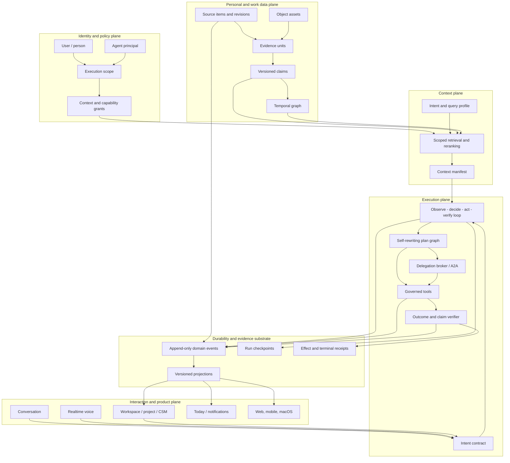

# Asael Root Architecture and Delivery Master Plan

**Status:** Proposed  
**Date:** 2026-09-02  
**Scope:** Core remediation, second-brain architecture, agent runtime, A2A/AP2, workspace management, voice, browser/computer use, integrations, and eventual native clients.

## 1. Executive conclusion

Asael already has valuable foundations: tenant isolation, a governed tool executor, approvals, provider credentials, durable queues, an event-log first stage, basic memory/RAG, workflows, capture, connectors, browser evidence, and a conversational interface.

The product is not yet a dependable second brain or a fully autonomous life-aware system. Its core problem is not model intelligence. It is that truth, identity, scope, provenance, execution state, and outcomes do not yet share one authoritative model.

The root architecture must become:

```text
source revision / user assertion / verified action
  -> addressable evidence
  -> versioned claim
  -> temporal graph projection
  -> scoped context manifest
  -> agent decision and governed action
  -> verified outcome receipt
  -> safe memory or adaptation candidate
```

No source chunk, assistant response, graph node, workflow summary, or UI status may independently become truth.

The delivery order is therefore:

1. Scope, contracts, truthful status, events, and rollout controls.
2. Convergent ingestion, provenance, assets, correction, and deletion.
3. Long-lived memory, context management, and temporal graph engineering.
4. Loop and harness engineering with truthful completion and recovery.
5. Agent identity, private memory, delegation, A2A, and eventually AP2 payments.
6. Complete governed app control, computer use, voice, and notifications.
7. Unified workspaces and a Salesforce-connected Customer Success domain.
8. Mobile and macOS clients only after the core contracts are stable.

## 2. North-star behavior

The target product should let the user speak or type naturally to the Main Agent, Asael, and expect the following behavior:

1. Asael understands the intended outcome using the current conversation, explicitly permitted personal context, workspace context, history, and known capabilities.
2. If material intent, target, authority, or acceptance criteria are ambiguous, Asael asks the smallest necessary question.
3. Asael creates a bounded plan, selects the right model, tools, skills, and agents, and explains the plan without exposing private chain-of-thought.
4. Asael performs all authorized operations in Asael through governed first-party tools: create, edit, organize, run, pause, retry, connect, assign, archive, and delete.
5. Asael delegates bounded work to agents with their own identities, personas, context grants, memories, tools, budgets, and acceptance contracts.
6. Every visible progress state represents real work. Preview, waiting, partial, blocked, failed, unverified, and succeeded are never conflated.
7. A result is complete only when its acceptance criteria and requested real-world effects are verified.
8. New memory is formed only from user assertions, source observations, confirmed tool outcomes, or user-approved inferences.
9. Future conversations retrieve the minimum relevant and authorized context with exact provenance and allow the user to remove it.
10. The same governed runtime works through text, realtime voice, web, mobile, and macOS.

### Reality boundary

“Fully aware of my life” cannot mean omniscience. Sources are incomplete, permissions change, people contradict themselves, relationships evolve, and models remain fallible. In Asael it must mean:

- aware of the information the user has knowingly connected or captured;
- explicit about what is missing, stale, uncertain, contradicted, or inaccessible;
- able to reason over people, time, projects, commitments, and preferences;
- proactive only within declared purposes, risk budgets, quiet hours, and consent;
- able to prove where important claims and actions came from.

## 3. Product and architecture principles

1. **Truth before autonomy.** Do not expand unsupervised action until completion and evidence are trustworthy.
2. **One lineage, many projections.** Memory, search, graph, Today, Missions, reports, and agent context are derived views of canonical records and events.
3. **Scope is mandatory.** Every store and operation receives an explicit execution scope; there are no default actor or workspace fallbacks for personal data.
4. **The model proposes; code authorizes and verifies.** Models never own permissions, idempotency, state transitions, deletion, or success determination.
5. **Minimum sufficient context.** Context is compiled just in time and never inherited wholesale between users, projects, agents, or providers.
6. **Personas do not grant authority.** An agent’s identity and personality are separate from its security principal and capabilities.
7. **Every action uses the governed executor.** Main Agent, subagent, workflow, browser, connector, A2A, and AP2 payment actions use the same policy boundary.
8. **Observable decisions, private reasoning.** Persist decisions, assumptions, evidence, plans, tool calls, and outcomes—not hidden chain-of-thought.
9. **Additive migration.** New schemas and behaviors run beside the old system until parity and rollback are proven.
10. **Failure becomes structure.** Repeated failures become contracts, deterministic checks, minimized fixtures, or clearer tools—not larger prompts.
11. **Source content is untrusted.** Documents, webpages, connector metadata, agent messages, and tool outputs can never become instructions without validation.
12. **Native clients reuse the core.** Mobile and macOS contain presentation, device, capture, and offline concerns; business logic remains server-authoritative.

## 4. What is preserved, changed, created, and retired

| Classification | Systems |
|---|---|
| **Reuse initially** | First-party authentication, tenant membership, RBAC, forced RLS, governed tool executor, approval records, encrypted credential vault, durable operation queue, SSE transport, provider adapters, app shell, theme system, resource states, and existing domain page shells. |
| **Modify behind versioned contracts** | `agent-runner`, supervisor/router, workflow planner/runner/executor, events, run trajectories, memory store/consolidator, RAG store/context engine/citations, graph projection, personal sync, capture/recording storage, agents/skills, Missions/Projects, Today, notifications, browser frames, voice, model assignments, integrations, and portable archive. |
| **Create** | ExecutionScope, AgentPrincipal, IntentSpec, OutcomeContract, HarnessManifest, TerminalReceipt, canonical source revisions, evidence units, claim ledger, lineage/tombstones, context manifests, temporal entity graph, agent memory spaces, internal delegation protocol, A2A adapter, AP2 mandate/receipt adapter, app-operation tool family, object storage plane, unified Workspace/WorkItem model, meeting domain, CSM domain pack, delivery outbox, realtime voice gateway, and versioned native API. |
| **Retire only after cutover** | Tenant-only personal-memory assumptions, append-only source ingestion, duplicate knowledge/memory/graph evidence, assistant-response fact promotion, keyword graph as personal truth, synthetic workflow-node completion, mechanical “verified” badges, generic workflow actor attribution, configuration-only model assignments, browser “Live” polling label, PostgreSQL binary storage for large media, and overlapping Mission/Project task records. |

Existing UI components are reused as compatibility surfaces while their data contracts change. Primary modification points include `today-workspace`, `agent-runs-workspace`, `mission-workspace`, `projects-workspace`, `memory-workspace`, `capture-workspace`, `agent-arsenal-workspace`, `integrations-workspace`, `tools-workspace`, `settings-workspace`, `notification-center`, `voice-mode`, and `conversation-canvas`.

## 5. Current limitation register

This register captures the static repository assessment that produced the plan. It describes current semantics, not merely missing UI polish.

### 5.1 Truth, execution, and evidence

- Direct-versus-durable routing and specialist selection depend heavily on English regular expressions, keywords, and message length rather than semantic intent grounded in conversation history.
- Direct agent execution and durable workflow execution are two engines with different state, continuation, approval, and completion semantics.
- Workflow nodes without tools can be marked complete after generating text that restates the task rather than performing it.
- Dependency outputs are not generally bound into downstream tool inputs, and independent DAG nodes are not broadly scheduled in parallel.
- Replanning is narrow and bounded to one verification-driven attempt rather than responding to every material observation or failed assumption.
- A workflow can report success when required work is dry-run, waiting, skipped, blocked, unverifiable, or never produced an external effect.
- Approval need can be decided before the final plan; later-discovered risk may become a preview instead of reopening the correct approval gate.
- An approval is not consistently bound to the final plan, target, tool-contract version, exact input digest, and budget.
- Citation “verification” checks evidence-ID presence, not claim entailment, material-claim coverage, validity time, source independence, or contradiction.
- Trajectory verification proves hashes, ordering, usage, and receipt presence—not that the user’s intended outcome occurred.
- The event-log substrate is still a first-stage dual-write system; bespoke ledgers remain authoritative in several domains and event writes are not uniformly atomic with domain writes.
- Observable activity is operationally useful but does not yet provide a replayable nested trace from intent through context, agent, model, tool, effect, verification, and memory.

### 5.2 Memory, context, and graph

- Personal memory is fundamentally tenant-scoped rather than consistently actor-, project-, mission-, and agent-scoped.
- Some visible memory-scope choices collapse to the same runtime behavior, so “project” can behave like general durable context.
- Assistant-generated response text participates in consolidation and can become a durable false memory.
- Memory formation ignores much of the structured tool/evidence trajectory and relies on bounded prompt/response extraction.
- Contradiction matching is largely title-token/content similarity rather than entity-, source-, and time-aware reconciliation.
- Knowledge chunks, memories, and graph-derived context can represent the same source independently, consuming tokens and creating false corroboration.
- Correcting or forgetting one memory does not atomically invalidate all related knowledge chunks, summaries, graph projections, embeddings, and learning signals.
- Edited source records may stay stale because stable document/chunk writes can ignore conflicts rather than create and activate a new revision.
- Conversation continuity uses a bounded recent transcript without a complete hierarchy of turn, episode, project, and lifetime summaries.
- Context retrieval uses hand-tuned weights and English/ASCII-oriented lexical logic; multilingual and temporal intent handling is weak.
- Embeddings and some visual extraction paths remain dependent on OpenAI even when another provider is primary.
- Context and tool outputs are truncated, which can omit decisive evidence in larger tasks.
- The graph is mostly topic/tag/word co-occurrence, not a typed personal graph of people, identities, relationships, places, events, commitments, validity time, and causal provenance.
- Retrieval traces can feed graph popularity, creating a self-reinforcing attention loop rather than new truth.
- Graph/search/reconciliation jobs operate over bounded recent sets and can omit older long-tail life context.
- “Always learning” means prompt guidance from corrections and simple performance thresholds, not verified preference/procedure learning or model-policy improvement.
- Retention limits raw episodes and consolidated memories, which is privacy-positive but cannot provide lifetime autobiographical recall without replacement summaries and archives.
- Portable export and restore are capped and omit important raw assets, audio, workflow/run history, graph state, automations, and restorable connector configuration.

### 5.3 Sources, capture, and life coverage

- Native personal OAuth ingestion is largely Google Gmail, Calendar, Drive, and selected Photos, and it is predominantly read-only.
- Combined Google sync processes a small bounded set and can advance source cursors past unprocessed items.
- Gmail and Drive paging/backfill are narrow; Gmail attachments are mainly metadata; Calendar and Gmail volume can crowd out later sources.
- Gmail deletion and Drive/Calendar revision/deletion reconciliation are incomplete.
- Photos uses user-selected picker sessions rather than continuous, permission-aware library understanding.
- There is no comprehensive native coverage for Contacts, Tasks, Keep, Maps/location, YouTube history, Microsoft 365, Apple/iCloud, messages/calls, health/wearables, finance, purchases, travel, social networks, or smart-home activity.
- MCP/OpenAPI access does not automatically create a durable, versioned, provenance-safe ingestion stream.
- Capture does not accept or fully understand every document type; extraction has format, size, page, OCR, and text-length limits.
- Spreadsheets and slides lose structure when flattened to text.
- Long recording uploads depend on the browser’s serial queue and synchronous segment transcription; disconnects can leave missing transcript segments.
- Large audio and file bytes are stored in PostgreSQL, creating backup, database-growth, streaming, and cost pressure.
- Meeting capture lacks first-class attendees, consent, diarization, identity, chapters, decisions, commitment extraction, and reliable follow-up linkage.
- There is no authoritative source-coverage and freshness view showing what is complete, stale, partial, disconnected, or never connected.

### 5.4 Agents, tools, models, and computer use

- Agent Council is a set of parallel one-shot structured model opinions plus a critic, not agents collaborating through messages, tools, artifacts, and iterative challenges.
- Durable specialists are fixed personas, normally maximum two, and read-only; they cannot own writable work or dynamically reshape the agent team.
- Agents do not have strongly isolated private memory, persistent working state, separately versioned personas, or independently governed principals.
- There is no general internal delegation contract, message broker, task acceptance protocol, or A2A adapter.
- The native tool surface is small; most real work depends on separately configured MCP/OpenAPI contracts.
- Only a bounded subset of external tool schemas is hydrated for a run, so an installed capability may be invisible to the model.
- Inbound Asael MCP is read-oriented and cannot yet command the Main Agent, launch workflows, capture data, or mutate work through the full governed surface.
- OpenAPI authentication lacks a general OAuth/refresh-token, signed-auth, GraphQL, mTLS, and large-media framework.
- Model routing is based on task heuristics and configured fallbacks rather than measured outcome quality, privacy, latency, price, context fit, and provider health.
- Several model assignments visible in Settings do not have corresponding runtime consumers.
- Provider capability and deprecation detection rely substantially on naming/description inference and warning rather than verified probes and lifecycle feeds.
- Full conversation/context is repeatedly transmitted in some paths; other providers receive flattened/truncated prompts, increasing cost or losing structure.
- Browser activity is a polling screenshot replay rather than a live, server-pushed, user-takeover computer-use session.
- Captured browser images are evidence but are not fully returned to the model as visual feedback for the next action.
- Browser interaction often requires approval for each click/type/navigation action, preventing useful bounded autonomy.
- Browser sessions do not naturally inherit the user’s logged-in Chrome profile and remain vulnerable to MFA, CAPTCHA, anti-bot, and session-expiry barriers.
- There is no general local desktop/computer-control bridge with actor-owned permissions and a visible kill switch.

### 5.5 Product, workspaces, voice, notifications, and clients

- Today is primarily an Asael activity dashboard rather than a unified agenda of calendar, meetings, commitments, people, customer risks, work, and blind spots.
- Today consumption does not cover every model/provider operation, transcription, speech, OCR, embedding, image generation, browser host, and connector cost.
- Projects and Missions expose overlapping work models and can show inconsistent concepts of task status, assignment, execution, and evidence.
- Marking a Mission task in progress does not necessarily start the assigned agent or workflow.
- Conversation progress, approvals, recovery, evidence, browser activity, and technical details remain distributed across multiple surfaces.
- The conversation canvas groups items visually but does not model true fork, delegation, dependency, project, or shared-artifact lineage.
- Files, images, recordings, transcripts, meeting media, emails, and generated artifacts do not share one complete, browsable, versioned workspace library.
- Voice is record-stop-upload-transcribe, not low-latency duplex voice with partial transcription, turn detection, interruption, and barge-in.
- Notifications poll while the app is open; the service worker does not provide a complete push subscription/delivery path.
- Quiet-hour notifications can be skipped rather than reliably deferred and released.
- The present mobile client/API work is not a release-ready companion and contains contract/lifecycle mismatches.
- Offline web behavior is limited; most conversation, knowledge, work, and supervision requires connectivity.
- Settings and integration catalog surfaces can imply capability or readiness when the corresponding connector or runtime behavior is absent.

### 5.6 Infrastructure, privacy, and operational efficiency

- The web, Postgres, worker, model egress gateway, browser service, cron, and connector topology is operationally complex for a personal system.
- Database-heavy work and the present worker topology trade throughput for bounded database pressure.
- Multiple mutable ledgers and projections can disagree until event sourcing is completed.
- Centralizing personal communications, files, recordings, browser sessions, memories, and provider credentials creates a very large compromise blast radius.
- A tenant boundary alone is insufficient for intimate life data; actor, relationship, project, purpose, sensitivity, and consent boundaries are required.
- Data about other people in email, photos, calls, meetings, and CRM records creates consent, disclosure, retention, and legal obligations beyond the primary user’s preferences.
- Existing backup/export and retention behavior does not yet provide both complete personal ownership and privacy-safe lifetime memory.
- Strong approval governance currently adds friction without sufficiently precise plan/action grants, while weak completion verification can still overstate success.

## 6. Target architecture



## 7. Canonical contracts

These contracts must exist before replacing behavior.

### 7.1 ExecutionScope

Every read and write must receive:

```text
tenantId
initiatingActorId
executingPrincipalType: user | agent | system
executingPrincipalId
workspaceId?
projectId?
missionId?
delegationId?
correlationId
causationId?
contextGrantIds[]
capabilityGrantIds[]
purpose
```

Personal data additionally carries `ownerActorId`, `visibility`, `sensitivity`, `allowedPurpose`, retention class, and lineage parents. Derived data may narrow access; it may never broaden it.

### 7.2 SourceRevision and EvidenceUnit

A source revision identifies one immutable version of an external or captured item. An evidence unit identifies an exact page, span, sheet, slide, email section, image region, or audio/video time range within that revision.

Every evidence unit carries source timestamps, capture timestamp, content hash, extractor/model version, permissions, and an exact locator. Generated prose is never evidence for itself.

### 7.3 Claim

A claim is a versioned assertion with:

- subject, predicate, object/value;
- asserted, observed, inferred, or computed origin;
- valid time and recorded time;
- evidence-unit IDs and asserter;
- confidence and verification state;
- visibility, sensitivity, purpose, and scope;
- lifecycle: `candidate | confirmed | active | superseded | contradicted | forgotten`.

### 7.4 ContextManifest

A context manifest records metadata about the context given to one model turn:

- query and scope decision;
- selected and rejected evidence/claim/summary IDs;
- selection reasons, scores, freshness, and conflicts;
- token allocation by tier;
- user inclusions and exclusions;
- provider disclosure boundary;
- compiler, embedding, reranker, and policy versions.

Raw private content is not duplicated into the manifest.

### 7.5 AgentPrincipal and AgentDefinition

`AgentDefinition` holds persona, identity, charter, voice, model policy, skills, visual theme, and version. `AgentPrincipal` holds authority, owner, delegation chain, grants, budgets, and scope. Changing a mascot or persona never changes authority.

### 7.6 IntentSpec and OutcomeContract

`IntentSpec` records the requested outcome, targets, exclusions, constraints, ambiguity, risk, and expected interaction mode. `OutcomeContract` records machine-checkable acceptance criteria, required artifacts, required live effects, and verification methods.

### 7.7 HarnessManifest and TerminalReceipt

The manifest pins engine, prompt, model, context, tools, skills, policies, budgets, grants, and contract hashes for the run. The terminal receipt is one of:

- `succeeded`: every required criterion and requested effect is verified;
- `partial`: useful work exists but one or more declared criteria are unmet;
- `waiting_approval`: a bound approval is required;
- `blocked`: external/user dependency prevents progress;
- `unverified`: work exists but verification could not establish correctness;
- `failed`: required work or verification failed;
- `canceled`: an authorized principal stopped the run.

A preview, dry run, model assertion, generated summary, or citation-ID match can never satisfy `succeeded`.

## 8. Non-breaking delivery protocol

Absolute zero impact is impossible in a shared application. The enforceable goal is a bounded blast radius, backward-compatible contracts, measurable parity, and a fast rollback.

Every implementation slice follows this sequence:

1. **Contract:** define versioned input, output, event, scope, ownership, and error semantics.
2. **Expand:** add schema and APIs without removing or reinterpreting legacy fields.
3. **Dual-write:** write legacy and new representations from one transaction or transactional outbox.
4. **Backfill:** migrate historical data resumably with explicit quarantine for ambiguous ownership.
5. **Shadow:** compute new reads/projections without serving them; compare counts, hashes, state, and access decisions.
6. **Canary:** enable the feature for selected tenants and only for new runs or records.
7. **Cut over:** switch one bounded read or behavior behind a persisted rollout generation.
8. **Observe:** keep dual writes and compatibility adapters through the rollback window.
9. **Contract:** retire legacy writers and schema only in a later cleanup release.

Additional rules:

- In-flight work is pinned to the engine and contract version that created it.
- Older workers never interpret newer checkpoints.
- Security improvements, tombstones, and actor isolation are permanent floors and are not disabled during rollback.
- Each slice has one named owner, affected bounded contexts, declared unaffected behavior, data migration, rollback switch, and acceptance gate.
- External mutations use idempotency keys and record compensating-action metadata.
- No page redesign precedes its canonical data projection.
- No broad test or audit run is implicit. Each slice declares a bounded verification set that is run only when that implementation phase is explicitly authorized.
- Any scope leak, unapproved effect, duplicate effect, false success, deletion resurrection, or corrupt projection stops rollout immediately.

## 9. Dependency map

```text
P0 Contracts and compatibility floor
  -> P1 Truthful event, evidence, and outcome kernel
      -> P2 Convergent source and asset plane
          -> P3 Long-lived memory
              -> P4 Context Management
                  -> P5 Graph Engineering
                      -> P6 Loop and Harness Engineering
                          -> P7 Agent identity and multi-agent runtime
                              -> P8 A2A
                                  -> P9 Main-agent app control, browser, voice, notifications, communications, AP2
                                      -> P10 Workspace and Salesforce CSM
                                          -> P11 Cohesive product projections
                                              -> P12 Mobile
                                                  -> P13 macOS
```

Some work can proceed in parallel only after its shared dependency is stable. UI mockups and connector research can be parallelized; competing truth stores, schemas, and runtime engines cannot.

## 10. Dependency-ordered implementation plan

Each row is one reviewable vertical slice. “Reuse / Modify / Create” names how it relates to the present system.

### Phase 0 — Contracts, ownership, rollout controls, and baselines

**Goal:** Make future replacements safe without changing user-visible behavior.

| ID | Vertical slice | Reuse / Modify / Create | Isolation and compatibility | Done when |
|---|---|---|---|---|
| P0.1 | Add versioned `ExecutionScope` to memory, RAG, runs, tools, workflows, connectors, events, assets, and projections. | Reuse auth/RBAC/RLS; modify store/service signatures; create scope contract. | Legacy adapters construct only explicitly trusted legacy scopes; ambiguous personal ownership is quarantined. | Every new operation records tenant, actor, executing principal, purpose, correlation, and grants; unscoped production calls fail closed. |
| P0.2 | Add `AgentPrincipal`, `IntentSpec`, `OutcomeContract`, `HarnessManifest`, `ContextManifest`, and `TerminalReceipt` schemas. | Reuse run/event stores; create versioned envelopes. | New fields are additive and optional only for legacy records. | New shadow runs emit valid envelopes with no secret or private reasoning content. |
| P0.3 | Add persisted per-tenant rollout generations and engine-version pinning. | Modify configuration and worker claiming; create rollout records. | Flags apply only to new work; existing work resumes on its original engine. | One tenant can enable or disable each v2 capability without changing another tenant or corrupting an in-flight run. |
| P0.4 | Define the canonical status vocabulary across agents, workflows, missions, projects, approvals, and UI. | Modify status adapters; create shared state contract. | Legacy states remain readable through translation adapters. | Every surface renders the same meaning for preview, running, waiting, blocked, partial, unverified, failed, canceled, and succeeded. |
| P0.5 | Create bounded golden fixtures and metrics for scope, pagination, update/delete, retries, intent routing, context selection, citations, temporal questions, approvals, and false completion. | Reuse evaluation harness; modify scorers; create fixtures. | Fixtures use synthetic tenant/user data and no external side effects. | Baseline is recorded and every later phase has a narrow regression set and explicit exit gate. |
| P0.6 | Record required architecture decisions. | Reuse ADR convention; create ADRs for canonical truth, agent identity, object storage, A2A, AP2, Workspace model, and native API. | Decisions include migration and rollback impact. | No phase depends on an unresolved cross-cutting architectural choice. |

**Phase gate:** 100% new shadow operations are scoped; schema/event versions are explicit; no user-visible behavior changes.

P0.6's seven required decisions are now accepted in ADRs 005–011: canonical
truth, agent definition versus principal authority, tenant-scoped object
storage, the internal delegation/A2A boundary, deterministic AP2 roles and key
custody, the canonical Workspace hierarchy, and the server-authoritative native
API. Each ADR fixes compatibility, migration/cutover, rollback, and permanent
security floors. A2A protocol `1.0` and AP2 tag `v0.2.0` are design pins only;
their accepted adapter-release sets remain empty. This closes the decision
record required by P0.6 without implementing an adapter, payment path, object
plane, Workspace cutover, native client, runtime grant, database change, or
user-visible behavior. It does not complete the other Phase 0 rows or satisfy
the aggregate Phase 0 gate.

P0.5 now has a reproducible observed baseline in `evals/p05/baseline.v1.json`.
All sixteen bounded synthetic cases pass across the ten required truth and
safety categories. The observer exercises the corresponding side-effect-free
runtime policies without calling a model, provider, database, connector, clock,
or external effect. This completes the shared baseline portion of P0.5; each
later phase must still add its own narrow regression set and explicit exit gate
rather than treating the shared baseline as proof of that phase.

### Phase 1 — Truthful events, evidence, completion, and recovery

**Goal:** Make every result and status honest before increasing autonomy.

| ID | Vertical slice | Reuse / Modify / Create | Isolation and compatibility | Done when |
|---|---|---|---|---|
| P1.1 | Finish the event-log substrate for runs, workflows, projects, missions, tools, approvals, assets, sync, memory, notifications, and customer records. | Reuse `omni_events`; modify domain stores; create transactional event/outbox path. | Personal content stays in scoped stores; events hold references, hashes, and minimal metadata. | Every mutation has typed event, actor/principal, scope, correlation, causation, idempotency key, and payload version. |
| P1.2 | Make canonical write plus event/outbox atomic. | Modify stores and projection workers. | Privacy-critical writes never use best-effort event append. | A committed mutation cannot exist without its event, and replay produces the same projection. |
| P1.3 | Implement `OutcomeContract` evaluation and exact terminal receipts. | Modify workflow and direct-run completion; create deterministic outcome evaluator. | Legacy success remains displayed as `legacy_unverified` until re-evaluated. | Waiting, skipped-required, blocked, partial, dry-run, and unverified work cannot report success. |
| P1.4 | Add external effect receipts and read-after-write postconditions. | Reuse governed executor; modify tool records; create effect receipt. | Receipts are bound to actor, agent, plan, tool contract, target, input digest, and idempotency key. | Every successful external mutation has provider acknowledgment and a verified postcondition or explicit unverifiable state. |
| P1.5 | Replace citation-ID validation with `ClaimEvidenceMap`. | Modify RAG citations and result UI; create material-claim decomposition and support states. | Claim checking runs only against authorized evidence units. | Each material claim is supported, inferred, disputed, stale, or unsupported; one citation cannot verify unrelated text. |
| P1.6 | Persist checkpoints at every model, tool, approval, delegation, and verifier boundary. | Reuse queue/events; modify agent/workflow continuation; create versioned checkpoint store. | Checkpoints contain references to scoped data, not duplicated credentials. | Interrupted work resumes without duplicate side effects; unsupported engine versions pause safely. |
| P1.7 | Add replay, fork, and correction from a checkpoint. | Reuse event streams; modify trajectory UI; create fork lineage. | Forks receive new grants and never inherit stale approvals. | A user can inspect a step, supply a correction, and continue as a new trace while preserving original history. |

**Phase gate:** zero false `succeeded` outcomes in negative/partial/dry-run fixtures; every accepted effect is attributable and idempotent; projection replay parity is 100%.

P1.5 is complete for the agent-answer serving path. Every final answer now
receives deterministic exact-span claim decomposition and a structurally
verified `ClaimEvidenceMapV1`. Only tenant-, owner-, scope-, purpose-,
retention-, hash-, and byte-length-verified canonical knowledge evidence is
opened for deterministic entailment; citation IDs, model assertions,
memory/graph/web results, and legacy chunks cannot establish support. The
private map persists in the existing grounding projection, `run.done` emits a
metadata-only summary, public APIs and streams expose a bounded projection,
and the result UI shows each material claim as supported, inferred, disputed,
stale, or unsupported. Legacy sources remain readable without being silently
upgraded. The normative boundary is documented in
[ClaimEvidenceMap v1](CLAIM_EVIDENCE.md).

P1.6 now has a contract, persistence foundation, and approval-boundary shadow
chain in
`src/lib/runs/checkpoints.ts` and `src/lib/runs/checkpoint-store.ts`. It defines
a bounded, immutable,
metadata-and-reference-only `RunCheckpointV1`, deterministic checkpoint
identity and digest, exact parent-chain validation, monotonic budget and
external-effect accounting, guarded waiting-boundary transitions, exact
completed-call counting, and a safe-pause compatibility decision for inactive
or unsupported engine, contract, configuration, or rollout pins. Mutation
boundaries bind governed tool execution, persisted intent, idempotency, and
effect-receipt identities rather than embedding provider state or trusting a
model assertion. Migration v68 adds append-only tenant-scoped checkpoint and
state-reference tables with forced RLS. A transaction-only writer rebinds the
exact scope, locks and validates the parent, persists the record and reference
index, and appends one metadata-only `run.checkpoint.recorded` event. The writer
does not itself load referenced state, claim work, or grant resume authority.
Newly created agent runs can capture an exact active shadow rollout pin and atomically record
their first governed approval-wait checkpoint with the legacy continuation.
The governed approval transaction now records the exact approved or rejected
successor; the approved record precedes effect execution, the rejected record
is terminal, and both retain zero boundary effects. Strict matched comparison
receipts cover both records while the legacy continuation remains authoritative.
The bounded tenant-scoped operator check now reconciles persisted checkpoint
rows, reference indexes, events, decision state, and effect receipts; it fails
closed on an empty or mismatched sample and never opens continuation contents.
Migration v69 and `checkpoint-resume-claim.ts` add a forced-RLS fence
store with exact checkpoint-digest foreign keys, hashed credentials, monotonic
lease generations, expired-only reclaim, and token-fenced heartbeat/completion.
Acquisition revalidates the live rollout, scope, waiting run, approval decision,
terminal tool state, and effect receipt. A distinct canary configuration may
enrol only risk-0, read-only, no-effect continuations. The resume worker never
falls back to the legacy path for such a pin: it atomically acquires and binds
the exact claim, keeps the raw token process-local, heartbeats it, and passes the
same token and generation through the runner. Terminal and next-wait writes now
require the exact live claim and complete it in the same transaction, so a stale
worker cannot commit run state or project mission progress. Unenrolled,
preclaimed, file-mode, and existing runs remain unchanged. The non-empty
production sample reconciled, and the active generation-2 risk-0 canary
reclaimed a deliberately interrupted generation-1 resume with exactly one tool
execution, no effect receipt, and a completed generation-2 fence. The expanded
shadow implementation now chains model success/failure, governed tool,
approval, council delegation, and verifier boundaries, and its bounded
reconciler fails closed on missing phase coverage or successful mutations
without exact receipts. Generation 3 was deployed and registered in production
shadow mode on 2026-09-06. A forced-approval read-only continuation and a
tool-free council/Sentinel run covered all ten required phases; the post-cleanup
sample matched 36 of 36 checkpoints and comparison receipts with no waiting
approvals. The separately pinned generation-4 canary then activated the full
boundary chain for read-only runs. Its final production sample matched 86 of 86
checkpoints across eight runs with all ten phases and no effect receipts. A
hard-killed generation-1 continuation reclaimed the exact approval fence as
generation 2 behind its valid zero-effect descendant chain and completed with
one reclaim event, zero external effects, and zero effect receipts. Transport
interruption now preserves stale leases for expired-only fenced recovery, while
ordinary execution and checkpoint failures remain fail closed. P1.6 is
complete. The normative
boundary and activation order are documented in
[RunCheckpoint v1](RUN_CHECKPOINTS.md).

P1.7 is complete for checkpoint-backed agent traces. The trajectory projection
now exposes bounded checkpoint steps and parent/child fork lineage without
opening referenced state. A user can select a recorded boundary, provide a
correction, and execute a deterministically identified new run. Migration v70
stores immutable tenant-scoped lineage bound to the full validated checkpoint
chain and exact event-prefix digest. Target creation, fresh scope binding, and
metadata-only source/target fork events commit together. The source history is
unchanged; stale provider continuation, resume claims, tool executions, and
approval decisions are never copied, so any gated action in the new trace
requires a new approval.

P1.4 is complete for the registered external mutation surface. Google Calendar
creation records deterministic provider acknowledgement plus verified
read-after-write state. HTTP POST/PUT/PATCH/DELETE, governed OpenAPI non-read
methods, and governed MCP mutation tools persist an immutable, scoped v2 intent
before delivery and a provider-response receipt afterward. Direct effects bind
the initiating user; workflow effects bind the exact persisted workflow, plan
digest, and node. Providers without a uniform safe read operation are recorded
as `unverifiable/read_unavailable`, never as verified, and an uncertain
intent-bound delivery is not replayed. Connector mutation classification is
part of the reviewed tool contract. Provider-specific reconciliation adapters
may strengthen generic receipts later without reopening this coverage gate.

### Phase 2 — Convergent sources, canonical assets, and privacy lifecycle

**Goal:** Ensure the system knows exactly what it has, which version it has, and what must disappear.

| ID | Vertical slice | Reuse / Modify / Create | Isolation and compatibility | Done when |
|---|---|---|---|---|
| P2.1 | Introduce canonical `SourceItem`, immutable `SourceRevision`, `EvidenceUnit`, and typed adapter output `upsert | delete`. | Reuse connector grants; modify ingestion; create source/evidence tables. | Every item is actor/workspace/project scoped and tied to one connection. | All indexed passages resolve to an exact source revision and locator. |
| P2.2 | Replace combined cursors with independent paginated, transactional checkpoints. | Modify personal sync; create per-source/page checkpoints and dead-letter records. | One source failure cannot advance or block another source. | Mid-page failure and retry converge without loss or duplicates; cursors never advance beyond committed pages. |
| P2.3 | Pilot revision-aware upsert/delete with Drive, then Gmail, Calendar, Photos, and Capture. | Modify adapters and RAG writes; reuse existing OAuth. | Roll out one source at a time with separate legacy/v2 checkpoints. | Creates, edits, deletes, moves, retries, and concurrent updates converge to provider state. |
| P2.4 | Create tenant-scoped object storage and asset metadata. | Reuse capture UI; modify asset/recording stores; create blob adapter and signed delivery. | Blob keys include tenant/owner scope; all access is authorized server-side. | Every asset has checksum, size, media type, retention, owner, extraction state, and version; interrupted large uploads resume. |
| P2.5 | Migrate existing files and recordings from database bytes. | Modify read/write adapters; create resumable backfill. | Dual-read/write behind tenant flag; retain old bytes through rollback window. | Hash/size parity is proven before reads switch; rollback returns to the old reader without data loss. |
| P2.6 | Build structured extraction for documents, spreadsheets, slides, PDFs, images, audio, and video. | Modify capture extractors; create format-specific normalized outputs. | Original assets remain immutable; derivatives inherit/narrow source permissions. | Extraction exposes page/slide/sheet/region/timestamp-level evidence and clear unsupported/partial states. |
| P2.7 | Implement lineage tombstones and complete correction/deletion propagation. | Modify memory, RAG, graph, summaries, archive; create deletion receipt and scrub worker. | Tombstone is an immediate query barrier and cannot be disabled by rollback. | Forgotten content is immediately absent from search/context/graph/export; physical descendants are scrubbed within SLA and cannot reappear after rebuild. |
| P2.8 | Build portable archive v2 and verified restore. | Modify personal data controls; create manifest, hashes, counts, optional encrypted assets. | Secrets are excluded; connector configuration requires reauthorization. | Export discloses all inclusions/exclusions; isolated restore matches declared counts, hashes, ownership, and provenance. |

**Phase gate:** source convergence is exact in bounded fixtures; stale current revisions and duplicate current records are zero; deletion lineage coverage is 100%.

### Phase 3 — Long-lasting, persistent, readable memory

**Goal:** Build memory that becomes more accurate and useful over time rather than merely larger.

| ID | Vertical slice | Reuse / Modify / Create | Isolation and compatibility | Done when |
|---|---|---|---|---|
| P3.1 | Add actor, agent, mission, project, workspace, sensitivity, purpose, and visibility to memory. | Modify memory types/store/API; create actor-aware policies. | Visibility values: `agent_private | user_private | mission_shared | project_shared | workspace_shared`. | Actor A and sibling agents cannot retrieve private data through any API, worker, export, graph, or context path. |
| P3.2 | Separate memory tiers: working, episodic, semantic, procedural, preference, decision, commitment, and summary. | Reuse typed memories; modify formation/retrieval; create tier policies. | Each tier has explicit retention, promotion, correction, and retrieval rules. | Users and agents can read why a memory exists, its source, scope, confidence, last use, and validity. |
| P3.3 | Replace response-based consolidation with evidence-based memory formation. | Modify consolidator; reuse run/tool/source events. | Assistant prose creates only an inference candidate, never an active fact. | User “remember” assertions, source observations, and verified effects form traceable memories; failed tools never become successful episodes. |
| P3.4 | Add contradiction and confirmation inbox. | Modify memory UI; create reconciliation service and review state. | Conflicting claims coexist with temporal/source context until deterministically resolved or reviewed. | No contradiction is silently overwritten; confirmed corrections stop old claims from recurring. |
| P3.5 | Add hierarchical conversation memory. | Modify thread context; create turn summaries, episode summaries, project summaries, and lifetime indexes. | Summaries retain links to source turns and access scope; they are rebuildable. | Long conversations remain coherent without repeatedly sending full transcripts. |
| P3.6 | Add memory maintenance: deduplication, decay of retrieval priority, promotion, archival, and pinned records. | Modify memory workers; create deterministic lifecycle policies. | Decay changes retrieval priority, not historical truth; deletion remains separate. | Duplicate memory rate stays below target and repeated verified episodes can become procedures with reviewable lineage. |
| P3.7 | Make memory correction and forgetting understandable in UI and conversation. | Modify memory workspace and Main Agent tools. | Exact affected descendants and irreversible consequences are previewed. | The user can search, inspect, correct, pin, scope, export, and forget memory in plain language with receipts. |

**Phase gate:** unsupported active assistant-derived facts are zero; explicit-memory recall and correction propagation meet the declared benchmark; cross-scope exposure is zero.

### Phase 4 — Context Management

**Goal:** Give each turn and agent only the most relevant authorized context, with user control and predictable cost.

| ID | Vertical slice | Reuse / Modify / Create | Isolation and compatibility | Done when |
|---|---|---|---|---|
| P4.1 | Build Context Compiler v2 over canonical evidence, claims, summaries, and graph neighborhoods. | Modify context engine; create compiler interface. | Access/purpose filtering happens before ranking or model calls. | Unauthorized, forgotten, superseded, or stale-invalid evidence cannot enter a context pack. |
| P4.2 | Implement distinct scopes: none, current turn, session, agent-private, mission, project, workspace, personal, and explicit selection. | Modify agent configuration/UI; reuse context deselection. | Explicit selection wins; explicit empty means no durable context. | Every scope produces meaningfully different authorized results and is visible before execution. |
| P4.3 | Add semantic, temporal, entity, relationship, and procedural query planning. | Modify heuristic profiling; create semantic router with deterministic validation. | Query planning cannot expand permissions. | Natural paraphrases and temporal questions retrieve the correct domains with measured accuracy. |
| P4.4 | Add provider-neutral multilingual embeddings and learned reranking. | Modify embedding/ranking adapters; create provider capability contract. | Cross-provider use follows user disclosure/consent policy. | Retrieval works without an OpenAI key and improves over lexical/heuristic baseline on multilingual fixtures. |
| P4.5 | Deduplicate context by lineage and allocate tokens by tier. | Modify packing; create budget allocator. | One underlying source cannot masquerade as multiple independent sources. | Duplicate-token share is below target and packs never exceed model/task budgets. |
| P4.6 | Add context preview, inclusion/exclusion, lock, and receipt in Conversation. | Modify agent-runs workspace; reuse evidence UI. | User overrides are bound to the run manifest. | The user can see what will be used, remove any item, and later inspect what was actually used. |
| P4.7 | Add prompt/context continuation and caching per provider. | Modify provider adapters and loop input. | Provider-bound opaque state never crosses providers; canonical transcript remains server-owned. | Long threads preserve roles and structure while reducing repeated tokens and latency. |

**Phase gate:** override compliance 100%; scope violations zero; context stays within budget; retrieval relevance, freshness, latency, and cost are measurable per successful task.

### Phase 5 — Graph Engineering

**Goal:** Turn the current topic/co-occurrence graph into a versioned personal and work temporal graph.

| ID | Vertical slice | Reuse / Modify / Create | Isolation and compatibility | Done when |
|---|---|---|---|---|
| P5.1 | Define an extensible ontology for Person, Organization, Account, Project, WorkItem, Event, Meeting, Place, Asset, Decision, Commitment, Preference, Risk, Goal, Product, Case, and Opportunity. | Reuse graph UI; modify graph model; create ontology registry. | Node and edge types include scope, sensitivity, purpose, and lineage. | Ontology versions can evolve without rewriting historical claims. |
| P5.2 | Build entity registry, aliases, and identity resolution. | Modify extraction; create candidate merge/review system. | Ambiguous merges never auto-broaden access or merge people across actors. | Auto-merge precision meets target; false merges are reversible and auditable. |
| P5.3 | Add bitemporal claims and typed relations. | Create temporal claim projection; modify graph queries. | Asserted, observed, inferred, and computed edges are distinct. | The graph can answer who/what/when/change-over-time questions while preserving conflicting dated facts. |
| P5.4 | Project graph transactionally from canonical claims and evidence. | Modify graph worker; reuse outbox/events. | Retrieval traces never create truth edges; legacy co-occurrence remains topic metadata only. | Incremental projection and full rebuild are identical; correction/deletion/access changes propagate. |
| P5.5 | Add graph-aware retrieval and explanation. | Modify context compiler and memory workspace. | Graph expansion respects access at every hop. | Multi-hop answers expose the path and evidence for each relationship without leaking adjacent private nodes. |
| P5.6 | Add scale metrics before choosing a graph database. | Reuse Postgres initially; create query telemetry. | Storage replacement must use an adapter and shadow parity. | A graph database is introduced only if measured latency/scale needs justify it. |

**Phase gate:** temporal QA and entity-resolution benchmarks pass; orphan evidence is zero; rebuild parity is 100%; no access boundary can be crossed through graph traversal.

### Phase 6 — Loop Engineering and Harness Engineering

**Goal:** Replace shallow routing and split execution semantics with one resumable, bounded, truthful runtime.

| ID | Vertical slice | Reuse / Modify / Create | Isolation and compatibility | Done when |
|---|---|---|---|---|
| P6.1 | Implement the persisted state machine `understand -> clarify -> plan -> act -> observe -> verify -> replan/finish`. | Reuse agent loop/workflows; create engine v2. | New-run-only flag; v1 runs remain pinned to v1. | Every transition is deterministic, evented, checkpointed, and has explicit retry/cancel semantics. |
| P6.2 | Replace regex intent routing with semantic intent/entity/capability resolution followed by deterministic policy validation. | Modify supervisor/capability catalog. | Semantic output cannot grant tools, context, or risk exemptions. | Intent-route accuracy and required-tool recall meet target without increasing unnecessary clarification. |
| P6.3 | Preserve native conversation roles and structured observations. | Modify prompts/provider adapters. | Untrusted tool/source data stays labeled and separated from instructions. | No provider receives a flattened pseudo-user transcript; continuations can be replayed provider-neutrally. |
| P6.4 | Make every workflow node a real bounded agent/tool execution with typed input and output. | Modify planner/executor; create node contract. | Nodes receive only declared grants and dependency artifacts. | No tool-less node can claim work by restating its description. |
| P6.5 | Add dynamic dependency output binding and parallel DAG scheduling. | Modify workflow executor/queue. | Side effects remain serialized unless independence and idempotency are proven. | Independent branches run concurrently; downstream input resolves from typed upstream artifacts. |
| P6.6 | Add bounded subtree replanning on failed assumptions, observations, tools, or verification. | Modify planner/runner. | Material plan change invalidates approval and context/capability grants. | Only affected work is replanned; prior verified artifacts remain reusable and attributable. |
| P6.7 | Add complete budgets: turns, tokens, cost, wall time, tools, browser actions, agents, fan-out, retries, and replans. | Modify config/run UI; reuse harness receipt. | Budgets can narrow delegated authority and cannot be increased by a subagent. | Run stops or asks for authorization before exceeding any budget. |
| P6.8 | Build trace hierarchy and outcome-oriented observability. | Modify events/trajectories/observability UI. | Trace metadata excludes secrets and private reasoning. | User can follow intent -> plan -> agent -> model -> tool -> evidence -> effect -> verification -> memory. |
| P6.9 | Route repeated failures into minimized replay cases and harness rules. | Modify evaluation/incident workflow. | Proposed prompt/tool changes remain versioned and reviewed. | Recurring failure categories decline without uncontrolled prompt growth. |

**Phase gate:** interrupted-run recovery and trace completeness meet target; duplicate effects and false success are zero in bounded fault injection; first visible progress remains fast.

### Phase 7 — Agent identity, persona, context, memory, and lifecycle

**Goal:** Make every agent a durable, understandable specialist without confusing personality with permission.

| ID | Vertical slice | Reuse / Modify / Create | Isolation and compatibility | Done when |
|---|---|---|---|---|
| P7.1 | Split current agent records into versioned AgentDefinition and AgentPrincipal. | Modify agents/skills/runtime; reuse existing personas and mascots. | Definition changes do not mutate authority or in-flight manifests. | Every run identifies exact agent/persona/model/skill/policy versions and security principal. |
| P7.2 | Give each agent a charter, role, operating style, voice, visual identity, allowed domains, escalation behavior, and success measures. | Modify agent builder; create definition schema. | Persona content is untrusted configuration and cannot override system policy. | Agent identity is consistent across Conversation, Council, Missions, results, voice, and A2A card. |
| P7.3 | Create agent-private working, episodic, semantic, and procedural memory spaces. | Modify memory/context; create agent memory grants. | Sibling agents cannot read private memory; sharing creates a provenance-preserving shared artifact. | Each agent learns only from its own verified work plus explicitly granted shared knowledge. |
| P7.4 | Add agent capability and context grant editor. | Modify Arsenal and Settings; reuse governed tools. | Default-deny; grants include scope, purpose, targets, budget, expiry, and revocation. | User can explain exactly what any agent can see and do. |
| P7.5 | Add agent versioning, evaluation, promotion, rollback, and retirement. | Modify agent performance; create release lifecycle. | In-flight runs stay pinned; historical evidence retains version identity. | An agent update cannot silently change active workflows and can be rolled back atomically. |
| P7.6 | Replace “learning” labels with measurable adaptation states. | Modify UI/learning service. | No silent policy or destructive-authority learning. | Every adaptation has evidence, confidence, evaluation, activation version, and rollback. |

**Phase gate:** isolation matrix has zero cross-agent leaks; all agent behavior and authority are versioned; no agent can self-expand its grants.

### Phase 8 — Delegation and A2A

**Goal:** Enable real agent collaboration internally, then interoperate safely with external agents.

The first external adapter is designed against the official [Agent2Agent Protocol 1.0 specification](https://a2a-protocol.org/v1.0.0/specification/) while keeping Asael’s internal envelope stable. A rollout pins an exact reviewed adapter release and artifact digest; later protocol versions require a separately reviewed mapping instead of following a mutable `latest` target. MCP remains the agent-to-tool/data layer; A2A is the agent-to-agent task layer.

| ID | Vertical slice | Reuse / Modify / Create | Isolation and compatibility | Done when |
|---|---|---|---|---|
| P8.1 | Define internal `DelegationContract`: objective, acceptance criteria, input artifact refs, output schema, context/capability grants, budgets, deadline, cancellation, retry, and verifier. | Reuse workflow tasks; create broker contract. | Full parent transcripts and credentials are never delegated. | Every subtask is independently understandable, bounded, cancelable, and verifiable. |
| P8.2 | Implement orchestrator-mediated agent execution with real tools. | Modify fixed read-only subagents; create delegation broker. | Agents operate using attenuated delegated principals. | Subagents can perform scoped work, send progress, request clarification, return artifacts, and never exceed grants. |
| P8.3 | Add delegation lifecycle: proposed, accepted, working, waiting, challenged, completed-proposed, accepted, rejected, canceled, expired. | Create task protocol/events/UI. | Subagent “done” is a proposal; parent outcome evaluator accepts or rejects it. | Every delegated result and action has parent/delegation/agent/tool causation. |
| P8.4 | Add bounded agent messages and shared mission artifacts. | Create brokered message/artifact channel. | Messages cannot mutate state directly and remain untrusted input. | Agents can coordinate without reading one another’s private memory. |
| P8.5 | Expose internal Agent Cards and capability discovery. | Modify agent registry; create versioned card projection. | Cards advertise capabilities, schemas, modalities, auth needs, and limits—not secrets. | Orchestrator selects agents semantically and validates compatibility deterministically. |
| P8.6 | Build external A2A client/server adapters. | Reuse inbound auth/MCP patterns; create A2A boundary. | External agents receive scoped references and delegated tokens; all actions re-enter governed execution. | Compatible external agents can discover, negotiate, stream progress, exchange artifacts, cancel, and resume without a second security path. |
| P8.7 | Add deadlock, timeout, fan-out, recursion, cost, and trust controls. | Modify budgets/policy. | Remote and peer delegation defaults to lower authority than local orchestration. | Cycles, runaway delegation, abandoned tasks, and budget cascades terminate predictably. |

**Phase gate:** malformed or over-scoped A2A fails closed; every accepted result is independently verified; parent-child causation coverage is 100%.

### Phase 9 — Main Agent control, browser/computer use, voice, notifications, communications, and AP2

**Goal:** Let Asael operate the product and communicate naturally without bypassing governance.

#### Main Agent app control

| ID | Vertical slice | Reuse / Modify / Create | Isolation and compatibility | Done when |
|---|---|---|---|---|
| P9.1 | Extract domain services used by both UI routes and agents. | Reuse APIs/stores; modify route handlers; create service layer. | UI and agent calls share authorization, validation, events, idempotency, and receipts. | No Main Agent operation requires DOM automation or direct database access. |
| P9.2 | Register complete first-party `app.*` tool families for workspaces, projects, work items, assets, memory, agents, skills, runs, workflows, connectors, settings, Today, and notifications. | Reuse governed executor; create app tools. | Tools are risk-classified and scoped; destructive actions preview exact targets. | Asael can perform every user-visible application operation for which it has authority. |
| P9.3 | Add reversible trash, undo, compensation, and two-step destructive action UX. | Modify domain deletes; create trash/compensation contracts. | Irreversible/high-impact deletes remain approval-gated and never graduate automatically. | Edit/archive/delete actions have clear preview, effect receipt, undo/compensation where possible, and final deletion receipt. |
| P9.4 | Add plan/domain/action-class approval grants. | Modify trust policy. | Grants bind actor, agent, tool contract, target, plan digest, budget, and expiry; replanning invalidates them. | Repetitive safe operations avoid per-click approval without permitting new targets or action classes. |

#### Browser and computer use

| ID | Vertical slice | Reuse / Modify / Create | Isolation and compatibility | Done when |
|---|---|---|---|---|
| P9.5 | Upgrade screenshot replay to server-pushed browser events and frames. | Modify Playwright gateway/viewer; reuse scoped sessions. | Frames and accessibility snapshots are owner/run scoped; sensitive entry is redacted. | Viewer shows fresh activity without manual refresh and accurately labels replay versus live state. |
| P9.6 | Give the model combined accessibility snapshot, screenshot, action result, and page state. | Modify MCP result handling and agent loop. | Page content stays untrusted; visual data follows provider disclosure. | The model can correct actions based on what it actually sees. |
| P9.7 | Add takeover and consented encrypted persistent browser profiles. | Modify gateway/session policy; create user takeover channel. | Profiles are actor-owned, opt-in, domain-scoped, revocable, and excluded from agent memory. | User can authenticate or take control and safely return execution to the agent. |
| P9.8 | Separate exploration from consequential submit/send/purchase actions. | Modify browser risk mapping and trust grants. | Consequential effects always re-enter governed effect verification. | Routine navigation can proceed within a grant while external commitments remain explicitly controlled. |

#### Realtime voice

| ID | Vertical slice | Reuse / Modify / Create | Isolation and compatibility | Done when |
|---|---|---|---|---|
| P9.9 | Add streaming audio transport, VAD, multilingual partial transcription, and turn detection. | Reuse Command API; modify voice mode; create realtime gateway. | Audio retention and provider use are explicit per session. | Partial transcript is low-latency, reconnectable, editable, and attributed to the correct conversation. |
| P9.10 | Add streaming TTS, Asael’s versioned voice, interruption, and barge-in. | Modify provider/audio layer; create voice profile. | Spoken output is the same agent result, not a separate assistant. | User interruption stops speech promptly and seamlessly returns to listening. |
| P9.11 | Add voice-safe approvals and ambiguity handling. | Reuse governed executor; modify approval UX. | Risky actions never execute from low-confidence or ambiguous transcription. | Spoken confirmation is paired with visible target/action evidence and a durable approval decision. |
| P9.12 | Separate Command voice from Meeting capture. | Modify capture/voice routing. | Meeting participants, retention, and consent are distinct from personal commands. | Long meetings do not accidentally trigger app actions; commands do not silently become meeting records. |

#### Notifications and governed communication

| ID | Vertical slice | Reuse / Modify / Create | Isolation and compatibility | Done when |
|---|---|---|---|---|
| P9.13 | Build notification outbox and delivery service for in-app, web push, email, and later mobile push. | Modify notification center/service worker; create outbox. | Preferences apply by user, urgency, workspace, project, customer, source, and channel. | Accepted notifications deliver once, defer through quiet hours, deep-link to cause, and expose acknowledgement/snooze/escalation. |
| P9.14 | Define `PersonContactPolicy`, `CommunicationIntent`, `MessageDraft`, `DeliveryReceipt`, and `ConversationLink`; add draft-first outbound email/message/voice workflows and safe inbound reply mapping. | Reuse people/connector data; modify channel tools; create governed communication contract. | Person, channel, relationship, purpose, disclosure, consent, approval, anti-impersonation, frequency, quiet hours, and opt-out are explicit. | External communication cannot occur from a free-form model string; drafts, approvals, delivery, replies, and causal work links are attributable and reconciled. |

#### AP2 — Agentic Payment Protocol

Asael should integrate the official [Agentic Payment Protocol (AP2) v0.2 specification](https://github.com/google-agentic-commerce/AP2/blob/v0.2.0/docs/ap2/specification.md) at the immutable `v0.2.0` tag and reviewed commit through a version-pinned adapter. AP2 secures agent-performed purchases with deterministic verification, signed Checkout and Payment Mandates, Trusted Surface consent, scoped payment credentials, and signed receipts. Payment credentials and signing keys must never enter model context, memory, connector output, or ordinary events.

| ID | Vertical slice | Reuse / Modify / Create | Isolation and compatibility | Done when |
|---|---|---|---|---|
| P9.15 | Define Asael’s AP2 roles and trust boundaries: Asael/delegated agent as Shopping Agent, Asael UI/native client as Trusted Surface, and external Credential Provider, Merchant, and Merchant Payment Processor adapters. | Reuse agent principals/governed executor; create versioned AP2 role and adapter contracts. | Role combination is explicit; deterministic verification remains outside the model; AP2 schema version is pinned per transaction. | Every participant, protocol version, key authority, credential boundary, and verification responsibility is inspectable before payment capability is enabled. |
| P9.16 | Implement the human-present purchase flow with user-reviewed, cryptographically signed Checkout and Payment Mandates. | Reuse approvals/OutcomeContract; create mandate builder, Trusted Surface review, signer, and verifier. | Mandates bind exact merchant checkout, items, quantities, price, currency, taxes, shipping, payment constraints, expiry, user, agent, and intent digest. | No checkout or payment proceeds unless the displayed terms and signed mandates match exactly; any material cart/price/plan change requires new consent and signatures. |
| P9.17 | Add payment-credential isolation and deterministic authorization. | Reuse encrypted vault; create credential-provider interface and payment-specific hardware/key-store boundary. | Models, subagents, MCP servers, browser pages, logs, memory, and general tools receive references or scoped tokens only—never raw credentials or private signing keys. | A compromised agent prompt cannot reveal, expand, replay, or redirect a credential; verification fails closed on scope, amount, merchant, currency, expiry, nonce, or signature mismatch. |
| P9.18 | Persist Checkout/Payment Receipts and reconcile authorization, capture, settlement, cancellation, refund, dispute, and fulfillment. | Reuse effect receipts/events; create payment ledger projection and reconciliation jobs. | Payment state is separate from model assertions and merchant UI state; retries are idempotent and transaction-bound. | Asael never reports “paid” from a click or model response; signed receipts and provider reconciliation establish each payment state and expose recoverable discrepancies. |
| P9.19 | Add human-not-present payment mandates only after the direct flow is proven. | Modify trust/budget policy; create autonomous mandate constraints and revocation. | Require user-defined merchant/category/item allowlists, per-purchase and period limits, validity windows, delivery constraints, notification policy, kill switch, and non-delegable credential rules. | An autonomous purchase cannot exceed the signed mandate, broaden its purpose, change merchant/beneficiary, bypass revocation, or proceed when confidence/risk/reconciliation is outside policy. |

**Phase gate:** zero unauthorized app, communication, or payment effects; browser grants do not leak across actors; voice shares identical policy/evidence with text; AP2 human-present mandates and receipts are proven before any human-not-present payment authority.

### Phase 10 — Workspace Management and Salesforce-connected Customer Success

**Goal:** Build one durable work context combining projects, documents, images, meetings, agents, and customer operations.

#### Workspace and work model

| ID | Vertical slice | Reuse / Modify / Create | Isolation and compatibility | Done when |
|---|---|---|---|---|
| P10.1 | Introduce canonical `Workspace -> Project -> WorkItem` with milestones, dependencies, owners, agents, schedules, recurrence, risks, decisions, and artifacts. | Reuse Projects/Missions; modify task stores; create canonical work model. | IDs and history are preserved through dual-write/backfill; workspace/project RLS is explicit. | Projects, Missions, Today, Conversation, notifications, and agents show one authoritative status per work item. |
| P10.2 | Make Mission an execution view, not a competing task store. | Modify Missions and workflow linkage. | Legacy mission IDs map to canonical projects/work items via adapters. | Starting an assigned task launches its governed run; status is projected from real execution. |
| P10.3 | Build unified workspace library for files, generated artifacts, images, recordings, transcripts, emails, and meetings. | Reuse asset plane; modify Capture/Results/Projects. | Asset permissions inherit or narrow workspace/project scope. | Every asset is browsable, versioned, searchable, cited, linked to its source and relevant work. |
| P10.4 | Add workspace context policy and shared memory. | Reuse Context Compiler and agent grants. | Workspace/project context never becomes user-private or agent-private context implicitly. | A project can have durable shared knowledge while personal and agent-private memory remains isolated. |
| P10.5 | Add templates and deterministic playbooks. | Reuse workflows/skills; create versioned workspace templates. | Template changes do not mutate active projects. | Known procedures run as typed workflows; open-ended work uses the bounded agent loop. |

#### Meetings

| ID | Vertical slice | Reuse / Modify / Create | Isolation and compatibility | Done when |
|---|---|---|---|---|
| P10.6 | Make Meeting a first-class entity linked to calendar event, attendees, customer/account, workspace, project, assets, and source permissions. | Reuse Calendar/Capture; create meeting domain. | Attendee and recording consent are captured; access follows the strictest source. | Meeting page unifies metadata, media, transcript, participants, decisions, commitments, and follow-up. |
| P10.7 | Add resumable transcription, speaker diarization, multilingual timestamps, chapters, and extraction. | Modify recording pipeline; create background media jobs. | Processing continues without browser; raw audio retention is configurable. | Long recordings survive disconnect; every summary/action item cites a timestamp and speaker where known. |
| P10.8 | Convert verified meeting commitments into proposed WorkItems and governed communication drafts. | Reuse claim/outcome/communication contracts. | Ownership/due dates require evidence or confirmation. | Confirmed action items become canonical work and follow-ups without duplicate or invented commitments. |

#### Customer Success domain pack

The domain is provider-neutral; Salesforce is the first CRM adapter, not the internal source of truth.

| ID | Vertical slice | Reuse / Modify / Create | Isolation and compatibility | Done when |
|---|---|---|---|---|
| P10.9 | Create Account 360 domain: organization, contacts, stakeholders, products, opportunities, cases, usage, projects, interactions, health, risks, renewal, and history. | Reuse temporal graph/workspaces; create CSM schema/projections. | CRM permissions and customer-data purposes are explicit. | Every account fact displays source, freshness, confidence, owner, and conflicting state. |
| P10.10 | Build Salesforce OAuth, backfill, delta/webhook sync, permissions, and read-only reconciliation. | Reuse connector platform; create Salesforce adapter. | Salesforce IDs/revisions remain external references; one account cannot cross workspaces/tenants. | Backfill plus concurrent updates converges; health shows cursor, lag, scope, and actionable errors. |
| P10.11 | Add guarded Salesforce create/update operations. | Reuse governed executor and communication policy; create typed CRM tools. | Writes are idempotent, previewable, approval-bound, and read-after-write verified. | Contacts, tasks, notes, cases, opportunities, and account fields can be updated safely with receipts. |
| P10.12 | Build explainable customer health scoring. | Reuse evidence/claims/graph; create deterministic factor engine with model-assisted suggestions. | Missing/stale inputs lower confidence; model cannot silently set authoritative score. | Every factor and score links to evidence, freshness, confidence, and policy version. |
| P10.13 | Add CSM workflows: onboarding, adoption review, risk escalation, renewal planning, QBR/EBR, meeting prep/follow-up, support escalation, and expansion discovery. | Reuse workflow/agent/template systems; create CSM pack. | External communication and CRM commitments follow governed communication/action policy. | Each workflow has typed inputs, acceptance criteria, artifacts, evidence, owner, next action, and outcome receipt. |
| P10.14 | Add portfolio view, account timeline, next-best action, commitments, risks, and approval queue. | Modify Today/Workspace; create CSM projections. | Recommendations show why, uncertainty, freshness, and whether they are merely suggested. | A CSM can answer what changed, what is at risk, who needs attention, and what action is recommended. |

**Phase gate:** canonical work state is consistent everywhere; meeting claims cite media; CSM golden scenarios produce correct evidence and approvals; Salesforce retries never duplicate writes.

### Phase 11 — Cohesive product projections and settings

**Goal:** Let the user understand and control the system without exposing implementation fragmentation.

| ID | Vertical slice | Reuse / Modify / Create | Isolation and compatibility | Done when |
|---|---|---|---|---|
| P11.1 | Rebuild Today from canonical agenda, meetings, commitments, customer risks, approvals, active agents, work, personal reminders, freshness, and complete consumption. | Modify Today workspace; reuse projections. | Personal/work/customer domains respect visibility and user-selected sections. | User can answer: what matters, what changed, what is running, what needs me, and what the system does not know. |
| P11.2 | Unify Conversation progress, plans, context, agents, browser/voice activity, approvals, evidence, result, and recovery. | Modify agent-runs workspace; reuse modals/trajectory. | Technical detail remains available without leaking private reasoning. | Every progress item links to a real event/checkpoint and collapses into an understandable result when finished. |
| P11.3 | Make Conversation canvas represent real forks, delegations, related projects, and shared artifacts. | Modify conversation canvas; reuse event/delegation lineage. | Visual links never imply shared memory unless a grant exists. | Every hierarchy edge maps to a canonical relationship rather than UI grouping. |
| P11.4 | Unify Projects and Missions around canonical WorkItems. | Modify both workspaces; reuse compatibility adapters. | Legacy URLs remain valid through migration. | No conflicting status, assignment, artifact, progress, or cost appears between surfaces. |
| P11.5 | Rebuild Agent Council as a live delegation map. | Modify Arsenal/Council UI; reuse AgentDefinitions/A2A events. | Displayed authority and context are derived from grants. | User can see each agent’s identity, current work, allowed context/tools, messages, outputs, cost, confidence, and verifier. |
| P11.6 | Rebuild Memory as readable claims, timeline, people/projects, provenance, conflicts, scopes, use history, and deletion state. | Modify memory workspace; reuse graph/context receipts. | Sensitive memory is progressively disclosed and never exposed through visual aggregation. | User can understand and control what Asael believes and why. |
| P11.7 | Make Integrations display actual availability, permissions, sync coverage, freshness, cursor, failures, read/write level, and cost. | Modify integrations workspace. | Catalog suggestions are clearly separated from installed/working connectors. | No integration looks connected or complete when it is not. |
| P11.8 | Make every Settings assignment functional or remove it until supported. | Modify settings/model runtime. | Configuration validation happens before activation and remains versioned. | Main, orchestrator, planner, verifier, council, memory, embeddings, vision, audio, and fallback assignments have real runtime receipts. |
| P11.9 | Add knowledge/source coverage and freshness dashboard. | Modify Today/Memory/Integrations; create coverage projection. | Absence is explicit and never inferred as a negative fact. | User sees connected domains, backfill completeness, last verified sync, blind spots, and stale sources. |

**Phase gate:** the product never labels preview as execution, polling replay as live, citation presence as verified, or prompt hints as learning; all operational and life-data errors have actionable recovery language.

### Phase 12 — Mobile application, after the core is stable

**Entry criteria:** versioned server contracts, actor-aware scope, object uploads, notification delivery, realtime voice, checkpoint continuation, Workspace model, and auth/device lifecycle are stable.

| ID | Vertical slice | Reuse / Modify / Create | Isolation and compatibility | Done when |
|---|---|---|---|---|
| P12.1 | Publish generated/versioned native API and event contracts. | Reuse server services; modify mobile API; create client SDK/fixtures. | Current and previous API versions remain supported during rollout. | Web and mobile consume the same authoritative contracts without custom business rules. |
| P12.2 | Complete device identity, access/refresh rotation, revocation, biometric gate, and remote wipe. | Reuse auth/RBAC; modify current Flutter auth. | Tokens stay in Keychain/Keystore; device scope is explicit. | Login, refresh, reinstall, loss, logout, revocation, and tenant change behave safely. |
| P12.3 | Ship Today, Conversation/voice, approvals, Workspaces, Capture, meetings, notifications, and evidence as vertical slices. | Reuse existing Flutter brief/tokens; modify unfinished client; create feature modules. | Each slice is feature-gated and contract-tested against the server version. | Core journeys work on phone/tablet with full loading, stale, offline, partial, approval, retry, and error states. |
| P12.4 | Add offline encrypted capture and resumable media outbox. | Reuse object/asset plane; create device outbox. | No consequential agent action is queued offline without fresh authorization on reconnect. | Text, scan, image, file, and meeting media survive disconnect and sync idempotently. |
| P12.5 | Add APNs/FCM delivery with causal deep links and notification actions. | Reuse delivery outbox; create device registrations. | Sensitive content previews follow device/user policy. | Notification opens the exact approval, work item, meeting, customer, or run and acknowledges once. |

**Phase gate:** revoked-device, reconnect, token rotation, offline capture, push, voice interruption, and cross-tenant isolation scenarios pass before public release.

### Phase 13 — macOS software, last

**Entry criteria:** mobile/native API and device security are proven; no separate desktop business logic is needed.

| ID | Vertical slice | Reuse / Modify / Create | Isolation and compatibility | Done when |
|---|---|---|---|---|
| P13.1 | Choose native Swift versus a shared shell through an ADR and prototype only device-specific risks. | Reuse native API/design tokens; create macOS client foundation. | Choice cannot fork domain logic or security policy. | Architecture supports sandboxing, accessibility, updates, Keychain, and the required capture/browser integrations. |
| P13.2 | Add menu-bar Today, global capture, share extension, drag/drop, microphone, file intake, and notification actions. | Reuse Workspace/Capture/voice/outbox; create macOS surfaces. | Every local permission is opt-in, scoped, visible, and revocable. | User can capture and supervise work without giving unrestricted filesystem or microphone access. |
| P13.3 | Add consented local browser handoff/computer bridge if still necessary. | Reuse browser grants/takeover; create signed local bridge. | Domain/action allowlist, user-visible indicator, kill switch, and session isolation are mandatory. | Asael can operate approved local surfaces without exporting browser credentials or bypassing governed execution. |
| P13.4 | Add offline cache and state reconciliation. | Reuse native contract/events. | Server remains authoritative; conflicts are visible and recoverable. | macOS, mobile, and web converge on identical work, memory, approval, and run state after reconnect. |

**Phase gate:** native clients are alternate interaction surfaces for one core—not independent products with divergent truth or policy.

## 11. Cross-cutting evaluation and operating scorecard

These are release gates for the relevant phase, not one giant audit to run after every change.

### Safety and truth

- Zero cross-tenant, cross-actor, cross-project, or sibling-agent private-memory disclosure.
- Zero unapproved consequential effects.
- Zero duplicate external effects under retry, timeout, resume, or worker replacement.
- Zero false `succeeded` results in negative, waiting, dry-run, partial, and verification-failure fixtures.
- 100% of material plan changes invalidate old approvals.
- 100% of accepted effects have exact receipts and postconditions.
- 100% of active memory claims retain source, asserter, scope, and validity.
- Forgotten content becomes query-invisible immediately and never resurrects.

### Agent and context quality

- Intent-route accuracy at least 95% on representative natural-language requests.
- Required-tool recall@6 at least 98%.
- Unnecessary clarification below 15% for unambiguous tasks.
- Claim-support precision at least 95%; material-claim coverage at least 90% initially and 95% for factual personal/CSM output.
- Unsupported-claim detection recall at least 95%.
- Context user-override compliance 100%.
- Duplicate context-token share below 2%.
- Correction recurrence below 1%; unsupported active assistant-only facts zero.
- Agent delegation acceptance accuracy at least 95%.

### Reliability and efficiency

- Event/projection replay consistency 100%.
- Run trace completeness at least 99.9%.
- Interrupted-run recovery at least 99%.
- Stuck non-terminal runs below 0.1%.
- First visible progress p95 below one second.
- No secrets, decrypted credentials, hidden reasoning, or sensitive browser entry in standard logs/events.
- Model routing is compared on successful outcome cost and latency, not token price alone.

### Data and life awareness

- Source convergence 100% in create/update/delete/retry fixtures.
- Every source exposes backfill completeness, last successful checkpoint, freshness, permissions, and blind spots.
- Every personal graph relation has evidence and temporal validity.
- Full archive/restore count and hash parity, with every exclusion disclosed.
- Proactive recommendations expose cause, confidence, freshness, risk, and why the user is being interrupted.

## 12. Work that must deliberately wait

- Do not add more life connectors until the convergent adapter and source-revision model are proven.
- Do not permit peer-to-peer A2A until orchestrator-mediated delegation, scope, causation, and cancellation are proven.
- Do not permit AP2 human-not-present payments until human-present mandates, Trusted Surface signing, credential isolation, receipts, reconciliation, revocation, and transaction-specific risk limits are proven.
- Do not widen browser autonomy until visual feedback, takeover, persistent-session consent, grants, and effect verification are proven.
- Do not call model-generated health scores or memories authoritative.
- Do not redesign Today, Missions, Memory, or the agent hierarchy around temporary data models.
- Do not start the final mobile or macOS product build before the core contracts and native API stabilize.
- Do not solve context problems by placing the entire database, conversation history, or all tools in a prompt.
- Do not treat additional personas, mascots, agents, or models as a substitute for truthful execution and data lineage.

## 13. First implementation sequence

The first safe delivery sequence is intentionally narrow:

1. P0.1 `ExecutionScope` and ownership inventory, with no read change.
2. P0.2/P0.4 versioned run contracts and truthful status vocabulary in shadow mode.
3. P1.3 terminal receipt v2 for workflows, initially display-only beside legacy status.
4. P1.4 effect receipts for approved, tenant-and-actor-bound workflow
   `memory.write` as the first reversible first-party canary.
5. P2.1 canonical source revisions and evidence units.
6. P2.2/P2.3 Google Drive sync v2 as the first convergent adapter.
7. P2.7 lineage tombstone and deletion barrier.
8. P3.1 actor/project/agent memory scope.
9. P3.3 evidence-based memory formation.
10. P4.1 Context Compiler v2 in shadow comparison.
11. P5.1/P5.2 ontology and entity registry without replacing current graph UI.
12. P6.1 Loop v2 for one low-risk, read-only canary task.

The first P1.3 workflow slice is implemented as an additive shadow projection:
completion persists a validated outcome evaluation, public reads display its
canonical outcome beside legacy status, and existing workflow controls remain
unchanged. Strong effect verification and broader terminal-path convergence
continue in P1.4 and later P1.3 expansion slices.

The first P1.4 canary was additive and did not by itself complete the phase. Only
live `memory.write` from a single-tool plan node in an approved workflow with
explicit tenant and initiating-actor scope receives a deterministic target and a strict
metadata/hash-only effect receipt. It records
a first-party commit acknowledgement and tenant-scoped read-after-write, then
persists the receipt on the tool record with a typed event atomically in
Postgres. Migration v36 adds that storage; the file fallback is a non-atomic,
best-effort development path. Legacy records, system-triggered workflows
without an initiating actor, dry runs, direct calls, and other tools are
unchanged. P1.3 may surface the ID of a strictly bound, verified
canary receipt as additive evidence, but its contract stays `posthoc` and
cannot project `succeeded`. The later v2 adapter expansion covers the registered
external mutation surface; pre-execution outcome-requirement binding remains
separate P1.3/P1.5 work.

P1.6 is complete behind exact rollout pins. Generation 3 established the
full-boundary production shadow, and active generation 4 applies that chain to
risk-0, read-only, no-effect continuations. It atomically claims the exact
approval successor and run transition, keeps the raw lease token process-local,
and uses that same token and generation for worker heartbeat plus terminal or
next-wait writes. A hard-kill gate proved expired-only generation reclaim and
completion without a duplicate effect; unsupported or mutable continuations do
not enter this path.

The first P2.1 slice is an additive, write-only lineage shadow for newly
accepted API, Capture, portable-restore, and governed knowledge-tool text. It
introduces strict metadata-only `SourceItem`, immutable `SourceRevision`,
`EvidenceUnit`, and adapter-output receipt contracts; binds each new knowledge
passage to an exact UTF-16 text-span locator; and leaves legacy retrieval and
ranking authoritative. Provider identifiers and content remain in their
existing scoped stores while lineage retains only opaque IDs, hashes, counts,
timestamps, and grants. Existing unlineaged documents remain readable, and the
Google personal-source adapters stay on their legacy path until the P2.2/P2.3
revision-aware cursor and convergence pilot begins with Drive. Actor-aware
canonical reads remain blocked on P3.1; no source-lineage read API is exposed
by this shadow slice.

P2.1 is complete for the registered indexing surface. Actor-attributed and
Capture ingestion now fail before embedding or persistence when canonical
lineage is absent. API, Capture, portable restore, governed knowledge tools,
and Google personal sync bind every accepted passage to one actor, connection,
immutable source revision, and exact UTF-16 locator; provider revision and
source timestamps make Google retry identity stable. The production closure
check found no pre-existing knowledge documents or chunks requiring an
unattributed backfill. Compatibility reads for legacy unlineaged rows remain,
but current production writers cannot create one through a registered ingress.

The first P2.2 slice adds a separate, write-only Google Drive checkpoint
shadow. It captures a Drive Changes start-page fence before a paginated
metadata backfill, then advances one transactionally committed page at a time
into the changes feed. Provider cursors are encrypted at rest; page manifests
and events retain only opaque IDs, hashes, bounded counts, and closed enums.
Authorization generations isolate reconnects from token refreshes, fenced
leases make retries idempotent, and exhausted pages become visible dead
letters. The legacy combined Gmail, Calendar, and Drive cursor, sync health,
knowledge writes, and served RAG remain authoritative and unchanged. P2.3 will
start a new rollout generation, replay Drive from a fresh fence, and apply the
observed upsert/delete records to canonical revisions and tombstones; this
shadow generation is not promoted in place.

The first P2.3 foundation slice is additive and inactive. It introduces an
immutable, receipt-bound source tombstone, a single lexicographically ordered
head per canonical SourceItem, exact page settlement bindings, and
transaction-only upsert/delete mutation APIs. A mutation advances by
authorization generation, rollout generation, phase, page, and ordinal; stale
or duplicate observations cannot replace a newer head. An unknown delete
creates a receipt-bound absence head but neither a false SourceItem nor a
tombstone, fencing an older delayed upsert while allowing a genuinely newer
restore. Revision predecessor and delete last-known-revision checks are made
while the item is locked, and each canonical-applied or absence-observed event
is in the same transaction. This slice neither promotes generation 1 nor
starts a new Drive rollout, changes legacy knowledge writes, or changes served
RAG. The next P2.3 slice must create a fresh rollout generation and settle its
own pages through this substrate before any read authority can move.

The first persisted P0.3 rollout-control slice is also additive and inactive.
It records immutable tenant capability generations with exact engine,
contract, configuration, mode, and actor bindings; enforces monotonic
generation numbers and one current generation; and permits only explicit
activation, pause/resume, or terminal supersession transitions. A monotonic
lifecycle revision makes every transition independently addressable. No tenant
is enrolled by the schema migration. Drive generation 2 must be registered and
activated explicitly before its first checkpoint can be claimed, while existing
generation-1 shadow rows remain historical and unchanged.

The next P2.3 slice implements that generation-2 path without promoting the
shadow stream. Its immutable configuration binds a small-page Drive metadata
adapter, fixed personal-source scope and retention policy, zero retained
content/evidence semantics, and explicit legacy-RAG read authority. Checkpoint
admission is tied to the exact active tenant rollout; every lease also pins the
rollout lifecycle revision so emergency pause/resume invalidates in-flight
work. Each fetched page settles its pending manifest items, canonical
revision/tombstone/absence heads, next cursor, and compact event in one
transaction. File mode, missing or mismatched rollout state, stale OAuth, and
non-canonical outcomes fail closed. The schema still enrolls no tenant and the
legacy connector remains the production read/write path until a later,
separately measured read cutover.

The first P2.7 slice hardens the already-live `memory.forget` path before
expanding deletion to every source. A permanent Postgres receipt, canonical
scrub, materialized trace/graph memory lineage, restrictive query policies,
and resurrection guards make the barrier survive an application rollback.
The receipt and typed event are metadata-only and execution-scope-bound;
legacy forgotten rows are marked as unattributed instead of being assigned a
fabricated actor. This is the immediate memory canary, not completion of P2.7:
knowledge/source/capture propagation, pending-run invalidation, readable
preview/receipt UX, and the bounded physical scrub worker still follow before
the phase gate can pass.

The first P3.1 slice is a dormant access-envelope shadow. Migration v43 adds
nullable actor, agent, workspace, project, mission, visibility, sensitivity,
and purpose fields beside an explicit version-0 legacy marker. It does not
infer ownership from the coarse historical `scope` label and does not expose
the new fields through runtime records. Version-1 envelopes are constrained to
the five declared visibility values, but a validated enrollment lock forbids
all version-1 rows until the atomic cutover; a restrictive all-command RLS
policy provides a second ordinary-role holdback. A later activation P3.1 batch
must add the actor/principal/scope/purpose runtime writer and atomically cover
memory, served RAG, mixed retrieval traces, graph, APIs, workers, and portable
data before any tenant can enroll a version-1 row.

Migration v44 installs only the fail-closed parser and exact JSON shape for
that future database session contract. It requires a canonical `purposeId`
separate from optional audit-purpose text, canonical context/capability grant
sets, an explicit actor, and an explicit user, agent, or actor-bound system
principal. A system principal in this envelope remains ordinary attributed
work and never enables the separate maintenance/RLS-bypass scope. No runtime
path can set or execute the parser, and v43 still forbids all version-1 rows.
The activation batch must add the transaction-local writer, validate every
scope target and grant before entry, grant only the required database roles,
and switch memory plus every derived/read/export path together before it drops
the enrollment lock.

The following P3.1 code canary adds the matching strict TypeScript envelope
and a held transaction-local installer. The adapter copies named attribution
only. Callers must provide the canonical purpose ID and optional audit purpose
separately, and no workspace/project/mission membership is inferred. The
installer accepts only an existing transaction callback, rejects maintenance
and nested scope, validates before setting the local GUC, and postflights the
database parser. No memory, RAG, graph, API, worker, or export path calls it,
and serving roles retain no function grant. This closes construction and pool
leakage hazards without beginning the atomic activation.

Migration v45 adds one held authorization hook whose only result is denial.
This is intentional: the current schema has no canonical workspace membership,
general capability-grant ledger, versioned purpose-entitlement catalog, or
unified agent/system principal registry. Project and mission ownership are
independent, tenant membership is not workspace membership, OAuth is not
memory consent, rollout state is not a principal grant, and audit-purpose text
is not a purpose ID. Later P3.1 batches must create those authorities, reject
unsupported target combinations, and replace the deny body with a resolver
that acquires deterministic `FOR SHARE` locks in the same transaction as scope
installation. Only then may narrowly required roles receive execute permission
and the enrollment, memory, RAG, trace, graph, export, API, and worker surfaces
cut over atomically.

Migration v46 adds the first authoritative user-identity input without changing
runtime ownership. Each auth user receives a generated, immutable, unique
`actor:<auth-user-id>` value, while the active tenant membership remains the
separate authorization fact. It does not translate the current email-shaped
browser/mobile actor or bind arbitrary headers, service keys, agents, workers,
cron, or system names. It also does not rewrite legacy owner columns, encrypted
OAuth AAD, events, receipts, hashes, jobs, continuations, or approval records.
A user ID is constrained to an opaque UUID and cannot be mutated, deleted,
truncated, and later reassigned; future account erasure must preserve the
pseudonymous actor identity as a tombstone.
A later collision-audited alias/dual-read migration must preserve those records
while live request contexts begin carrying the stable actor identity; the v45
hook and v43 enrollment lock remain closed until that convergence is complete.

The next code-only canary exposes that identity through a pure, fail-closed
accessor over authenticated session context. It neither adds an enumerable
context field nor changes the historical email-shaped actor, so browser/mobile
JSON, ownership queries, execution scopes, approval comparisons, persistence,
and hashes remain unchanged. Only an exact v46 UUID plus exact authenticated
email/actor match yields the frozen canonical identity; every non-session,
synthetic, legacy, or malformed context remains unbound. No serving path calls
the accessor or memory-scope installer yet.

Migration v47 introduces the first closed purpose vocabulary. Its immutable,
versioned contracts distinguish direct inspection (`memory.read.v1`), context
selection (`memory.retrieve.v1`), explicit persistence, correction, forgetting,
automatic formation, maintenance, and export. Existing API, tool, connector,
worker, usage, and `ExecutionScope.purpose` strings retain their current
subsystem-specific semantics and are not mapped or accepted as these IDs;
historical source `allowed_purpose_ids` also remain untouched. Catalog
membership grants nothing. A later tenant
entitlement/consent ledger and the transaction-bound resolver must separately
authorize a catalog row before any memory operation can use it.

Migration v48 installs only the tenant-entitlement half of that authority. Its
empty generation ledger supports held, active, and terminally revoked tenant
purpose eligibility, but a validated activation constraint and a restrictive
system-only RLS policy keep every generation inactive and unavailable to
serving roles. No legacy purpose, catalog row, membership, OAuth grant, rollout,
or administrator is inferred into an entitlement. Actor consent remains a
separate authority. Entitlement actor columns record attribution only, not the
grantee, subject, consent, or mutation authority. Before future lifecycle DML,
the writer must live-lock an active canonical user, an active same-tenant
membership, and a distinct entitlement-management authority; an actor foreign
key or generic administrator role cannot satisfy that authority. Activation
must then atomically record typed evidence with the canonical decision actor.
The later resolver must still live-lock the active user and membership,
principal, target membership, tenant entitlement, actor consent,
context/capability grants, and operation policy. Export and forget remain data
rights that tenant entitlement cannot silently suppress, and maintenance never
grants system-scope or RLS bypass.

Migration v49 installs only a held standing-consent authority. Its empty
generation ledger keys one canonical subject actor to one exact v47 purpose,
and, as installed under record contract version 1, requires the subject to make
any grant or revocation. Migration v55 later advances the still-empty ledger to
current record contract version 2, retains self-decision, and adds the exact
membership-epoch and informed-notice-receipt binding. Tenant entitlement
generations remain independent from the actor's durable decision. The ledger
rejects standing `memory.export.v1` and `memory.forget.v1` consent: those rights
require verified request-bound flows and cannot be disabled by a missing tenant
entitlement or stored consent row. No membership, administrator role, OAuth
grant, prior use, legacy purpose, or v48 row is inferred. The grant hold,
restrictive system-only RLS, owner-only ACL, and zero-row postflight keep the
ledger unavailable. Activation remains blocked until a narrow writer can
live-lock the subject, decision actor, active same-tenant membership and epoch,
purpose, tenant entitlement, receipt, and consent generation in deterministic
order. Revocation cannot require an active entitlement, and consent can never
grant maintenance/RLS bypass.

Migration v50 installs the identity-alias foundation only. Its owner-only,
append-only registry maps each exact v46 canonical actor and every observed
auth email alias to one auth user, after failing on ambiguous identifiers,
generated canonical actors already present in durable contracts, or
email-shaped tenant ownership without matching membership. An auth-user
trigger records new aliases without mutating history. A deep-frozen code
binding orders the canonical actor before the exact legacy email, but no
serving path consumes it and request/session/API behavior does not change.

Canonical convergence must proceed later as separately gated, store-specific
dual-read slices. Each slice must collision-audit its complete scalar and JSON
surface, select at most one physical row, and retain that row's persisted actor
for ciphertext AAD, hashes, approvals, receipts, and event comparisons; it
must not bulk-rewrite history. Approval identity equivalence and write
behavior need explicit gates before the live request actor can flip.
Membership epochs remain blocked until those slices and the final runtime
convergence are complete, while all v43-v49 holds stay intact.

The first read-convergence canary is deliberately limited to
`omni_today_preferences`, a scalar owner row with no ciphertext, hash,
approval, receipt, child graph, or domain event. Authenticated browser and
mobile requests may inspect only the canonical actor and exact current email
when it fits the store's existing 200-character actor contract; zero matches
retain the legacy email default-write behavior, one match keeps
its physical actor on update, and two matches fail closed before mutation.
User-facing projections retain the request's email-shaped actor. The
one-statement Today projection enforces the same cardinality rule. This
does not dual-read any other Today record, enumerate retained prior emails,
change cache/session/request identity, or begin canonical writes. It therefore
does not unblock membership epochs or any v43-v49 hold.

The next canary remains request-bound and covers only the Today item collection
shown on the dashboard plus direct ID-based item edits. Authenticated reads
merge the canonical and exact-current-email partitions before applying the
existing global limit, with item ID as the final deterministic ordering key.
An edit is safe to resolve across those two partitions because item IDs are
globally unique; it never rewrites the selected row's actor, while the API
continues to project the current email-shaped request actor. Creation remains
email-owned. Briefs, notification occurrence state, background enumeration,
portable export/restore, file fallback, retained aliases, and canonical writes
remain outside this canary and require separate convergence gates. This slice
does not unblock membership epochs or any v43-v49 hold.

The following canary is a PostgreSQL-only read convergence for conversation
threads. Authenticated lists merge the canonical and exact-current-email
partitions before one global `updated_at DESC, id ASC` limit; owner-scoped
direct-ID reads resolve the parent before exposing turns, thread-linked
memories, or thread-gated browser activity. Returned thread ownership remains
email-shaped. Global thread IDs make direct lookup unambiguous, while creation,
turn appends, agent continuation, workflow attachment, Today projections,
portable data, file fallback, prior aliases, and canonical writes remain
unchanged. No action scope, event identity, approval, receipt, or continuation
is translated, so membership epochs and the v43-v49 holds remain blocked.

The next read-only canary covers project list, summary, and direct-detail
reads. Authenticated PostgreSQL queries merge canonical/current-email owners,
globally preserve the existing status and update ordering with project ID as
the final tie-breaker, and project the current request actor. Child tasks and
artifacts are loaded only after a globally unique, tenant-scoped parent is
authorized. Creation, PATCH, planning, task operations, autonomous execution,
artifact feedback, Today/brief projections, portable data, file fallback,
prior aliases, and canonical writes remain unchanged because project actions
feed workflow initiating actors and governed effects. This slice changes no
action scope or event identity and does not unblock membership epochs or the
v43-v49 holds.

The next canary converges personal-notification reads only through the
interactive, notification-generation-free inbox path; the existing preference
lookup/default behavior is unchanged. PostgreSQL considers the canonical/current-email
partitions together, rejects any duplicate `(source_type, source_id,
occurrence_key)` across the complete readable set before limiting, then
applies the existing status/update ordering with ID as a tie-breaker. Results
retain the current email-shaped request actor. Reminder generation, scheduler
enumeration, occurrence upsert, read-all, snooze, dismiss, complete, the
coupled Today-item update, file fallback, and canonical writes remain exact
and unchanged. Because this is read-only and fails rather than reconciling
notification lifecycle state, it does not unblock membership epochs or the
v43-v49 holds.

Before opening another actor-owned store, the following slice aligns Today's
combined projection with the proven thread and project canaries. Recent
threads and active projects read the canonical/current-email pair, apply one
global `updated_at DESC, id ASC` order before their existing limits, and keep
project task summaries bound to the selected globally unique parent's exact
persisted actor. Today emits no owner fields and retains its tenant/current-
email cache identity. Briefs, memory rows, writes, workers, portable data,
file fallback semantics, retained aliases, and canonical writes remain
unchanged. This consistency slice changes no governed operation and does not
unblock membership epochs or the v43-v49 holds.

The following request-read slice converges daily briefs without changing their
writer identity. The brief endpoint and Today projection treat canonical and
current-email records as one local-date namespace, reject cross-alias date
collisions, and strictly validate the duplicated scalar/JSON ownership and
generation envelope. Validation occurs inside the same transaction as the
legacy default-preference behavior, so ambiguity or malformed stored content
rolls that write back. The selected physical actor remains an integrity fact;
the direct response projects the current email and Today exposes no actor.
Generation, scheduling, paid model calls, persistence, actions, workers, file
fallback, cache keys, portable data, retained aliases, and canonical writes
stay exact. This read canary does not unblock membership epochs or v43-v49.

The next request-read slice is limited to the user-visible Capture asset
collection. Authenticated PostgreSQL requests merge the canonical and exact
current-email partitions, exclude internal artifacts, and apply one global
`updated_at DESC, id ASC` order before the existing limit. Global asset IDs
make each returned row unambiguous, while the response projects the current
email-shaped actor. Direct asset lookup and download, stored bytes, indexing,
status changes, deletion, ingestion-job recovery, internal browser frames,
recordings and their segments, RAG links, background work, file fallback,
portable data, retained aliases, and canonical writes remain exact-owner.
This read-only canary changes no governed effect and does not unblock
membership epochs or v43-v49.

The following request-read slice covers only custom Skill list and detail
responses. Built-in Skills keep their static catalog identity and order.
Authenticated PostgreSQL reads treat canonical and current-email custom rows
as one namespace, reject any duplicate custom slug across those partitions,
apply a deterministic update-time/ID order, and project the current request
actor. Skill IDs remain the persisted global IDs. Creation, update, deletion,
custom Agent references, agent execution and run-contract hashes, portable
export/restore, file fallback, retained aliases, and canonical writes remain
exact-owner. This read-only canary neither reconciles a collision nor changes
runtime authority, so membership epochs and v43-v49 remain blocked.
Production has no canonical-owned custom Skill row, making this a dormant
compatibility canary. Before any canonical Skill can exist, custom-Agent
create/update must validate every custom Skill against the Agent's persisted
owner and the UI must not offer a cross-owner Skill for edit, deletion, or
assignment; alternatively the Agent/Skill runtime graph must converge
atomically.

The next compatibility batch installs that required reference barrier.
Migration v51 reserves built-in Skill IDs, validates custom Skill identifiers,
and enforces exact tenant/actor ownership for every non-built-in Agent Skill
edge, including direct database writers and concurrent deletion. Unsafe
trigger/truncate privileges and Skill truncation are blocked; direct Skill
deletion requires read-committed isolation for a fresh post-lock reference
check. The Agent
write path performs the same validation transactionally, while Skill response
metadata lets the UI expose canonical compatibility rows for reading without
offering assignment, edit, or deletion. This makes the dormant Skill read
canary safe to populate, but it does not converge custom Agent reads, Agent
runtime identity, run-contract hashes, portable data, or canonical writes;
those remain separate gates before any canonical Skill can drive execution.

The next request canary covers custom Agent detail only. The validated
canonical/current-email pair may resolve one globally unique custom Agent ID,
but malformed or built-in-reserved IDs and unexpected ownership fail closed.
The response derives `selectable` and `manageable` from the persisted owner
before projecting the current email; Command does not retain or submit the
Agent unless the returned ID matches and `selectable` is explicitly true.
The Flutter Agent editor now also enforces the Skill actionability metadata
installed with v51. Agent lists remain exact because Arsenal, Missions, and
native controls still treat list entries as actionable; runtime selection,
tool authority, hashes, portable data, mutations, and canonical writes also
remain exact. Canonical Agent enrollment therefore remains dormant until the
list consumers and runtime identity gates converge together.

The following Agent-list canary is deliberately opt-in. Arsenal requests the
complete validated canonical/current-email collection with
`ownerScope=readable`; malformed or reserved IDs, unexpected owners,
duplicate IDs, and cross-owner slug collisions fail the entire private read.
Exact custom rows are selectable/manageable and canonical compatibility rows
are neither. Arsenal and the web Mission workspace opt into this request-bound
catalog; bare Agent list GET remains exact for Flutter and legacy installed
clients and publishes explicit exact actionability. Web Mission assignment
and Flutter mutation controls are capability-aware, including omission of an
unchanged read-only historical assignee. Canonical Agent enrollment still
requires a native minimum-version/adoption gate, and runtime identity, Skill/tool
authority, hashes, portable data, mutations, file fallback, and canonical
writes remain exact-owner.

The next request canary covers public Capture asset metadata detail only.
PostgreSQL may resolve one globally unique, non-internal asset ID from the
validated canonical/current-email pair, without selecting the stored bytes.
The response projects the current request email and explicitly marks whether
content, indexing, and management actions are available from the row's
physical owner. The Capture library trusts only those booleans, so canonical
compatibility rows remain inspectable metadata without offering download or
deletion. Content GET, POST indexing, status mutation, DELETE and linked RAG
cleanup, browser-frame/internal artifacts, ingestion recovery, recordings,
file fallback, portable data, and canonical writes remain exact-owner. This
does not unblock any canonical action path; those require content-integrity,
owner-transition, deletion-barrier, and native-adoption gates of their own.

The following foundation repairs native authentication contracts and measures
their safe rollout without enabling it. Migration v52 preserves every legacy
free-text app version under contract version zero and adds structured build,
client-contract, and last-seen fields. Current login/refresh attestations are
strict, bootstrap returns the server-owned platform minimums, and a
`read.identity` endpoint exposes only tenant-aggregate latest-device and active
session-family buckets. The latter prevents a deduplicated percentage from
hiding an older refreshable legacy family. Flutter now uses the real bootstrap
route and rotating token shape with a stable secure device ID. Native bearer
contexts are distinct from browser cookie sessions for origin enforcement but
retain identical RBAC, RLS, canonical-request, and audit attribution; generic
native mutations remain explicitly held. Flutter falls back to the prior
strict request shape on a server rollback, and an unattested refresh resets
structured compatibility to unknown. The
evidence state and Agent catalog enrollment remain explicitly held; zero data,
legacy clients, and future/unknown contracts never imply readiness. No Agent
list, runtime, ownership, consent, membership, or canonical-write behavior is
changed by this observation batch.

The next request canary extends public Capture access from metadata to verified
content only. A single PostgreSQL statement resolves a globally unique,
non-internal asset and its bytes from the validated canonical/current-email
pair while retaining the selected physical actor as an internal integrity
fact. The response is allowed only when storage kind, positive bounded byte
count, safe header metadata, and SHA-256 all match the stored record;
corruption or an unexpected projection fails closed without emitting bytes.
Canonical compatibility rows are downloadable but remain explicitly
non-indexable and non-manageable. POST indexing, status mutation, DELETE and
linked RAG cleanup, internal artifacts, recordings and segments, background
work, file-fallback ownership, portable data, and canonical writes remain
unchanged. This read-only slice emits no domain event and does not unblock
membership epochs or any memory-consent hold.

The following request canary converges only redacted service API-key metadata
lists. Authenticated PostgreSQL reads select the complete validated
canonical/current-email pair in one globally ordered query without selecting
token hashes, reject malformed or duplicate rows and unexpected owners, then
normalize legacy display-name controls and project the current request actor
while exposing physical-owner-derived `manageable`. Canonical compatibility
keys are inspectable but cannot be
revoked, and their stored MCP scope may differ from the exact-owner MCP policy
shown in Settings. The aggregate Settings read does not pass the compatibility
binding to providers, model assignments, or MCP configuration. Creation,
revocation, Bearer verification, last-used updates, service principals, file
fallback, portable data, events, and canonical writes remain unchanged. This
read-only slice emits no domain event and does not unblock membership epochs
or any consent hold.

The next request canary converges only model-catalog metadata lists.
Authenticated PostgreSQL reads select explicit non-credential fields from the
validated canonical/current-email owners, retain index-compatible candidate
predicates before binary checks, validate the deterministic ID against the
physical owner and raw model identifier, reject duplicate or cross-owner
semantic collisions, and project the request actor. External display fields
are safely normalized, `displayModelId` is the render-safe identifier, and
`selectable` is true only for an exact-owner identifier accepted by the
assignment input contract. Canonical and unsupported entries remain
inspectable but cannot populate assignment defaults, provider options,
datalists, or lifecycle warnings. File fallback remains exact-owner and uses
the same integrity checks. Provider credentials, refresh, assignments,
runtime routing, events, portable data, and canonical writes remain unchanged.
This read-only slice emits no domain event and does not unblock membership or
consent holds.

The next request canary adds an opt-in summary catalog for Capture recording
history. Migration v53 adds an owner/update/ID index; PostgreSQL takes one
bounded page per validated canonical/current-email owner and globally orders
only that union before returning safe display identity, status, timing/count
summaries, and physical-owner-derived
`detailAvailable`/`manageable` booleans. Each returned row is validated;
canonical history is visible without exposing its owner, transcript, audio,
segments, source, metadata, or knowledge/job linkage and without offering an
action. File fallback validates only its complete exact-owner set. Bare list,
detail, audio, completion, indexing, mutation, deletion, background recovery,
portable data, events, and canonical writes stay exact. This read-only slice
emits no domain event and does not unblock membership or consent holds.

The following request canary adds opt-in provider-connection metadata reads.
Authenticated PostgreSQL requests select only the redacted allowlist from the
validated canonical/current-email pair, retain the physical owner long enough
to derive `manageable` and runtime readiness, normalize display fields, and
then project the current request actor. Credential ciphertext and key IDs are
never selected. Malformed rows, revocation contradictions, duplicate IDs, and
cross-owner copies of the same provider fail the complete read. Canonical
connections are inspectable but configuration-only and expose no validation,
rotation, enablement, revocation, assignment, or runtime affordance; deployment
fallbacks remain visible but managed outside Asael. Bare Settings/provider
GETs, file fallback, credential opening, every provider write, catalog refresh,
assignments, runtime routing, MCP policy, portable data, events, and canonical
writes stay exact. The UI requires the response-level `readable_v1`
acknowledgement before exposing provider-write controls and clears stale
actionability whenever that strict refresh fails. This read-only slice emits
no domain event and does not unblock membership or consent holds.

The next request canary converges only model-assignment metadata GETs.
Authenticated PostgreSQL reads select an explicit allowlist from the validated
canonical/current-email pair, retain physical ownership until actionability and
runtime readiness are derived, and then project the current request actor.
Malformed identifiers, scopes, providers, fallback pairs, consent/readiness
contradictions, timestamps, duplicate IDs, and every cross-owner scope
collision fail the complete read. Separate display identifiers neutralize
control and bidi characters without rewriting persisted identity. Exact rows
remain manageable; canonical rows are configuration-only continuity records.
The aggregate Settings and direct assignment endpoints widen only for literal
`ownerScope=readable` and publish a `readable_v1` assignment acknowledgement.
The Settings UI requires that acknowledgement and `manage.connector` before a
save, counts only exact routes, never mounts an editor for a retained scope,
and presents retained fallback and consent as text rather than form state.
Bare GETs and file fallback remain exact. Assignment PUT/pre-read, runtime
resolution, provider credentials, catalog refresh, MCP policy, portable data,
events, and canonical writes remain unchanged. The exact-PUT race with a newly
appearing canonical scope deliberately fails the next complete readable GET;
widening a write to hide that collision is outside this canary. This read-only
slice emits no domain event and does not unblock membership or consent holds.

The following request canary converges only OAuth connection metadata GETs.
The literal `ownerScope=readable` path selects an explicit non-secret column
allowlist from the validated canonical/current-email pair; it never fetches
sealed token payloads or sync cursors. Tenant, physical owner, provider,
active-state, scope, authorization-generation, sync-state, counter, and date
integrity are checked before cross-owner provider collisions fail closed. The
response projects the current request actor, sanitizes provider-derived error
text, derives `manageable` from physical ownership, and acknowledges
`requestReadContracts.oauthGrants=readable_v1`. Capture and Integrations trust
that acknowledgement and exact management flag, alongside their existing
role gate, before offering connect, reconnect, sync, Photos, removal, or
disconnect actions; this also prevents reconnect from creating a duplicate
email-owned grant beside retained canonical history. Bare GET and file fallback
stay exact. Token opening, scheduled and manual sync internals, refresh,
authorization state and callback, save, revoke, Photos sessions, autonomy,
readiness, portable data, events, and canonical writes remain unchanged. This
read-only slice emits no domain event and does not unblock membership or
consent holds.

The next request canary converges only MCP export configuration metadata GETs.
Literal `ownerScope=readable` requests select an explicit public policy
allowlist from the validated canonical/current-email pair and reject malformed
owners, booleans, scopes, approval mode, timestamps, or a policy stored under
both owners. The projection derives `manageable` from the physical owner before
publishing the current request actor and acknowledges
`requestReadContracts.mcpExportConfiguration=readable_v1`. A canonical-only
policy remains visible for continuity but is rendered outside editable form
state and does not describe the runtime policy of a current-email service key.
Settings requires the acknowledgement, exact management capability, and the
existing role gate before saving. Bare GET, file fallback, PUT/pre-read,
service-key verification and last-used state, runtime policy loading, scope
intersection, resource/tool exposure, governed execution, portable data,
events, and canonical writes stay exact. This read-only slice emits no domain
event and does not unblock membership or consent holds.

The following request canary extends Capture recording continuity from the
summary catalog to one public metadata-detail snapshot. The literal
`ownerScope=readable` route selects only the recording's safe display fields
and bounded segment timing, size, MIME, status, and date fields from the
validated canonical/current-email pair. It never selects transcript text,
audio, hashes, transcription diagnostics, arbitrary metadata, source linkage,
or knowledge/job linkage. Parent and child ownership, lifecycle, chronology,
unique ordered indexes, and count/byte/duration aggregates must all verify;
segment index gaps remain valid because the existing writer permits them. The
projection acknowledges `requestReadContracts.captureRecordingDetail=readable_v1`
and exposes transcript, audio, and mutation capabilities only for exact-owner
records. Capture requires both list and detail acknowledgements, aborts stale
loads, and gives retained history a separate read-only metadata presentation.
Bare detail, file fallback compatibility, content routes, completion,
indexing, mutations, background recovery, portable data, events, and canonical
writes stay exact. This read-only slice emits no domain event and does not
unblock membership or consent holds.

The next request canary converges only Mission collection summaries. Literal
`ownerScope=readable` requests select safe mission identity, objective,
lifecycle, priority, source label, and timestamps from the validated
canonical/current-email pair; source keys are used only for an in-database
collision check and arbitrary metadata is never selected. Bounded per-owner
status lanes reuse the existing index before deterministic global ordering.
Malformed owners, identifiers, text, states, chronology, duplicate IDs, or a
cross-owner source-key collision fail the complete read. Exact physical rows
alone advertise detail, management, and Command-handoff capabilities. Missions
requires `requestReadContracts.missions=readable_v1`, disables all row actions
while authority is stale, and gives retained history a summary-only view with
no task board, event polling, task mutation, or run handoff. Bare collection
GET and file fallback stay exact. Full detail, events, mission transitions,
tasks, comments, reviews, attempts, artifacts, execution, portable data,
events, and canonical writes remain unchanged. This read-only slice emits no
domain event and does not unblock membership or consent holds.

The following compatibility repair adds a literal opt-in direct Mission
summary lookup for deep links that fall outside the bounded collection. It
selects the same explicit public columns from the validated
canonical/current-email pair, proves the requested global ID without
normalizing attacker input, and checks the hidden source key against the other
owner before projection. The response requires the independent
`requestReadContracts.missionSummary=readable_v1` acknowledgement and derives
detail, management, and Command-handoff capabilities from physical ownership.
An exact row may then use the unchanged bare full-detail route; a canonical row
remains summary-only with no child, event, mutation, or execution access. File
fallback stays exact-owner and rejects duplicate IDs or source keys. This
read-only repair emits no domain event, changes no writer identity, and does
not unblock membership or consent holds.

Migration v54 adds the first versioned tenant-actor membership authority as an
empty, owner-only shadow ledger. Each future subject epoch must begin held,
advance monotonically under a tenant-and-subject lock, and may only move from
held to active or revoked and from active to revoked; revocation is terminal
and a later authority requires the next epoch. A validated activation hold,
forced tenant RLS, a restrictive system-only policy, and zero-row postflight
keep the ledger unusable by serving roles. No current membership is enrolled:
the mutable bootstrap upsert has no authoritative decision actor or typed
evidence, so treating it as epoch one would fabricate history. Current auth
rows, roles, sessions, login behavior, file fallback, the v45 deny hook, and
the v48-v49 holds stay unchanged. Migration v55 subsequently adds the exact
informed-notice and epoch binding to the still-empty consent contract without
adding a consent grant writer.

Migration v55 adds that binding as another closed shadow, not as consent
activation. It introduces an empty immutable informed-notice contract catalog
and an empty tenant/actor acknowledgement-receipt ledger. Both have validated
issuance holds, so the migration cannot invent privacy wording, a presentation,
or an acknowledgement. Standing-consent contract version 2 requires an exact
membership epoch and the exact notice receipt tuple, including the purpose and
consent generation, without defaults or backfill. Notice issuance, membership
activation, tenant entitlement, consent grant, and the v45 memory authorization
hook remain blocked and unavailable to serving roles. A later reviewed batch
must approve and pin notice copy before any narrow writer can live-lock all
authorities and emit the corresponding typed evidence.

The next contract-only slice fixes event payload schema version 1 for
`memory.membership_epoch.{held,activated,revoked}`,
`memory.purpose_entitlement.{held,activated,revoked}`,
`memory.informed_notice_receipt.recorded`, and
`memory.purpose_consent.{held,granted,revoked}`. Their payloads use closed
event-evidence coordinates keyed to record identities: record-local lifecycle
and decision attribution plus cross-record management authority, decision
epoch, notice digest/version, receipt, and timestamp evidence. Those record
schemas are version 1 for membership epoch, entitlement, and receipt, but
version 2 for consent; payload schema version 1 does not reset them. One receipt
event represents presentation plus acknowledgement evidence, with no separate
presented event yet.

At a later append boundary, duplicated tenant and decision/acknowledgement actor
fields must equal `ExecutionScope.tenantId` and
`ExecutionScope.initiatingActorId`. Management authority IDs,
`decisionMembershipEpoch`, and exact receipt-to-consent tuple
binding are evidence, not authorization or proof of a currently active
authority. The schemas define no fields for notice or consent text, credentials,
private content, tool/model output, or private chain-of-thought. Opaque
identifier fields can contain `@` and are not semantically inspected, so a
future writer must keep content out of them. The pure contract module has no
writer, serving import/call site, event append, or row mutation; all v45 and
v48-v55 database and runtime holds remain, including the need for reviewed
legal/privacy notice copy before issuance can be enabled.

The following denial-only authority-resolution canary exercises the future
transaction boundary without enabling it. It accepts only the exact held memory
access envelope and frozen canonical request binding, opens an ordinary
tenant-scoped PostgreSQL transaction, rejects system/prior-memory scope, and
attempts to lock each authority separately in this order: user, current
membership, membership epoch, purpose, tenant entitlement, consent, the exact
receipt, and notice contract. It stops at the first unavailable or malformed
prerequisite. Every attempted lookup is explicit, sequential,
ambiguity-bounded, and `FOR SHARE`; no authority row or legacy email is
returned. Production serving roles currently lack `SELECT` on these owner-only
shadows, so accidental use fails as a sanitized read failure. The restrictive
v48-v55 policies remain an additional row-hiding hold for any future non-bypass,
least-privilege reader.

Every successfully returned observation remains `deny / activation_held` with
coarse ordered missing-authority codes, even against coherent hypothetical
active rows. Invalid input, missing PostgreSQL, rejected database scope, and
database read failures produce fixed, sanitized errors instead. Export and
forget stop before standing authorities and retain a distinct request-bound
data-right prerequisite. The canary takes transient row locks but performs no
durable write, event, audit/log, canary-specific metric, telemetry SQL, scope
installation, v45 call, or file fallback and has no serving import or call
site. It also leaves executing-principal, context-grant, capability-grant, and
operation-policy authority explicitly unavailable. Those authorities, governed
lifecycle writers, atomic typed events, and a shared lock protocol must exist
before an allow path can be designed.

Migration v56 adds only the missing membership-management foundation as the
separate, empty, owner-only
`omni_tenant_actor_membership_management_authorities` shadow ledger. One
generation binds one canonical grantee actor to one exact canonical membership
subject inside one tenant; it does not confer tenant-wide administrator
authority. Generations are monotonic under a tenant, subject, and grantee lock
and start held. The lifecycle model reserves held-to-active, held-to-revoked,
and active-to-revoked transitions, but v56's validated activation hold makes
the active state impossible. Forced tenant RLS, a restrictive system-only
policy, owner-only ACLs, and a zero-row postflight also keep every generation
unavailable to serving roles. The migration creates no authority row, derives
none from the mutable bootstrap membership, role, session, actor foreign key,
or existing event evidence, grants no runtime reader or writer, and emits no
event. Current auth behavior and all v45 and
v48-v55 database and runtime holds remain unchanged.

The bounded v56 predecessor audit re-proves those holds but does not replace
v55's exact structural postflight. Before any notice, receipt, or consent writer
is enabled, extract that postflight into a shared read-only verifier and require
it at the writer migration boundary.

The dependency order remains closed: a separately reviewed bootstrap-governance
decision must first authorize creation of the exact subject-bound grant; a
separately reviewed cutover must then remove the activation hold and add
least-privilege ACL/RLS access before a governed writer may persist and
activate that grant under a separately versioned event contract. Only then may
a separate v54 lifecycle writer live-lock the active canonical grantee, exact
subject, and management generation while committing a membership-epoch
transition and its typed event together. A distinct entitlement-management
authority comes afterward. Migration v56 neither models that entitlement
authority nor enables entitlement, consent, notice issuance, the v45 hook, or
an allow-capable resolver.

The next contract-only slice mirrors the exact v56 record in a strict frozen
shape: schema version; tenant, subject, and grantee; management-authority ID and
generation; lifecycle state and revision; created, activated, and revoked actor
attribution and timestamps; and the update timestamp. Held is revision 0,
activation is revision 1, direct revocation is revision 1, and revocation after
activation is revision 2. State-specific nullability, decision attribution, and
timestamp ordering remain part of the contract rather than caller convention.

It also fixes the stable event family
`memory.membership_management_authority.{held,activated,revoked}` and
`payloadKind: "memory_membership_management_authority"`. Each payload carries
the exact tenant/subject/grantee/authority/generation identity, state and
revision, its state-specific decision actor and time, and a required opaque
`governanceDecisionId`. A pure binding helper proves only exact record/event
coordinates and lifecycle attribution. It does not prove that the row exists or
is current, that governance approved it, or that the actor may mutate it. V56
has no governance-decision column, so the helper validates the opaque ID's
shape but deliberately neither binds nor authenticates it.
Bootstrap governance remains a separate unmodeled trust and lifecycle contract;
the opaque ID cannot substitute for it. The slice adds no writer, event append,
database or event-store import, serving import or call site, grant, or authority
row, and changes none of the v45 or v48-v56 physical and runtime holds.

Migration v57 is the next held prerequisite, not an authority activation. It
adds empty persistent tables that are owner-only as installed:
`omni_membership_management_bootstrap_decisions` and
`omni_membership_management_bootstrap_attestations` evidence tables. Each
decision is fixed at held revision 0, pins the database identity, and binds
one tenant, subject, grantee, management-authority ID, and generation to
`create_held_membership_management_authority`. The latter tuple exactly mirrors
the target coordinates of the would-be v56 held row without inserting that
row; database identity is an additional ceremony coordinate. It is logical
lineage preserved by restore rather than proof of one physical instance, so it
does not prevent replay into a clone by itself. The remaining
persisted material is limited to an opaque decision ID,
ceremony-policy coordinates, trust-manifest, nonce, evidence, and decision
SHA-256 digests, a nonempty validity interval capped at 15 minutes, and
operational recording attribution. The trigger authors `recorded_at` inside the
half-open interval `[not_before, expires_at)`. Verification, consumption, and
revocation attribution fields are null in v57.

The child table models only the two attester slots
`organization_custodian` and `independent_reviewer`. Their key IDs must be
distinct; each possible row is structurally bound to the parent's decision
digest and window and contains only its slot and key coordinates, the fixed
`ed25519` algorithm, a canonical 86-character unpadded base64url signature
ending in `[AQgw]`, and caller-supplied attestation time. Its insert guard
requires both the claimed time and the database statement time to fall in the
half-open interval `[not_before, expires_at)`, but does not prove when signing
occurred. Those checks are structural evidence only. The migration does not
require the pair, cryptographically authenticate either
signature, resolve either key, or prove governance. `trust_manifest_sha256` is
only a digest; public trust anchors remain outside the database. Actor foreign
keys prove canonical identities only, not signer trust or same-tenant
authority. Raw or private evidence, prose, private keys, and credentials do
not belong in either table.

V57 seeds no rows, grants no serving access, emits no event, and adds no route,
writer, runtime import, or call site. Forced RLS and owner-only ACLs preserve
the hold, while v56 remains empty and active-forbidden and all prior holds stay
closed. Broad development permission is not a signed bootstrap-governance
decision, and administrator, session, system-scope, or database-owner roles
are not trust roots. External human approval and signatures, an externally
anchored verifier, governed atomic writer/event integration, a reviewed
least-privilege cutover, and a separate v56 activation migration remain future
gates.

The next pure contract slice mirrors v57 without consuming it. It defines
strict frozen held-decision and attestation records, canonical actors and
timestamps, the fixed action and two slots, canonical SHA-256 coordinates, and
the exact unpadded Ed25519 signature encoding. Decision hashing uses a
versioned domain separator and fixed-order uint32-big-endian UTF-8 field-name
and value frames—not object property order. The signed coordinates include the
governance-decision ID, logical database identity, exact authority target,
ceremony policy, trust-manifest/nonce/evidence digests, and validity window;
operational recording and lifecycle placeholders are excluded. Future Ed25519
verification signs those exact preimage bytes, not the hexadecimal digest or a
second hash.

Its digest assertion is recomputation only. One attestation can be bound only
to its parent coordinates and half-open window, while a complete evidence
bundle requires both stable slots and distinct key IDs. These checks do not
authenticate Ed25519, resolve external trust, prove human independence or
same-tenant authority, read the current time, or prevent clone replay. The
module adds no database/auth/event-store/serving/key-registry import, writer,
route, event, row, or call site. V57 remains empty and owner-only as installed;
v56 and every predecessor hold remain closed.

The next pure verifier slice consumes only caller-supplied values. A strict
external manifest binds the logical database lineage, tenant, fixed action,
ceremony policy, and validity interval to exactly two ordered Ed25519 keys with
distinct key IDs, canonical actor controllers, raw public keys, key windows,
and optional revocation times. Its digest uses a separate versioned domain and
fixed uint32-big-endian UTF-8 framing. Verification requires that computed
digest to equal both an independently supplied trusted anchor and the digest
pinned by the decision, then checks equality for shared decision/manifest
coordinates, full manifest/key-window coverage of the decision window,
explicit observation ordering, revocation, and both signatures over the
canonical decision-preimage bytes.

The returned frozen evidence is expressly non-authorizing and contains no
signature or public-key material. It cannot prove the freshness or provenance
of the caller's trust anchor or clock, authenticate the unsigned attestation
time, establish human independence or tenant membership from distinct actor
IDs, or distinguish a restored clone that retained the logical database ID.
The verifier has no environment, database, auth, event-store, serving, or
registry dependency and no runtime call site. It persists nothing, emits
nothing, and leaves every writer, activation, ACL/RLS, and authority hold in
place.

Only after these slices satisfy their gates should the plan proceed into writable subagents, browser autonomy, A2A, voice actions, AP2 payments, Salesforce writes, or native clients.

## 14. Program completion definition

The core is considered solid when:

- the system can state exactly what it knows, from where, as of when, with what confidence and access scope;
- correction and deletion propagate completely;
- every agent has durable identity, private and shared memory boundaries, explicit context, capabilities, budgets, and evaluation history;
- natural-language goals become truthful, resumable, inspectable work with verified outcomes;
- agents collaborate through scoped contracts and artifacts rather than shared unbounded prompts;
- Asael can operate the whole Asael product through governed tools and delegate safely;
- voice and text are two transports for the same agent, context, policy, run, evidence, and memory;
- workspaces unify projects, work, files, meetings, people, customers, agents, and history;
- Salesforce-connected Customer Success workflows are evidence-backed, explainable, and approval-aware;
- web, mobile, and macOS show the same authoritative state and enforce the same boundaries.

That is the path from the current governed assistant workspace to a cohesive second brain and personal/work agent operating system.

## 15. Master execution checklist

The task tables above are the source of truth. A phase is checked only after every listed slice and its phase gate are complete.

- [ ] **Phase 0 — contracts and compatibility:** P0.1–P0.6 complete.
- [ ] **Phase 1 — truthful events and outcomes:** P1.1–P1.7 complete.
- [ ] **Phase 2 — sources, assets, and privacy lifecycle:** P2.1–P2.8 complete.
- [ ] **Phase 3 — persistent memory:** P3.1–P3.7 complete.
- [ ] **Phase 4 — Context Management:** P4.1–P4.7 complete.
- [ ] **Phase 5 — Graph Engineering:** P5.1–P5.6 complete.
- [ ] **Phase 6 — Loop and Harness Engineering:** P6.1–P6.9 complete.
- [ ] **Phase 7 — agent identity and lifecycle:** P7.1–P7.6 complete.
- [ ] **Phase 8 — delegation and A2A:** P8.1–P8.7 complete.
- [ ] **Phase 9 — app control, browser, voice, notifications, communications, and AP2:** P9.1–P9.19 complete.
- [ ] **Phase 10 — Workspaces and Salesforce-connected CSM:** P10.1–P10.14 complete.
- [ ] **Phase 11 — cohesive product projections:** P11.1–P11.9 complete.
- [ ] **Phase 12 — mobile application:** P12.1–P12.5 complete.
- [ ] **Phase 13 — macOS application:** P13.1–P13.4 complete.
